# 在Tableau中添加参考线

> 原文：<https://www.tutorialgateway.org/add-reference-lines-in-tableau/>

在本文中，我们将通过一个例子向您展示如何在 Tableau 中添加参考线。在这个参考行演示中，我们将针对 SQL Server 数据源编写定制的 SQL 查询。

请访问[连接 Tableau 到 SQL Server](https://www.tutorialgateway.org/connecting-tableau-to-sql-server/) 文章，了解 [Tableau](https://www.tutorialgateway.org/tableau/) 配置。我们将在 Tableau 报告中为此参考行使用的自定义 [SQL](https://www.tutorialgateway.org/sql/) 查询是:

```
SELECT ProdSubCat.EnglishProductSubcategoryName, 
	   Tery.[SalesTerritoryCountry], 
	   Prod.EnglishProductName, 
	   Prod.Color, 
	   Fact.OrderQuantity, 
	   Fact.TotalProductCost, 
	   Fact.SalesAmount, 
	   Fact.TaxAmt, 
          Fact.[Freight],
         Fact.OrderDate
FROM DimProductSubcategory AS ProdSubCat
   INNER JOIN
     DimProduct AS Prod ON ProdSubCat.ProductSubcategoryKey = Prod.ProductSubcategoryKey 
    INNER JOIN
     FactInternetSales AS Fact ON Prod.ProductKey = Fact.ProductKey 
   INNER JOIN
     [DimSalesTerritory] AS Tery ON Tery.[SalesTerritoryKey] = Fact.[SalesTerritoryKey]
```

## 在Tableau中添加参考线

在本例中，我们将向条形图中添加表参考线。首先，将颜色、英文产品名称从维度区域拖放到列架，将销售额从度量区域拖放到行架。默认情况下，Tableau 将生成条形图。


要在Tableau中添加参考线，右键单击销售金额轴将打开上下文菜单。请从上下文菜单


中选择添加参考线选项

选择该选项后，将打开一个名为“添加参考线、标注栏或框”的新窗口来配置它们。本文是关于添加参考线的。因此，请选择行选项卡，我们将在下一篇文章中向您展示其余选项。

从下面的截图中，您可以看到，我们有三个选项用于“范围”区域:

*   整个表:如果选择此选项，表将计算整个表的聚合，并为整个表添加参考线
*   每个窗格:它将计算表中各个窗格的聚合，并将参考线添加到各个窗格中
*   每个单元格:选择此选项可计算表内单个单元格的聚合，并向单个单元格添加参考线

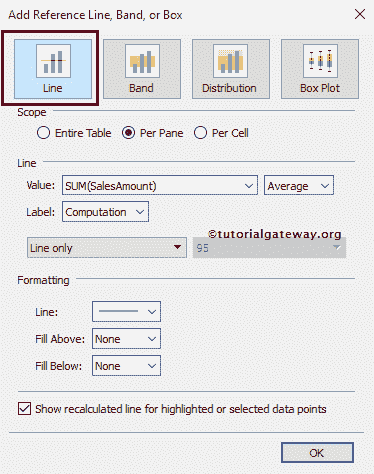

### 向表中的整个表添加参考线

要将表参考线添加到整个表，请在范围区域中选择整个表选项。从下面的截图可以观察到，整个表里面可用的选项参考线选项

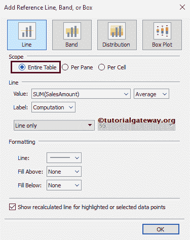

在线区域内，“值”选项将决定参考线使用的数据。请选择我们将用于创建参考行的度量值(这里我们选择销售金额)。Tableau 还允许您使用现有或新参数作为值

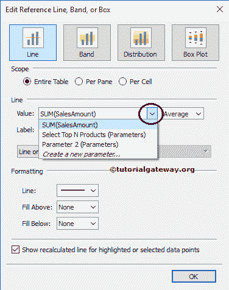

以下是“参考线”框中可用的聚合:

*   合计:此选项将在选定度量的所有值的合计处放置一条线(此处为销售金额)
*   总和:此选项将在所选度量的总和(此处为销售金额)处放置一条线
*   常量:它将一行放在指定的常量值
*   最小值:它在所选度量的最小值处放置一条线(这里是销售金额)
*   最大值:此选项将一行置于所选度量的最大值(此处为销售金额)
*   平均值:此选项将行置于所选度量的平均值(此处为销售金额)
*   中位数:在所选衡量标准的中位数处划一条线(这里是销售金额)。

请记住，上面提到的所有聚合都将取决于范围。

*   如果我们选择整个表，聚合将执行整个表
*   如果我们选择每个窗格，聚合将显示在单个窗格上
*   如果我们选择每个单元格，聚合将在单个单元格上执行

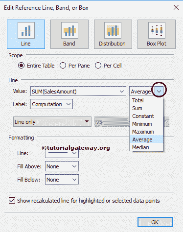

标签允许您配置是否要查看标签。该选项有不同的字段:

*   无:如果选择此选项，则表不会显示参考线的任何标签
*   值:如果选择此选项，则表将显示选择作为参考线标签的度量的聚合值
*   计算:如果选择此选项，则表将显示聚合函数名或度量名作为参考线的标签
*   自定义:如果选择此选项，则表将显示您在文本框中指定的自定义值，作为参考线的标签

在这个例子中，我们选择数值作为标签

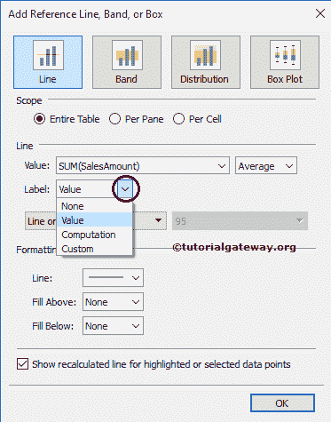

请指定是要显示参考线、参考线和置信区间，还是仅显示置信区间。现在，我们选择“仅线路”选项

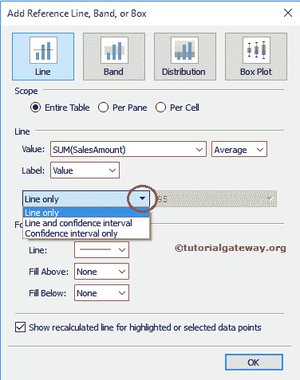

格式化区域允许我们格式化上面区域和下面区域的参考线型、颜色、宽度和背景颜色。下面的[条形图](https://www.tutorialgateway.org/bar-chart-in-tableau/)显示了我们如何设置参考线的格式。

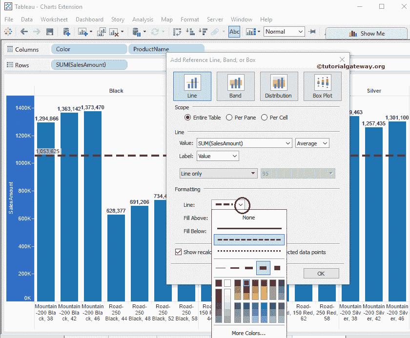

从下面的截图可以观察到，我们添加了浅粉色来填充参考线

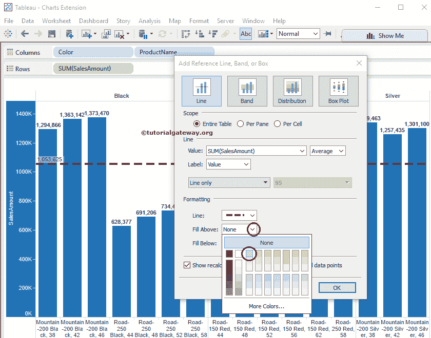

上方的空间

从下面的截图可以看到，我们添加了浅黄色来填充参考线

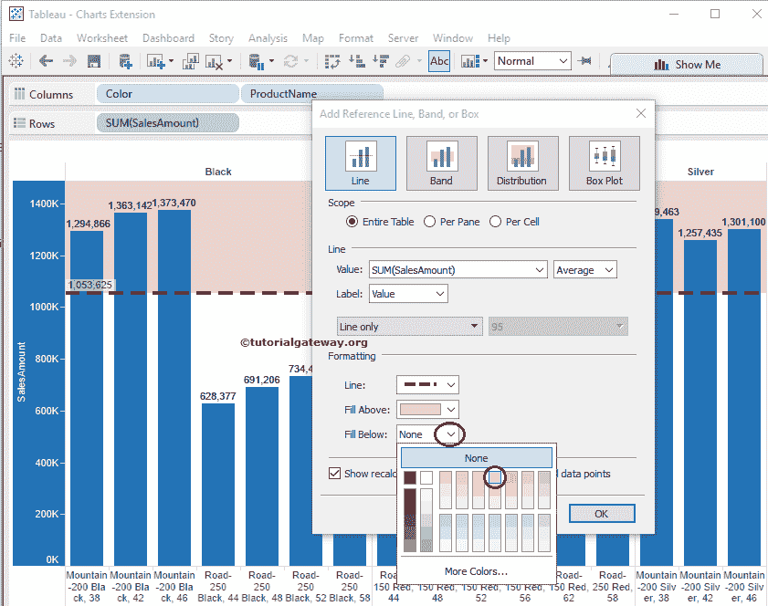

下方的区域

单击“确定”完成向靶心图添加参考线。下面的截图将显示整个表的参考线

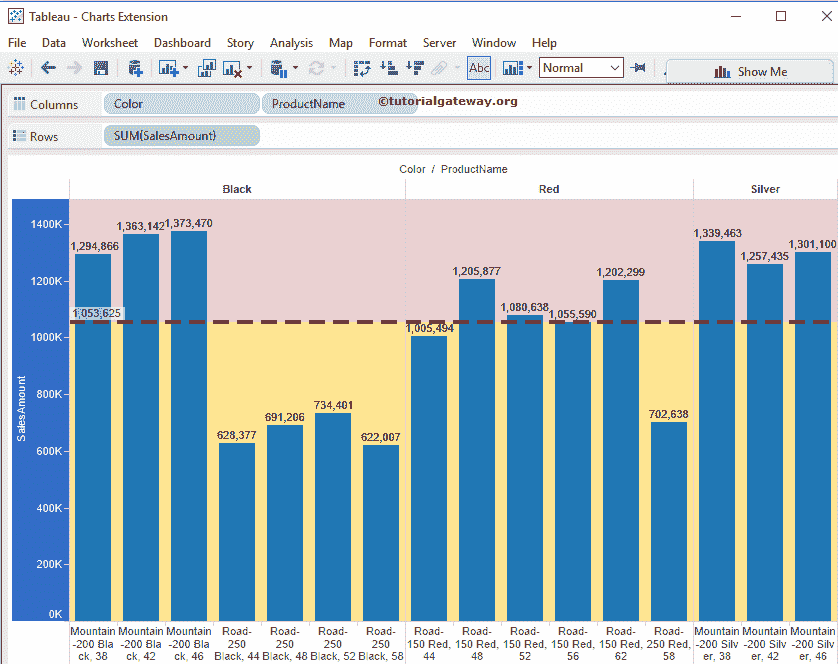

让我们将线选项从仅线更改为线和置信区间，如下所示

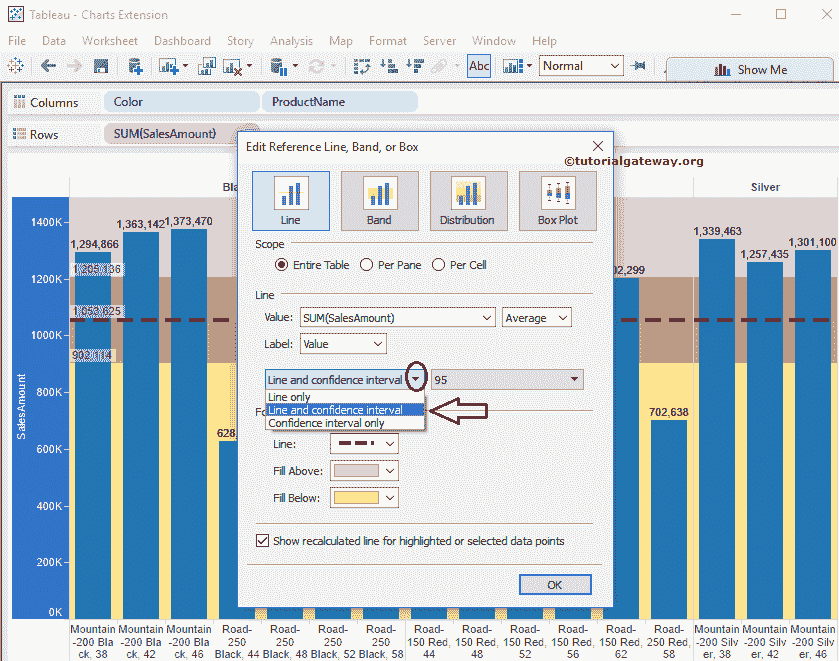

从上面的截图中，您可以观察到直线和置信区间选项显示的置信区间为 95

### 删除表中的参考线

要删除表中的参考线，右键单击销售金额轴将打开上下文菜单。我们有多个选项来删除参考线，如下所示。例如，

*   如果Tableau 报告仅包含一条参考线，请选择删除参考线选项。
*   如果报告包含多条参考线，请选择删除参考线选项，然后选择所需的参考线。
*   要一次性删除多条参考线，请选择删除所有参考线选项。

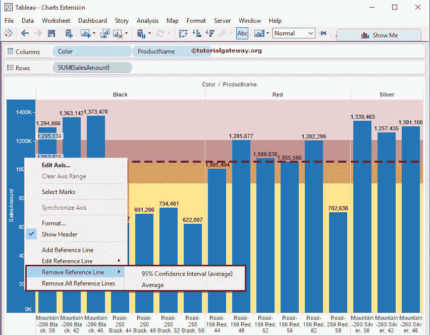

### 在每个窗格的表中添加参考线

要为每个窗格添加表参考线，请在范围区域中选择每个窗格选项。从下面的截图中你可以观察到我们没有用【线】或【格式】

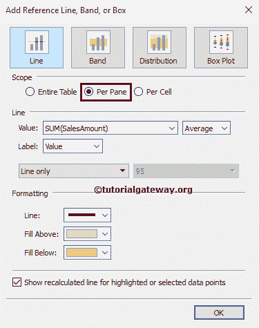

改变任何东西

单击“确定”完成将每个窗格的参考线添加到靶心图。下面的截图将向您展示单独窗格

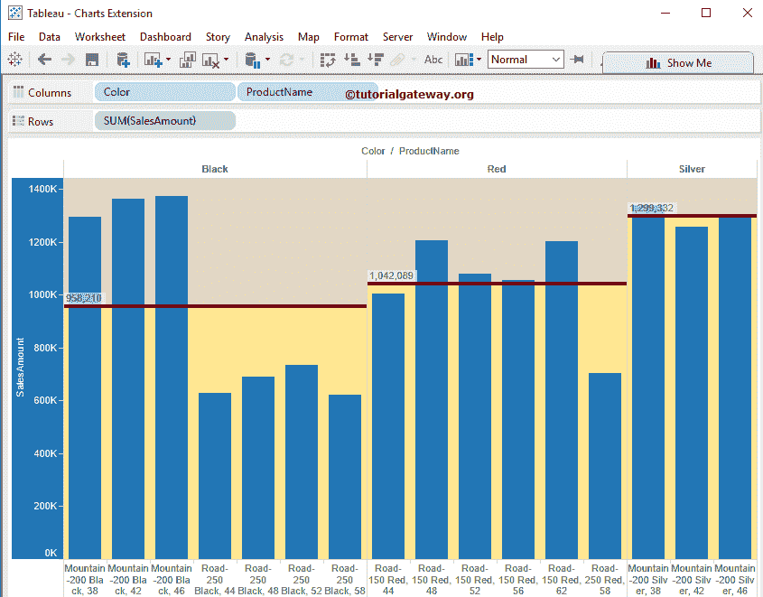

的参考线

从上面的截图中，您可以注意到 Tableau 正在为单个窗格而不是整个表计算平均值

### 为每个单元格添加表参考线

要添加每个单元格的表参考线，请在范围区域中选择每个单元格选项。从下面的截图中你可以观察到我们没有用【线】或【格式】

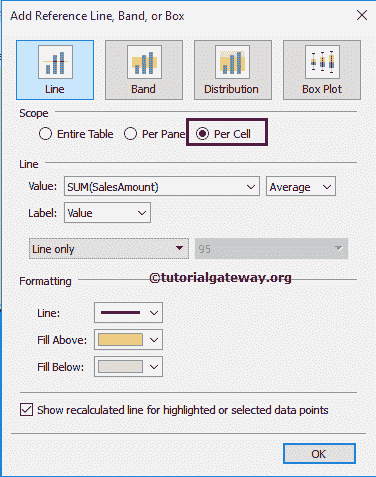

改变任何东西

单击“确定”完成添加每个单元格的参考线。下面的截图将显示单个细胞

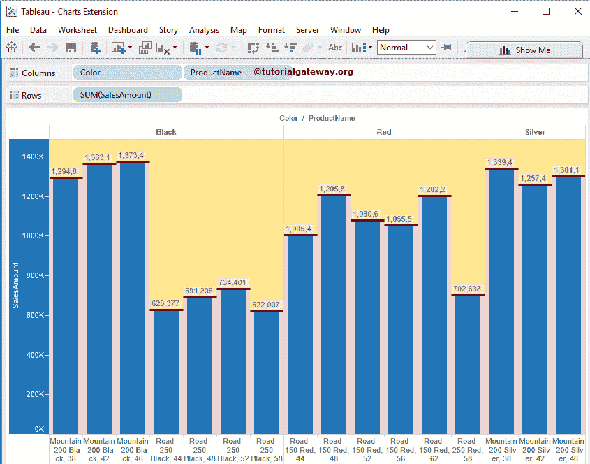

从上面的截图中，您可以注意到 Tableau 正在计算单个单元格的平均值，而不是整个表或窗格的平均值

### 编辑表中的参考线

要编辑现有的表参考线，右键单击销售金额轴打开上下文菜单。请从上下文菜单中选择编辑参考线选项。

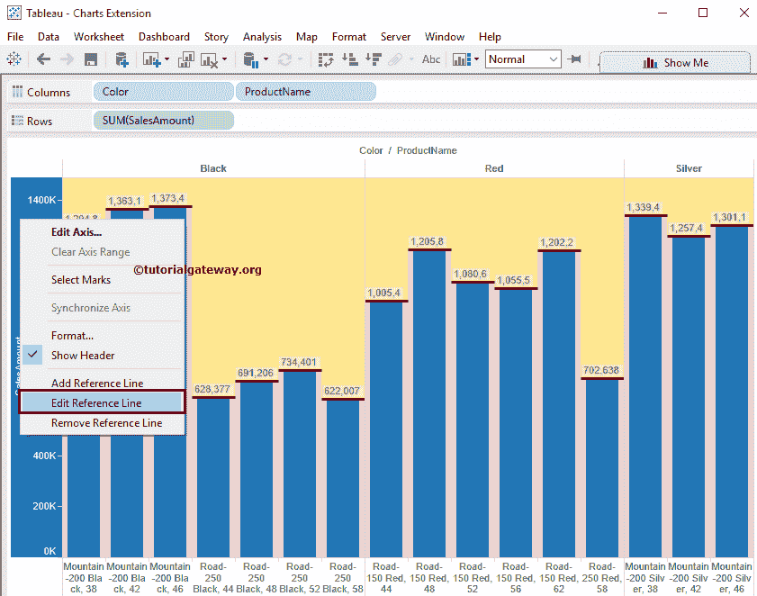