# 在表格中添加参考波段

> 原文：<https://www.tutorialgateway.org/add-reference-bands-in-tableau/>

在本文中，我们将通过一个例子向您展示如何在 Tableau 中添加参考波段。对于这个添加引用带的表，我们将针对 SQL Server 数据源编写定制的 SQL 查询。

请访问[连接 Tableau 到 SQL Server](https://www.tutorialgateway.org/connecting-tableau-to-sql-server/) 文章了解配置。自定义 [SQL](https://www.tutorialgateway.org/sql/) 查询我们将用于此 [Tableau](https://www.tutorialgateway.org/tableau/) 报表的是:

```
SELECT ProdSubCat.EnglishProductSubcategoryName, 
	   Tery.[SalesTerritoryCountry], 
	   Prod.EnglishProductName, 
	   Prod.Color, 
	   Fact.OrderQuantity, 
	   Fact.TotalProductCost, 
	   Fact.SalesAmount, 
	   Fact.TaxAmt, 
          Fact.[Freight],
         Fact.OrderDate
FROM DimProductSubcategory AS ProdSubCat
   INNER JOIN
     DimProduct AS Prod ON ProdSubCat.ProductSubcategoryKey = Prod.ProductSubcategoryKey 
    INNER JOIN
     FactInternetSales AS Fact ON Prod.ProductKey = Fact.ProductKey 
   INNER JOIN
     [DimSalesTerritory] AS Tery ON Tery.[SalesTerritoryKey] = Fact.[SalesTerritoryKey]
```

## 在表格中添加参考波段

在本例中，我们将向条形图添加参考波段。首先，将颜色、英文产品名称从维度区域拖放到列架，将销售额从度量区域拖放到行架，如下所示。默认情况下，Tableau 生成条形图

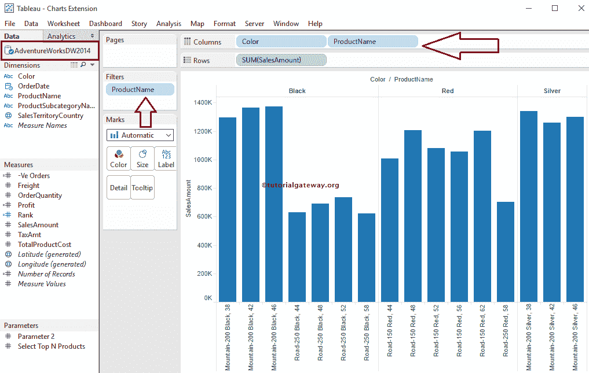

要在表格中添加参考波段，右键单击销售金额轴将打开上下文菜单。请从[条形图](https://www.tutorialgateway.org/bar-chart-in-tableau/)上下文菜单

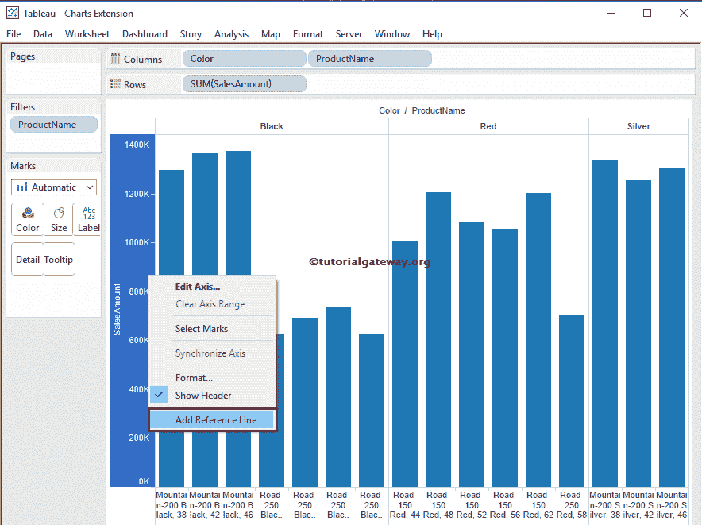

中选择添加参考线选项

选择“添加参考线”选项后，将打开一个名为“添加参考线、波段或框”的新窗口来配置参考波段。本文是关于在 Tableau 中添加参考波段；请选择波段标签。

提示:添加参考线请参考文章中[添加参考线。](https://www.tutorialgateway.org/add-reference-lines-in-tableau/)

从下面的屏幕截图中，您可以看到我们在“范围”区域有三个选项:

*   整个表:如果选择此选项，则表将计算整个表的聚合(带区起始和带区终止)，并将参考带区添加到整个表中
*   每个窗格:此选项为表中的各个窗格计算聚合(带区起始和带区终止)，并将参考带区添加到各个窗格
*   每个单元格:它将计算表内单个单元格的聚合(从带区和到带区)，并将参考带区添加到单个单元格

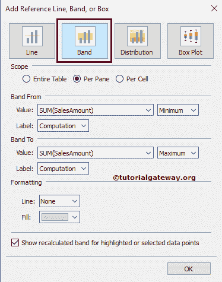

### 向整个表格添加参考波段

要将表格引用带添加到整个表格，请在范围区域中选择整个表格选项。从下面的截图可以观察到，整个表格内可用的选项参考波段选项

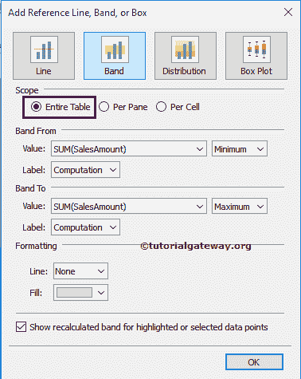

在“起始波段”和“终止波段”区域中，“值”选项将决定参考波段使用的数据。请选择我们将用于创建参考范围的度量值(这里我们选择销售金额)。Tableau 还允许您使用现有参数或新参数作为值

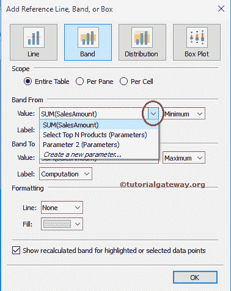

“标注栏起始”和“标注栏终止”区域中的“标注”选项将允许您配置是否要查看标注。该选项有不同的字段:

*   无:如果选择此选项，则 Tableau 将不显示参考波段的任何标签
*   值:它显示选择作为参考波段标签的度量的聚合值
*   计算:如果选择此选项，则表将显示聚合函数名或度量值名作为参考带的标签
*   自定义:此选项将您在文本框中指定的自定义值显示为参考波段的标签

在本表参考波段示例中，我们选择值作为标签

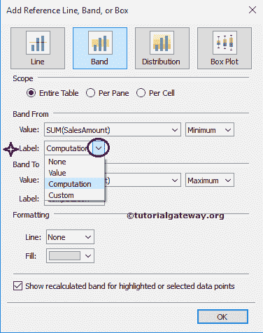

以下是“带区起始”和“带区终止”区域中可用的聚合:

*   合计:此选项将开始或结束参考范围为选定衡量标准的所有值的总和(此处为销售金额)
*   总和:此选项将在选定度量的总和(此处为销售金额)处开始或结束参考波段
*   常数:该选项将以指定的常数值开始或结束参考波段
*   最小值:此选项将在选定度量的最小值(此处为销售金额)开始或结束参考范围
*   最大值:此选项将在所选度量的最大值(此处为销售金额)开始或结束参考范围
*   平均值:此选项将在所选度量的平均值(此处为销售金额)处开始或结束参考范围
*   中位数:此选项将在所选衡量标准的中位数(此处为销售金额)开始或结束参考区间

请记住，如上所述，所有聚合都将取决于范围。

*   如果选择“整个表”，聚合将在整个表上执行
*   如果我们选择每个窗格，聚合将在单个窗格上执行
*   如果我们选择每个单元格，聚合将在单个单元格上执行

这里，我们选择了“起始波段”的平均聚合函数和“终止波段”的最大聚合函数

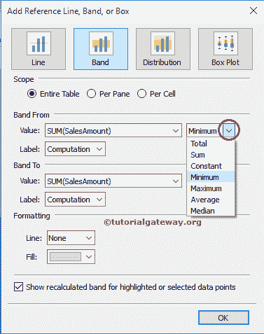

格式化区域允许我们格式化波段区域的参考波段类型、颜色、宽度和背景颜色。下面的截图显示了我们如何格式化参考线(从线带到线带和从线带到线带)。

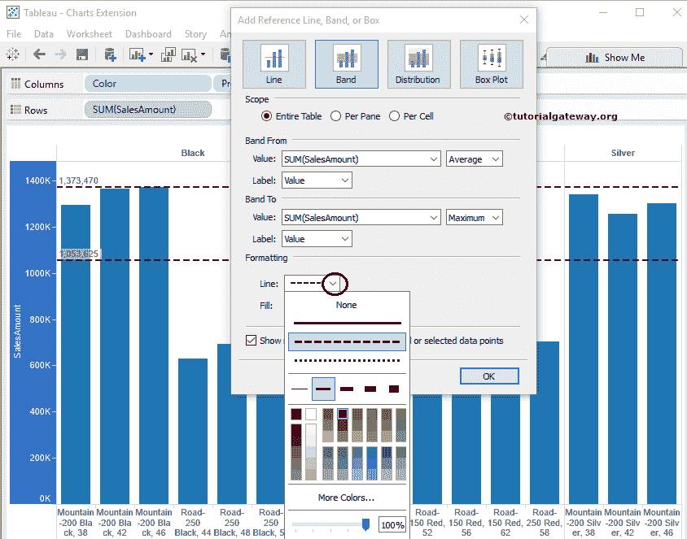

从下面的截图中，你可以观察到我们添加了浅黄色来填充带从线和带到线之间的空间

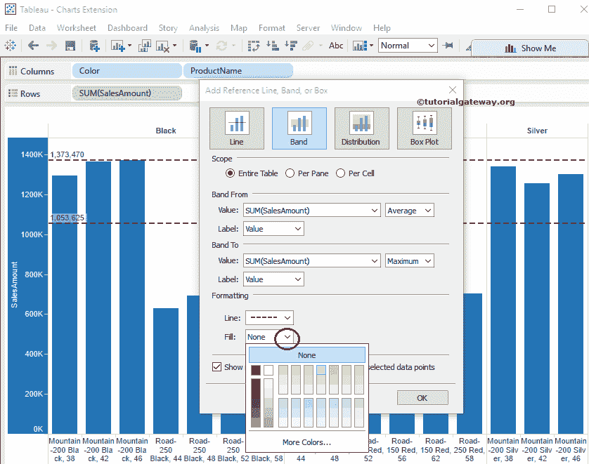

单击“确定”完成向项目符号图添加参考带。下面的截图将向您展示整个表格的参考带

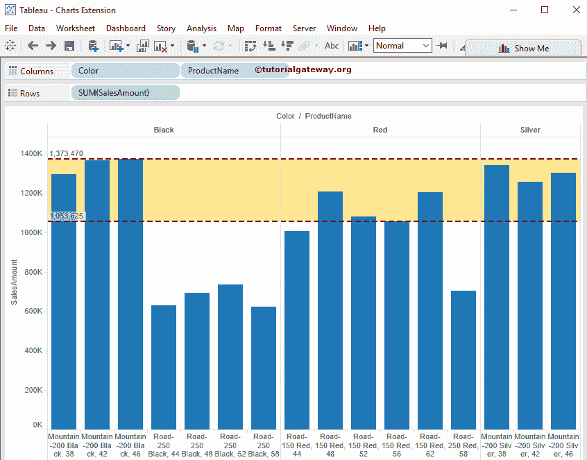

### 删除表格中的参考波段

要删除表格中的参考带，右键单击销售金额轴将打开上下文菜单。我们可能有多个选项来删除 Tableau 参考波段。例如，

*   如果报告有一个参考带，请选择删除参考线选项。
*   如果有多个参考带，请选择移除参考线选项，然后选择所需的参考线。
*   要一次性移除多个参考带，请选择移除参考线选项。

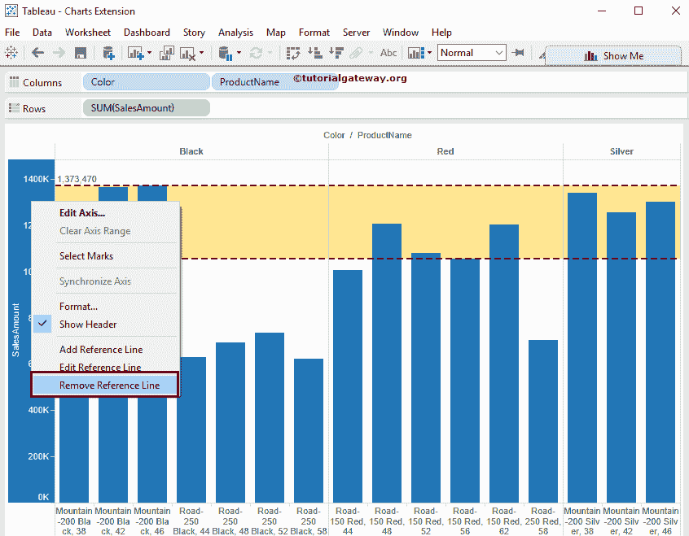

### 为每个窗格添加参考波段

要为每个窗格添加参考波段，请在范围区域中选择每个窗格选项。从下面的截图可以观察到，我们将“波段范围”的聚合函数更改为“最小值”，将“波段范围”的聚合函数更改为“平均值”，并保持“格式”区域不变

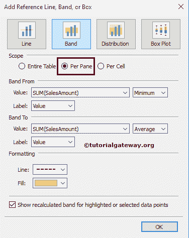

单击“确定”完成将每个窗格的参考带添加到项目符号图。下面的截图将向您展示单个窗格

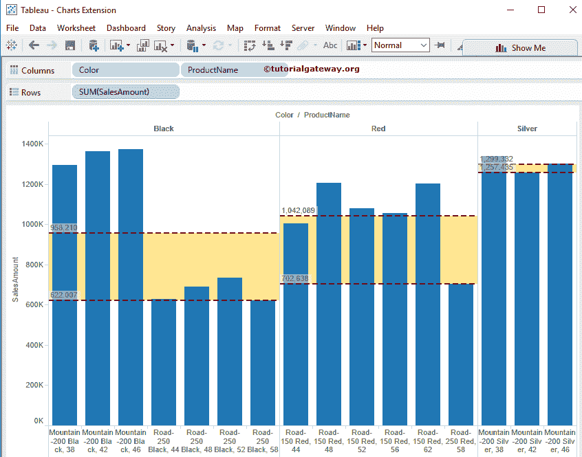

的参考波段

从上面的截图中，请注意 Tableau 正在查找单个窗格的最小值，并计算单个窗格而不是整个表的平均值

### 为每个单元格添加参考波段

要为每个单元格添加表格引用带，请在范围区域中选择每个单元格选项。从下面的截图中你可以观察到我们在格式化

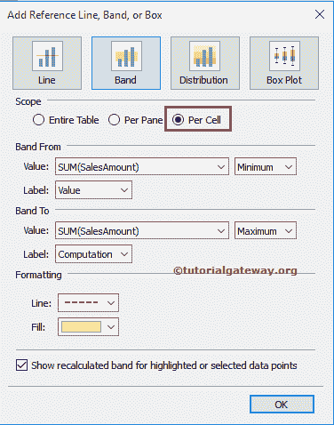

方面没有任何改变

从下面的截图中，我们将“销售金额总和”中的“从”值更改为 622，007.1 的常量值，并将“到”的聚合函数更改为最大值

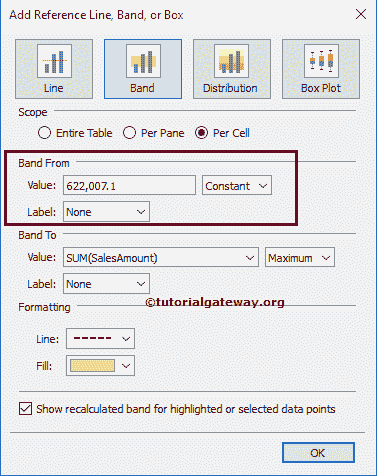

单击“确定”完成添加每个单元的参考波段。下面的截图将向您展示单个窗格

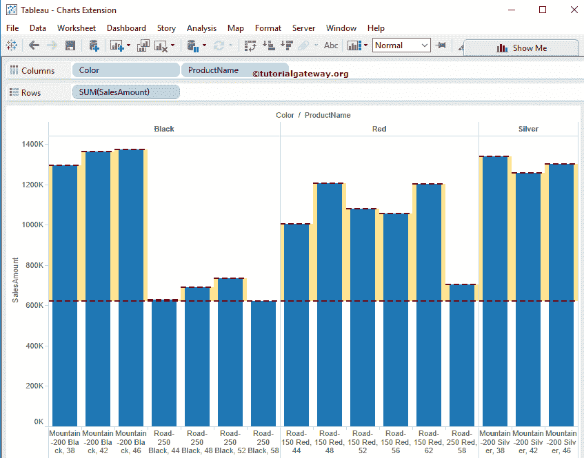

的参考波段

从上面的截图中，您可以注意到 Tableau 正在查找单个单元格的最大值，而不是整个表格