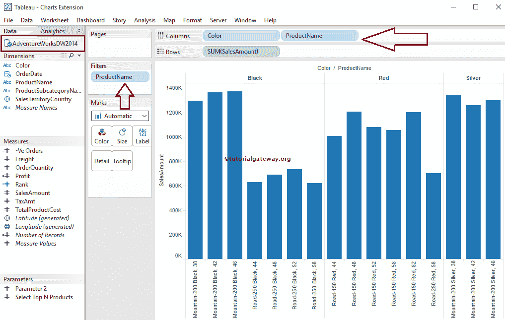
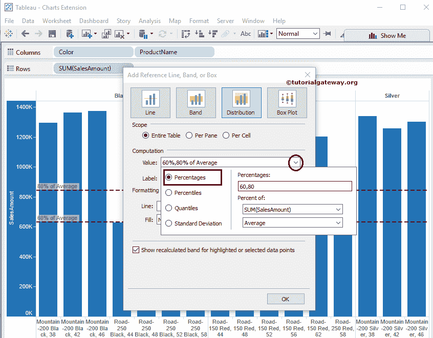
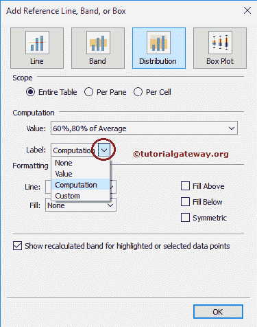

# 在表中添加参考分布

> 原文：<https://www.tutorialgateway.org/add-reference-distributions-in-tableau/>

在本文中，我们将通过示例向您展示如何在 Tableau 中添加参考分布。

对于这个 Tableau 参考分布，我们将[将 Tableau 连接到 SQL](https://www.tutorialgateway.org/connecting-tableau-to-sql-server/) 并针对 SQL 数据源编写定制的 [SQL](https://www.tutorialgateway.org/tableau/) 查询。

```
SELECT ProdSubCat.EnglishProductSubcategoryName, 
	   Tery.[SalesTerritoryCountry], 
	   Prod.EnglishProductName, 
	   Prod.Color, 
	   Fact.OrderQuantity, 
	   Fact.TotalProductCost, 
	   Fact.SalesAmount, 
	   Fact.TaxAmt, 
          Fact.[Freight],
         Fact.OrderDate
FROM DimProductSubcategory AS ProdSubCat
   INNER JOIN
     DimProduct AS Prod ON ProdSubCat.ProductSubcategoryKey = Prod.ProductSubcategoryKey 
    INNER JOIN
     FactInternetSales AS Fact ON Prod.ProductKey = Fact.ProductKey 
   INNER JOIN
     [DimSalesTerritory] AS Tery ON Tery.[SalesTerritoryKey] = Fact.[SalesTerritoryKey]
```

## 在表中添加参考分布

在本例中，我们将向条形图中添加参考分布。

首先，将颜色、英文产品名称从维度区域拖放到列架，将销售额从度量区域拖放到行架，如下所示。默认情况下， [Tableau](https://www.tutorialgateway.org/tableau/) 会为您生成[条形图](https://www.tutorialgateway.org/bar-chart-in-tableau/)



要在表中添加参考分布，右键单击销售金额轴将打开上下文菜单。请从中选择


添加参考线选项

选择“添加参考线”选项后，将打开一个名为“添加参考线、波段或框”的新窗口，以配置参考分布。本文是关于添加参考发行版的。请选择分配选项卡，如下所示。

提示:参考表中[添加参考线，参考表](https://www.tutorialgateway.org/add-reference-lines-in-tableau/)文章中[添加参考带，了解参考带的配置。](https://www.tutorialgateway.org/add-reference-bands-in-tableau/)

从下面的屏幕截图中，您可以看到我们在“范围”区域有三个选项:

*   整个表:如果选择此选项，Tableau 将计算整个表的聚合，并为整个表添加参考分布
*   每个窗格:如果选择此选项，Tableau 将计算表中各个窗格的聚合，并将引用分布添加到各个窗格中
*   每个单元格:选择此选项将计算表内单个单元格的聚合，并将引用分布添加到单个单元格

### 向整个表添加引用分布

要将参考分布添加到表中的整个表，请在范围区域中选择整个表选项。从下面的截图可以观察到，整个表里面可用的选项参考线选项


在线区域内，“值”选项将决定参考分布使用的数据。请选择我们将用于创建参考分配的度量值(这里我们选择销售金额)。

以下是“值”字段中“百分比”选项中可用的聚合:

*   合计:此选项会将行放在所选度量的所有值的合计处(这里是销售金额)
*   总和:它将行放在所选度量的总和处(这里是销售金额)
*   常数:此选项将线放置在指定的常数值
*   最小值:此选项会将行置于所选度量的最小值(此处为销售金额)
*   最大值:此选项会将行设置为所选度量的最大值(这里是销售金额)
*   平均值:此选项将行置于所选度量的平均值(此处为销售金额)
*   中位数:它将把线放在所选衡量标准的中位数(这里是，销售金额)



标签允许您配置是否要查看标签。该选项有不同的字段:

*   无:如果选择此选项，Tableau 将不显示参考分布的任何标签
*   值:此选项显示选择作为参考分布标签的度量的聚合值
*   计算:如果选择此选项，表将聚合函数名或度量值名显示为参考分布的标签
*   自定义:选择此选项会将您在文本框中指定的自定义值显示为参考分布的标签

在这个例子中，我们选择数值作为标签



格式化区域允许我们格式化表参考分布区域的分布类型、颜色、宽度和背景颜色。下面的截图将展示我们如何格式化参考发行版。


从下面的截图中，您可以看到我们添加了浅黄色来填充“值”或“分布”区域之间的空间。


在格式化区域中，我们有以下选项:

*   上方填充:如果选中此选项，表将向分布上方的区域添加选定的颜色
*   下方填充:如果选中此选项，它会将选定的颜色添加到分布下方的区域
*   对称:此选项为分布上方和下方的区域添加相似的颜色
*   反转:这将反转“填充上方”颜色和“填充下方”颜色

当我们勾选以上任何选项时，我们必须将填充属性从单一颜色更改为内置托盘，如下所示


从下面的截图中你可以观察到，当我们选中反转选项时，上方填充颜色和下方填充颜色互换


单击“确定”完成向靶心图添加参考分布。下面的截图将显示整个表的参考分布


### 在表中编辑参考分布

要编辑现有的表参考分布，右键单击销售金额轴将打开上下文菜单。请选择编辑参考线选项，如下所示。


让我们将计算值从百分比更改为百分位数，请从可用的百分位数中选择百分位数，否则请输入自定义值。Tableau 还允许您使用现有参数或新参数。现在，我们选择 80，如下图所示


让我们将计算值从百分位数更改为分位数，请从可用的分位数中选择分位数。Tableau 还允许您使用现有参数或新参数。目前，我们选择了如下所示的四个


这一次，我们将计算值从分位数更改为标准差。请写下标准差的因子。默认情况下，Tableau 将因子显示为(-1，1)，我们对此很满意。但是，您可以根据项目要求进行更改。


单击“确定”完成将计算值的参考分布添加为因子的标准偏差(-1，1)。下面的截图将显示整个表的表参考分布


### 移除表中的参考分布

要删除表中的参考分布，右键单击销售金额轴将打开上下文菜单。我们可能有多个选项来删除参考发行版。例如，

*   如果Tableau 报告仅包含一条参考线，则可以选择“删除参考线”选项。
*   如果Tableau 报告包含多条参考线，请选择“删除参考线”选项，然后选择所需的参考线。
*   如果要一次性删除多条参考线，请选择删除所有参考线选项。


### 为每个窗格添加参考分布

要在表中添加每个窗格的参考分布，请在范围区域中选择每个窗格选项。从下面的截图中，您可以看到我们将计算区域的计算值从平均值的 60%、80%更改为平均值的 30%、60%、80%，并且我们将格式化区域


内的填充托盘更改为蓝色、黄色

单击“确定”完成将每个窗格的参考分布添加到靶心图。下面的截图显示了单个窗格


的表参考分布

从上面可以看到，Tableau 正在为单个窗格寻找最小值，并计算单个窗格的平均值，而不是整个表。

### 为每个单元格添加参考分布

要在表中添加每个单元格的参考分布，请在范围区域中选择每个单元格选项。从下面的截图中，我们将计算区域的计算值从平均值的 30%、60%、80%更改为平均值的 60%、90%。接下来，我们将格式区域


中的填充托盘更改为浅黄色，取消选中上方填充、下方填充选项

单击“确定”完成添加每个单元格的表引用分布。下面的截图将向您展示单个窗格


的参考分布