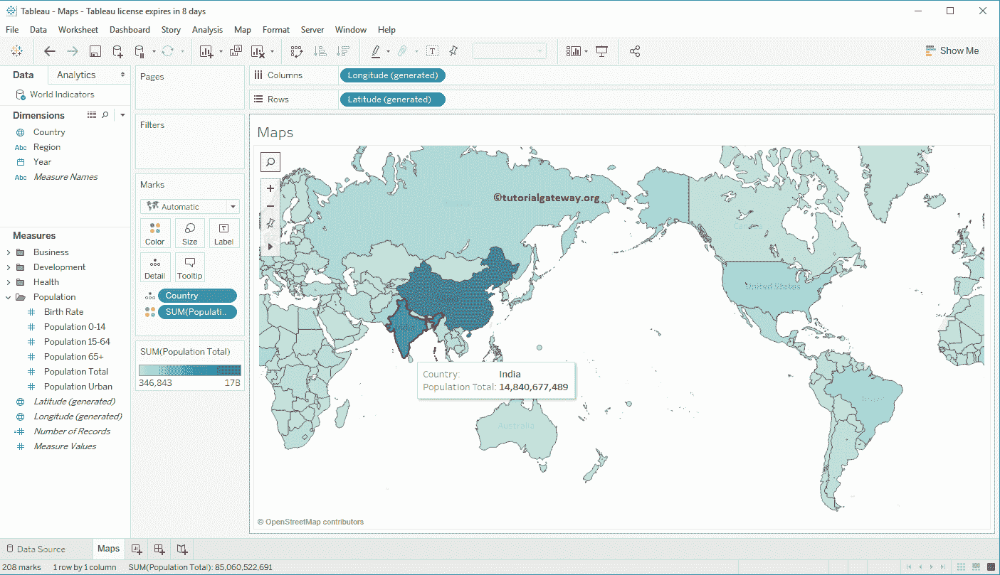

# Tableau 中的地图

> 原文：<https://www.tutorialgateway.org/maps-in-tableau/>

Tableau 地图便于可视化地理数据。在本文中，我们将通过一个例子向您展示如何在 Tableau 中创建常规地图。对于这个 Tableau 地图演示，我们将使用桌面附带的世界指标数据源。

## 在表格中创建地图

在 Tableau 中创建地图有多种方法。在这篇文章中，我们将解释所有这些。

将任何地理字段拖放到“行”或“列”架上，并在“演示”窗口中选择图标将自动在 Tableau 中创建地图。在本例中，我们将把国家维度拖到列架

接下来，将总人口从[表](https://www.tutorialgateway.org/tableau/)测量区域拖放到行架。由于它是一个度量值，总人口将聚合为默认总和。

让我把那个[条形图](https://www.tutorialgateway.org/bar-chart-in-tableau/)改成世界地图。为此，请展开“演示”窗口并从中选择标记的选项

从“演示”窗口中选择此选项后，将显示表格地图。从下面显示的截图中，您可以看到“行”和“列”货架上填充了生成的纬度和经度。此外，国家将添加到详细信息卡，总人口将添加到列卡。

您可以突出显示任何国家以查看该国人口

### 创建地图的第二种方法

双击任何地理字段，如邮政编码、城市、州或国家，将自动创建一个 Tableau 地图。在本例中，我们将双击国家维度。从下面的截图可以看到，Tableau 已经为你创建了一个 [SymbolMap](https://www.tutorialgateway.org/how-to-create-a-map-in-tableau/) 。这里，它在标记架中添加了纬度到行架、经度到列架和国家名称到详细信息卡。

要将符号转换为地图，您可以从“演示”窗口中单击标记的符号，也可以将标记类型从“自动”更改为“地图”

无论哪种方式，它都会为你生成下面的

让我们将总人口添加到标记架的颜色卡中。它将根据每个国家的人口为它们增添色彩。

### 在表格中创建地图–第三种方法

将任何地理字段拖放到详细信息卡上将自动创建一个表格地图。在本例中，我们将把国家名称维度拖到标记架

中的详细信息卡上

现在，您可以看到自动生成的符号。使用上述任一方法将符号转换为地图。在 Tableau。

### 向表格中的地图添加数据标签

要向表格地图添加数据标签，请单击工具栏中的显示标记标签按钮。虽然看起来很奇怪，但你会想到添加数据标签。

### 改变颜色

到目前为止，您已经看到了具有默认颜色的 Tableau 地图，但是您可以选择更改默认颜色。为此，请单击总和(总人口)颜色图例旁边的下拉菜单，或者右键单击颜色栏。两者都将打开下面显示的上下文菜单。请选择编辑颜色…选项

一旦您选择了“编辑颜色...”选项，将会打开以下窗口。单击调色板下的下拉箭头，并根据您的规格选择颜色。目前，我们选择金紫色分叉。请记住，通过单击“高级”按钮，您还可以指定起点、终点和中心。

现在你可以看到它与金紫色发散颜色模式。

