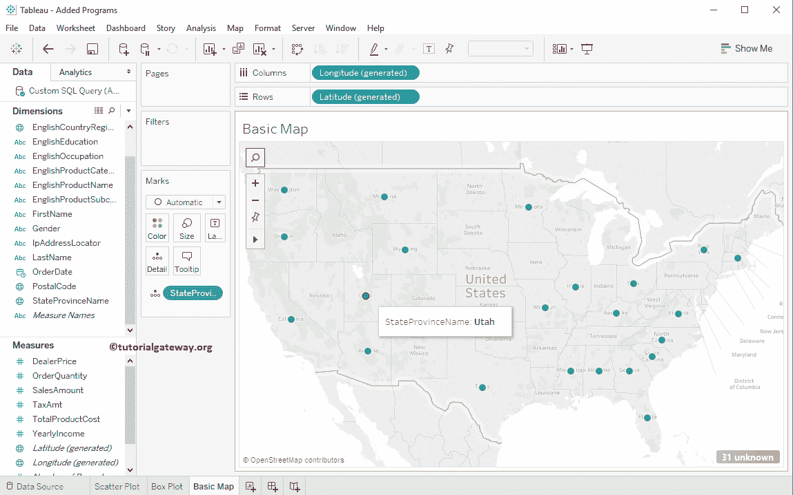
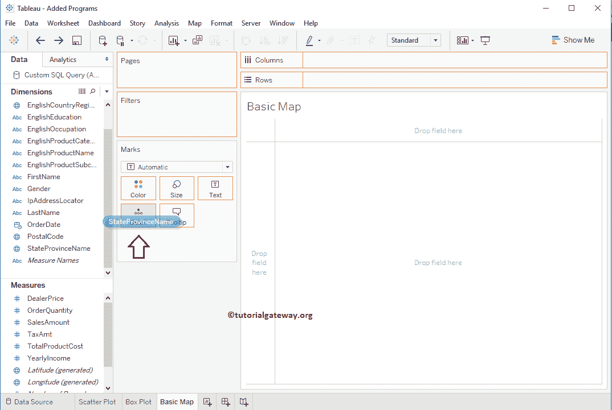
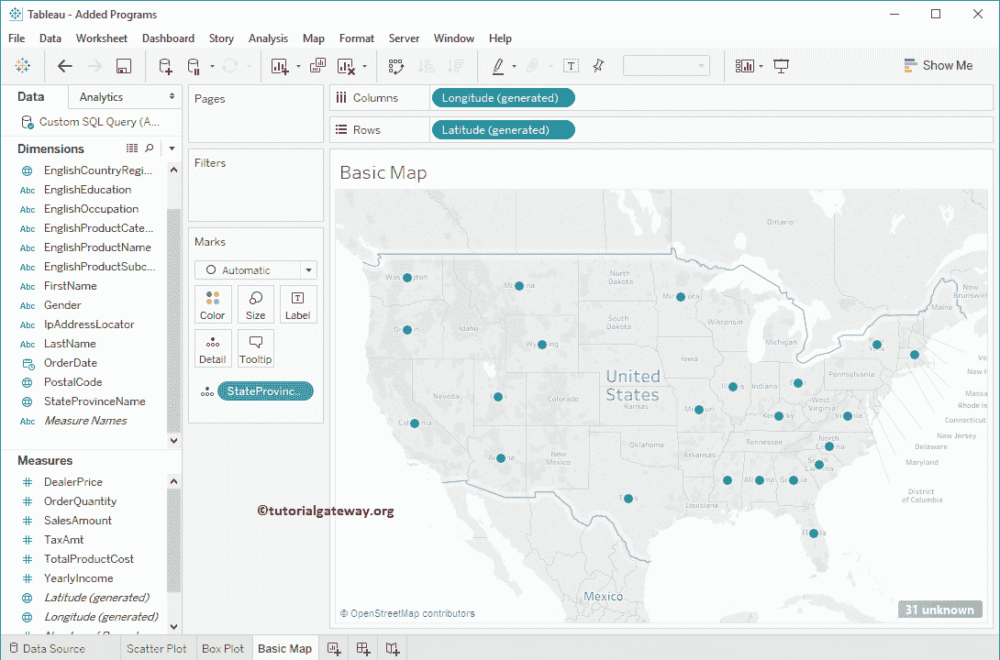
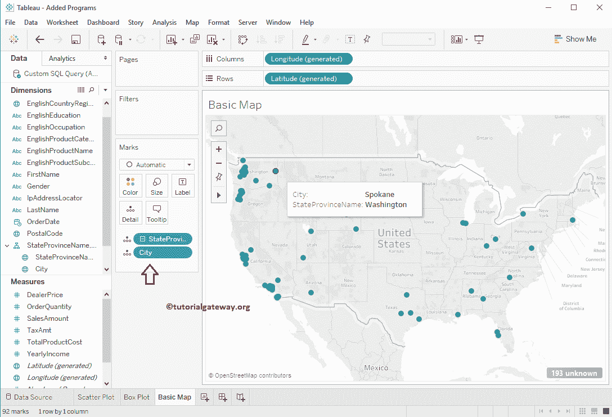
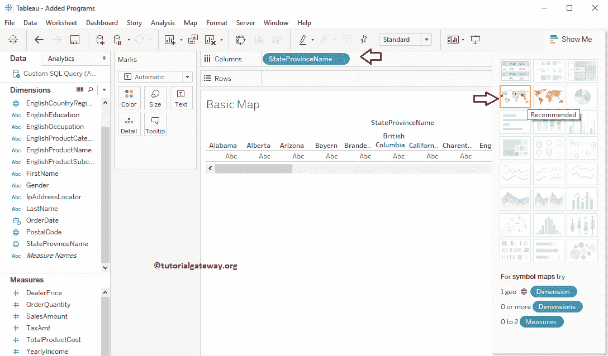
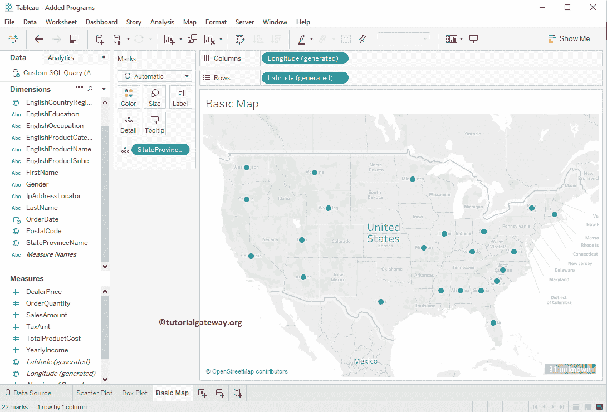
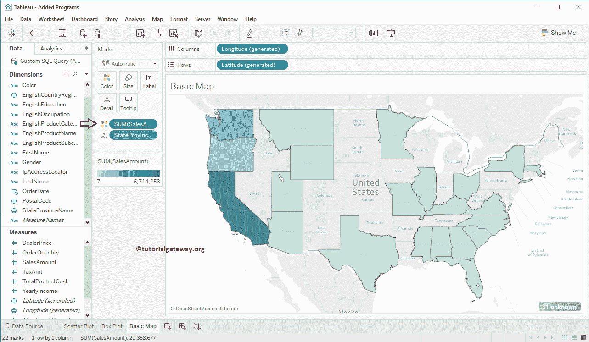

# 如何在 Tableau 中创建地图

> 原文：<https://www.tutorialgateway.org/how-to-create-a-map-in-tableau/>

Tableau 地图便于可视化地理数据。在本节中，我们将通过一个示例展示如何在 Tableau 中创建地图。在本演示中，我们将使用 SQL Server 数据源。

## 在 Tableau 中创建地图的第一种方法

双击任何地理字段，如城市、邮政编码、国家或州，将自动在 Tableau 中创建地图。在本例中，我们将双击州/省名称维度。表将纬度值添加到行架，将经度值添加到列架，并将州/省名称添加到标记架中的详细信息字段。

本[表](https://www.tutorialgateway.org/tableau/)报告参考[连接到 SQL Server](https://www.tutorialgateway.org/connecting-tableau-to-sql-server/) 和 [SQL](https://www.tutorialgateway.org/sql/) 。

## 在 Tableau 中创建地图的第二种方法

在详细信息字段中拖放任何地理字段，如城市、国家、邮政编码或州，将自动在 Tableau 中创建地图。在这里，我们将州省名称维拖动到标记架

中的详细信息字段

现在你可以看到自动生成的。

您也可以添加地理层级。我们已将州省层级(省名、市)添加到详细信息卡中。

## 创建地图的第三种方法

请将任何地理字段拖放到“列”或“行”架子上，然后从“演示”窗口中选择地图将自动为您创建。让我们将“省/市/自治区名称”维度拖到“列”架子上，并选择“演示”卡片中的虚线部分。

即会自动创建美国数据点

让我们将销售金额度量添加到标记架的颜色字段中。它将根据发生的销售额为每个状态添加颜色。

