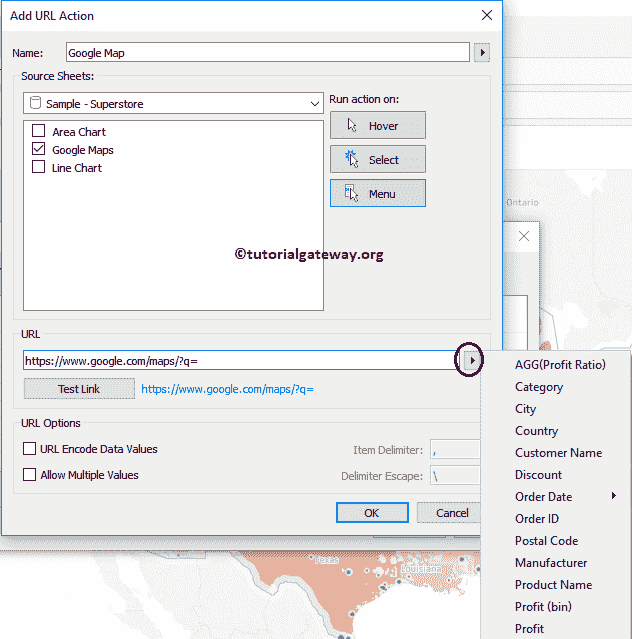
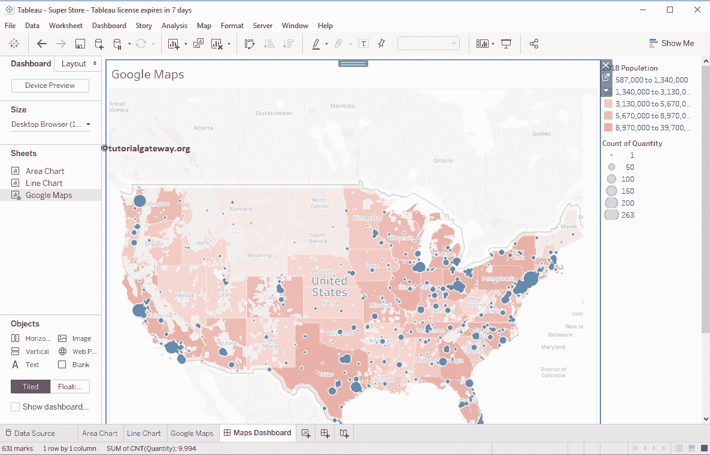

# 如何在 Tableau 中使用谷歌地图

> 原文：<https://www.tutorialgateway.org/how-to-use-google-maps-in-tableau/>

在本文中，我们将通过一个例子向您展示如何在 Tableau 中使用谷歌地图。对于这个 tableau 谷歌地图演示，我们将使用 Tableau 附带的 Sample–supercore 数据源。

## 如何在 Tableau 中使用谷歌地图

在我们开始使用 Tableau 中的谷歌地图之前，让我先创建一个[符号地图](https://www.tutorialgateway.org/how-to-create-a-map-in-tableau/)。为此，请将邮政编码维度拖放到[表](https://www.tutorialgateway.org/tableau/)标记货架

中的详细信息卡上

现在，您可以看到自动生成的符号地图。

让我把数量加到尺寸上。这意味着圆圈大小将取决于订单数量

### 如何在 Tableau 工作表中使用谷歌地图

要在表中使用谷歌地图，请转到工作表并选择操作..从下拉菜单

选择操作后..，下面显示的窗口将被打开。单击添加操作按钮并选择网址..选项

选择网址将打开添加网址操作窗口

*   名称:请提供有效的名称
*   来源表:请选择要执行此操作的选项。我是说地图
*   悬停:如果选择此选项，当您悬停在地图上时，地图将打开。
*   选择:当您选择指定点时，地图将打开。
*   菜单:使用菜单打开地图
*   网址:请指定网址

我们将其命名为谷歌地图，并将其用于谷歌地图表单，当您选择一个点时，它将运行。你要用的网址是:https://www.google.com/maps/?q=

请单击侧箭头选择纬度和经度。如您所见，我们在维度和度量中都没有任何现有的纬度和经度。如果您的数据源有这些东西，他们会选择它们。

### 如何在 Tableau 仪表盘中使用谷歌地图

在开始使用 Tableau Dashboard 中的谷歌地图之前，让我先创建一个 Dashboard

接下来，我们将之前创建的谷歌地图添加到这个仪表板中。

接下来，将网页从对象区域拖放到仪表板底部区域。

删除网页将打开编辑网址窗口。请留空或指定默认网址名称，然后点击【确定】

现在你可以看到我们的仪表盘有一个符号地图和一个网页

要在 Tableau 仪表板中使用谷歌地图，请转到仪表板并选择操作..从下拉菜单

选择操作后..，下面显示的窗口将被打开。在这里，请点击添加操作按钮，并选择网址..选项

选择网址将打开添加网址操作窗口。我们已经在前面的例子中解释了这些属性。在这里，我们将其命名为谷歌数据库地图，当您选择一个点时，它将运行。你要用的网址是:https://www.google.com/maps/?q=

请单击侧箭头选择纬度和经度。如您所见，我们选择的纬度是在您向地图添加邮政编码时由 tableau 自动生成的。

同样，在网址上添加经度。现在的网址会是<latitude></latitude>

点击【确定】关闭

窗口

让我从地图中选择洛杉矶，你可以看到指定邮政编码的谷歌地图。如果你的数据有正确的地址，那么 Tableau 谷歌地图也会显示那个建筑。

通过选择位置，您可以浏览谷歌地图选项，如方向、呼叫等。

让我给你看看下图

的景色

你可以看到市政厅

你也可以从这张谷歌地图

中选择卫星视图