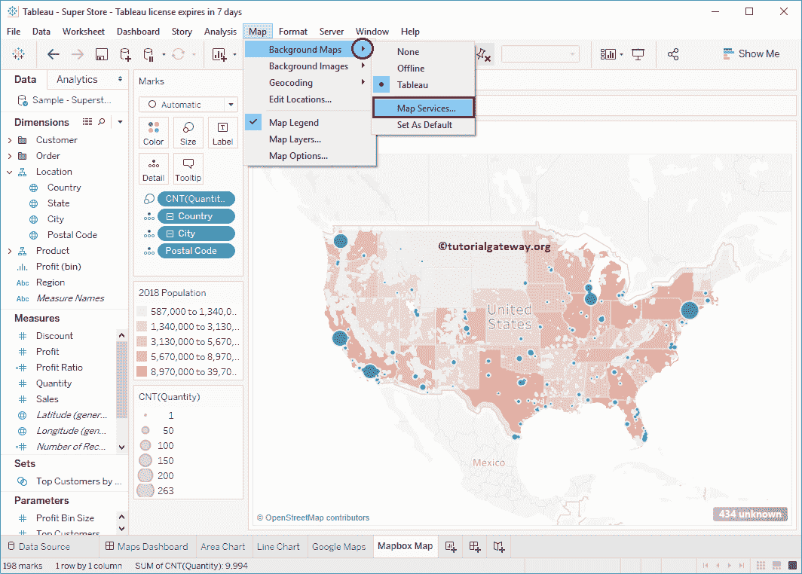
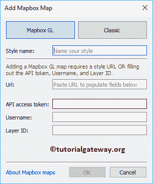

# 作为 Tableau 背景图的地图框地图

> 原文：<https://www.tutorialgateway.org/mapbox-maps-background-map-tableau/>

默认情况下，Tableau 使用默认地图来显示空间数据。但是，您可以选择使用自己的背景图。在本文中，我们将通过一个例子向您展示如何在 Tableau 中使用 Mapbox 地图作为背景地图。

对于这个 Tableau 地图框地图演示，我们在我们的地图框帐户中创建了两个示例样式。如果需要可以使用默认的地图框样式

对于这个 Tableau 中的 Mapbox Maps 示例，我们将使用 Tableau 附带的 Sample–supercore 数据源。

## 如何在 Tableau 中使用地图框地图作为背景地图

在我们开始在[表格](https://www.tutorialgateway.org/tableau/)中使用地图框地图作为背景地图之前，让我先创建一个[符号地图](https://www.tutorialgateway.org/how-to-create-a-map-in-tableau/)。为此，请将邮政编码维度拖放到标记架

中的详细信息卡上

现在，您可以看到自动生成的符号地图。

让我将城市添加到详细信息卡，并将计数(数量)添加到大小。这意味着圆圈大小将取决于订单数量

要在 Tableau 中将地图框地图用作背景地图，请转到地图，选择背景地图，然后从下拉菜单

中选择地图服务

选择地图服务…将打开地图服务窗口。请单击添加…按钮并选择地图框地图..选项。请参考 [WMS 服务器图作为背景图](https://www.tutorialgateway.org/wms-server-map-as-a-background-map-in-tableau/)来了解 WMS 服务器..

选项T4】

选择表格地图框地图..选项将打开添加地图框地图窗口

*   样式名:请指定有效的样式名。
*   网址:指定地图框地图所在的网址。

请访问地图框网站并转到样式部分。接下来，选择您想要使用的样式，并从菜单

中选择共享、开发和使用

它会引导你进入一个新的页面。请在地理信息系统应用程序的使用风格部分复制代码。记住，别忘了选择

表格

粘贴网址将自动添加应用编程接口访问令牌、用户名和图层标识。点击【确定】关闭

窗口

点击关闭按钮

现在你可以看到我们默认的表格地图被我们在地图框中创建的卫星地图所取代。

如果您想检查当前使用的背景地图，请转到地图->背景地图。您可以看到它正在使用新的路线图，而不是表格。

您可以缩放任何特定位置

