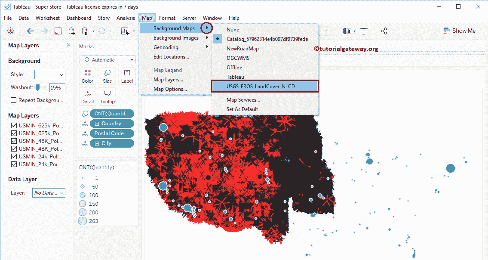

# 在 Tableau 中将 WMS 服务器地图作为背景地图

> 原文：<https://www.tutorialgateway.org/wms-server-map-as-a-background-map-in-tableau/>

通常，Tableau 使用默认地图来显示空间数据，但是您可以选择使用背景地图。在本文中，我们将通过一个例子向您展示如何在 Tableau 中使用 WMS 服务器地图作为背景地图。

对于这个 tableau 中的 WMS 服务器图示例，我们将使用 Tableau 附带的 Sample–supercore 数据源。

## 如何在 Tableau 中使用 WMS 服务器地图作为背景地图

在我们开始在 Tableau 中使用 WMS 服务器地图作为背景地图之前，让我先创建一个[符号地图](https://www.tutorialgateway.org/how-to-create-a-map-in-tableau/)。为此，请将邮政编码维度拖放到[表格](https://www.tutorialgateway.org/tableau/)标记货架

中的详细信息卡上

现在，您可以看到自动生成的符号地图。

让我将城市添加到详细信息卡，将数量计数添加到大小卡。这意味着圆圈大小将取决于订单数量

要使用 Tableau WMS 服务器地图作为背景地图，请转到地图，选择背景地图，然后从下拉菜单

中选择地图服务

选择地图服务…将打开地图服务窗口。如您所见，它正在显示一个地图服务。它是我们在上一篇文章中创建的。请参考[地图框地图作为背景地图](https://www.tutorialgateway.org/mapbox-maps-background-map-tableau/)来理解。请单击添加…按钮并选择 WMS 服务器..

选项T4】

选择 WMS 服务器..选项将打开添加 WMS 服务器连接窗口

粘贴 WMS 网址，然后单击确定关闭窗口。

点击关闭按钮

现在你可以看到，我们默认的地图被 Tableau 中的 WMS 地图所取代。

如果您想检查当前使用的背景地图，请转到地图->背景地图。你可以看到它正在使用目录…而不是表格。让我再添加两张 WMS 服务器地图

让我选择美国地质勘探局……背景图

现在可以用 USGS 看到数据了……背景图

让我把地图改成 OGCWMS

现在可以在 OGCWMS 地图

看到数据了

您可以使用地图图层从地图

中添加或移除图层

现在，您可以在此 Tableau WMS 服务器地图

中看到可用的图层

从下面的截图中你可以看到地图发生了变化，因为我们勾选标记了

