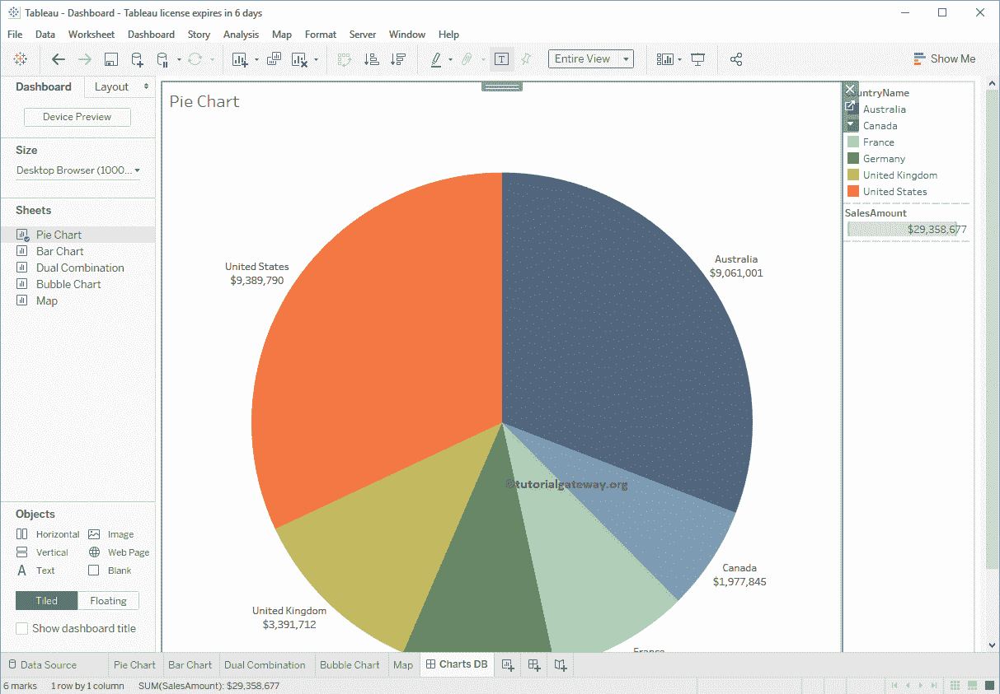

# 如何在 Tableau 中创建仪表板

> 原文：<https://www.tutorialgateway.org/create-a-dashboard-in-tableau/>

Tableau 仪表板是一个视图，它将显示几个工作表的集合。您可以使用单个仪表板来分析整个业务。在本文中，我们将向您展示如何在 tableau 中创建仪表板。对于这个 Tableau 仪表板创建演示，我们使用下面的工作表。它有饼图、条形图、双组合图、气泡图和地图。

## 在表格中创建仪表板

请单击“新建”选项卡创建 Tableau 仪表板。

现在，您可以看到 Tableau 仪表板。

1.  设备预览:使用此按钮为电话、桌面和平板电脑创建视图。
2.  尺寸:调整显示尺寸。
3.  图纸:可用于创建此的图纸列表。
4.  对象:可以在其中使用的预定义对象。
5.  名称:右键单击并选择“重命名图纸”选项以重命名该图纸。
6.  这是实际的工作区域。

将鼠标悬停在任何图纸上以查看预览，并通过单击标记的按钮将您带到原始位置。请参考[表格](https://www.tutorialgateway.org/tableau/)中的[饼图](https://www.tutorialgateway.org/pie-chart-in-tableau/)、[条形图](https://www.tutorialgateway.org/bar-chart-in-tableau/)、[双组合](https://www.tutorialgateway.org/tableau-dual-combination-chart/)、[气泡](https://www.tutorialgateway.org/tableau-bubble-chart/)、[地图](https://www.tutorialgateway.org/maps-in-tableau/)和[数据标签。](https://www.tutorialgateway.org/data-labels-in-tableau-reports/)

让我拖动饼图。

接下来，让我将条形图添加到仪表板中。从下面的截图可以看到，如果你在把东西拖到工作区，它会询问位置。我指的是右上、左上、右下等

现在，您可以在我们的 Tableau 仪表板中看到两张工作表。

让我添加双重组合表和气泡图。

### 重新排列工作表

要重新排列仪表板上的工作表，请选择要更改位置的工作表，并使用标记字段。

为了演示相同的内容，我们在底部放置了双组合。

### 从表格仪表板中删除工作表

请选择要删除的工作表。接下来，单击关闭按钮。

或者单击向下箭头并选择从仪表板中删除选项。

无论哪种方式，它都将从中删除选定的一个。如您所见，没有饼图。

