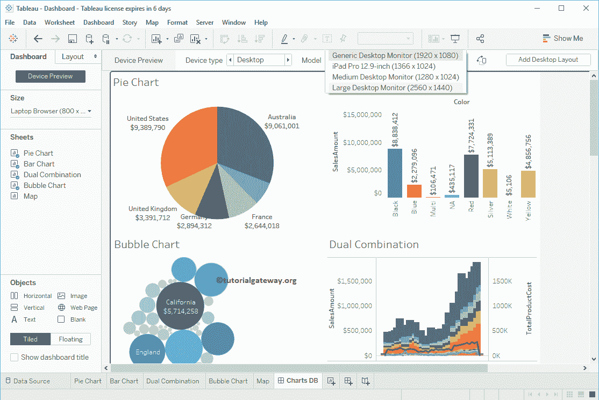

# 创建 Tableau 仪表板设备预览

> 原文：<https://www.tutorialgateway.org/create-tableau-dashboard-device-preview/>

在本文中，我们将通过一个示例向您展示如何创建 Tableau 仪表板设备预览。设备预览意味着为台式机、平板电脑和移动电话创建仪表板视图。

为此，我们将使用下图所示的仪表板。这是我们在上一篇文章中创建的 [Tableau 仪表板](https://www.tutorialgateway.org/create-a-dashboard-in-tableau/)。

## 创建 Tableau 仪表板设备预览

[Tableau](https://www.tutorialgateway.org/tableau/) 仪表板左侧的设备预览按钮将帮助您为手机、平板电脑和桌面创建不同的仪表板视图。点击设备预览按钮查看

您可以在仪表板顶部看到“设备预览”选项。

使用此按钮将视图从横向更改为纵向，反之亦然

您可以在设备类型

下查看可用视图列表

### 创建 Tableau 仪表板的桌面预览

请选择设备类型作为桌面。您可以在“模型”下拉列表下看到可用桌面模型的列表。让我选择通用桌面显示器

点击添加桌面布局按钮，为所选模型

添加布局

我们选择了适合所有人的桌面尺寸

### 创建 Tableau 仪表板的平板预览

请选择平板电脑的设备类型。您可以在“型号”下拉列表中看到可用平板电脑型号的列表。让我选择通用平板电脑

点击添加平板电脑布局按钮，为您的仪表板

添加平板电脑布局

我们从仪表板中删除了气泡图，以适应平板电脑的宽度。这意味着，当您在平板电脑中选择仪表板时，您只能看到饼图、条形图和双组合图。

### 创建 Tableau 仪表板的电话预览

请选择设备类型为电话。您可以在“型号”下拉列表中看到可用手机型号的列表。让我选择 iPhone 7 Plus，点击【添加手机布局】按钮

你可以看到手机屏幕

的边界

为了适合手机屏幕，我们从仪表盘中移除了[气泡图](https://www.tutorialgateway.org/tableau-bubble-chart/)和[双组合图](https://www.tutorialgateway.org/tableau-dual-combination-chart/)。意思是，在手机中选择仪表盘，只能看到[饼图](https://www.tutorialgateway.org/pie-chart-in-tableau/)和[条形图](https://www.tutorialgateway.org/bar-chart-in-tableau/)。

让我把型号换成三星 Galaxy S 系列查看屏幕

创建完设备预览后，单击设备预览返回正常显示。

