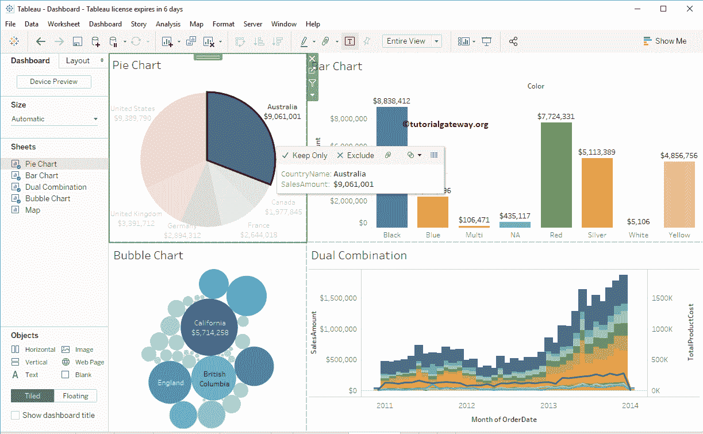

# Tableau 仪表板中的过滤器

> 原文：<https://www.tutorialgateway.org/filters-in-tableau-dashboard/>

在本文中，我们将通过一个例子向您展示如何在 Tableau 仪表板中创建过滤器。对于这个仪表板过滤器演示，我们将使用下面显示的仪表板。

这是我们在上一篇文章中创建的仪表板。所以，请参考 [Tableau 仪表盘](https://www.tutorialgateway.org/create-a-dashboard-in-tableau/)下的文章。

## 在 Tableau 仪表板中创建过滤器

有多种方法可以在[表](https://www.tutorialgateway.org/tableau/)仪表盘上创建过滤器

### Tableau 仪表板中的过滤器–第一种方法

我们可以使用仪表板项目(工作表或图表)作为表中的过滤器。为了演示相同的内容，我们将使用[饼图](https://www.tutorialgateway.org/pie-chart-in-tableau/)作为这个仪表板的过滤器。要应用相同的方法，请选择饼图并单击“用作过滤器”按钮，如下所示。

或者单击向下箭头，并从下拉菜单中选择“用作过滤器”选项。

无论哪种方式，它都会将饼图转换为过滤器。从下面的截图中，你可以观察到，当我选择美国时，所有其他图表中的数据都是格式化的。我的意思是他们正在显示属于美国

的数据

让我也试试德国

### 删除 Tableau 仪表板中的过滤器

要删除此过滤器，您可以选择“过滤器”按钮，也可以从下拉菜单中取消选中“用作过滤器”选项。让我把它去掉

现在你看，即使我从饼状图

中选择了澳大利亚，对仪表板表也没有影响

### Tableau 仪表板中的过滤器–第二种方法

我们还可以对仪表板中的单个项目(工作表或图表)应用过滤器。我们再次使用饼图进行演示。要应用相同的设置，请选择过滤器，然后选择国家/地区名称或您想要的任何字段。

现在你可以看到仪表板右侧的过滤器

让我不选几个国家。从下面的截图中，您可以看到，过滤器仅适用于饼图，其余所有图表不受影响。

您也可以将其转换为完整的工作表过滤器。为此，请选择一个过滤器，然后单击向下箭头打开下拉菜单。请选择应用于工作表，然后选择选定的工作表..选项

它会打开“将过滤器应用于工作表”窗口。请选择您要应用的工作表。

让我不选几个国家。从下面的截图中，可以看到过滤器正在应用于所有现有的图表。

### Tableau 仪表板中的过滤器–第三种方法

我们可以使用在单个工作表中创建的过滤器，而不是在仪表板上应用过滤器。让我在[饼图](https://www.tutorialgateway.org/pie-chart-in-tableau/)上创建一个过滤器。请参考[滤镜介绍](https://www.tutorialgateway.org/tableau-filters/)文章了解概念。

你可以看到对整个仪表板的影响。

让我打开我们在上一篇文章中创建的另一个仪表板。您可以看到，同样的过滤器也在影响这个仪表板。

