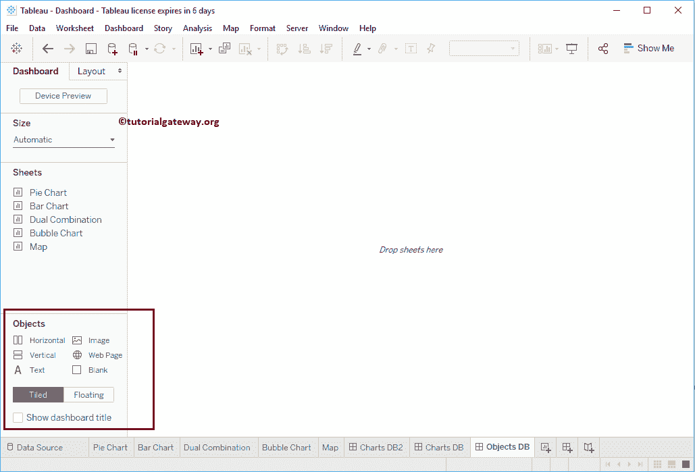
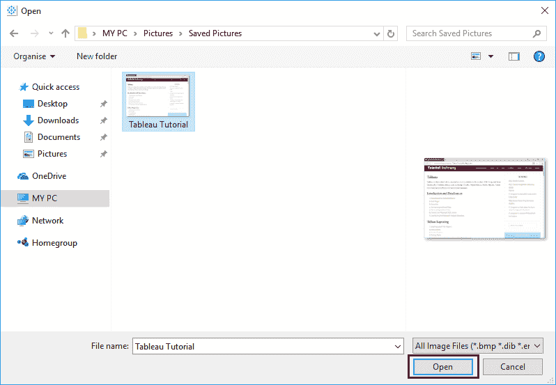
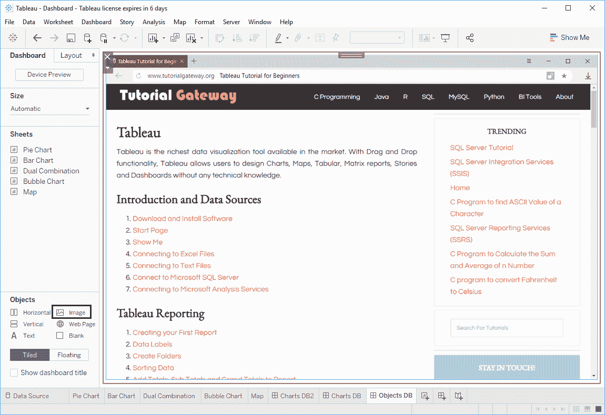
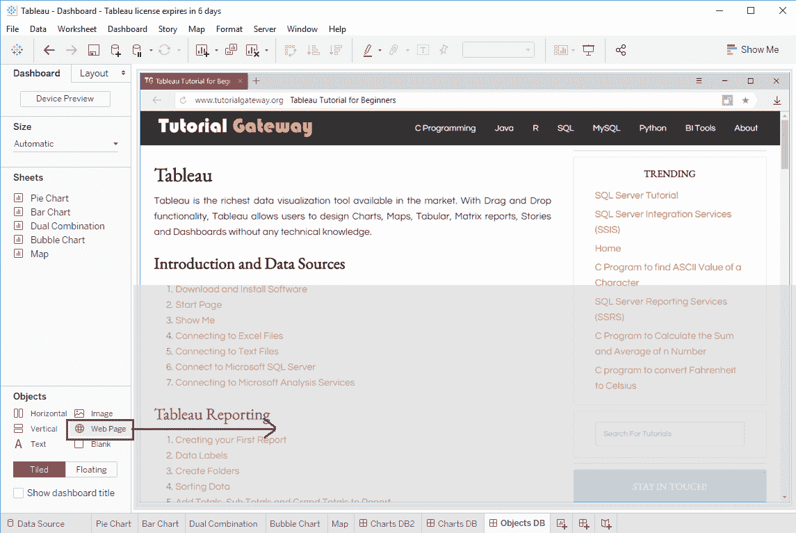
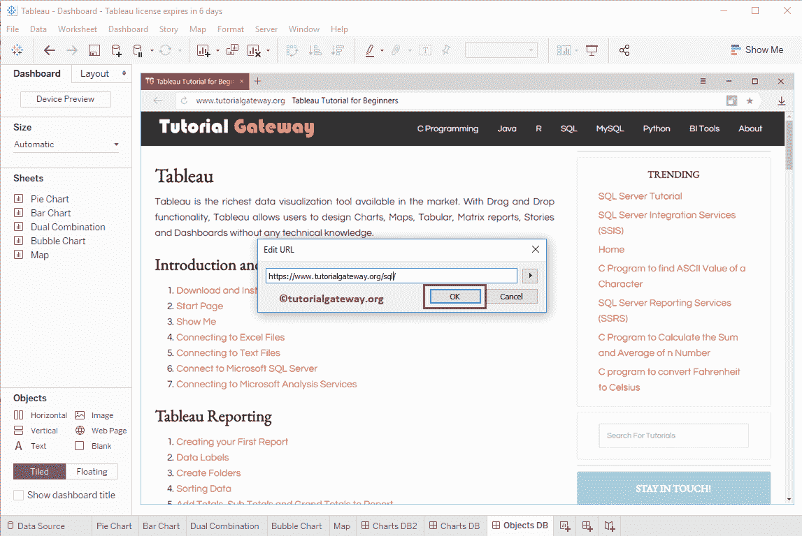
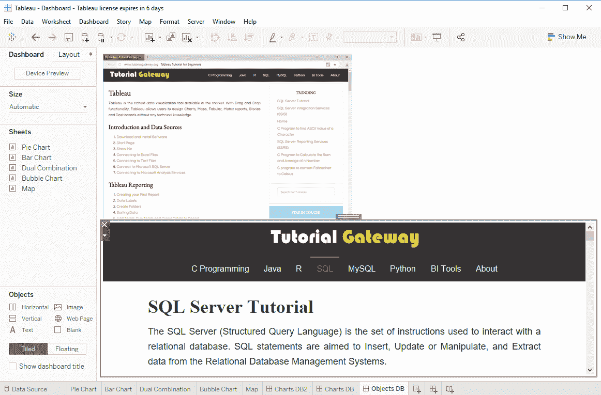
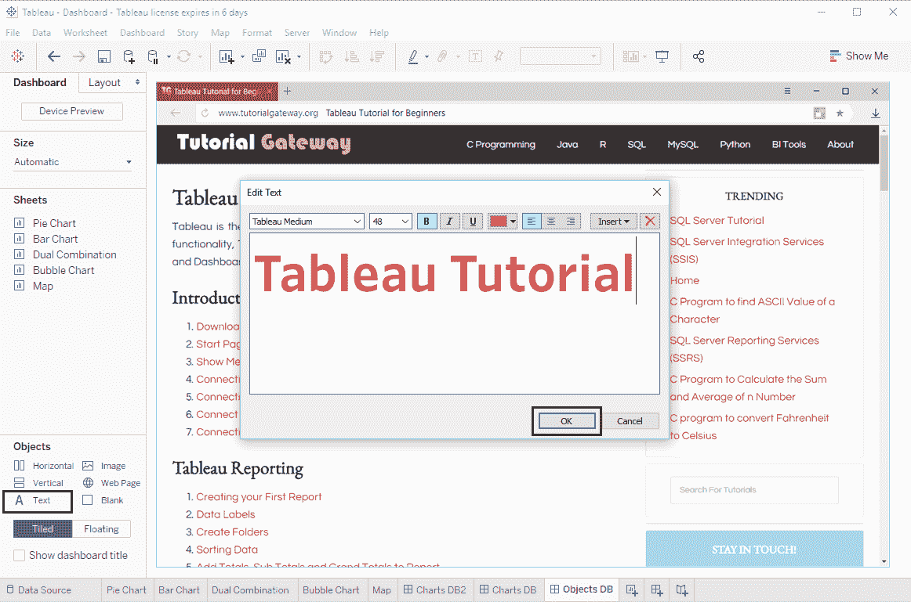
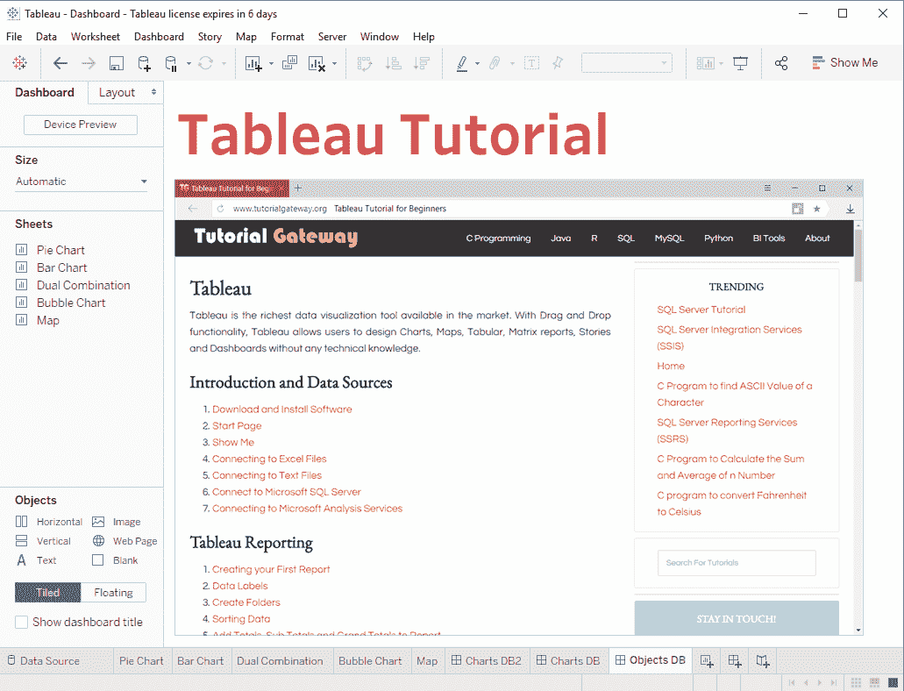

# 表格仪表板对象

> 原文：<https://www.tutorialgateway.org/tableau-dashboard-objects/>

在本文中，我们将通过一个例子向您展示如何使用 Tableau 仪表板对象。对于这个仪表板对象演示，我们正在创建一个新的仪表板。

## 表格仪表板对象

从上面的截图中，可以看到 [Tableau](https://www.tutorialgateway.org/tableau/) 仪表盘中可用的对象列表。我建议您参考 [Tableau 仪表板](https://www.tutorialgateway.org/create-a-dashboard-in-tableau/)文章中创建仪表板所涉及的步骤。

### 将图像添加到 Tableau 仪表板

通常，我们用它来添加一个徽标。让我将图像对象拖放到工作区。这将打开以下窗口。请使用此窗口选择所需的图像。

现在，您可以在我们的仪表板上看到图像。

### 将网页添加到 Tableau 仪表板

让我将网页对象拖放到工作区或 Tableau 仪表板上。

放下网页会打开一个弹出窗口写网址。现在，我们指向 [SQL Server](https://www.tutorialgateway.org/sql/)

您可以在我们的仪表板上看到教程网关网页。

### 向表格仪表板添加文本

当您将文本对象放到工作区时，将会打开一个名为“编辑文本”的新弹出窗口。使用此窗口编写您的自定义。

现在可以了，文字添加到我们的仪表盘

