# 表格过滤器

> 原文：<https://www.tutorialgateway.org/tableau-filters/>

Tableau 过滤器用于根据客户要求限制数据。例如，我们可以从显示中排除一个区域，或者我们可以使用 Tableau Filters 显示前 10 个表现好的记录或表现差的记录。在开始我们的示例之前，理解 Tableau 在工作簿中执行过滤器的操作顺序是非常重要的。顺序是:

1.  [提取](https://www.tutorialgateway.org/extract-filters-in-tableau/)
2.  [数据源](https://www.tutorialgateway.org/data-source-filters-in-tableau/)
3.  [上下文](https://www.tutorialgateway.org/context-filters-in-tableau/)
4.  尺寸上的
5.  [关于措施](https://www.tutorialgateway.org/tableau-filters-on-measures/)

在本文中，我们将通过示例向您展示如何创建基本的 Tableau 过滤器？。在本演示中，我们创建了两个层次结构，分别代表国家和产品。下面的截图会给你展示尺寸，测量预览

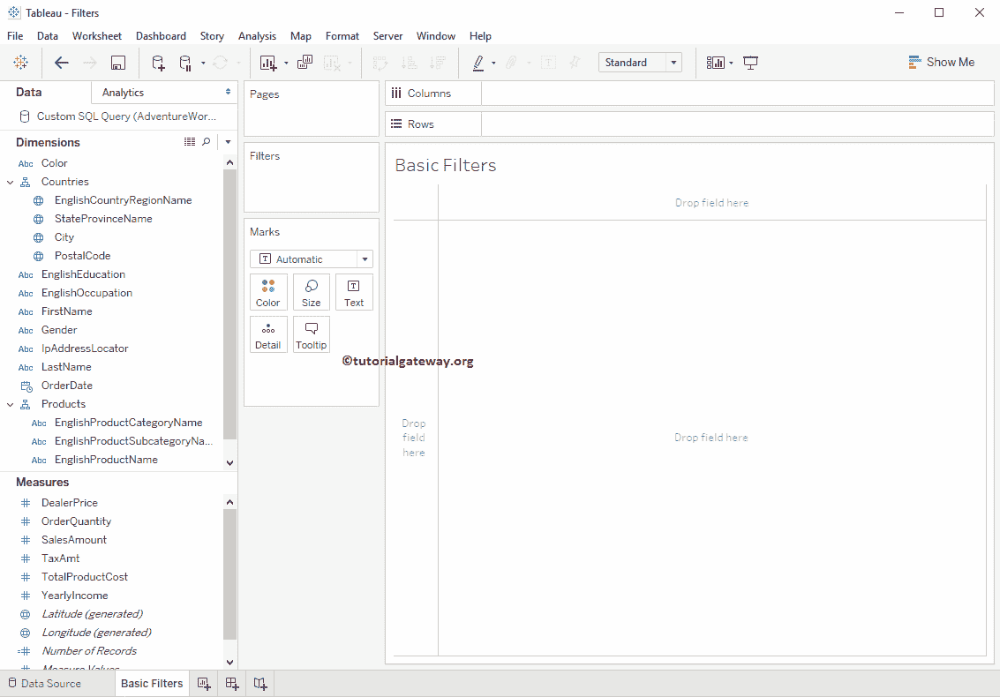

## 创建表格过滤器

首先，将城市名称从维区域拖放到行货架，将销售额度量区域拖放到列货架。默认情况下，tableau 将生成条形图，如下所示。请记住，我们的[报告](https://www.tutorialgateway.org/tableau-reports/)中有 269 行。也可以访问[层次结构](https://www.tutorialgateway.org/hierarchies-in-tableau/)和[报告中的数据标签](https://www.tutorialgateway.org/data-labels-in-tableau-reports/)文章，了解[表格](https://www.tutorialgateway.org/tableau/)数据源。

### 在 Tableau 中创建过滤器的方法 1

Tableau 允许您从报告中选择单个数据点或一组数据点。一旦您选择了数据点，您将获得两个选项，称为“仅保留”和“排除”。选择这两个选项中的任何一个都意味着您确实在使用过滤器。

例如，如果你观察下面的截图，我们从条形图中随机选择了 16 个城市。接下来，我们使用仅保留选项。这意味着我们正在使用 Tableau 过滤器，说明应该显示具有所选名称的城市。

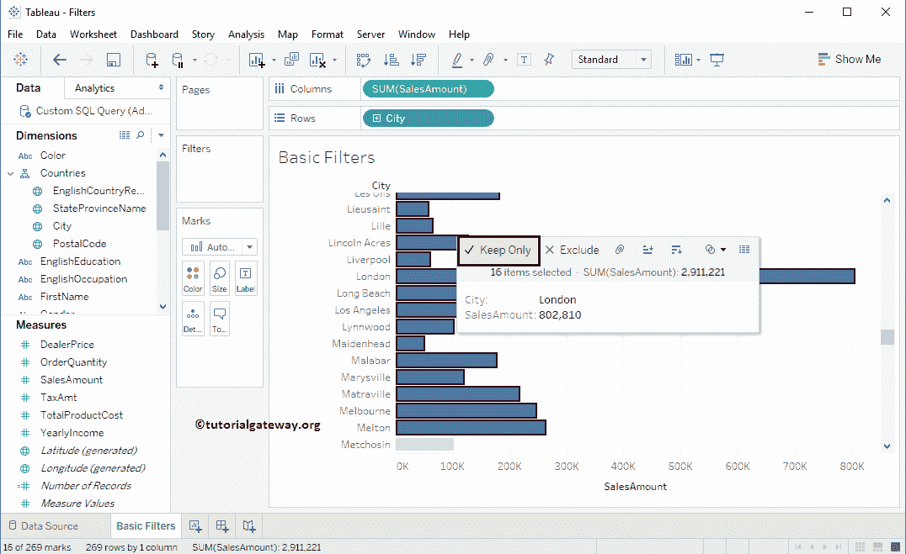

如您所见，该报告显示了我们在上一步中选择的记录。最重要的是，城市维度出现在过滤器货架上。

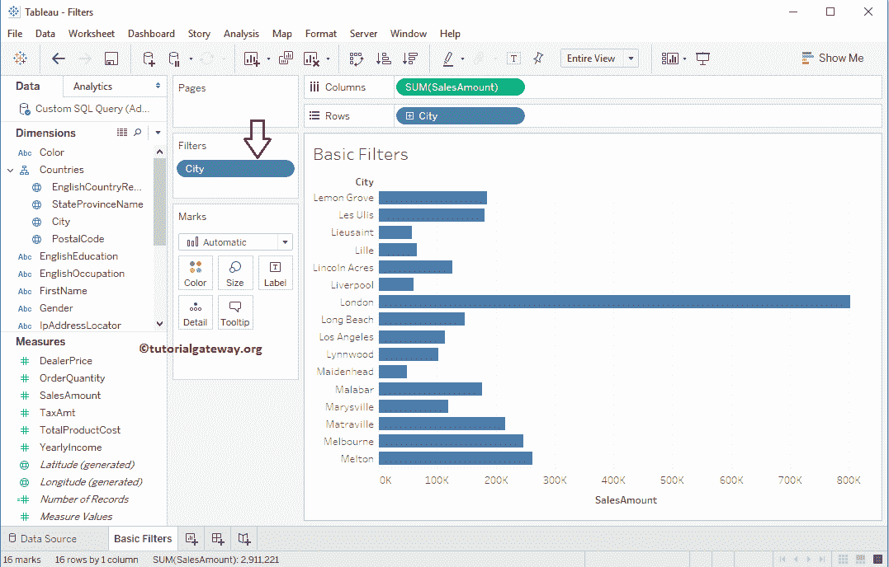

### 创建表格过滤器的方法 2

在这个表格过滤器的例子中，我们将使用排除选项。这里，我们从条形图中选择前 96 个城市。接下来，我们使用排除选项。这意味着我们正在使用过滤器，说明具有所选名称的城市应该限制显示。

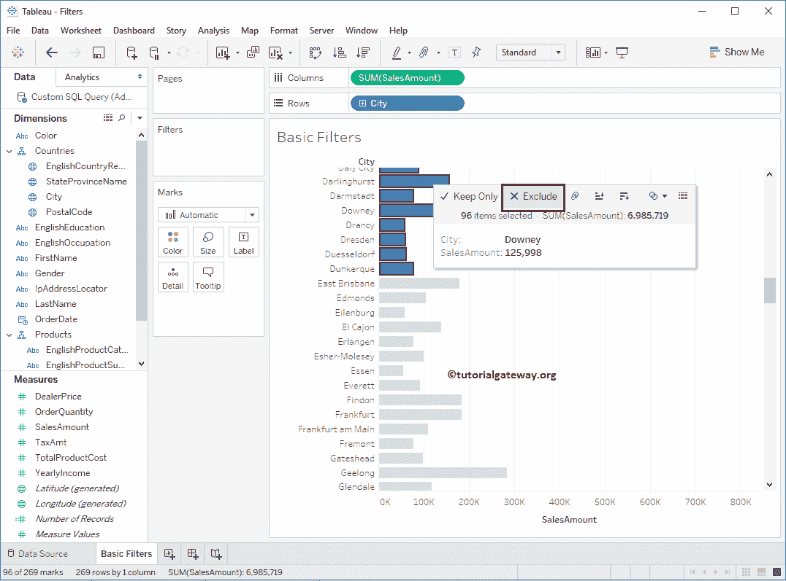

您可以观察到 tableau Filter 报告正在显示以 E.

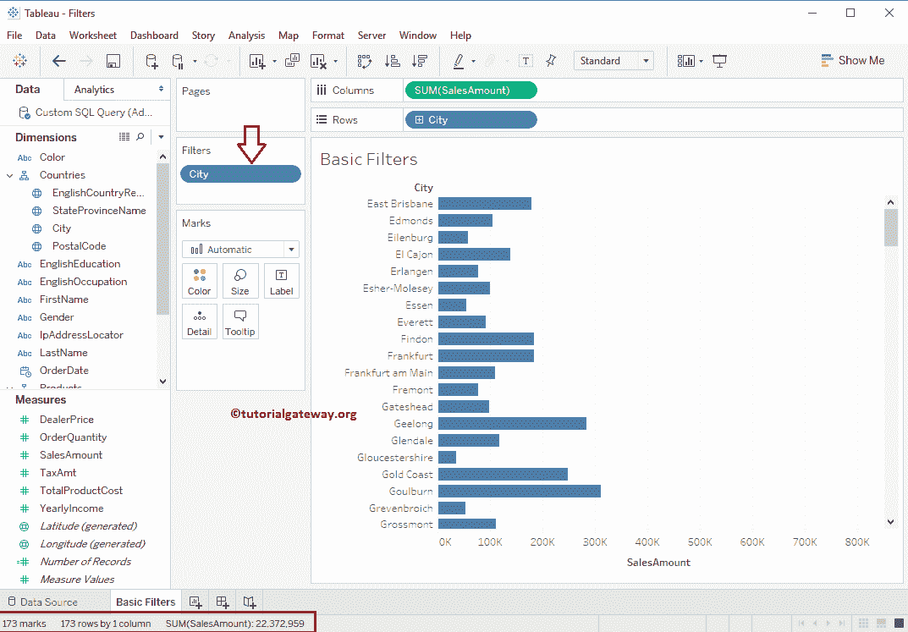

开头的城市

虽然上面的例子足以理解 Tableau 中的基本过滤器。我想用[表格地图](https://www.tutorialgateway.org/how-to-create-a-map-in-tableau/)再提供两个样本。这可能有助于进一步参考。

## 在表格地图中创建过滤器

将“销售额度量”区域拖放到“列”货架，将“城市名称”从“维区域”拖放到“行”货架。默认情况下，Tableau 会生成[条形图](https://www.tutorialgateway.org/bar-chart-in-tableau/)。因此，请使用“展示货架”将其更改为“地图”。如你所见，表格地图显示有 128 个未知区域。

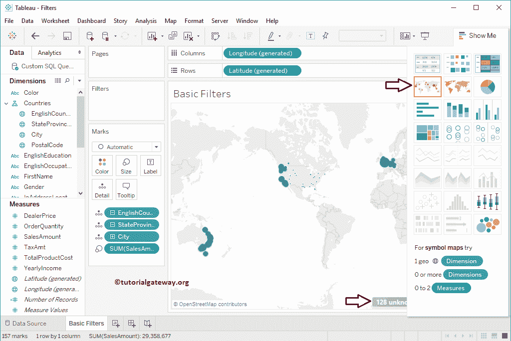

双击它，会打开如下带有多个选项的窗口。这是一个完全不同的话题，我们将在地图部分讨论可能性。目前，我们选择了第二种选择。这意味着，我们正在地图上应用过滤器，并坚持地图不显示这 128 个地区。

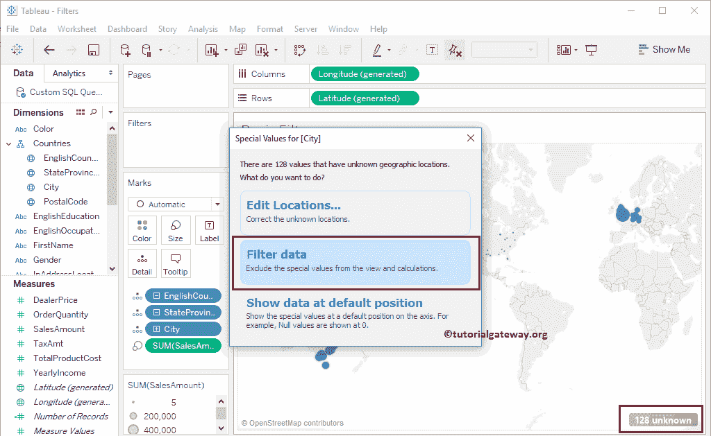

现在你可以看到地图，排除了这 128 个地区。在 Tableau 中也称为过滤地图数据。

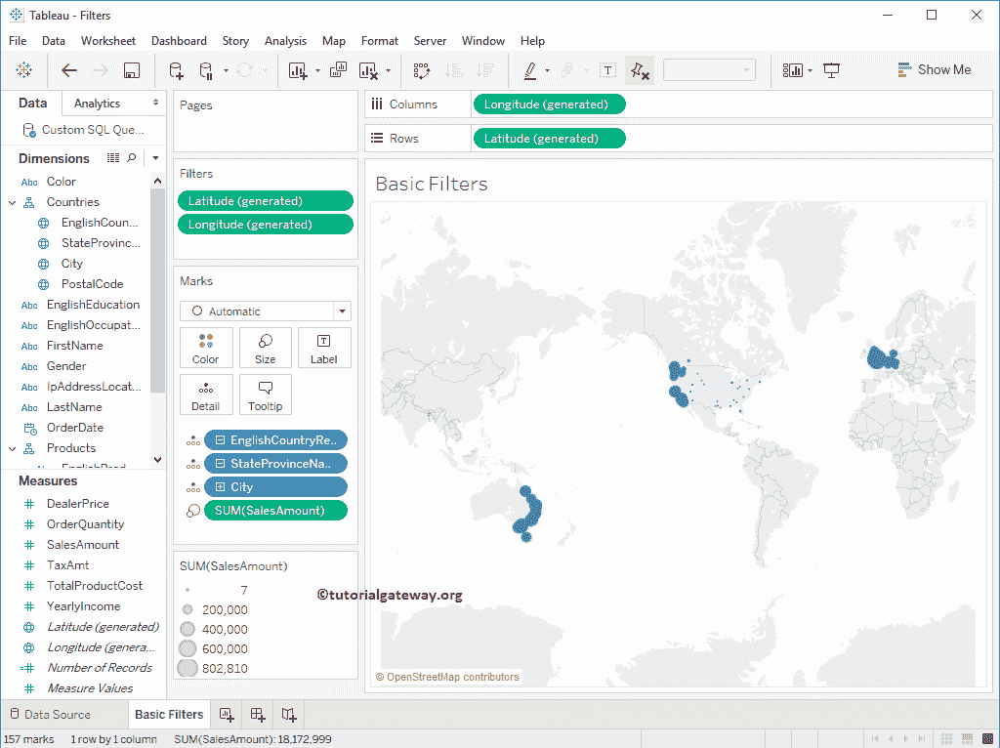

### 使用排除选项创建表格过滤器

我们正在从地图中选择欧洲区域的数据点。接下来，我们使用排除选项。这意味着我们使用的条件是，该地区的销售额应限制在显示范围内。

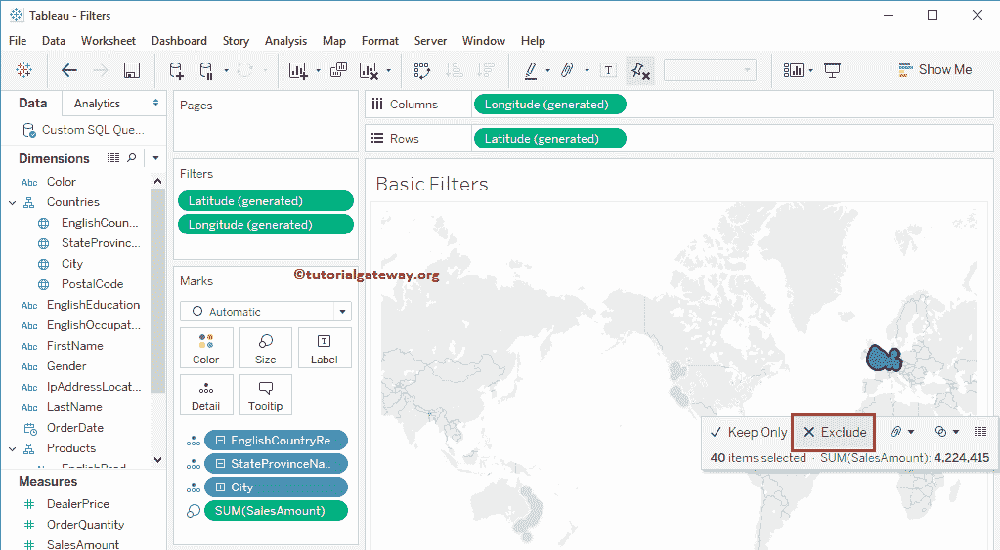

现在你可以看到没有欧洲数据的地图。

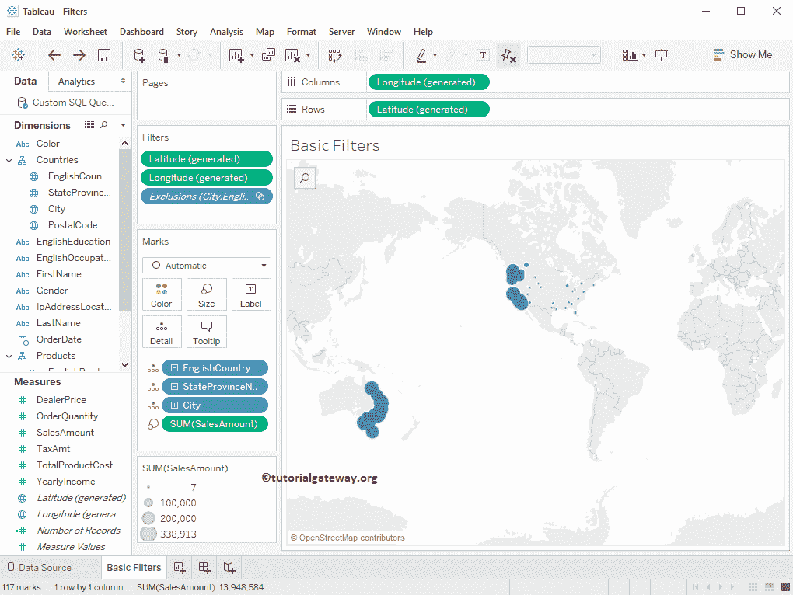

### 使用仅保留选项创建表格过滤器

我们正在从地图中选择美国地区的数据点。接下来，我们将使用仅保留选项。这意味着我们正在使用条件过滤器，说明“美国地区的销售额”应该只显示。

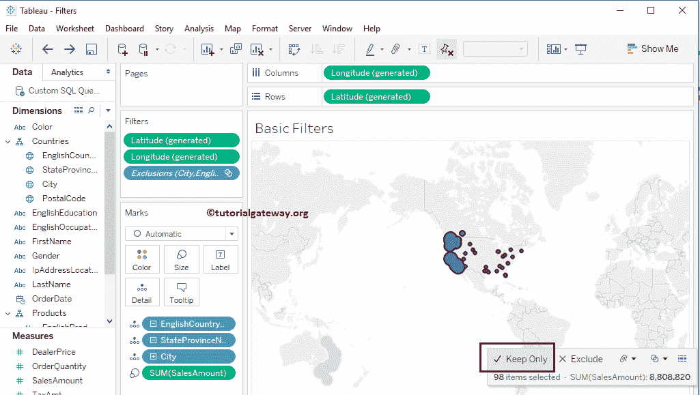

下面的截图将显示 Tableau 过滤器映射。

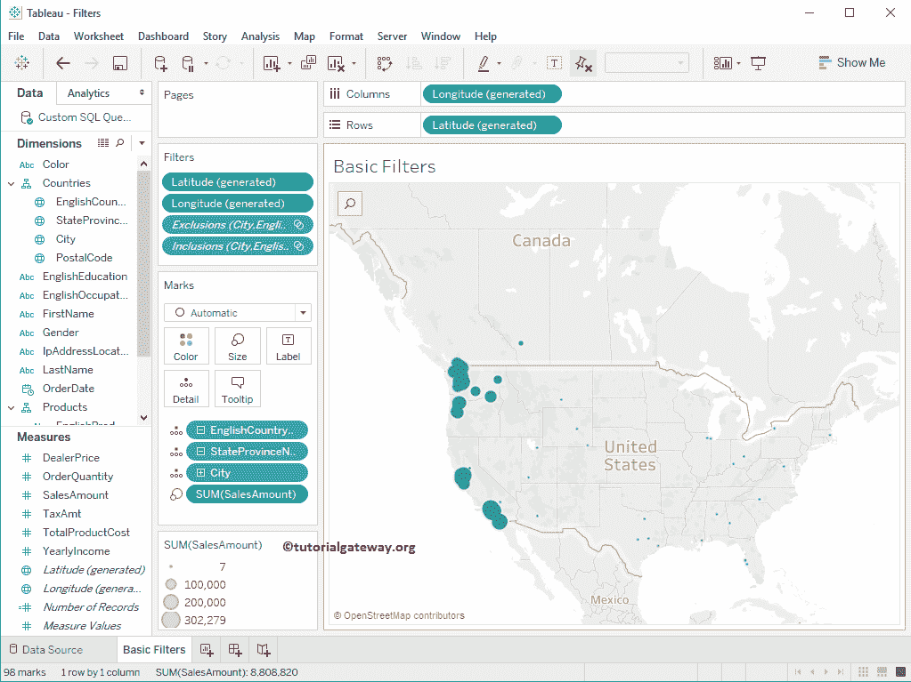