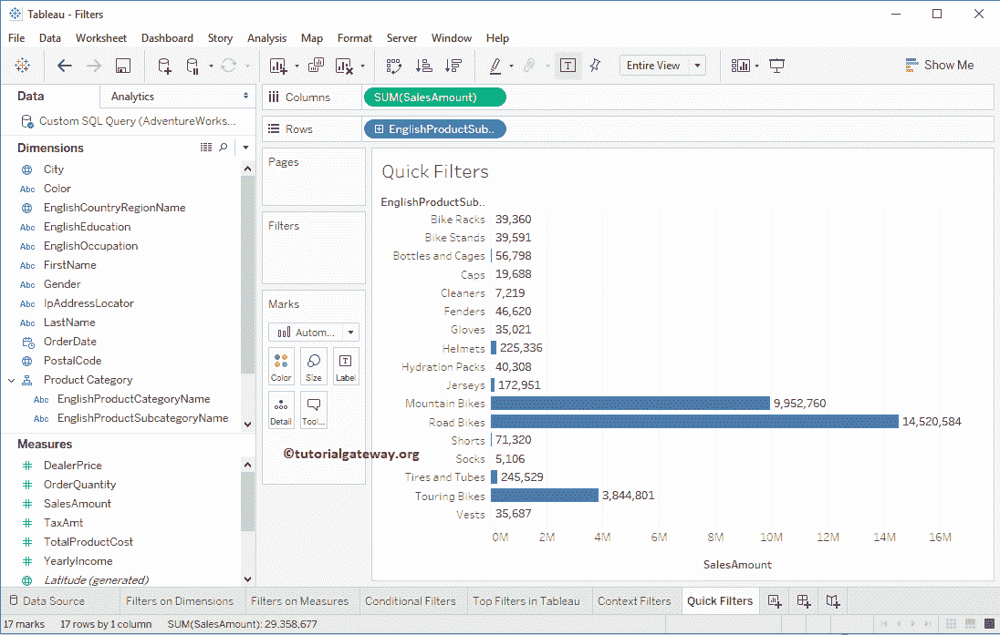

# 表中的快速过滤器

> 原文：<https://www.tutorialgateway.org/quick-filters-in-tableau/>

在本文中，我们将通过一个例子向您展示如何在 Tableau 中创建快速过滤器。

## 在表中创建快速过滤器

对于这个 Tableau 快速过滤器演示，我们将使用我们在上一篇文章中创建的数据源。因此，请访问 Tableau 报告文章中的[数据标签来了解数据源。接下来，请参考](https://www.tutorialgateway.org/data-labels-in-tableau-reports/) [Tableau 滤镜](https://www.tutorialgateway.org/tableau-filters/)了解基本的 [Tableau](https://www.tutorialgateway.org/tableau/) 滤镜技术。

要在 Tableau 中创建快速过滤器，首先，将英文产品子类别从维度区域中的产品类别[层次结构](https://www.tutorialgateway.org/hierarchies-in-tableau/)拖放到行货架，将销售额度量区域拖放到列货架。默认情况下，Tableau 会生成[条形图](https://www.tutorialgateway.org/bar-chart-in-tableau/)。

在这里，我们将在英文产品名称上添加快速过滤器。要在 Tableau 中添加快速过滤器，请单击行架中英文产品子类别名称旁边的向下箭头将打开菜单。在这里，您必须选择显示过滤器选项。

选择“显示过滤器”选项“英文产品子类别名称”后，该维度将添加到过滤器架中。最重要的是，Tableau 将列出维度中存在的记录。

我们可以从快速过滤器部分执行过滤。例如，我们可以检查所需的子类别。

### 快速过滤器选项

以下是 Tableau 快速过滤器部分中可用的选项列表。您可以通过点击快速过滤器

旁边的向下箭头来访问这些项目

#### 表快速过滤单值(列表)

此选项允许您从可用列表中选择任何一条记录(或行)。让我为演示目的选择相同的。

从下面的截图中可以看到，快速过滤器显示了英文产品子类别名称维度中存在的所有记录的列表。在这里，您可以选择任何一个选项，也可以为所有记录选择(全部)选项。

#### 表快速过滤单值(下拉)

此选项允许您从下拉列表中选择任何一条记录(或行)。出于演示目的，我们将选项从单值(列表)更改为单值(下拉)。从下面的截图中，您可以看到快速过滤器正在显示下拉列表，以从该下拉列表中选择任何一条记录。

#### 表快速过滤单值(滑块)

它允许您使用滑块选择任何一条记录或行。出于演示目的，我们将选项从单值(下拉)更改为单值(滑块)。您可以从下图中看到，快速过滤器显示了一个滑块，您可以使用它来选择任何一条记录。

#### 表快速过滤多值(列表)

此选项允许您从可用记录列表中选择多个记录或行。出于演示目的，我们将选项从单值(滑块)更改为多值(列表)。从下面的截图中，可以看到快速过滤器显示了选择多条记录的列表。为了演示的目的，我们选择了一些随机的子类别。

#### 表快速过滤多值(下拉)

它允许您从下拉列表中选择多行或多条记录。出于演示目的，我们将选项从多值(列表)更改为多值(下拉)。从下面的截图中，您可以看到快速过滤器正在显示下拉列表，以从该下拉列表中选择所需的记录。

#### 表快速过滤多值(自定义列表)

此选项允许您编写自己的自定义列表。出于演示目的，我们将选项从多值(下拉列表)更改为多值(自定义列表)。在这里，我们可以使用空文本框添加列表项，或者我们可以通过单击每个项旁边的退出符号来删除任何项。

#### 表快速过滤通配符匹配

此 Tableau 快速过滤选项允许您使用通配符匹配来搜索记录。出于演示目的，我们将选项从多值(自定义列表)更改为通配符匹配。

从下面的截图中，您可以看到快速过滤器显示了用于写入通配符条件的文本框。在这个例子中，我们将 b*作为搜索字段。这意味着它将返回子类别维度中所有名称以 b 或 b 开头的记录。

