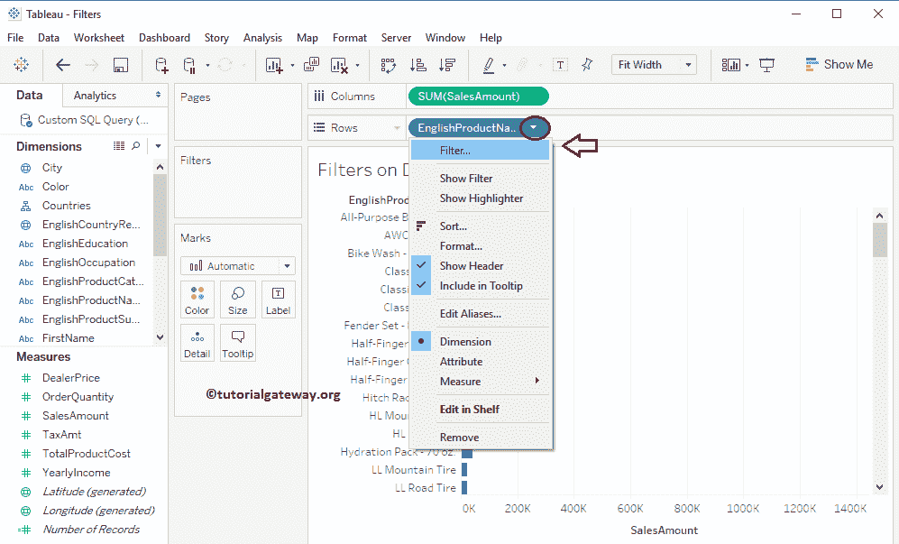

# 维度上的 Tableau 过滤器

> 原文：<https://www.tutorialgateway.org/tableau-filters-on-dimensions/>

在本文中，我们将通过示例向您展示如何在维度上创建 Tableau 过滤器？。

在开始之前，请参考[Tableau 过滤器](https://www.tutorialgateway.org/tableau-filters/)了解[表](https://www.tutorialgateway.org/tableau/)中的基本过滤技术。

对于这个维度上的 Tableau 过滤器演示，我们将使用我们在上一篇文章中创建的数据源。因此，请参考 Tableau Reports 文章中的[数据标签来了解数据源。](https://www.tutorialgateway.org/data-labels-in-tableau-reports/)

## 维度上的 Tableau 过滤器

首先，将英文产品名称从维度区域拖放到行货架，将销售额度量区域拖放到列货架。默认情况下，tableau 会生成[条形图](https://www.tutorialgateway.org/bar-chart-in-tableau/)。请记住，我们的[Tableau 报告](https://www.tutorialgateway.org/tableau-reports/)有 130 分。

### 在维度上创建 Tableau 过滤器的第一种方法

在这个维度上的 Tableau 过滤器示例中，我们将在产品名称上添加过滤器条件。首先，请将产品名称从维度区域拖放到过滤器架。

将产品名称拖放到过滤器架后，将打开一个名为过滤器的新窗口，如下所示。此窗口有四个选项卡:常规、通配符、条件和顶部。

在这篇关于维度上的 Tableau 过滤器的文章中，我们将解释前两个选项卡和基本条件。其余两个将在单独的文章中解释。

### 在维度上创建 Tableau 过滤器的第二种方法

在本例中，我们将在英文产品名称上添加过滤条件。首先，请点击行货架中产品名称旁边的向下箭头，将打开菜单。在这里，您必须选择过滤器..选项。

选择过滤器后..选项，将打开一个新窗口来创建维度上的 Tableau 过滤器。

#### Tableau 过滤器中的常规选项卡

以下是此常规选项卡中可用的选项列表:

1.  从列表中选择:默认情况下，此单选按钮处于选中状态。选择此属性后，它将显示该维度(产品名称)中存在的所有记录(行)。
2.  自定义值列表:在这里，您可以编写自定义值。
3.  全部使用:该选项用于选择所有记录。这里没什么可做的。
4.  全部:该按钮将选择该窗口中的所有记录。
5.  无:该按钮将取消选择该窗口中的所有记录。
6.  排除:如果选中此选项，Tableau 将排除您在此选择的所有记录。

为了演示维度上的 Tableau 过滤器，我们取消了一些随机记录，并单击了应用按钮。这里，应用按钮将自动反映 Tableau 报告，而不关闭过滤器窗口。

从下面的截图中，您可以看到以前未检查的记录没有显示报告。让我取消选中一些记录，然后单击“确定”应用更改并关闭窗口。

现在，您可以看到应用了过滤器的条形图。最棒的是，英文产品名称维度已经出现在过滤器货架上。

##### 自定义值列表

通过选择此单选按钮，将显示一个空文本框来搜索或添加文本。过滤条件将适用于我们在此添加的数据。

从下面的截图中，可以观察到我们增加了两条记录。

让我在这个自定义列表中再添加一些记录。完成后，单击应用，然后单击确定按钮应用更改并关闭窗口。

现在，您可以看到 tableau 报告显示了我们添加到海关价值列表中的四条记录。

##### 排除

让我编辑我们创建的维上的 Tableau 过滤器，并勾选排除选项

这意味着，Tableau 显示除这四条记录之外的英文产品名称维度中的所有记录。

#### Tableau 过滤器中的通配符选项卡

以下是此常规选项卡中可用的选项列表:

1.  匹配值:输入要在通配符搜索中使用的文本值。
2.  包含:默认情况下，此单选按钮处于选中状态。选择此属性后，它将根据匹配值检查每条记录。如果它在任何位置包含匹配值，那么记录将被显示。否则，它将忽略该记录。
3.  开始于:它将根据匹配值检查每条记录。如果记录以匹配值开始，则显示该记录。否则，它将忽略该记录。
4.  结束于:如果记录以匹配值结束，将显示该记录。否则，它将忽略该记录。
5.  完全匹配:它将根据匹配值检查每条记录。如果该记录与匹配值完全匹配，则显示该记录；否则，它将忽略该记录。
6.  排除:如果选中此选项，则 Tableau 将排除您选择的所有记录。

为了演示 Tableau 维度过滤器，我们使用了 Mountain 关键字。

从下面的截图中，您可以观察到 Tableau 报告显示了包含 Mountain 关键字的所有记录。

让我用

将表维度过滤器选项从包含更改为统计

现在，我们的报告显示了英文产品名称维度中的所有记录，其名称以 Mountain 关键字开头。

让我将选项从统计改为结束，并将匹配值从山区改为整数 2。

现在，我们的报告显示了英文产品名称维度中的所有记录，其名称以整数 2 结尾。

#### 度量上的 Tableau 过滤器中的条件选项卡

我们将在下一篇文章中解释所有的选项，并将这一部分视为引言。

从下面的截图中，您可以看到我们正在选择“按字段”部分。接下来，我们选择销售金额作为条件，并使用> =运算符。最后，我们在文本框中添加了 1，000，000 个值。

下面的报告显示了总和(销售额)大于或等于 1，000，000 的所有记录。

