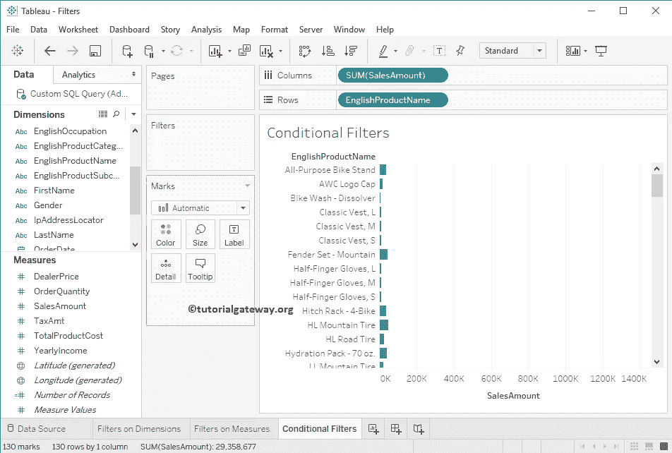
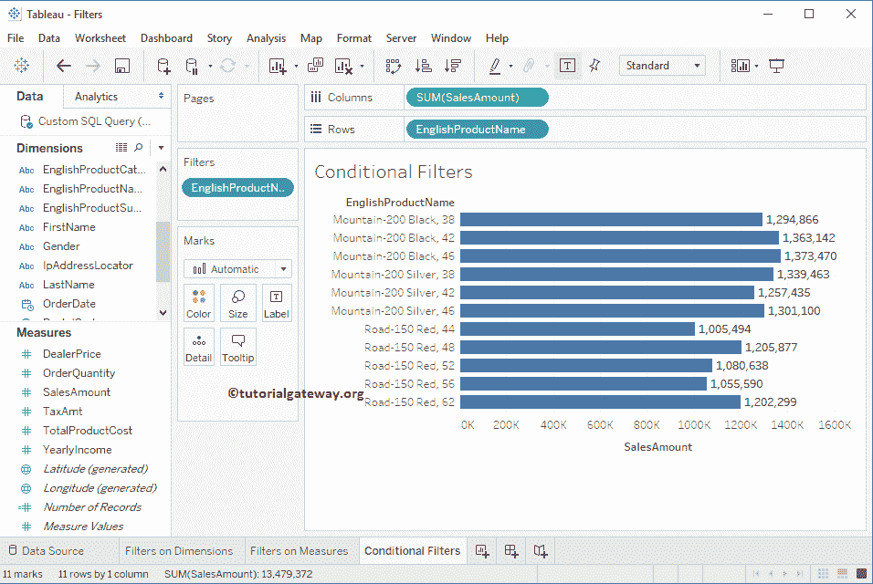

# Tableau 中的条件过滤器

> 原文：<https://www.tutorialgateway.org/conditional-filters-in-tableau/>

在本文中，我们将通过一个例子向您展示如何在 Tableau 中创建条件/条件过滤器。

## Tableau 中的条件过滤器

在进入这个 Tableau 条件过滤器演示之前，请参考 [Tableau 过滤器](https://www.tutorialgateway.org/tableau-filters/)了解基本的过滤技术。对于 Tableau 演示中的这个条件过滤器，我们将使用我们在上一篇文章中创建的数据源。请访问[表格报告中的数据标签](https://www.tutorialgateway.org/data-labels-in-tableau-reports/)文章，了解[表格](https://www.tutorialgateway.org/tableau/)数据源。

首先，将英文产品名称从维度区域拖放到行货架，将销售额度量区域拖放到列货架。默认情况下，tableau 会生成如下所示的[条形图](https://www.tutorialgateway.org/bar-chart-in-tableau/)。

在这个 Tableau 条件过滤器示例中，我们将在英文产品名称上添加过滤器条件。首先，请点击行货架中产品名称旁边的向下箭头，将打开如下所示的菜单。在这里，您必须选择过滤器..选项。

选择过滤器后..选项，将打开一个新窗口来创建过滤器。

### 表条件过滤器中的按字段选项

以下是此 Tableau 条件过滤器部分的可用选项列表:

第一个下拉列表:默认情况下，这将选择记录中存在的度量值。但是您可以通过单击向下箭头来更改字段。当您单击向下箭头时，它会显示数据源中存在的所有度量和维度。

第二个下拉列表:默认情况下，这将选择应用于度量值的聚合函数。但是您可以通过单击向下箭头来更改该功能。当您单击向下箭头时，它会显示该度量可用的函数列表。

第三个下拉列表:默认情况下，这将选择=运算符。但是您可以通过单击向下箭头来更改操作符。当您单击向下箭头时，它会显示可用的赋值运算符列表。

加载:当你点击这个按钮时，过滤器窗口将把最小值和最大值加载到它们各自的文本框中。这将有助于你理解数据。

从下面的截图中，您可以看到我们正在选择“按字段”部分。接下来，我们选择“销售额”作为条件，“总和”作为聚合函数，并使用> =运算符。最后，我们在文本框中添加了 1，000，000 个值。

下面的 Tableau 条件筛选器报告显示了销售额总和大于或等于 1，000，000 的所有记录。

### 按公式列出条件过滤器

在这里，您可以编写自己的自定义和更复杂的条件作为 Tableau 中的 Filter 条件。

当您在文本字段中键入任何字母时，Tableau 智能将显示可用选项的列表，如“字段名称”和“函数名称”。

从下面的截图中，您可以看到我们正在选择“按公式”部分。接下来，我们添加了 SUM(【sales amount】)> = 1000000 代码

下表条件筛选器报告显示了销售额总和大于或等于 1，000，000 的所有记录。

