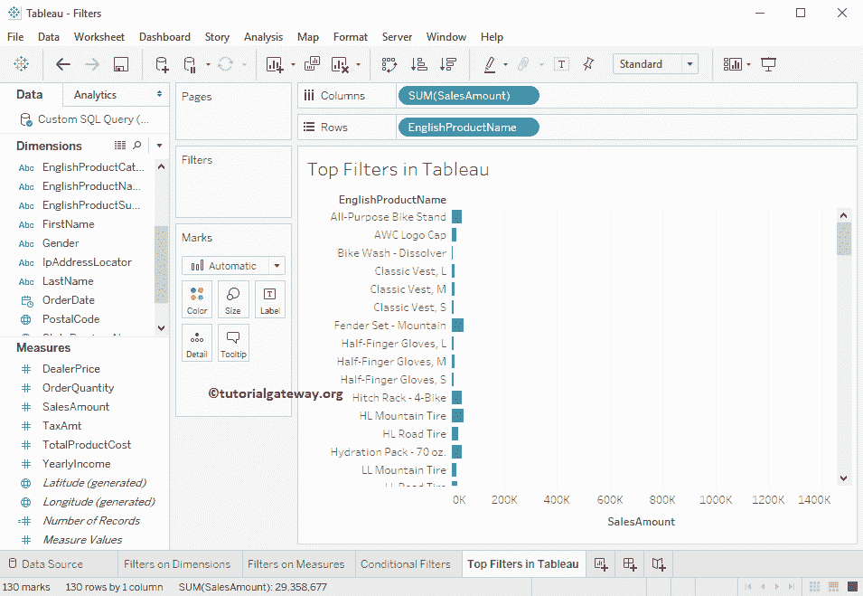

# Tableau 中的顶级过滤器

> 原文：<https://www.tutorialgateway.org/top-filters-in-tableau/>

在本文中，我们将通过示例向您展示如何在 Tableau 中创建底部或顶部过滤器。

## Tableau 中的顶级过滤器

在进入这个顶级过滤器演示之前，请参考[过滤器](https://www.tutorialgateway.org/tableau-filters/)了解基本的过滤技术。对于 Tableau 演示中的底部和顶部过滤器，我们将使用我们在上一篇文章中创建的数据源。请访问[Tableau 报告中的数据标签](https://www.tutorialgateway.org/data-labels-in-tableau-reports/)文章了解数据源。

首先，将“销售额度量”区域拖放到“列”货架，并将英文产品名称从“维度区域”拖放到“行”货架。默认情况下，[表](https://www.tutorialgateway.org/tableau/)会生成[条形图](https://www.tutorialgateway.org/bar-chart-in-tableau/)。

这里，我们将在英文产品名称上添加一个过滤条件。因此，请点击行货架中英文产品名称旁边的向下箭头将打开菜单。在这里，您必须选择过滤器..选项。

选择过滤器后..选项，将打开一个新窗口来创建过滤器。

### Tableau 中顶部过滤器的“按字段”选项

以下是此表顶部过滤器部分的可用选项列表:

第一个下拉列表:默认情况下，这将选择顶部。但是您可以通过单击向下箭头将字段更改为底部。

第二个下拉列表:默认情况下，该字段的值为 10。但是您可以通过单击向下箭头来更改该值。当您单击向下箭头时，它允许您选择或创建新的参数。

第三个下拉列表:默认情况下，这将选择记录中存在的度量值。但是您可以通过单击向下箭头来更改字段。当您单击向下箭头时，它会显示数据源中存在的度量和维度。

第四个下拉列表:默认情况下，这将选择应用于度量值的聚合函数。但是您可以通过单击向下箭头来更改该功能。

### 表 10 大过滤器示例

在本例中，我们使用 Tableau Top 10 过滤器，根据销售额的总和来选择前 10 条记录。

从下面的截图中，您可以看到我们正在选择“按字段”部分。接下来，我们选择顶部，销售金额作为条件，总和作为聚合函数。最后，我们在文本框中添加了 10 个值。

下面的报告根据销售额总和显示了前 10 个记录。或者我们可以说，根据销售额排名前十的记录。

### 表底部 10 个过滤器

这里，在本例中，我们使用 Tableau 底部 10 个过滤器，根据销售金额列的总和来选择底部 12 个记录。

对于这个表底部 10 个过滤器的例子，让我将字段选项从顶部改为底部，并将整数值改为 12

下面的报告根据销售金额的总和显示了最后 12 条记录。或者我们可以说，表现最差的产品。

### 表按公式过滤

在这里，您可以编写自己的自定义和更复杂的条件作为过滤器条件。

当您在文本字段中键入任何字母时，Tableau 智能将显示可用选项的列表，如“字段名称”和“函数名称”。

从下面的截图中，您可以看到我们选择了“按公式”部分。接下来，我们添加 SUM([SalesAmount])代码作为公式。

下面的报告根据销售额总和显示了前 10 个记录。或者我们可以说，根据销售额排名前十的记录。

