# Tableau 度量上的过滤器

> 原文：<https://www.tutorialgateway.org/tableau-filters-on-measures/>

在本文中，我们将通过一个例子向您展示如何在 Measures 上创建 Tableau 过滤器。

## Tableau 度量上的过滤器

在开始之前，我建议你参考 [Tableau Filters](https://www.tutorialgateway.org/tableau-filters/) 来了解基本的过滤技术。对于这个度量上的 Tableau 过滤器演示，我们将使用我们在上一篇文章中创建的数据源。因此，请访问[Tableau 报告中的数据标签](https://www.tutorialgateway.org/data-labels-in-tableau-reports/)文章，了解[表](https://www.tutorialgateway.org/tableau/)数据源。

首先，将英文产品名称从维度区域拖放到行货架，将销售额度量区域拖放到列货架。默认情况下，tableau 会生成[条形图](https://www.tutorialgateway.org/bar-chart-in-tableau/)。记住，我们的[Tableau 报告](https://www.tutorialgateway.org/tableau-reports/)有 130 分。下面截图会给大家展示

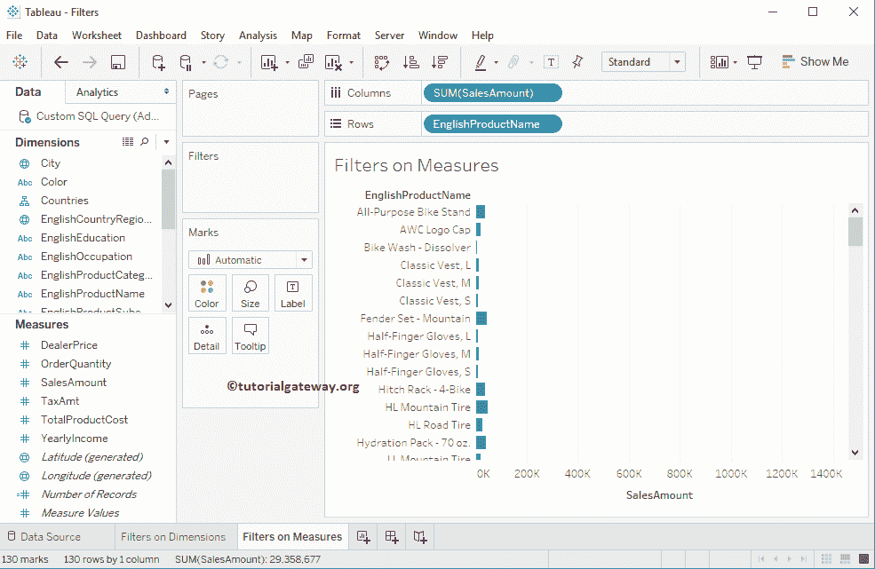

的报告预览

### 在度量上创建 Tableau 过滤器的第一种方法

在这个度量上的 Tableau 过滤器示例中，我们将在销售额上添加一个过滤器条件。因此，请将销售金额从测量区域拖放到过滤器架。

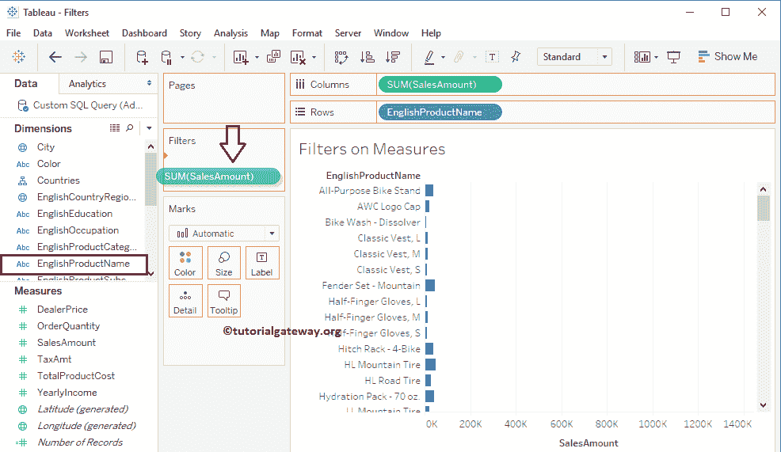

一旦您将销售金额放入过滤器架，一个名为过滤器字段的新窗口将会打开。此窗口包含所有值选项、聚合函数、标准偏差和方差。

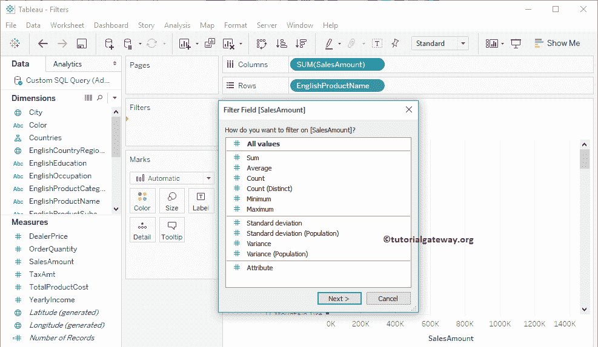

在本例中，我们将向您展示如果选择“所有值”或“聚合”函数会发生什么。首先，我们将选择“所有值”选项，然后单击“下一步”按钮。

提示:这里，“所有值”意味着过滤条件将应用于单个记录。如果我们选择聚合函数(求和、平均等)。)，则过滤条件将应用于聚合值。

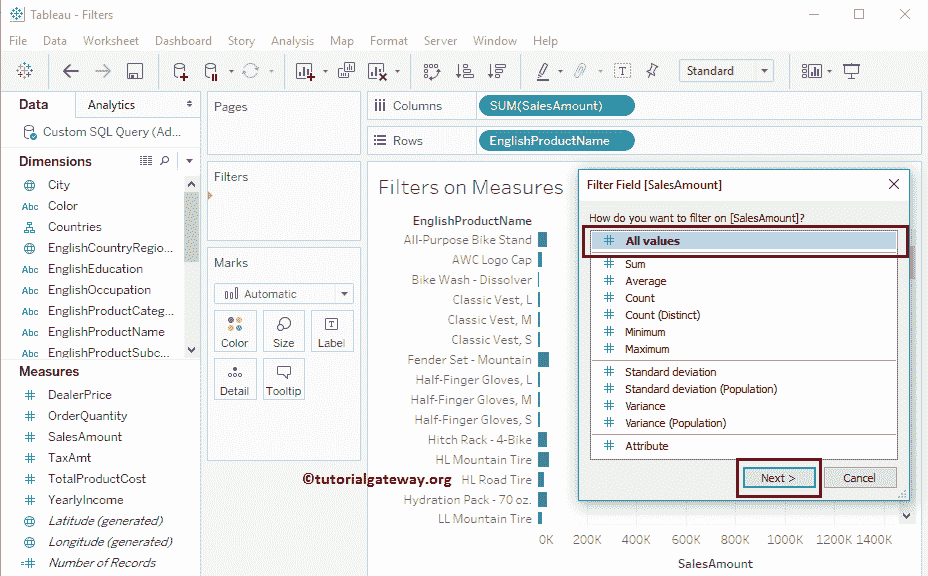

单击“下一步”按钮后，将打开一个名为“过滤器”的新窗口来选择过滤器条件。从下面的截图中，您可以观察到该窗口有四个选项卡:值范围、至少、最多和特殊。在这个例子中，我们将解释前三个选项卡，剩下的三个将在下面的例子中解释。

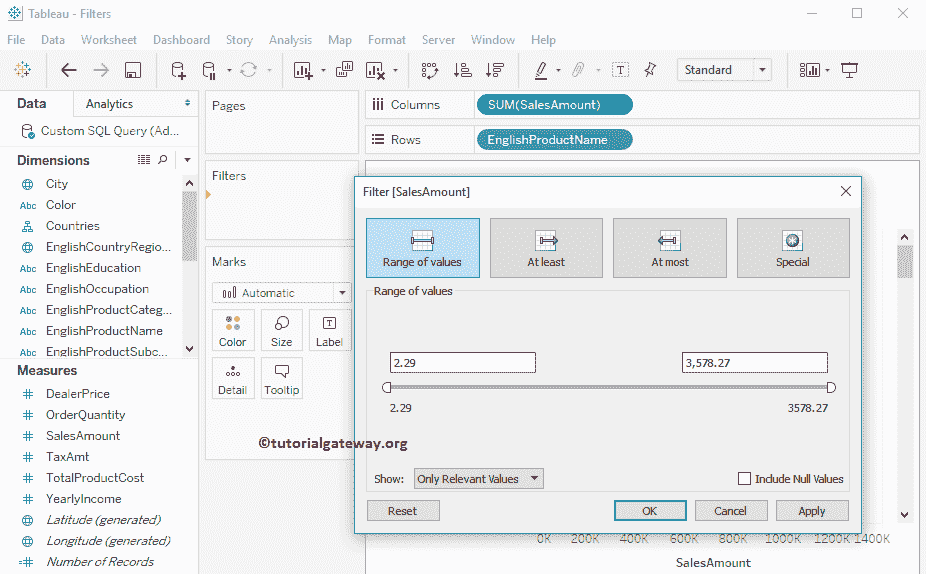

#### 数值范围

度量上的 Tableau 过滤器的这个选项卡包含两个文本框。第一个选择最小值，第二个写最大值。因此，您可以使用这些文本框按照您的要求编写值。或者使用范围栏并将其拖到适当的点。对于这个度量上的 Tableau 过滤器演示，我们保持最大值不变，并将最小值更改为 2，455

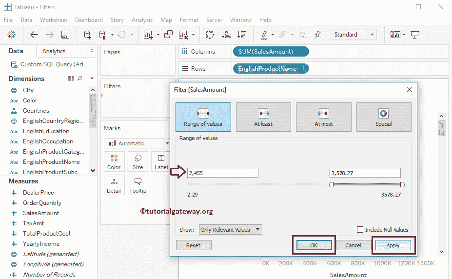

从下面的截图中，可以看到过滤后的[条形图](https://www.tutorialgateway.org/bar-chart-in-tableau/)。

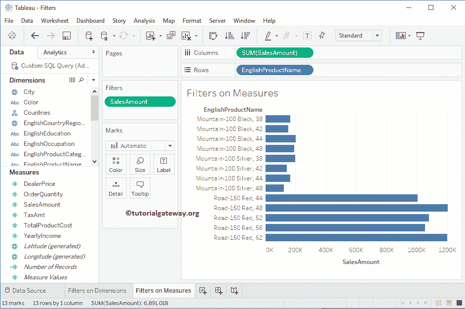

让我将过滤器字段从所有值更改为总和

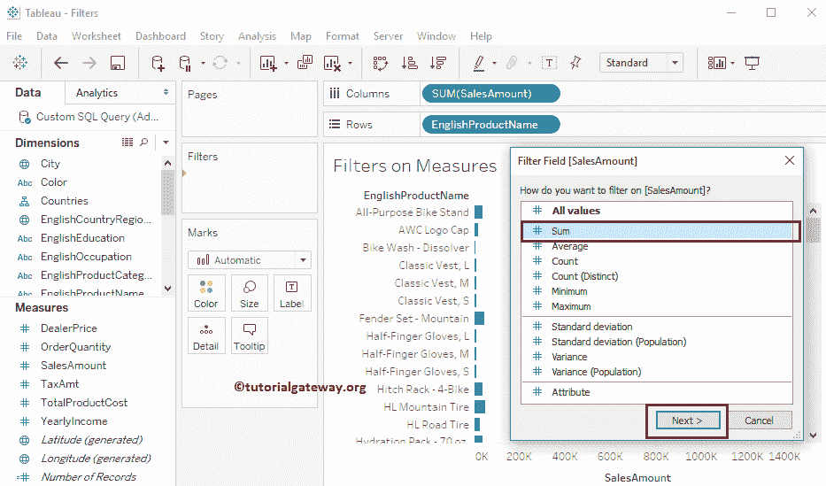

现在，您可以看到“过滤器”窗口将聚合值显示为范围值。在这个演示中，我们将最小值改为 590，466，最大值改为 980，396

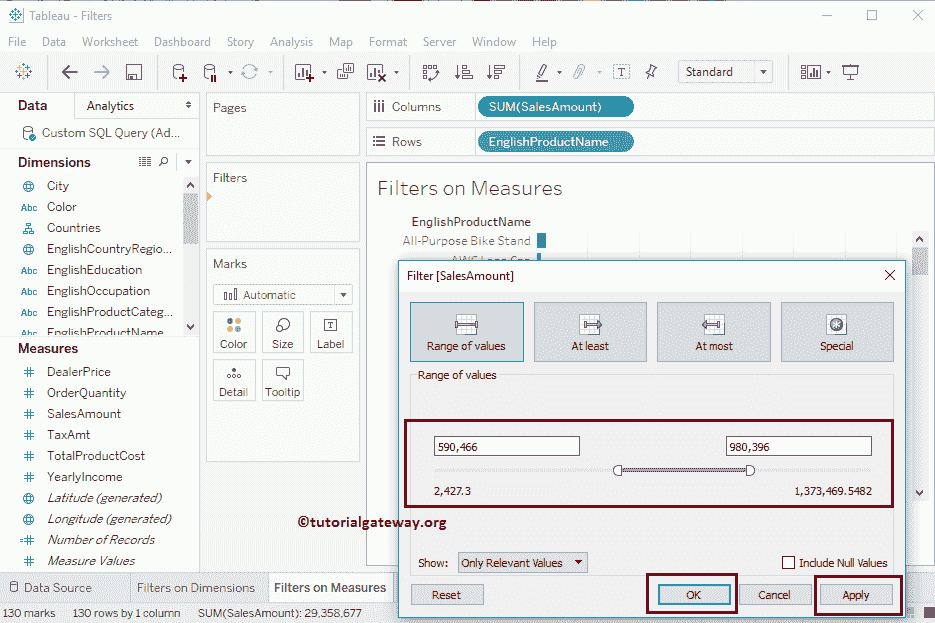

现在，您可以看到报告显示的产品的销售金额总和在 590，466 到 980，396 之间。为了更好地理解，我们在条形图中添加了数据标签。

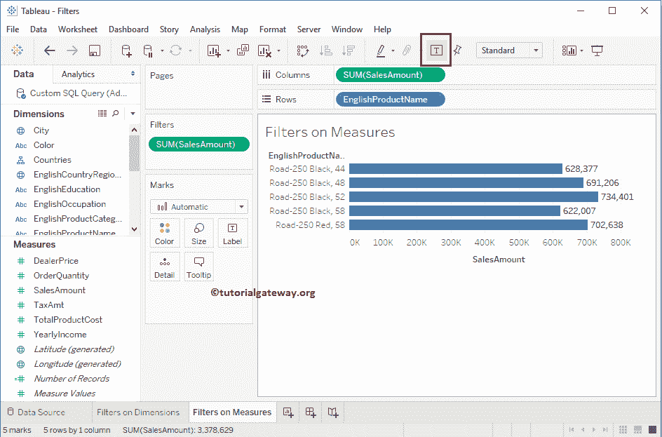

### 在度量上创建 Tableau 过滤器的第二种方法

在这个度量上的 Tableau 过滤器示例中，我们将从列架添加一个过滤器条件。首先，请点击列架中销售金额旁边的向下箭头，将打开菜单。在这里，您必须选择过滤器..选项。

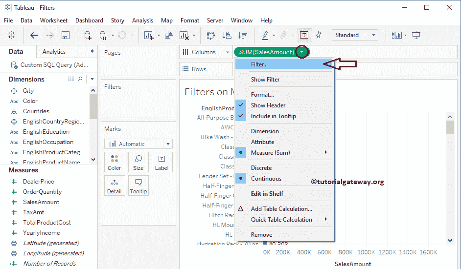

选择过滤器后..选项，将打开一个新窗口来创建过滤器。我们已经在前面的例子中解释了功能。所以，让我把最小值改为 999，263。接下来，单击确定应用更改并关闭窗口。

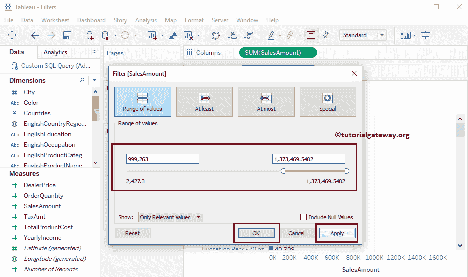

现在，您可以看到应用了过滤器的条形图。最棒的是，销售额测量出现在过滤器货架

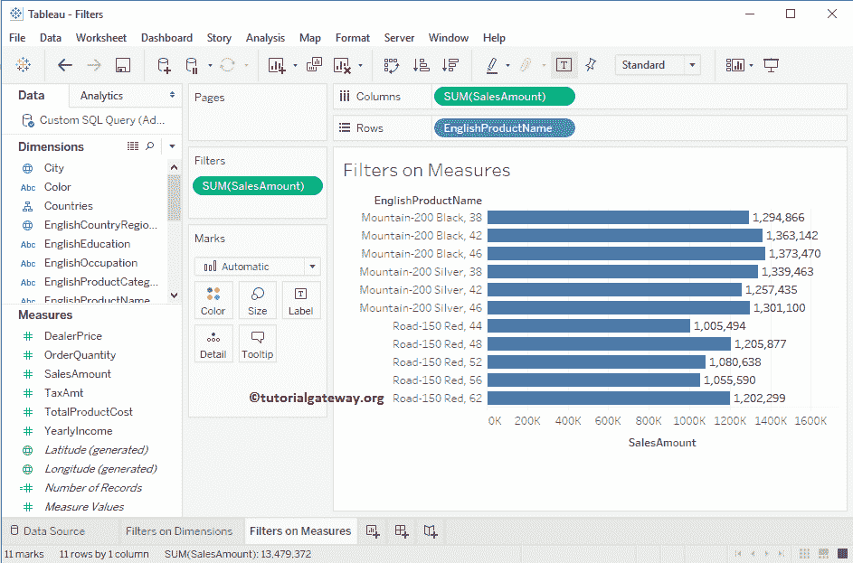

### 至少

此选项卡仅允许您选择最小值。出于演示目的，我们将该值更改为 499，273

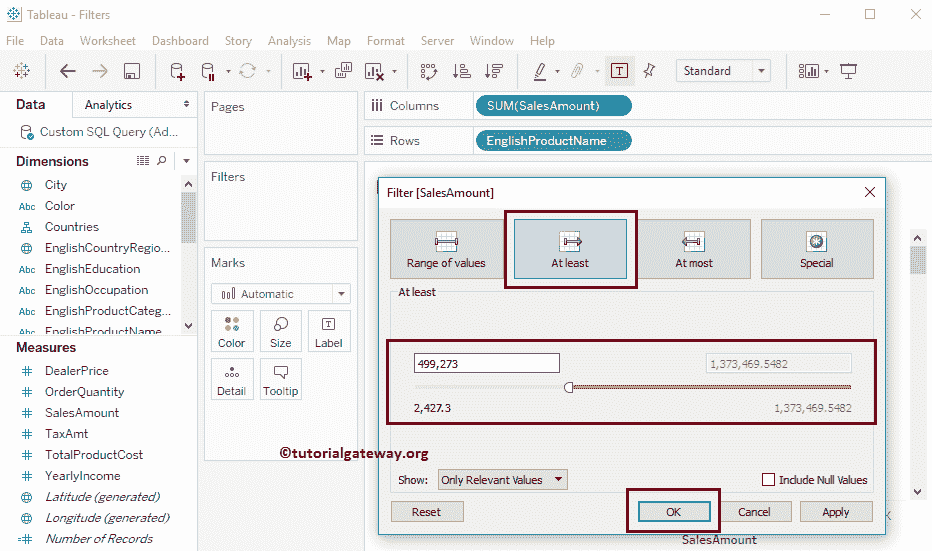

现在，您可以看到报告显示的产品的销售金额总和至少为 499，273。

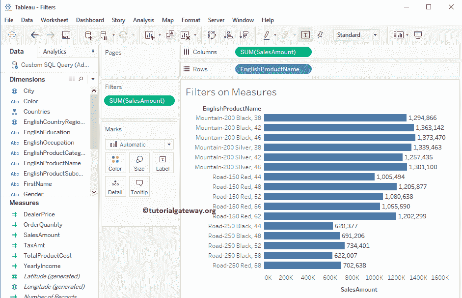

### 至多

“度量”选项卡上的 Tableau 过滤器仅允许您选择最大值。出于演示目的，我们将该值更改为 1，000，469

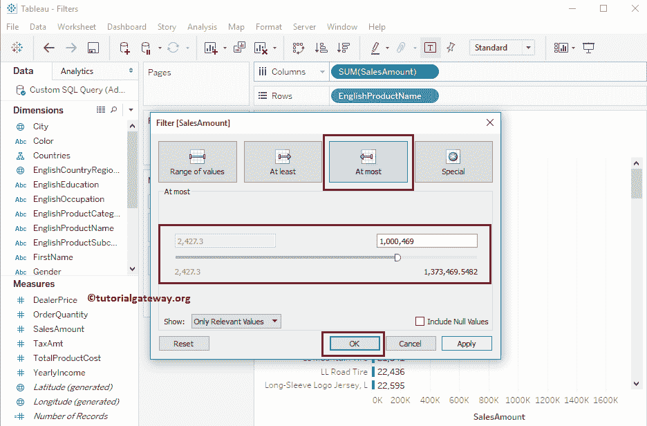

现在可以看到报告显示的是销售金额总和最多为 1000469

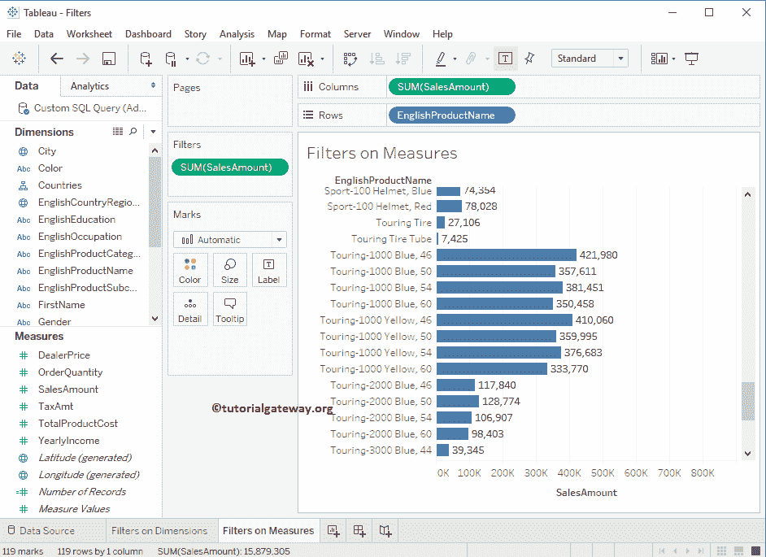

的产品

#### 特别的

此选项卡有三个选项:“空值”、“非空值”和“所有值”。根据你的要求选择。

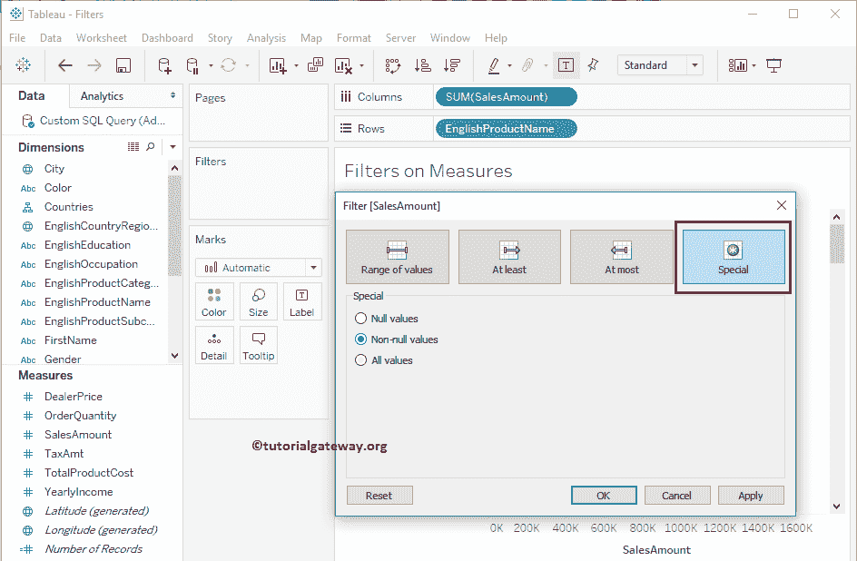