# Tableau 中的上下文过滤器

> 原文：<https://www.tutorialgateway.org/context-filters-in-tableau/>

Tableau 上下文过滤器:默认情况下，Tableau 中的过滤器独立计算。这意味着每个过滤器将分别访问数据源中的所有记录。如果您的数据源很小，这可能是可以的，但是对于大数据源来说，这将是一种不好的做法。

上下文过滤器在 Tableau 的例子中，我们想要分析美国每个城市的前 10 名产品。

*   第一个过滤器将找到世界上性能最高的产品。
*   显示美国城市的第二个过滤器。

在这里，两者都将独立访问数据源，我必须说这是重复的工作。在这种情况下，我们可以在 Tableau 中使用或设置一个上下文过滤器。

从上面的例子中，如果我们将第二个过滤器设置为 Tableau Context 过滤器，那么第一个过滤器将基于第二个过滤器搜索数据。意思是，在美国内部，不需要搜索整个世界。让我给你看一个例子，这样你就可以理解 Tableau 中上下文过滤器的概念。

在进入这个 Tableau 上下文过滤器示例之前，请参考[过滤器](https://www.tutorialgateway.org/tableau-filters/)了解基本的过滤技术。对于这个 Tableau 上下文过滤器演示，我们将使用我们在上一篇文章中创建的数据源。请访问[Tableau 报告中的数据标签](https://www.tutorialgateway.org/data-labels-in-tableau-reports/)文章，了解[表](https://www.tutorialgateway.org/tableau/)数据源。

我建议你记住这份报告。它可以帮助您了解我们的数据源

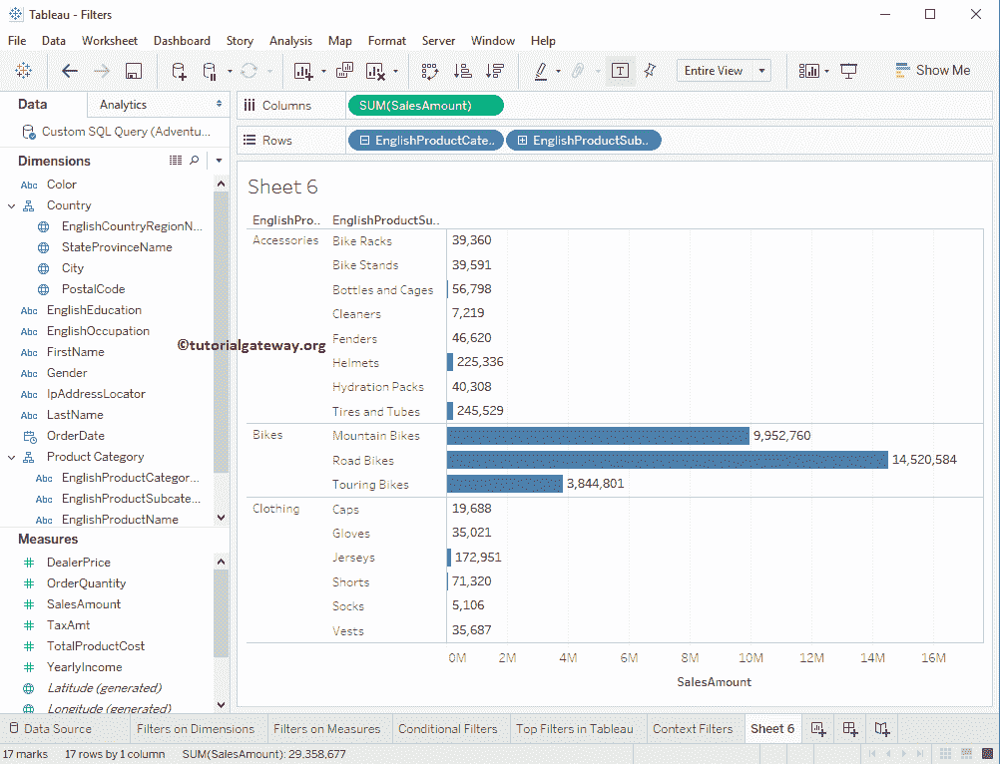

中的类别、子类别及其各自的销售金额列表

## 在表中创建上下文过滤器

在本例中，我们将向您展示如何在 Tableau 中创建上下文过滤器。我们的场景是找到配件和服装(产品类别)中的前 10 个产品子类别。

首先，将英文产品子类别从维度区域中的产品[层次结构](https://www.tutorialgateway.org/hierarchies-in-tableau/)拖放到行货架，将销售额度量区域拖放到列货架。默认情况下，tableau 会生成[条形图](https://www.tutorialgateway.org/bar-chart-in-tableau/)。

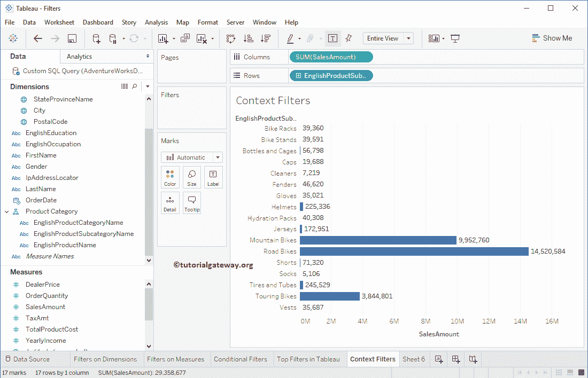

这里，我们将在英文产品名称上添加一个过滤条件。首先，请点击行货架中产品子类别名称旁边的向下箭头，将打开菜单。在这里，您必须选择过滤器..选项。

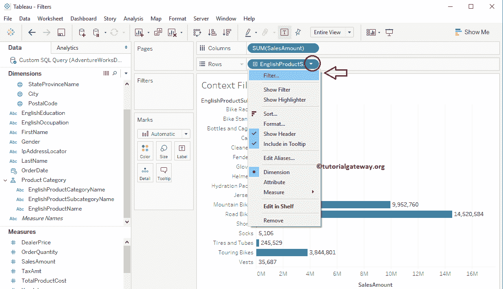

选择过滤器后..选项，将打开一个新窗口来创建过滤器。请自行导航至顶部选项卡。从下面的截图中，您可以看到我们正在选择“按字段”部分。

接下来，我们选择了前 10 个记录，销售额作为度量，总和作为聚合函数。建议大家参考，Tableau 文章中的 [Top Filters 了解属性。](https://www.tutorialgateway.org/top-filters-in-tableau/)

[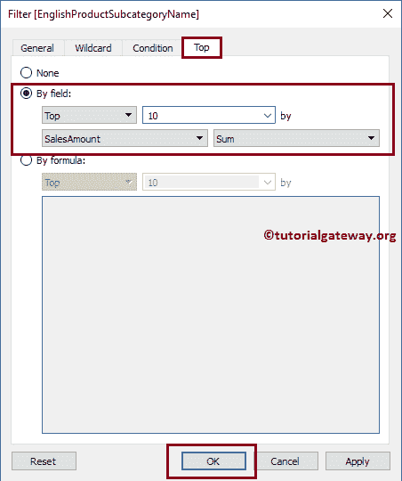](https://www.tutorialgateway.org/top-filters-in-tableau/)

通过单击“确定”按钮，我们在 tableau 中创建了第一个上下文过滤器，它将根据销售额总和找到前 10 个子类别。

接下来，我们将在产品类别上添加过滤条件。为此，请将产品类别从维度区域拖放到过滤器架。

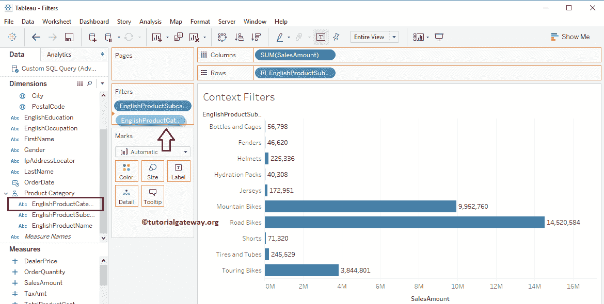

将产品名称放入过滤器架后，将会打开一个名为过滤器的新窗口。出于演示目的，请在“概述”中检查附件和服装。我建议您参考[维度上的 Tableau 过滤器](https://www.tutorialgateway.org/tableau-filters-on-dimensions/)文章来了解属性。

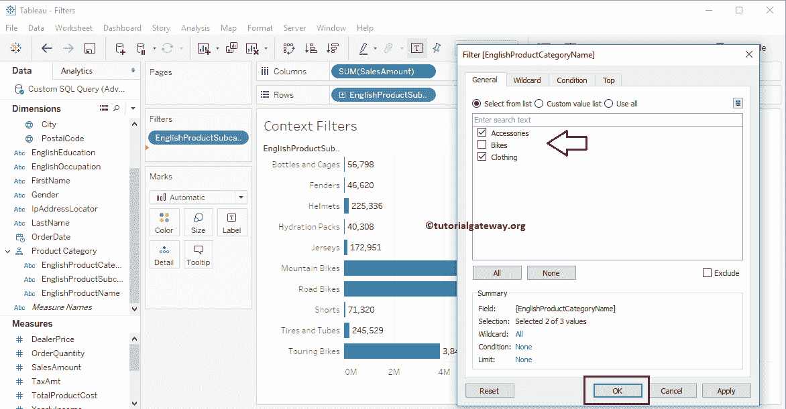

从下面的截图中，您可以看到报告显示了配件和服装类别的七个子类别。这意味着第一个 Tableau 应用了第一个类别过滤器，并提取了前 10 个子类别。

接下来，它应用了第二个过滤器，并显示了配件和服装中的子类别。我们都知道它有三个代表自行车类别的记录。

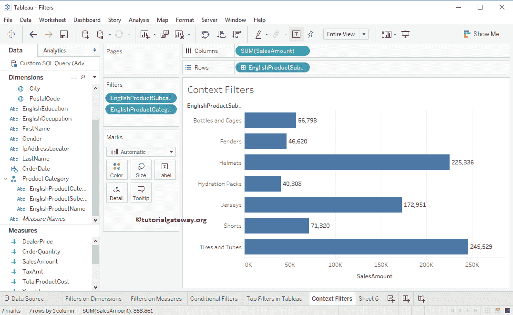

现在，让我们将英语产品类别过滤器更改为 Tableau 上下文过滤器，以包括类别。为此，请转到过滤器架，然后单击类别旁边的向下箭头。它将打开菜单，从该菜单中，请选择“添加到上下文”选项。

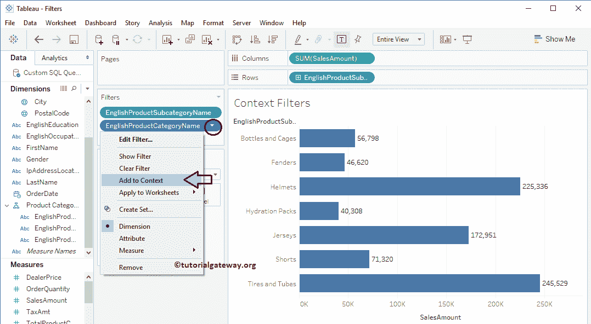

选择“添加到上下文”选项后，英文产品类别名称过滤器将转换为 Tableau 上下文过滤器。按照表的执行顺序，首先执行上下文过滤器，然后是维度上的[过滤器，然后是度量](https://www.tutorialgateway.org/tableau-filters-on-dimensions/)上的[过滤器。](https://www.tutorialgateway.org/tableau-filters-on-measures/)

从下面的截图可以看到，它显示的是配饰、服装

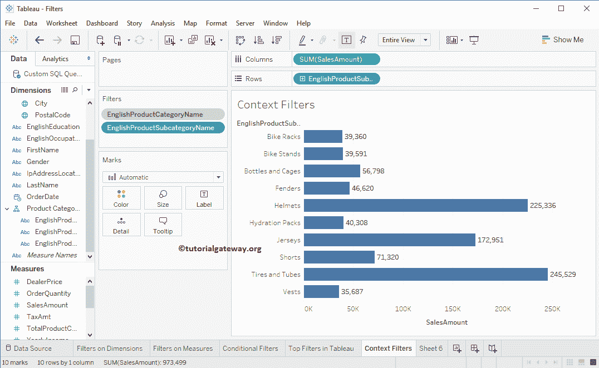

中的前 10 个子类别

## 删除Tableau 中的上下文过滤器

要删除它们，请转到过滤器架。接下来，单击要删除的上下文过滤器旁边的向下箭头。它将打开菜单，从该菜单中，请选择从上下文中删除选项。

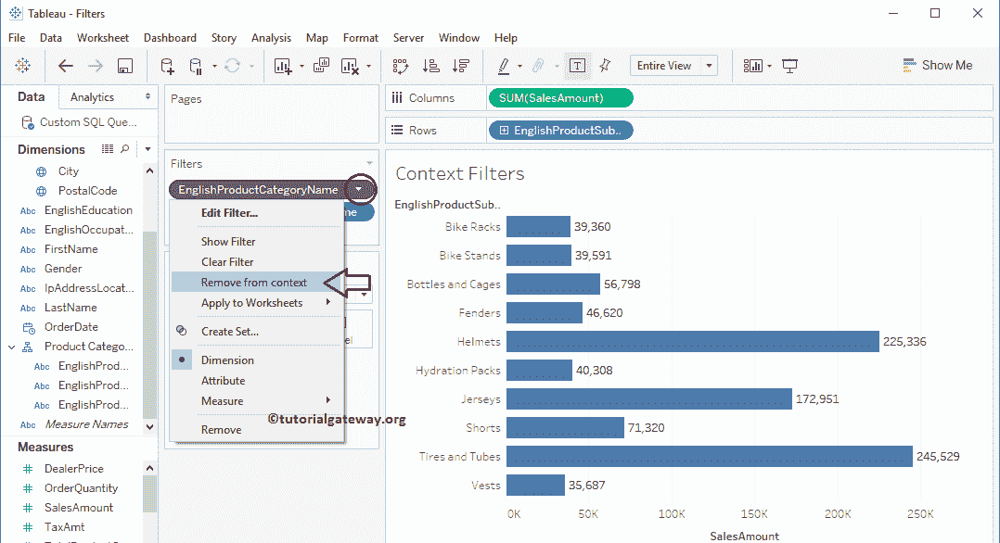

这将移除 Tableau

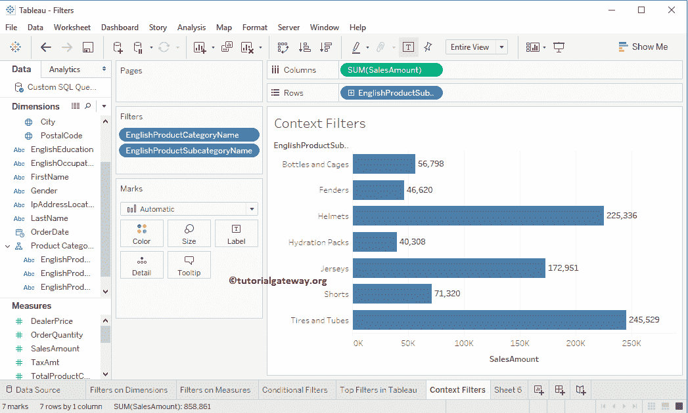

中的上下文过滤器