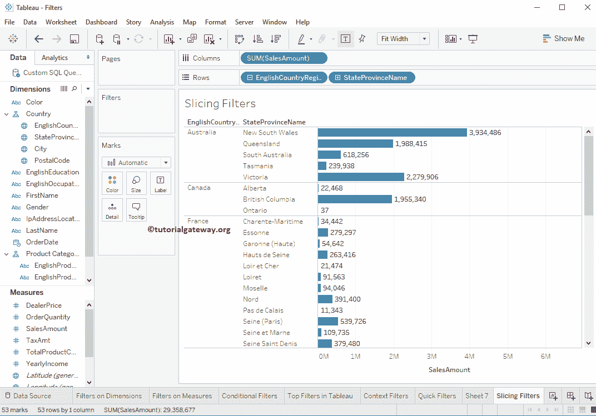
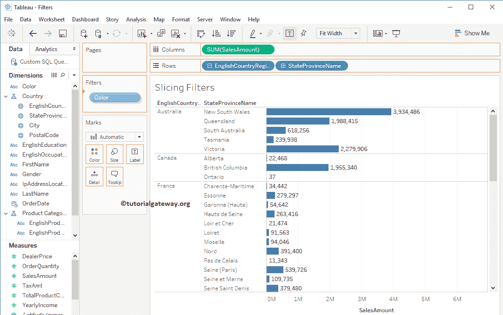
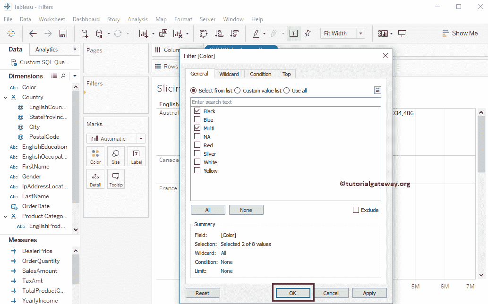
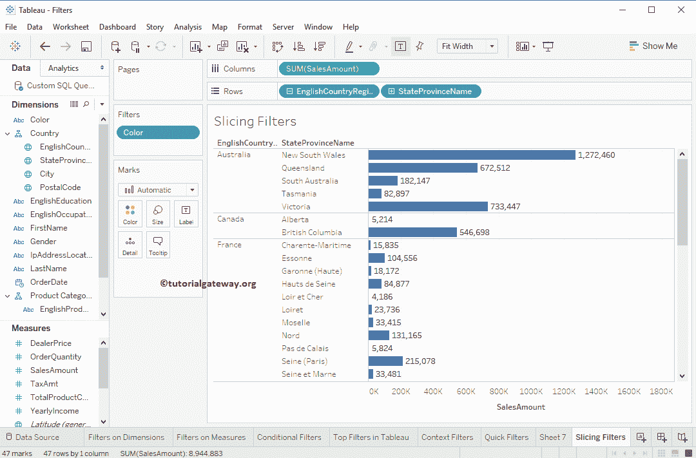

# 表中的切片过滤器

> 原文：<https://www.tutorialgateway.org/slicing-filters-in-tableau/>

表中的切片过滤器称为计算过滤器或切片器。这些是维度过滤器，我们必须将它们应用于维度字段。与关系数据源相比，多维数据源中这些过滤器的行为是不同的。

Tableau 切片过滤器:如果我们在过滤器架上放置一个维度，并且该维度不存在于任何其他架中(独立于行和列)，那么我们可以将其称为切片过滤器。在本文中，我们将通过一个例子展示如何在 Tableau 中创建切片过滤器。

对于这个 Tableau 切片过滤器演示，我们将使用我们在上一篇文章中创建的数据源。因此，请访问Tableau 报告文章中的[数据标签，了解](https://www.tutorialgateway.org/data-labels-in-tableau-reports/)[表](https://www.tutorialgateway.org/tableau/)数据源。在开始之前，我建议你参考 [Tableau 滤镜](https://www.tutorialgateway.org/tableau-filters/)来了解基本的滤镜技术。

## 在表中创建切片过滤器

在这个例子中，我们想要演示 Tableau 中的切片过滤器。首先，将维度区域中的英文国家/地区名称从国家/地区[层次结构](https://www.tutorialgateway.org/hierarchies-in-tableau/)拖放到行货架，将销售额度量区域拖放到列货架。默认情况下，Tableau 会生成[条形图](https://www.tutorialgateway.org/bar-chart-in-tableau/)。

接下来，我们想在颜色维度上应用过滤条件。并且它不是任何现有架(标记、行、列和页)的成员。因此，将颜色从尺寸区域拖放到过滤器架。

一旦您将“颜色”放到“过滤器”架上，一个名为“过滤器”的新窗口将会打开。这里，我们选择黑色和多色。我建议您参考[维度上的 Tableau 过滤器](https://www.tutorialgateway.org/tableau-filters-on-dimensions/)文章，了解以下窗口中的属性。

从下面的截图中，您可以看到下面的报告显示了该国所有州/省名称的销售额，其颜色为黑色或多种颜色。

