# 表格中的数据源过滤器

> 原文：<https://www.tutorialgateway.org/data-source-filters-in-tableau/>

Tableau 中的数据源筛选器对于在数据源级别创建筛选器非常有用。这样，我们就可以在开始生成有关该数据源的任何报告之前对数据进行润色。在本文中，我们将通过一个例子向您展示如何在 Tableau 中创建数据源过滤器。

## 在表中创建数据源过滤器

在这个例子中，我们想要演示在 tableau 中创建数据源过滤器所涉及的步骤。为此，请转到数据源，然后拖放表，或者创建自定义 SQL 查询从数据库中提取数据。

在进入这个 Tableau 数据源过滤器之前，我建议您参考 [Tableau 过滤器](https://www.tutorialgateway.org/tableau-filters/)来了解基本的过滤技术。

在这个[表格](https://www.tutorialgateway.org/tableau/)演示中，我们选择了冒险作品数据仓库数据库中的暗淡客户、事实互联网销售表格。

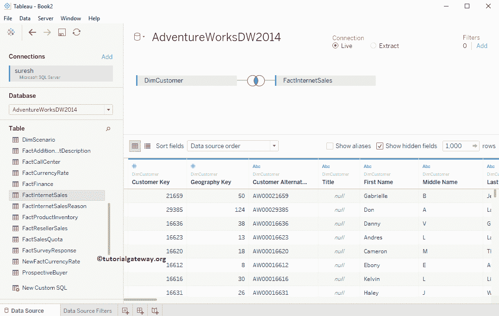

要创建 Tableau 数据源筛选器，请单击筛选器部分下的超链接添加。

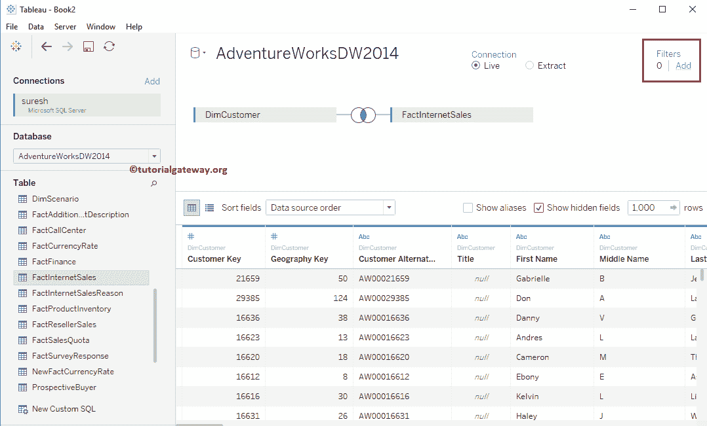

单击添加后，将打开一个名为编辑数据源过滤器的新窗口。要创建第一个数据源过滤器，请单击添加按钮。

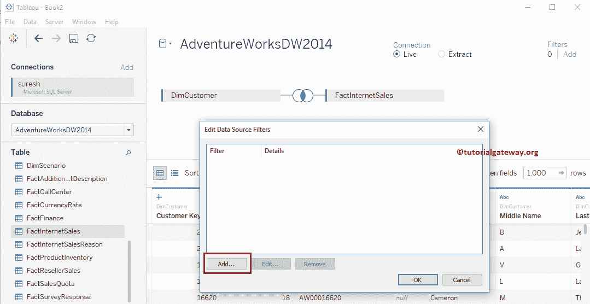

一旦你点击添加..，将打开一个名为“添加筛选器”的新窗口，其中包含表中所有可用列的列表。

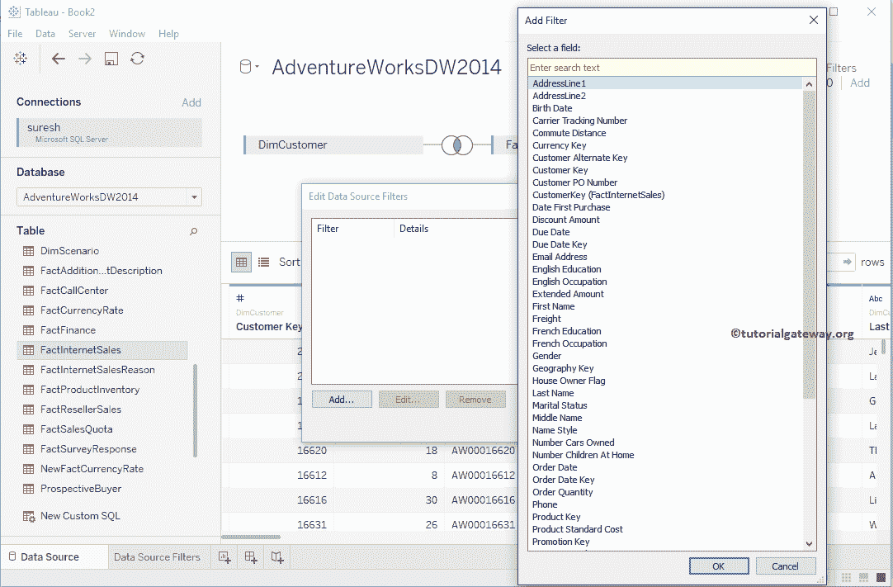

### 度量上的表数据源筛选器

请从可用字段(或列)列表中选择度量字段。从下面的截图中，您可以看到我们选择了“销售额度量”作为筛选字段。

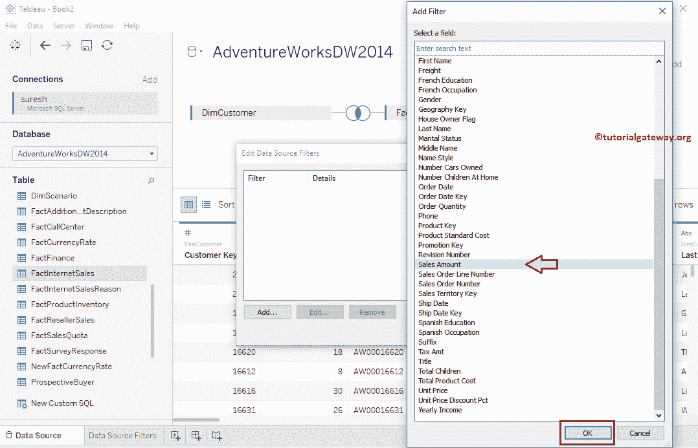

一旦您选择了“测量”字段(即销售额)，将会打开一个名为“筛选”的新窗口来创建筛选条件。

从演示目的来看，我们保持最大值不变，并将最小值更改为 2，471。我建议您参考 Tableau [过滤器上的措施](https://www.tutorialgateway.org/tableau-filters-on-measures/)文章，以了解以下窗口中出现的每个属性。

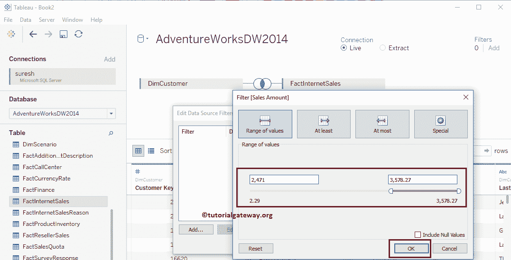

现在，您可以看到数据源在过滤器部分下显示 1 过滤器。让我们创建一个示例报告来显示我们新创建的过滤器是否工作？

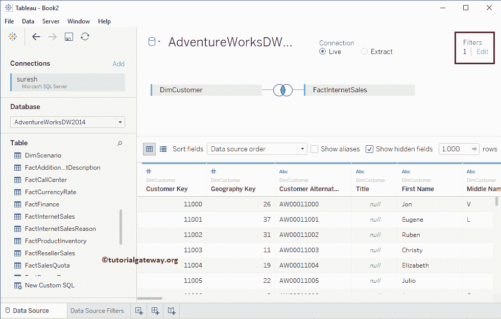

为此，请将维度区域中的名字拖放到行架，将销售额度量区域拖放到列架。默认情况下，tableau 会生成[条形图](https://www.tutorialgateway.org/bar-chart-in-tableau/)。为了更好地理解，我们根据销售额以升序对数据进行排序，并将数据标签添加到条形图中。

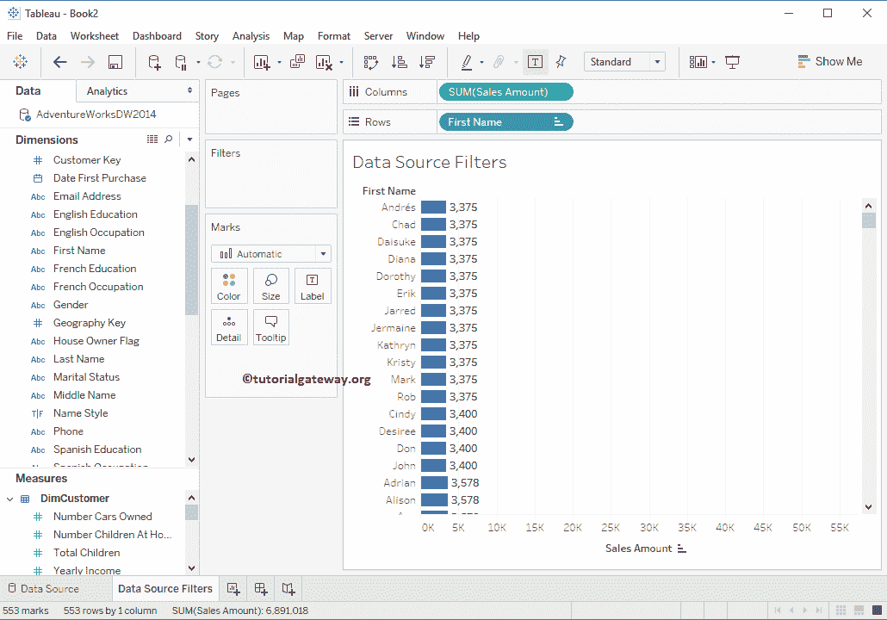

从上面的截图可以看出，所有记录的销售额都大于 2471

### 删除表格中的数据源过滤器

在 tableau 中删除数据源过滤器很容易。为此，

*   转到数据源部分，然后单击编辑超链接。
*   它会打开该数据源上可用筛选器的列表。
*   请选择所需的过滤器，然后单击删除按钮。

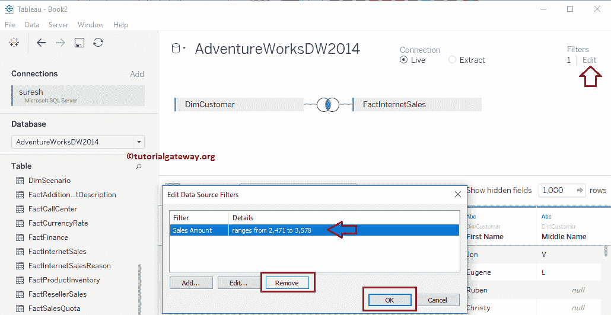

### 维度上的表数据源筛选器

请从可用字段或列列表中选择维度字段。从下面的截图中，您可以看到我们选择了性别维度作为我们的过滤字段。

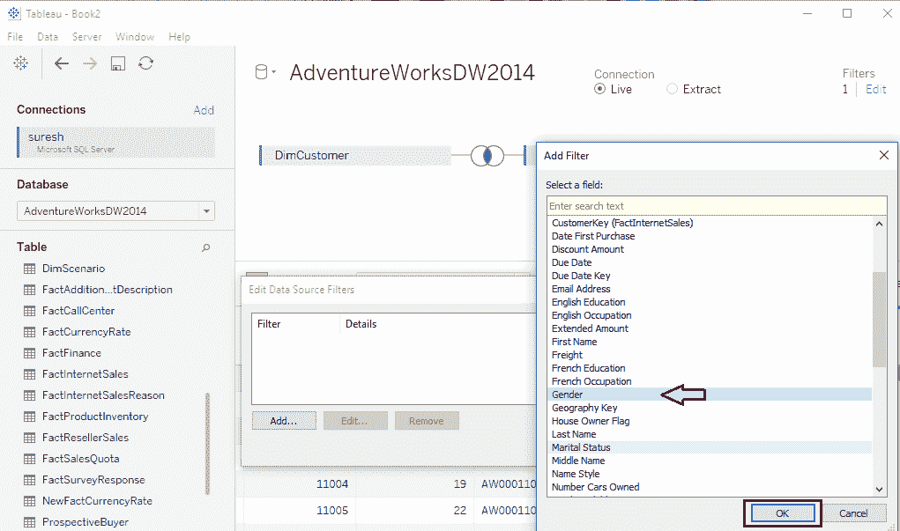

选择维度字段(即性别)后，将打开一个名为过滤器的新窗口，如下所示。这里我们选择的是 M，这意味着数据源将提取性别为男性的数据。我建议您参考[维度上的 Tableau 过滤器](https://www.tutorialgateway.org/tableau-filters-on-dimensions/)文章，了解以下窗口中的属性。

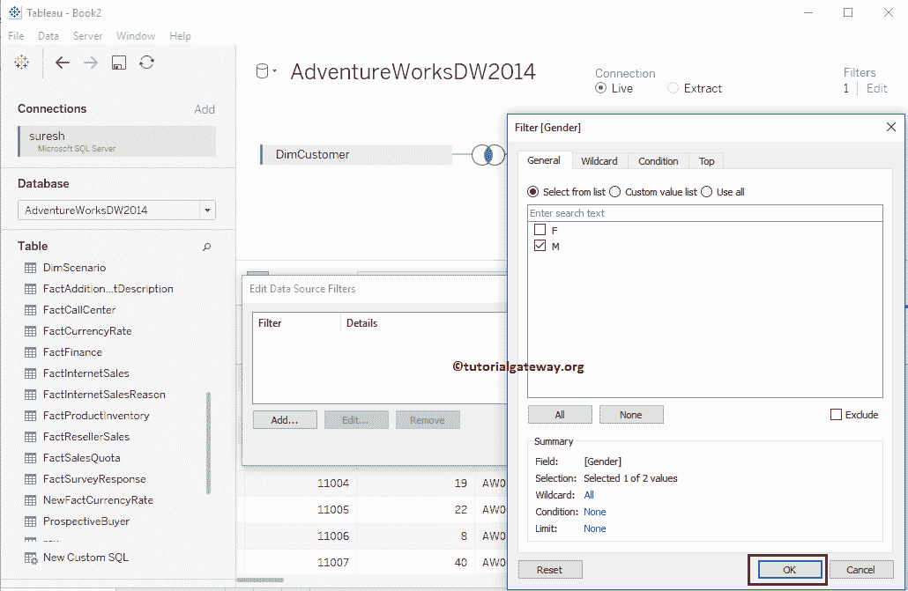

将“维度区域”中的英语职业、性别拖放到“行”框，将“销售额度量”区域拖放到“列”框。默认情况下，tableau 会生成[条形图](https://www.tutorialgateway.org/bar-chart-in-tableau/)。如您所见，我们的报告显示了男性字段，因为我们对女性应用了过滤器。

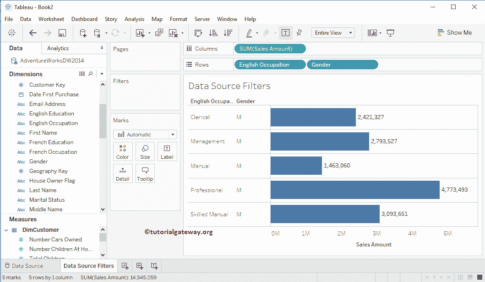

让我删除性别过滤器，以便您可以看到实际数据。从下面的截图中，你可以看到属于女性和男性的数据。

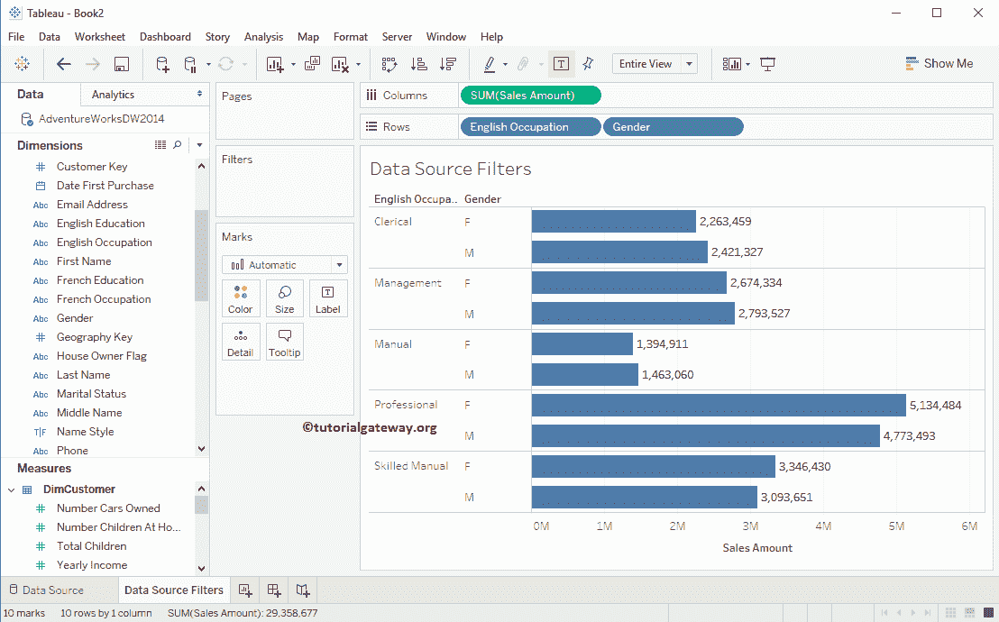