# Tableau 中的提取过滤器

> 原文：<https://www.tutorialgateway.org/extract-filters-in-tableau/>

在本文中，我们将通过一个例子向您展示如何在 Tableau 中创建提取过滤器。为此，我们将使用 SQL Server 数据源。

## 在表中创建提取过滤器

在这个例子中，我们想要演示在 tableau 中创建提取过滤器的步骤。在我们开始创建过滤器之前，我们需要一些数据。要获取数据，请转到数据源，然后创建一个自定义的 SQL 查询，或者拖放表以从数据库中提取数据。

在进入这个 Tableau 提取过滤器之前，我建议你参考 [Tableau 过滤器](https://www.tutorialgateway.org/tableau-filters/)来了解基本的过滤技术。并访问[连接 Tableau 到 SQL Server](https://www.tutorialgateway.org/connecting-tableau-to-sql-server/) 文章了解连接过程。

对于这个 Tableau 提取过滤器演示，我们正在编写关于冒险工作 DW 数据库的自定义查询。

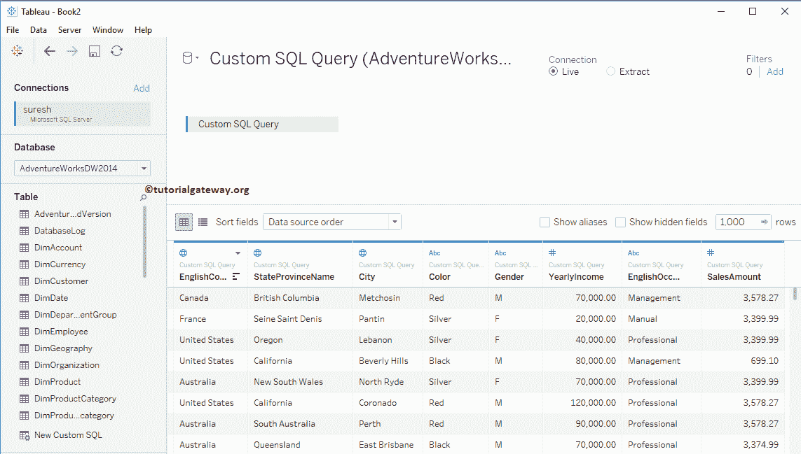

自定义 [SQL](https://www.tutorialgateway.org/sql/) 查询我们在上面的[表](https://www.tutorialgateway.org/tableau/)中使用的数据源是:

```
SELECT Geo.EnglishCountryRegionName, 
       Geo.StateProvinceName, 
       Geo.City, 
       Prod.Color, 
       Cust.Gender, 
       Cust.YearlyIncome, 
       Cust.EnglishOccupation, 
       Fact.SalesAmount
FROM DimProduct AS Prod 
   INNER JOIN
     FactInternetSales AS Fact ON Prod.ProductKey = Fact.ProductKey 
   INNER JOIN
     DimCustomer AS Cust ON Fact.CustomerKey = Cust.CustomerKey
   INNER JOIN
     DimGeography AS Geo ON Cust.GeographyKey = Geo.GeographyKey
```

注意:不要担心我们在上面的陈述中使用的代码和[连接](https://www.tutorialgateway.org/sql-joins/)。但是，如果您有兴趣学习 SQL Server，请访问我们的 [SQL 教程](https://www.tutorialgateway.org/sql/)页面。

要创建 Tableau 提取过滤器，请在“连接”部分下将连接从“实时”更改为“提取”，然后单击“编辑”按钮。

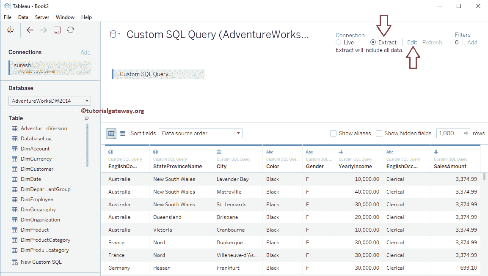

单击编辑超链接后，将打开一个名为提取数据的新窗口。要创建我们的第一个提取过滤器，点击添加..按钮。

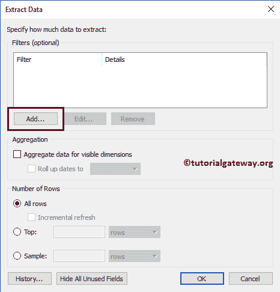

一旦你点击添加..，将打开一个名为“添加过滤器”的新窗口。它包含了表中所有可用列的列表。在这里，您可以选择要应用过滤器的字段。

### 维度上的表提取过滤器

请从可用字段或列列表中选择维度字段。从下面的截图中，您可以观察到我们正在选择颜色维度作为我们的过滤器字段。

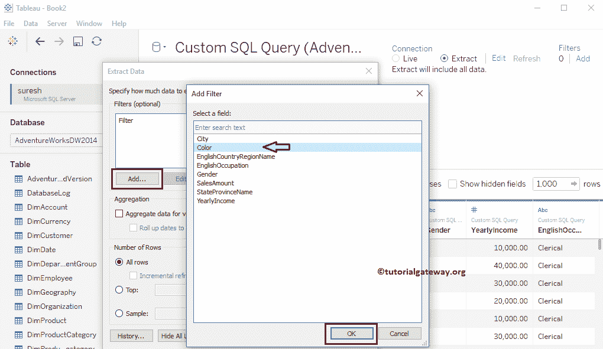

选择“颜色尺寸”字段后，将打开一个名为“过滤器”的新窗口。这里我们选择黑色，蓝色，多，北美，黄色。这意味着数据源提取的数据的颜色为黑色、蓝色、多种颜色、不透明或黄色。

我建议您参考[维度上的 Tableau 过滤器](https://www.tutorialgateway.org/tableau-filters-on-dimensions/)文章，了解以下窗口中的属性。

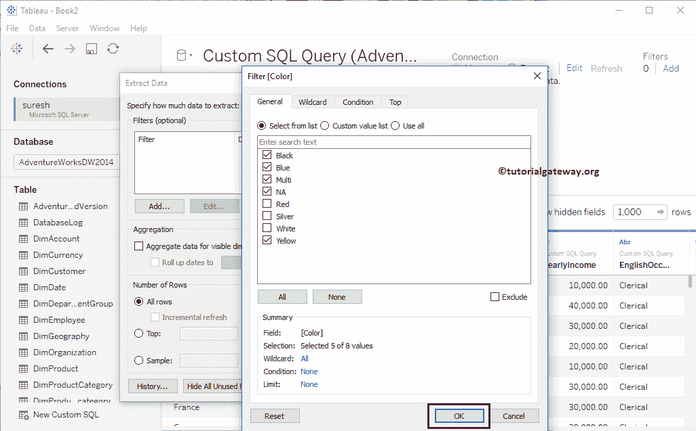

单击确定关闭提取数据窗口。

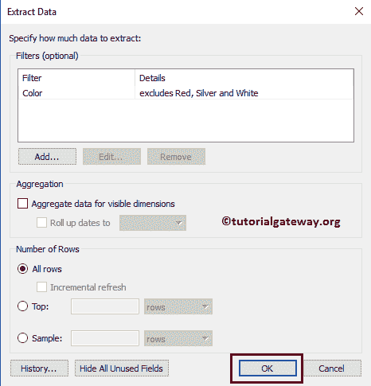

将英文国家/地区名称、维度区域中的颜色拖放到行架，将销售额度量区域拖放到列架。如您所见，我们的报告显示的记录的颜色为黑色、蓝色、多种颜色、中性或黄色。

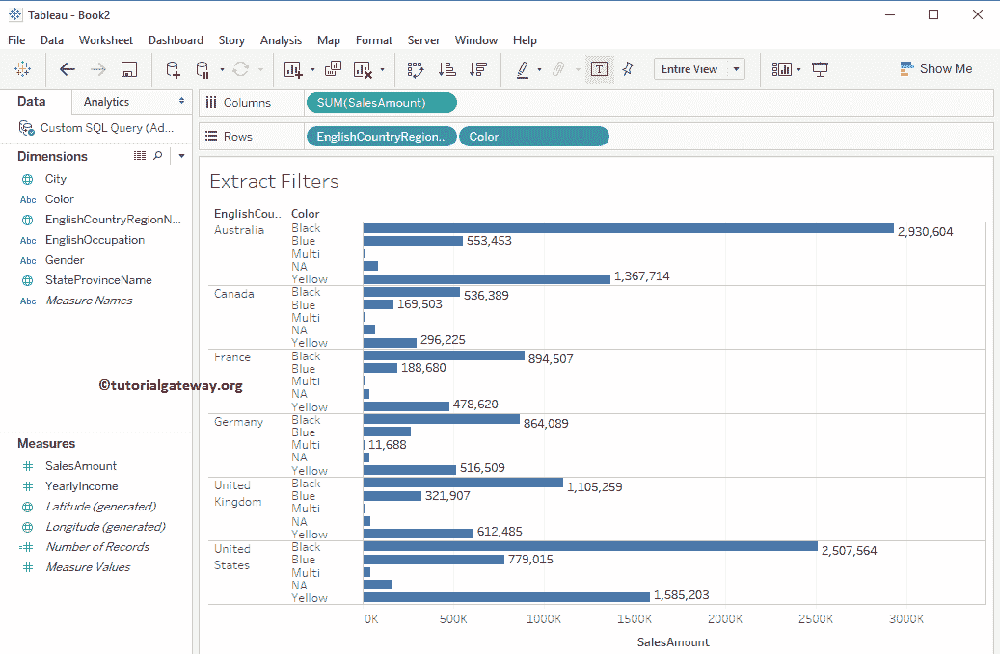

### 删除Tableau 中的提取过滤器

很容易移除 tableau 中的提取过滤器。为此，请转到数据源中的连接部分，然后单击摘录旁边的编辑超链接。它打开该数据源上可用提取过滤器的列表。请选择所需的过滤器，然后单击删除按钮。

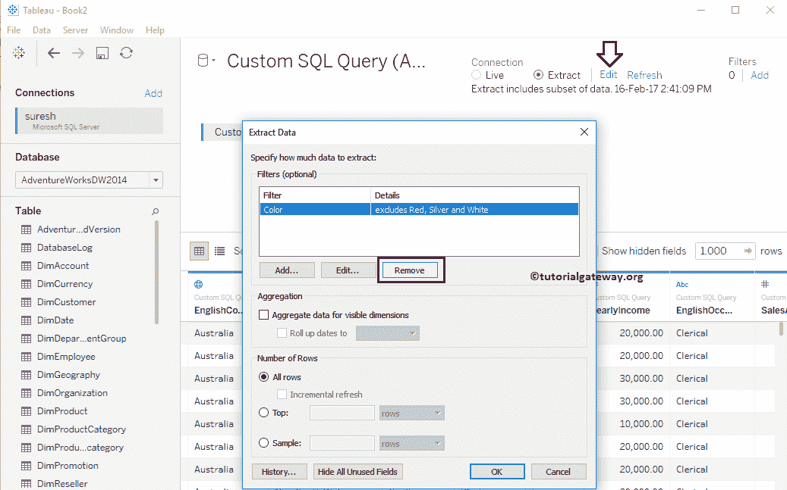

### 度量上的表提取过滤器

请从可用字段或列列表中选择度量字段。从下面的截图中，您可以看到我们选择了“销售额度量”作为过滤字段。

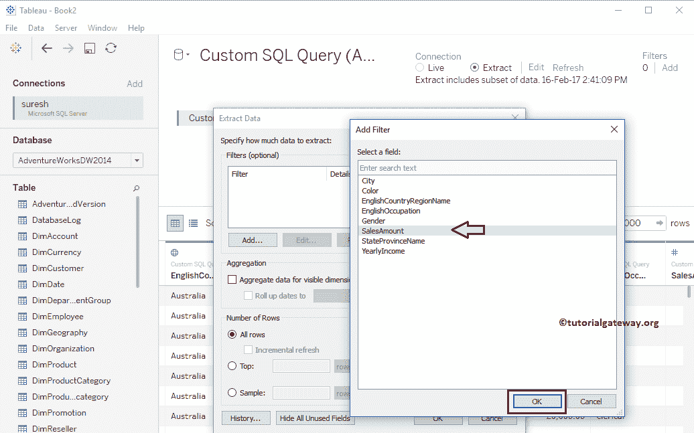

选择“销售额度量”字段后，将打开一个名为“过滤”的新窗口来创建过滤条件。从演示目的来看，我们保持最大值不变，并将最小值更改为 1，684。我建议您参考 Tableau [过滤器上的措施](https://www.tutorialgateway.org/tableau-filters-on-measures/)文章，以了解以下窗口中出现的属性。

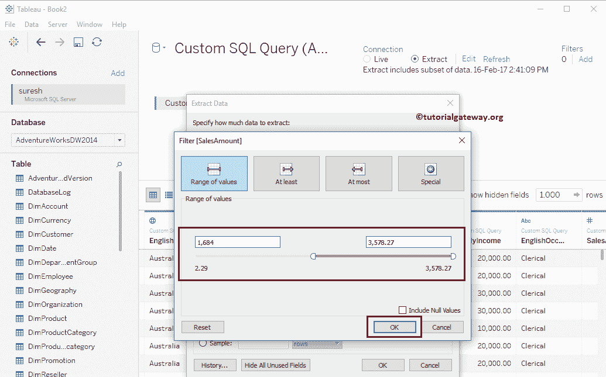

单击确定关闭表提取过滤器数据窗口。

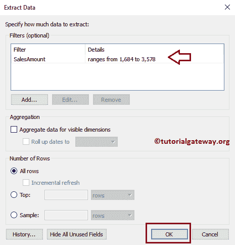

让我们创建一个示例报告来显示我们新创建的提取过滤器是否工作？。为此，请将城市从维区域拖放到行架，将销售额从度量区域拖放到列架。为了更好地理解，我们根据销售额以升序对数据进行排序，并将数据标签添加到条形图中。

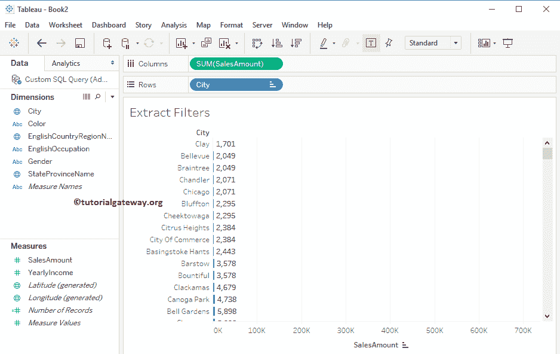

从上面的截图可以看出，所有记录的销售额都大于 1684

### 使用提取数据的顶级过滤器

从下面的截图中，可以看到我们选择了前 15 行作为过滤条件。

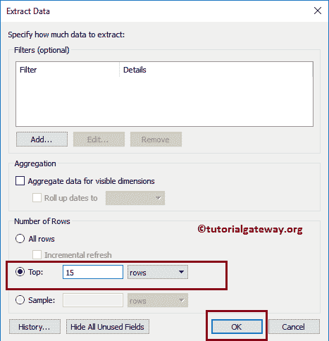

如您所见，我们的数据源只有 15 行。

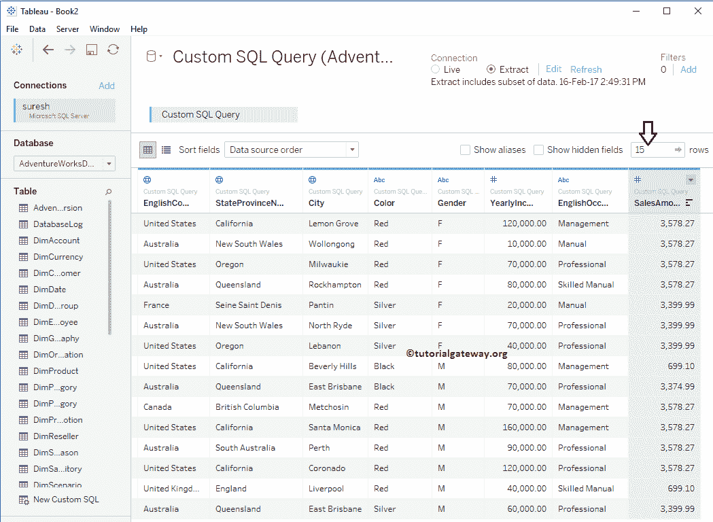

让我通过将城市从维区域拖到行架，将销售额从度量区域拖到列架来创建一个示例报告。如您所见，它显示了 14 项记录，因为东布里斯班市在前 15 行中重复了两次。

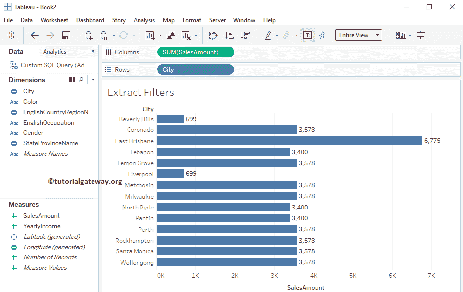