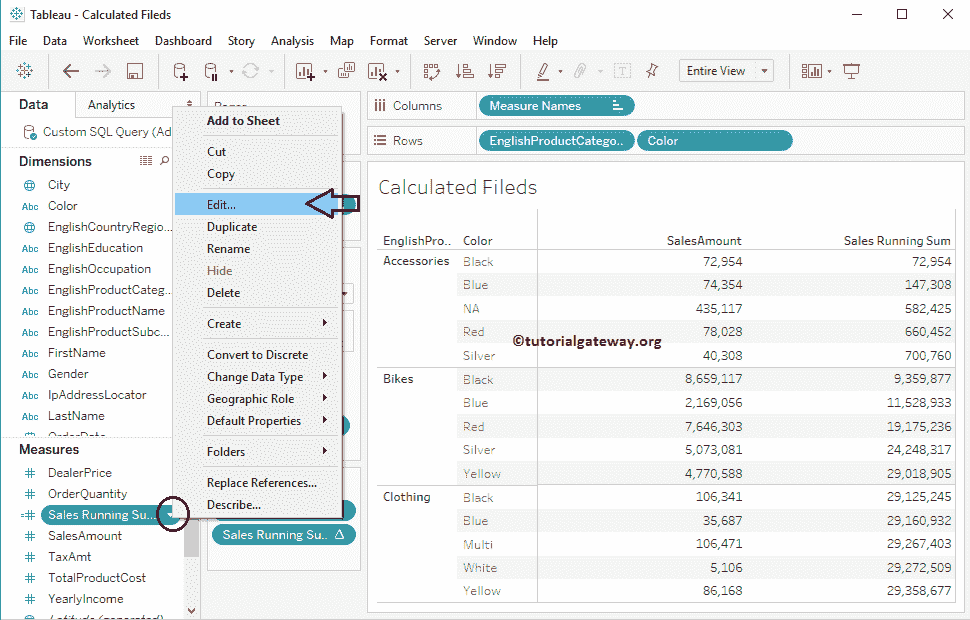
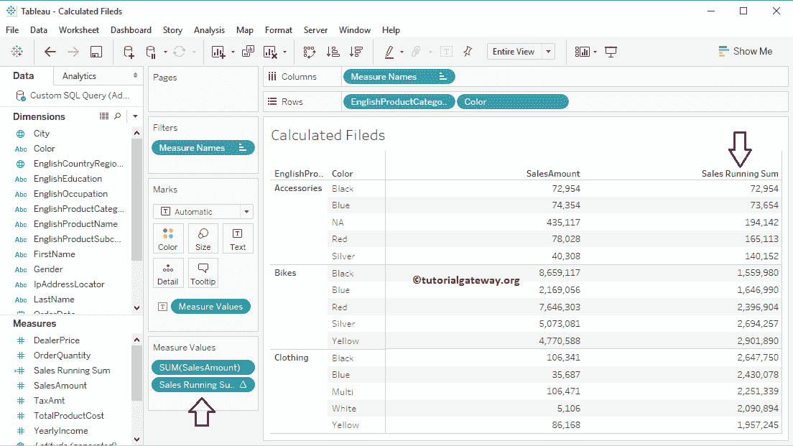

# 表中的计算字段

> 原文：<https://www.tutorialgateway.org/calculated-field-tableau/>

如果数据源不包含要查找的字段，则可以创建一个计算字段表。在本文中，我们将通过一个例子向您展示如何在 Tableau 中创建计算字段。

## 如何在表中创建计算字段

您可以通过多种方式创建 Tableau 计算字段。第一种方法是:请导航到分析选项卡，并选择创建计算字段…选项。

对于这个 Tableau 计算字段演示，我们将使用我们在上一篇文章中创建的数据源。因此，请访问【报告中的数据标签】文章，了解[表](https://www.tutorialgateway.org/tableau/)数据源。

单击“创建”选项后，将打开一个新窗口来编写计算。

### 在 Tableau 中创建计算字段的第二种方法

请点击销售额测量旁边的向下箭头(根据您的要求进行更改)。或者右键单击它以打开上下文菜单。从可用选项列表中，请选择创建选项，然后选择计算字段…选项，如下所示。

单击该选项后，将打开一个新窗口来编写计算。使用此计算编辑器编写函数。

如果你知道公式，你可以直接写在那个度量或任何其他度量上。否则，单击侧箭头列出 Tableau 中所有可用的功能。如果您知道功能名称，请使用搜索框搜索项目。并且，如果不知道那么点击向下箭头，选择功能类型

在这个字段示例中，我们将计算运行总数，因此我们使用 RUNNING_SUM 函数。在这里，您可以看到理解函数语法的示例。

双击它会自动将函数添加到计算区域。从下面的截图中，你可以看到我们将计算出的域名改为销售流水账

现在您可以在 Tableau 测量

下看到我们新创建的计算字段

我们创建了一个Tableau 报告来显示我们新创建的计算字段结果。如您所见，最后一列显示的是运行总数。

## 编辑表中的计算字段

要更改现有的表计算，请单击表计算旁边的向下箭头，然后选择编辑..选项。

一旦你点击编辑按钮..选项，将打开以下窗口编辑现有的计算或功能

让我们将函数名从 RUNNING_SUM 更改为 RUNNING_AVG。或者在计算编辑器上编写自定义函数，点击

确定

现在，您可以看到我们报告的最后一列显示了 tableau 报告中的运行平均值计算。

