# Tableau 排名计算

> 原文：<https://www.tutorialgateway.org/tableau-rank-calculation-basic/>

在本文中，我们将通过一个例子向您展示如何进行 Tableau 排名计算。在这个 Tableau 排名计算演示中，我们将使用雇员表来展示 SQL Server。

建议大家参考[连接 Tableau 到 SQL Server](https://www.tutorialgateway.org/connecting-tableau-to-sql-server/) 文章了解配置。

下面的截图会展示表里面的数据，可以看到，它有 14 条记录:

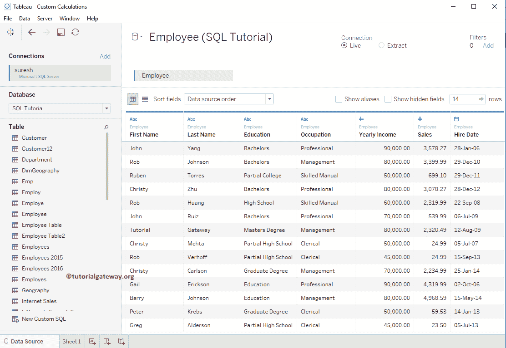

在我们进入示例之前，让我向您展示 [Tableau](https://www.tutorialgateway.org/tableau/) 中的可用排名选项列表。

| 可用选项 | 结果 |
| 比赛(1、2、2、4) | 此选项将相同的排名分配给相同的值，并跳过下一个排名。例如，如果我们有 100，200，300，300，400，那么这个选项将分配排名为 1，2，3，3，5 |
| 修改后的比赛(1、3、3、4) | 修改的竞争选项为重复值分配相同的排名。最高值将排名为 1，接下来的两个相同值将排名为 3。下一个值排名为 4。例如，如果我们有 100，200，300，300，400，那么这个选项将分配排名为 1，2，4，4，5 |
| 密集(1，2，2，3) | 密集选项将相同的排名分配给相同的值，但不会跳过下一个排名。例如，如果我们有 100，200，300，300，400，那么这个选项将分配排名为 1，2，3，3，4 |
| 唯一(1，2，3，4) | 此 Tableau 排名选项为每条记录分配唯一的值。虽然有相同的值，但它会分配一个唯一的排名。这里，排名因素由我们指定的顺序决定。 |

升序和降序选项:在 Tableau 排名计算类型下，我们有两个选项:

1.  升序:Tableau 排名将被分配，从最低到最高。例如，如果我们有 100，200，300，300，400，那么它将分配排名为 1，2，3，3，5
2.  降序:从最高到最低，排名将奖励。例如，如果我们有 100，200，300，300，400，那么它将分配排名为 4，3，2，2，1。

## Tableau 排名计算基本

在本例中，我们将向您展示计算 tableau Rank 的基本方法。为此，我们将把职业、姓氏、名字从维度区域拖放到行框，把年收入从度量区域拖放到标记框中的文本字段。

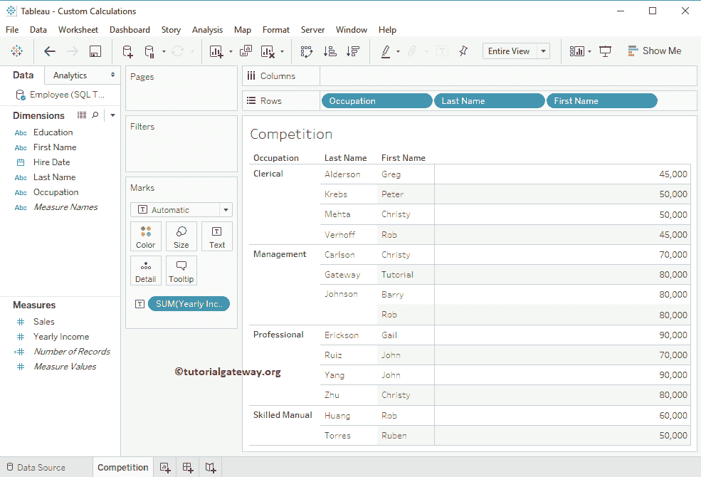

要分配 Tableau 排名，我们必须添加表计算。为此，单击年收入度量(根据要求更改)旁边的向下箭头打开上下文菜单。

从可用选项列表中，您可以选择添加表计算选项或快速表计算选项。现在，我们选择快速表计算选项，然后选择排名选项

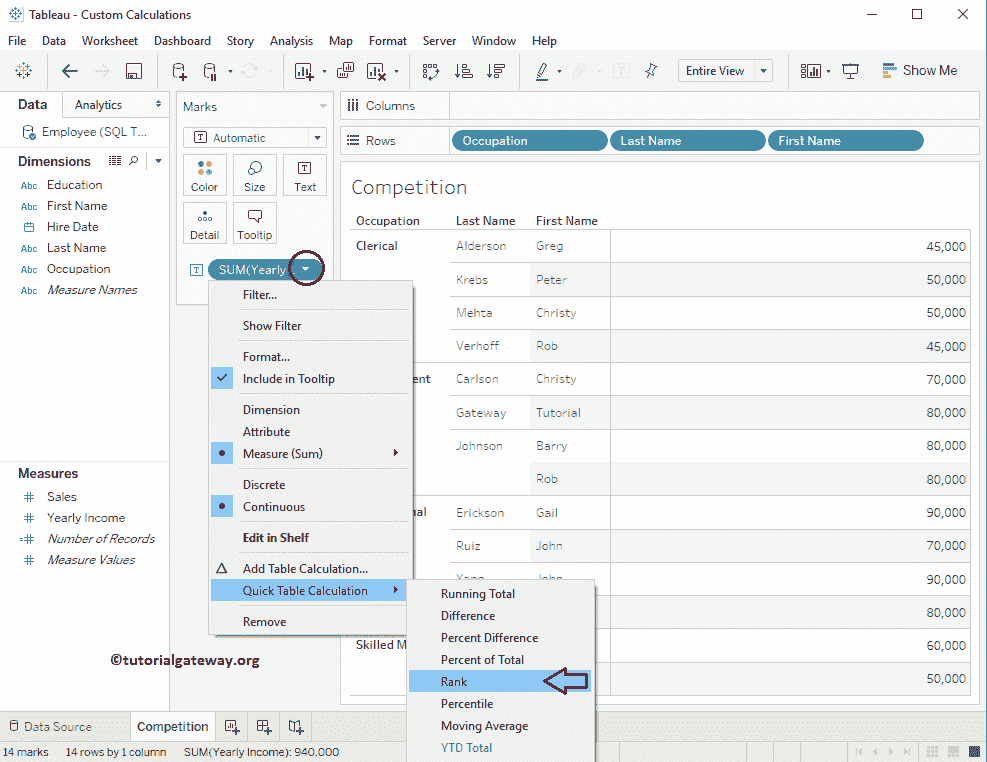

选择排名选项后，Tableau 会根据年收入值

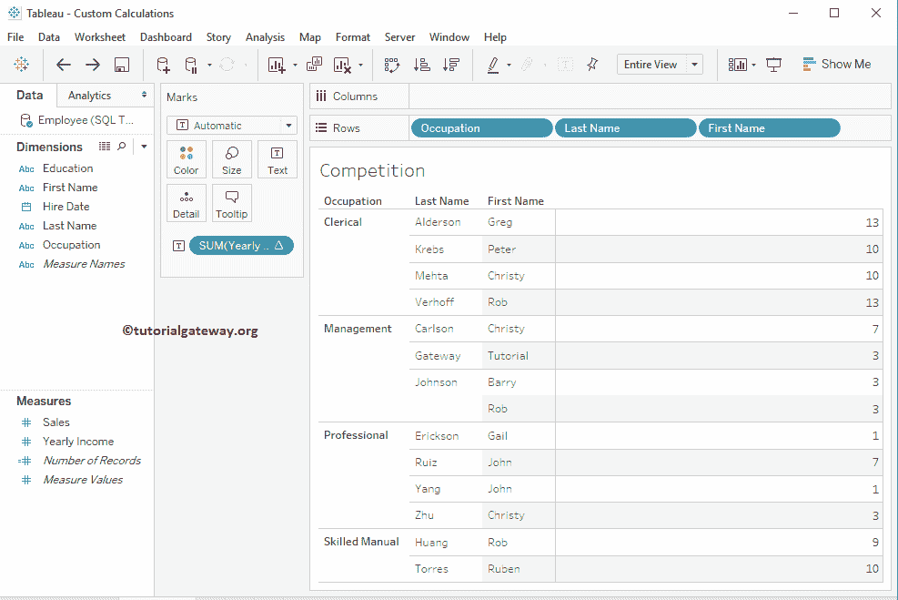

为每个记录分配排名

我认为显示年收入值会很好，这样你就可以将排名值与年收入进行比较。让我们把年收入加到柱架上。如您所见，它将创建一个水平条形图。请使用“演示”窗口将条形图更改为文本。

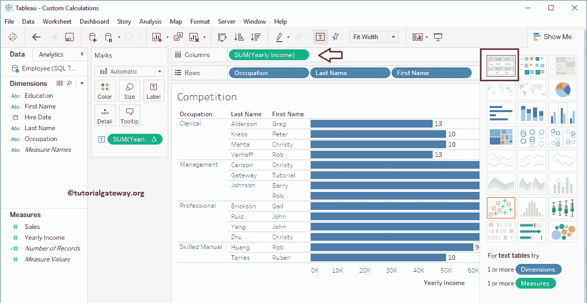

下面的截图将向您展示 Tableau 排名计算的更好视图。

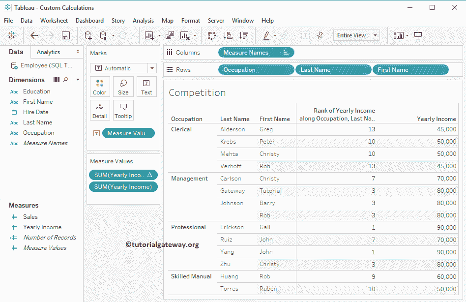

### 更改 Tableau 排名计算

要编辑现有的表计算，请点击表计算旁边的向下箭头将打开上下文菜单。在这里，您必须选择“编辑表计算”选项。

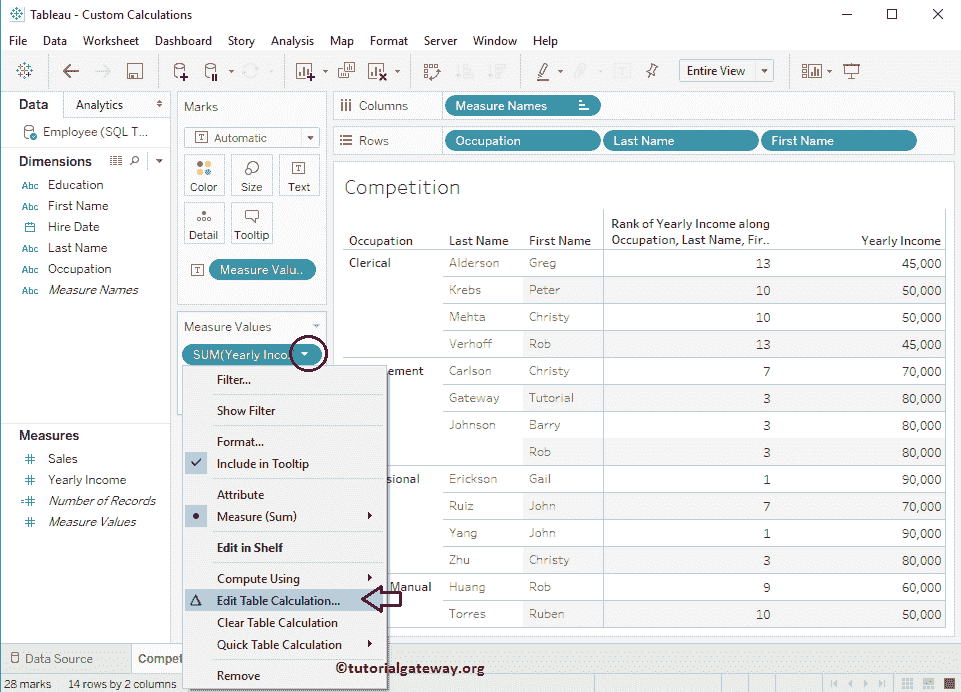

单击“编辑表计算”选项后，将打开一个名为“表计算”的新窗口。如您所见，默认情况下，tableau 已将排名计算类型选择为竞争(1、2、2、4)，并将使用选项计算选择为指定维度(职业、姓氏和名字)。在这里，您也可以取消选中不需要的尺寸。

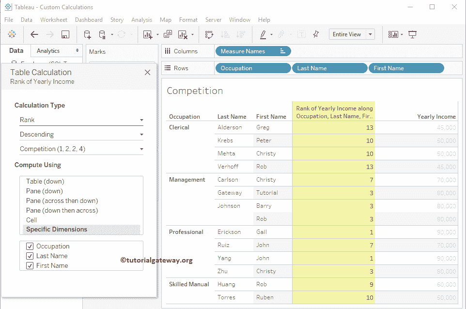

让我们将排名计算类型从竞赛改为修改竞赛(1、3、3、4)，可以看到排名

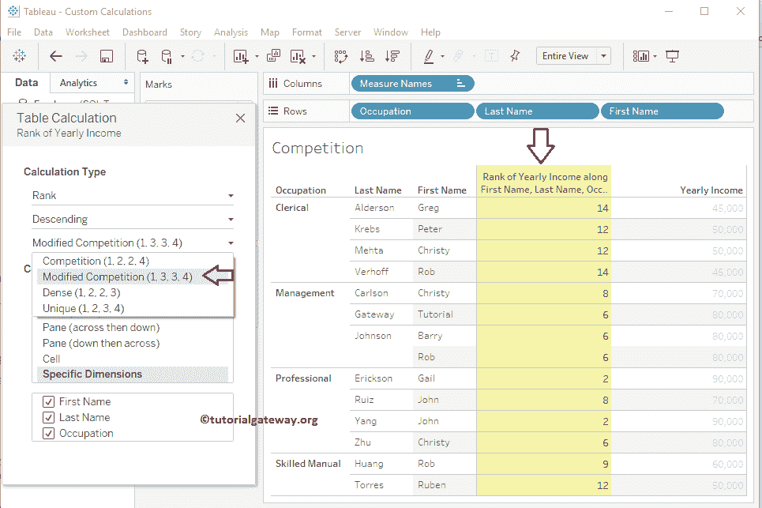

的变化

让我们将排名计算类型从修改后的竞赛(1，3，3，4)改为密集(1，2，2，3)，可以看到排名

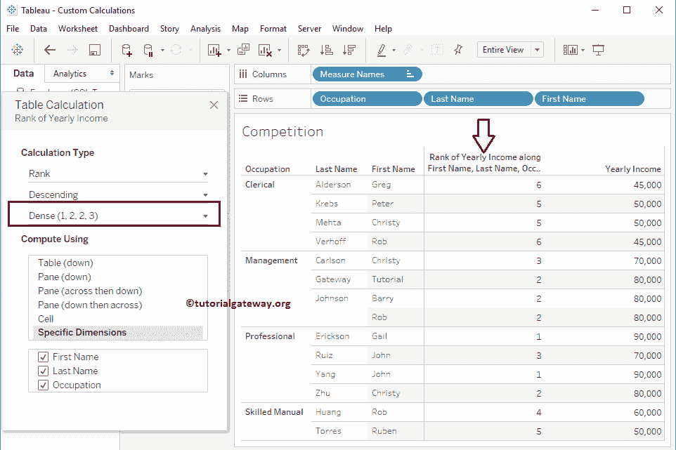

的变化

最后，我们将排名计算类型从密集(1，2，2，3)更改为唯一(1，2，3，4)。你可以看到排名

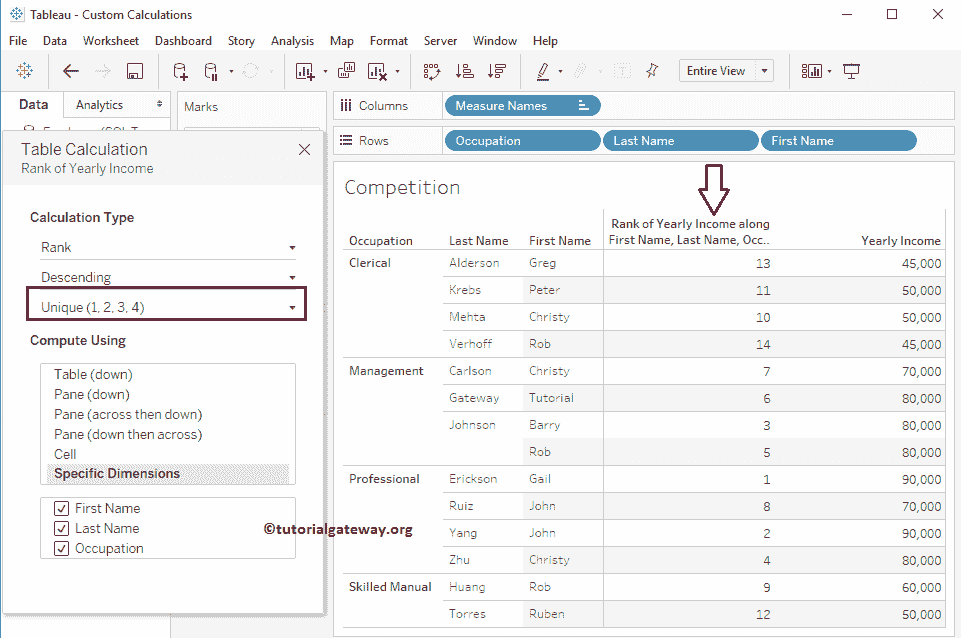

的变化

## 表跨选项卡报告的排名计算

在本例中，我们向您展示了如何在表中计算交叉 Tableau 报告的排名(或)计算每个分区的排名。为此，我们从“行架”中删除了“名字”，并将“使用计算”选项更改为窗格(向下，然后横向)。这里我们没有任何交叉标签，所以它将通过向下计算。

首先，我们将排名计算类型更改为竞争(1，2，2，4)，您可以看到结果。它正在计算每个分区的排名(这里是职业)

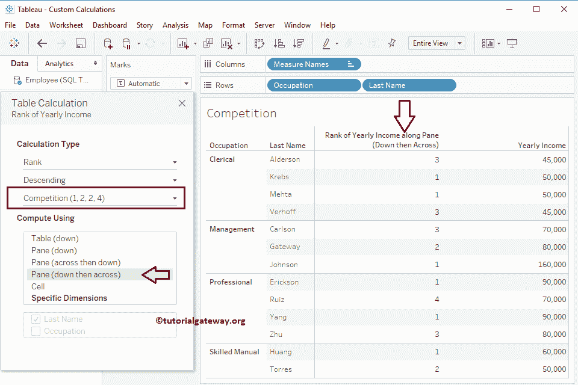

让我们将 Tableau 排名计算类型从竞争更改为修改竞争(1，3，3，4)。从下面的截图中可以看到按职业

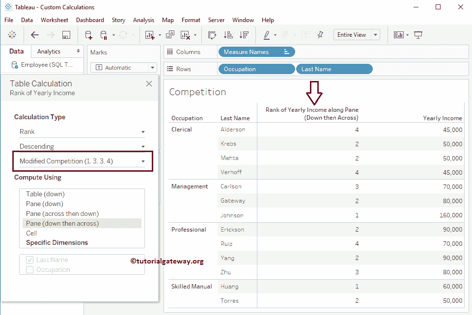

划分的修改后的比赛排名

让我们将排名计算类型从修改的竞争(1，3，3，4)更改为密集(1，2，2，3)。从下面的截图中你可以看到按职业

划分的密集排名

最后，我们将 Tableau 排名计算类型从密集(1，2，2，3)更改为唯一(1，2，3，4)。您可以看到按职业划分的唯一排名

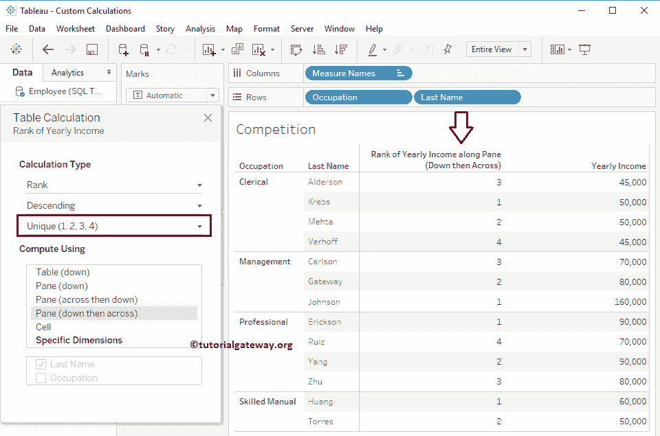

### Tableau 排名计算–第二种方法

请点击测量值旁边的向下箭头(这里是年收入)将打开上下文菜单。这里你必须选择

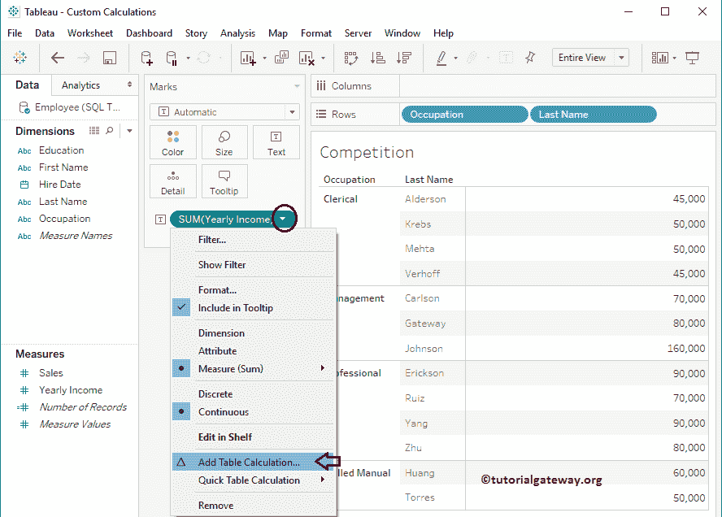

添加表计算选项

单击添加表计算选项后，将打开一个名为表计算的新窗口。

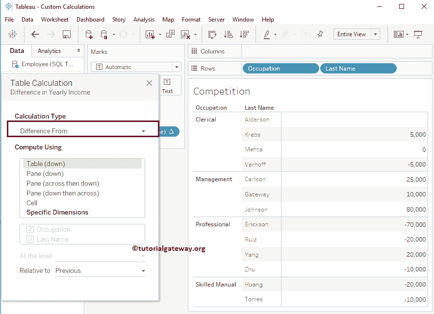

请将计算类型从差异自选项更改为 Tableau 排名

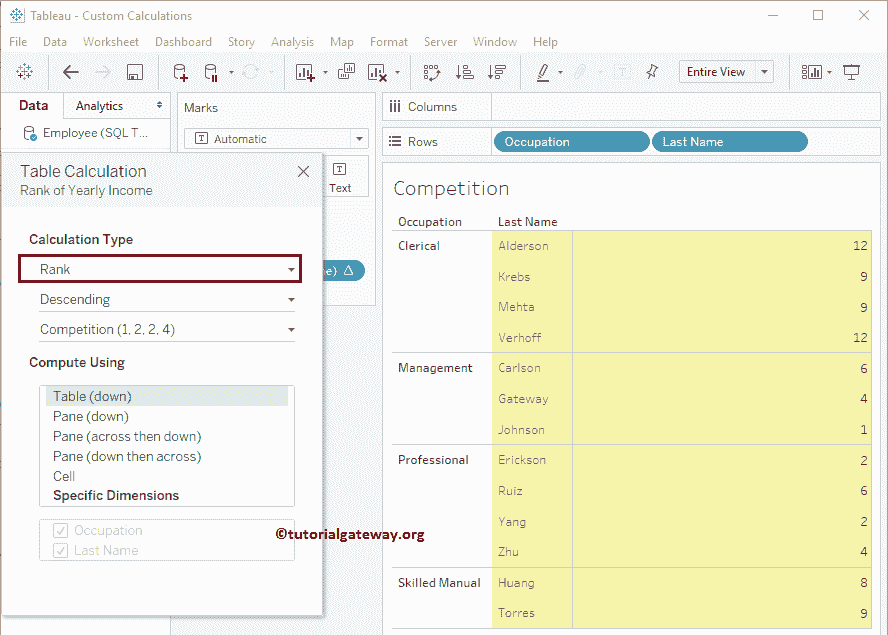

接下来，将“计算使用”选项从表(向下)更改为窗格(横向然后向下)

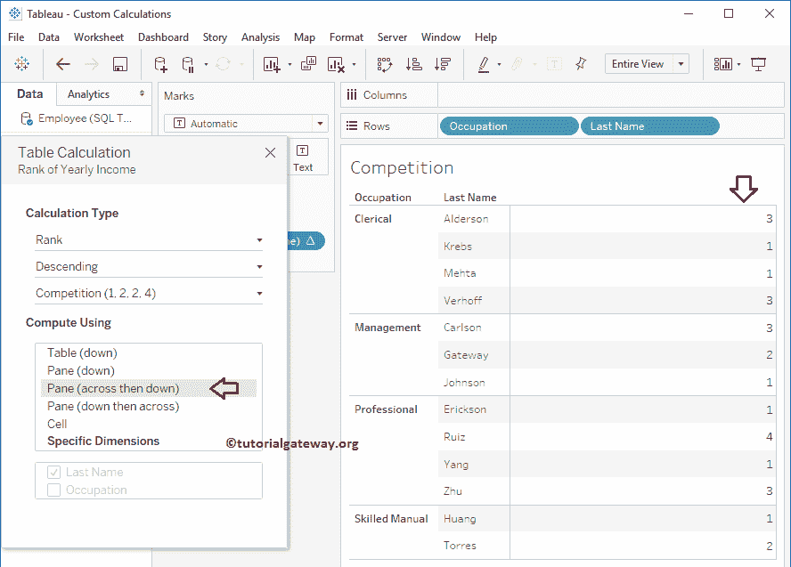