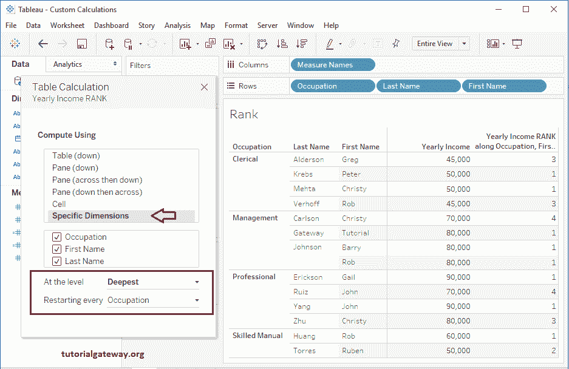

# 高级等级计算表

> 原文：<https://www.tutorialgateway.org/tableau-rank-calculation/>

在我们之前的文章中，我们已经向您展示了在 Tableau 中计算等级的基本方法。在本文中，我们将通过一个示例向您展示如何使用表计算来计算 Tableau Rank。

对于这个 Tableau 等级计算，我们将使用雇员表来表示 SQL Server。建议大家参考[连接 SQL Server](https://www.tutorialgateway.org/connecting-tableau-to-sql-server/)[排名](https://www.tutorialgateway.org/tableau-rank-calculation-basic/)文章了解配置。下面的截图会给大家展示 [Tableau](https://www.tutorialgateway.org/tableau/) 表里面的数据，可以看到，它有 14 条记录:

## 高级等级计算表

在本例中，我们将向您展示计算 tableau 等级的高级方法。对于此表排名计算，我们将把职业、姓氏和名字从维区域拖放到行架。接下来，将“年收入”从“测量”区域拖到标记架中的文本字段。

要分配表格等级，我们必须添加表格计算。为此，请单击年收入衡量标准旁边的向下箭头(根据需要更改)。或者右键单击它将打开上下文菜单。从可用选项列表中，请选择创建选项，然后选择计算字段…选项。

单击计算字段…选项后，将打开一个新窗口来编写计算。

### Tableau 秩函数

在这个例子中，我们将计算等级，所以我们使用 Tableau RANK 函数。Tableau 中的 Rank 函数首先接受两个参数，聚合度量(或表达式)，其次是排名顺序(升序或降序)。这里第二个参数是可选的，默认情况下，它被指定为 DESC(降序)。

Tableau 等级函数将相同的等级分配给相同的值。例如，如果我们有 100，200，200，400，那么该函数将以升序

返回等级为 1，2，2，4

提示:点击我们四舍五入的箭头来显示或隐藏现有功能。您可以搜索所需的函数，然后通过选择一个函数来检查其语法。

点击确定按钮后，表格将根据年收入值

为每条记录分配等级

#### 编辑表格等级函数

要编辑现有的表格计算，请点击表格计算旁边的向下箭头将打开上下文菜单。在这里，您必须选择“编辑表格计算”选项。

单击“编辑表格计算”选项后，将打开一个名为“表格计算”的新窗口。如您所见，默认情况下，tableau 选择了“使用表计算”选项(向下)。

让我们将计算使用选项从表(向下)更改为指定维度(职业、姓氏和名字)。注意，我们正在为“重新启动每个”选项选择“占用”维度。它将允许 Tableau 为每个职业分配排名。或者我们可以说，按职业划分的年收入排名。

现在你可以看到这个 Tableau 秩函数的结果。它正在计算每个分区的等级(这里是职业)

### Tableau RANK _ 密集函数

在这个例子中，我们使用的是 Tableau RANK_DENSE 函数。这个 Tableau 排名函数接受两个参数，第一，聚合度量(或表达式)，第二，排名顺序(asc 或 desc)。这里，第二个参数是可选的，默认情况下，它将指定 DESC(降序)。

Tableau Rank _ 密集函数将为相同的值分配相同的等级，但不会跳过下一个等级。例如，如果我们有 100，200，200，400，那么该函数将以升序返回 1，2，2，3 的等级。

要更改现有的表格计算，请单击表格计算旁边的向下箭头，然后选择编辑..选项。

让我们将函数名从 RANK 更改为 RANK_DENSE，或者写下您的自定义函数，然后单击 OK。

正如你看到的结果，它正在计算每个分区的密集等级(这里是占领)

### Tableau RANK_MODIFIED 函数

在这个例子中，我们使用的是 Tableau RANK_MODIFIED 函数。这个 Tableau Rank 函数首先接受两个参数，聚合度量(或表达式)，其次是排名顺序。这里，第二个参数是可选的，默认情况下，它将指定 DESC(降序)。

Tableau Rank_Modified 函数将为相同的值分配相同的等级。最高值将列为 1，下面两个相等的值将列为 3。例如，如果我们有 100，200，200，400，那么该函数将以升序

返回等级为 1，3，3，4

它正在计算每个职业

的修改等级

### Tableau 秩百分位函数

我们正在使用 Tableau RANK _ PERCENTILE 函数。这个 Tableau Percentile 函数接受两个参数，一是聚合度量(或表达式)，二是排序顺序(升序或降序)。

在 Tableau PERCENTILE 函数中，第二个参数是可选的，默认情况下，它分配 DESC(降序)。

现在你可以看到这个 Tableau Rank 函数的结果。它正在计算每个职业的百分位等级

### Tableau RANK_UNIQUE 函数

在这个例子中，我们使用的是 Tableau RANK_UNIQUE 函数。这个 Tableau Rank 函数首先接受两个参数，其次是一个表达式，排名顺序(升序或降序)。这里，第二个参数是可选的，默认情况下，它将指定 DESC(降序)。

Tableau Rank_UNIQUE 函数将为唯一的等级分配一个相同的值。例如，如果我们有 100，200，200，400，那么该函数将以升序

返回等级为 1，2，3，4

参见 Tableau RANK_UNIQUE 函数结果。它为职业中的每个项目分配唯一等级。

