# 表运行合计计算

> 原文：<https://www.tutorialgateway.org/tableau-running-total-calculation/>

在本文中，我们将通过一个例子向您展示如何计算 Tableau 运行总数。对于 Tableau 运行总计演示，我们将使用我们在上一篇文章中创建的数据源。

请访问【报告中的数据标签】文章，了解[表](https://www.tutorialgateway.org/tableau/)数据源。

## 计算表运行总数

在开始计算 tableau 中的运行总数之前，让我创建一个 Tableau 报告，我们将在本例中使用它。首先，将订单日期(年)从维区域拖放到列架。

接下来，将订单日期(季度)和订单日期(月)从维区域拖放到行架。最后，将“销售额”从度量区域拖放到“标记”框中的文本字段。一旦拖动它们，将生成以下[Tableau 报告](https://www.tutorialgateway.org/tableau-text-label/)。

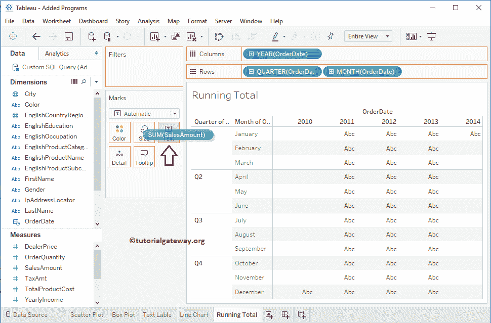

如您所见，我们没有太多 2010 年和 2014 年的数据(销售额)。因此，我们通过选择这两列，然后单击工具提示

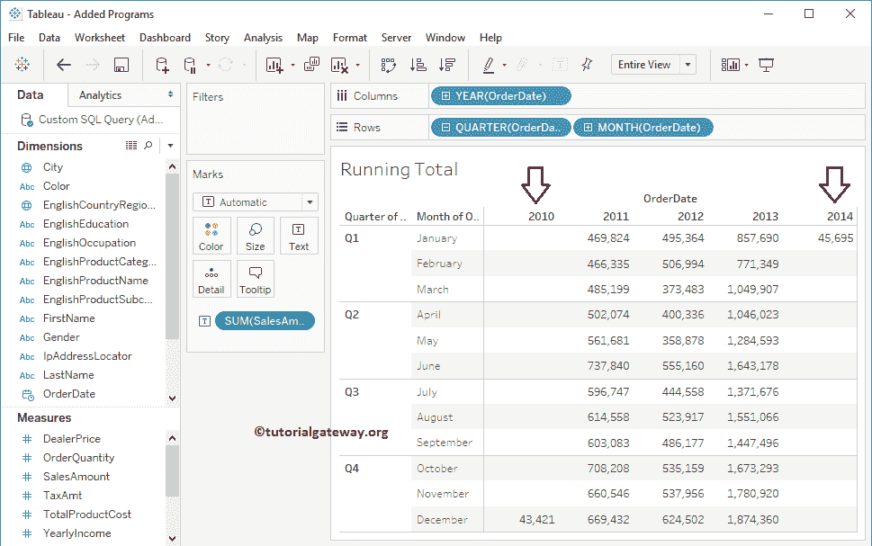

中的排除按钮，将这两年从Tableau 报告中排除

下面的截图将向您展示最终的报告，我们将使用它来计算 Tableau 中的运行总和。

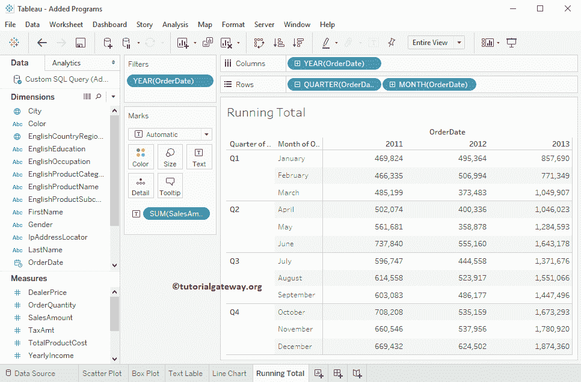

为了在 Tableau 中计算运行的 Total，我们必须添加表计算。为此，单击销售额度量(根据要求更改)旁边的向下箭头将打开上下文菜单。

从可用选项列表中，您可以选择“添加表”选项或“快速表计算”选项。我建议您使用【添加表计算】选项

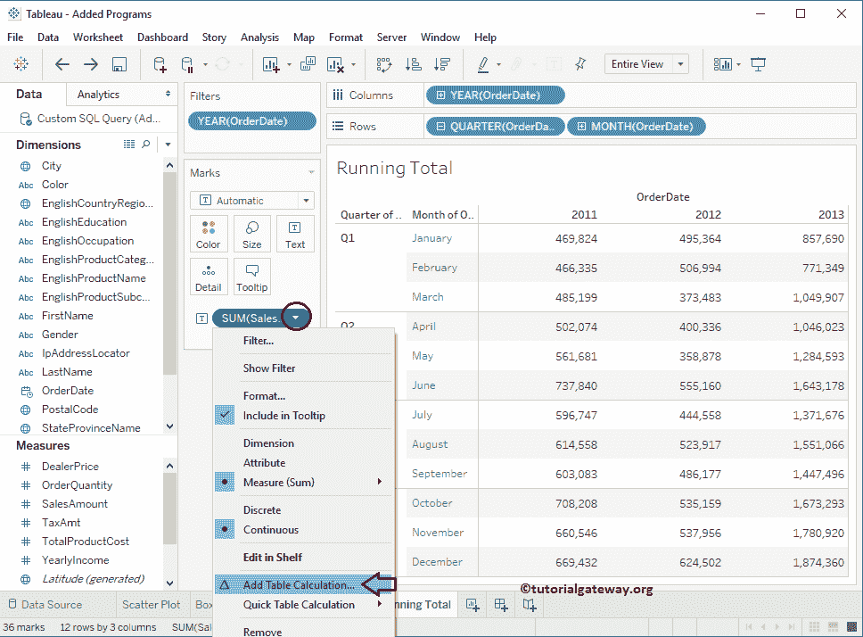

单击“添加表”选项后，将会打开一个名为“表计算”的新窗口，如下所示。如您所见，默认情况下，Tableau 已选择计算类型作为差异来源，并选择计算使用选项作为表(跨)。

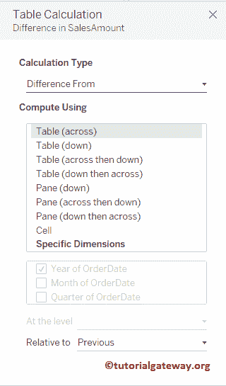

请将计算类型从差异自选项更改为累计

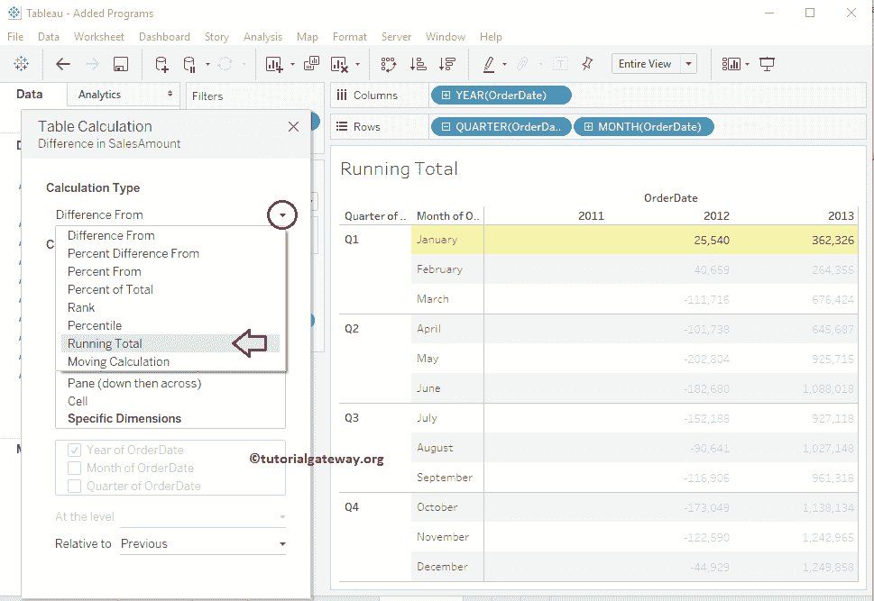

接下来，将计算使用选项从表(跨)更改为表(下)

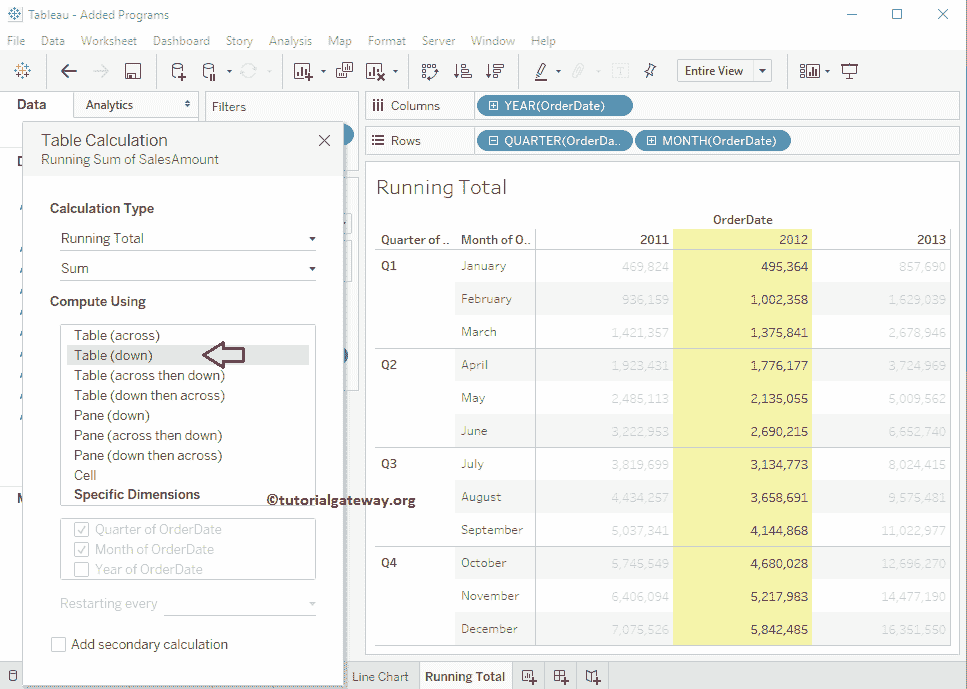

如您所见，我们已经成功生成了在 Tableau 中计算运行总数的报告。

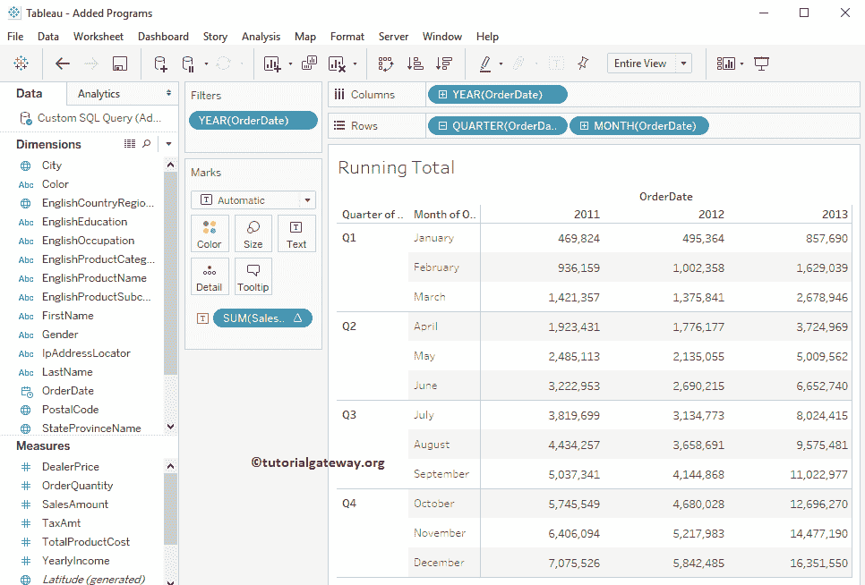

我认为显示销售金额值会有所帮助。为了让您可以将“累计销售额”与“原始销售额”值进行比较，让我们将“销售额”添加到“栏架”中。

如您所见，Tableau 显示了原始值及其每年的运行总数。

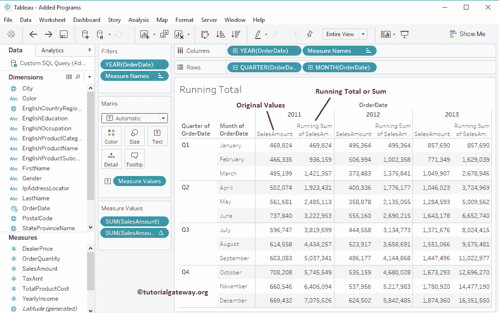

### 表每个分区的运行总数

如果我们计算每个分区或每个季度的运行总数，那就太好了。要更改实际计算，我们必须编辑它。

要编辑现有的表计算，请点击表计算旁边的向下箭头将打开上下文菜单。在这里，您必须选择编辑表计算选项，如下所示。

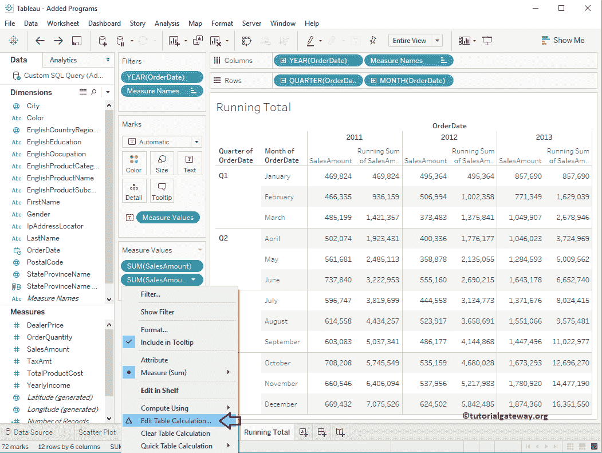

单击“编辑表计算”选项后，将打开一个名为“表计算”的新窗口。如您所见，默认情况下，tableau 选择了最佳选项，如计算类型作为运行合计、聚合作为总和以及使用选项作为指定维度(订单日期的季度和订单日期的月份)进行计算。

在这里，您必须将“每季度重新启动”选项从“无”更改为“订单季度”日期。这将确保 tableau 在一年的每个季度重新启动运行总数。

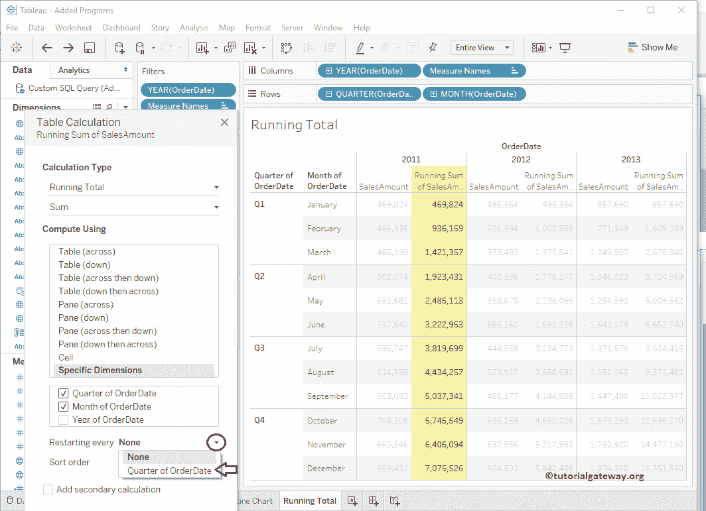

现在你可以看到每个季度

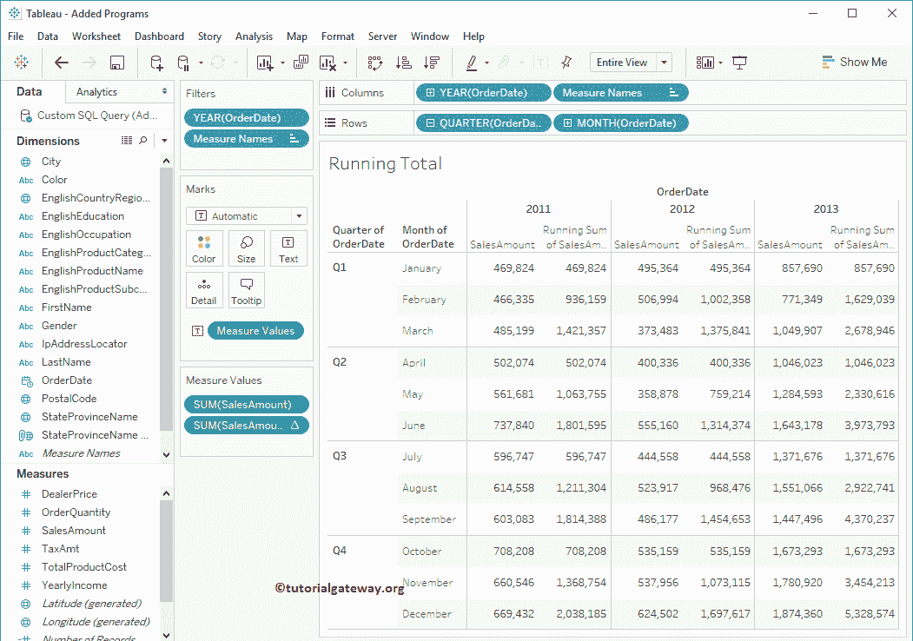

的跑步总数

### 在表中添加二次计算

Tableau 允许我们将辅助计算添加到报告中。在实际计算的基础上进一步计算是有益的。为此，请选中添加辅助计算选项，如下所示。

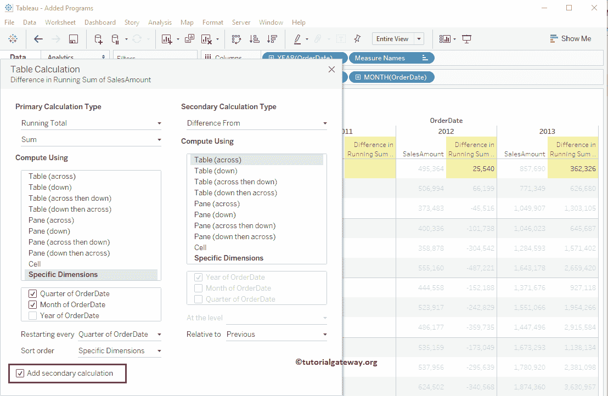

请保留所有默认设置，并将“二次计算类型”选项从“差值从”更改为“百分比差值从”

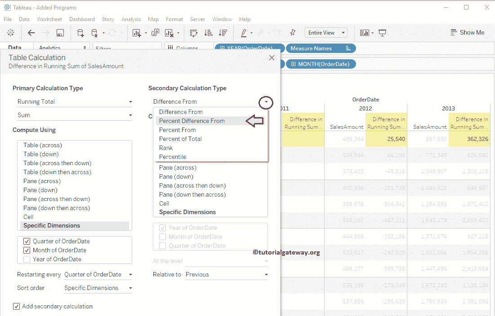

以下截图将向您展示 Tableau 运行总数

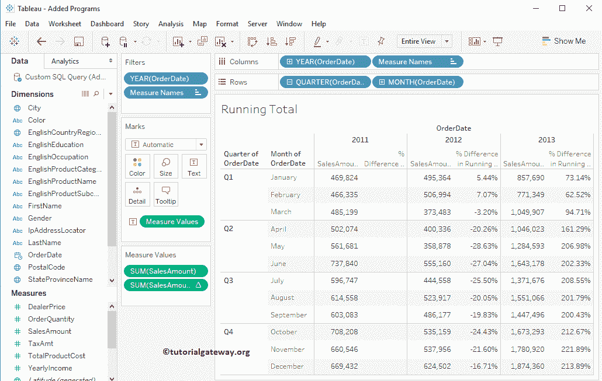

的差异百分比