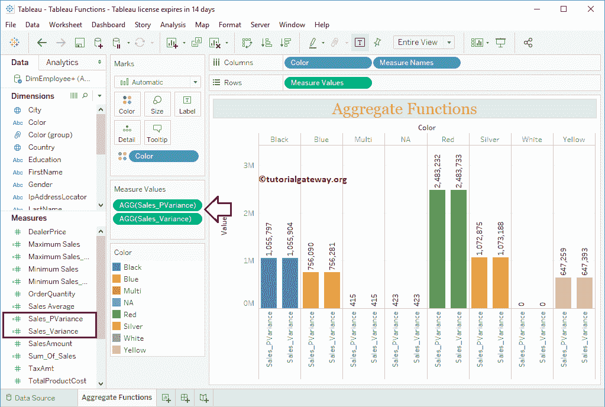

# Tableau 聚合函数

> 原文：<https://www.tutorialgateway.org/tableau-aggregate-functions/>

Tableau 提供了各种聚合函数，帮助您执行聚合，如计算总和、平均值、最小值、最大值等。在本文中，我们将通过示例向您展示如何使用 Tableau 聚合函数。

为了演示这些 Tableau 聚合函数，我们将使用我们在上一篇文章中创建的数据源。因此，请访问 Tableau Reports 文章中的[数据标签。](https://www.tutorialgateway.org/data-labels-in-tableau-reports/)

## Tableau 聚合函数

以下示例将向您展示[表](https://www.tutorialgateway.org/tableau/)中的聚合函数列表。

### 表和函数

Tableau Sum 函数用于查找列中记录的总和。这个 Tableau 求和函数的基本语法如下所示:

```
SUM(Expression)
```

为了演示这些 Tableau 聚合函数，我们必须使用计算字段。请导航至分析选项卡，并选择创建计算字段…选项以[创建计算字段](https://www.tutorialgateway.org/calculated-field-tableau/)。


单击创建计算字段选项后，将打开以下窗口。在这里，我们将默认计算名称重命名为销售总和。

从下面的截图中可以看到，在我打字的时候，Tableau 计算窗口正在显示建议。


出于演示目的，我们将计算销售金额的总和。通过单击“确定”按钮，将创建一个名为“销售额总和”的新字段。表和的最终代码是

```
SUM([SalesAmount])
```


现在可以看到我们新创建的 Tableau Sum 计算字段


让我创建一个条形图，方法是将“国家/地区”拖到“列”架，“销售额总和”(新计算字段)拖到“行”架，“国家/地区”拖到“颜色”架。


### 表平均函数

表平均值或平均函数用于计算平均值。这个 Tableau AVG 函数的语法如下所示:

```
AVG(Expression)
```

从下面的截图中可以看到，我们正在使用 Tableau 函数创建一个新的字段(销售平均值)。

```
AVG([SalesAmount])
```

点击【确定】关闭


窗口

让我用此“销售平均值”字段替换“行销售总和”货架。


### 表最小函数

Tableau MIN 函数是 Tableau 中的一个聚合函数，用来求最小值。该表最小函数的语法如下所示:

```
MIN(Expression)
```

从下面的截图中可以看到，我们正在创建一个名为“最低销售额”的字段。

```
MIN([SalesAmount])
```


让我将“最小销售额”放在“行”框中，将“颜色”维度放在“列”框中。


Tableau MIN 函数接受两个参数。用它来找出两个数字中的最小值。语法是:

```
MIN(Expression1, Expression2)
```

在这里，我们创建了一个新的字段，最小 _ 销售 _ 成本，以找到销售金额和总成本之间的最低值。


让我在图表


中添加最小销售成本、销售额和产品总成本

### 表最大函数

Tableau MAX 函数用于查找最大值。这个 Tableau MAX 的语法如下所示:

```
MAX(Expression)
```

您可以看到，我们正在创建一个名为“最大销售额”的字段。

```
MAX([SalesAmount])
```


让我用最大销售额字段替换行货架中的最小销售额字段。


在 Tableau 中，MAX 函数接受两个参数。用这个在两个数字中找出最大的。语法是:

```
MAX(Expression 1, Expression 2)
```

在这里，我们创建了一个新的字段，最大销售成本，以找到销售额和总产品成本中最大的值。


让我在图表


中添加最大销售成本、销售额和产品总成本

### 表 VAR 函数

Tableau VAR 函数是 Tableau 中的一个聚合函数，用来求样本总体的方差。这个 Tableau VAR 的语法如下所示:

```
VAR(Expression)
```

在这里，我们创建了一个名为 Sales_Variance 的新字段。

```
VAR([SalesAmount])
```

点击【确定】关闭


窗口

### 表 VARP 函数

Tableau VARP 函数用于寻找整个人口的方差。表 VARP 语法:

```
VARP(Expression)
```

让我创建一个名为 Sales_PVariance 的新字段。

```
VARP([SalesAmount])
```

点击【确定】关闭


窗口

让我将这两个差异添加到柱状图



### Tableau STDEV 函数

Tableau STDEV 函数是 Tableau 中的聚合函数之一，用于查找样本总体的标准差。这个 Tableau STDEV 的语法如下所示:

```
STDEV(Expression)
```

在这里，我们创建了一个名为 Sales _ StdDeviation 的新字段。

```
STDEV([SalesAmount])
```

点击【确定】关闭


窗口

### Tableau STDEVP 函数

Tableau STDEVP 函数用于寻找整个人口的标准差。这个 Tableau STDEVP 的语法是:

```
STDEVP(Expression)
```

让我创建一个名为 Sales_StdDeviationP 的新字段。

```
STDEVP([SalesAmount])
```


让我把这两个标准差加到柱形图


### Tableau 计数函数

Tableau COUNT 函数是 Tableau 聚合函数之一，用于查找非空值的数量。这个 Tableau COUNT 的语法如下所示:

```
COUNT(Expression)
```

这里，我们正在创建一个名为 Count_Orders 的新字段。

```
COUNT([OrderQuantity])
```

单击确定关闭窗口

提示:使用 COUNTD 函数获得一个不同的计数。


让我将它添加到 Tableau 计数行字段中。

