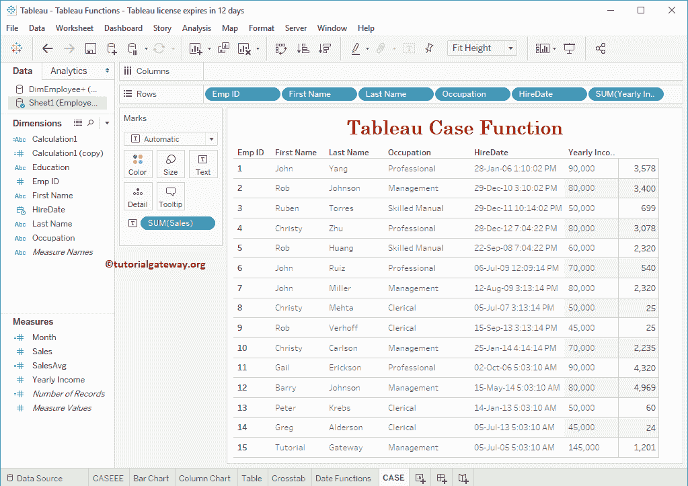

# Tableau `CASE`函数

> 原文：<https://www.tutorialgateway.org/tableau-case-function/>

Tableau Case 函数类似于 IF ELSE 或 Else If 函数。Tableau 中的 Case 函数根据条件结果计算一系列条件表达式，并将返回输出。

## Tableau `CASE`函数语法

Tableau 中 Case 语句背后的基本语法如下所示:

```
CASE <Input_Expression>
     WHEN <test_condition1> THEN result_1
     WHEN <test_condition2> THEN result_2
     .........
     ELSE default_result
END
```

这个 Tableau 案例语句的参数是:

*   Input_Expression:这可以是要对其执行操作的任何列或表达式。
*   test_condition: Tableau CASE 函数将把这个表达式与 Input_Expression 进行比较，如果是 TRUE，将返回结果。
*   结果:
    *   如果测试条件等于输入表达式，那么它将作为输出返回。
    *   如果它们不相等，default_result 将作为输出返回。

在本文中，我们将通过一个例子向您展示如何在 Tableau 中编写 CASE 函数。为了演示这个 [Tableau](https://www.tutorialgateway.org/tableau/) `CASE`函数，我们将使用下面显示的数据。

如你所见，这张表中有 15 条记录。



## 表`CASE`函数示例

为了演示这个 Tableau Case 函数，我们必须创建计算字段。要[创建计算字段](https://www.tutorialgateway.org/calculated-field-tableau/)，请导航至分析选项卡并选择创建计算字段…选项，如下所示。


单击创建计算字段选项后，将打开以下窗口。在这里，我们将默认计算名称重命名为 case1。你可以看到 Tableau 案例语句的代码

```
CASE [Occupation]
    WHEN 'Management' THEN 'Administrators'
    WHEN 'Professional' THEN 'Sr. Software Developer'
    WHEN 'Skilled Manual' THEN 'Software Developer'
    ELSE 'Freshers'
END
```

对上述代码的分析

*   如果职业=管理为真，管理员保存在案例 1 中
*   职业=专业是真的，它将分配高级软件开发人员
*   职业=熟练手册为真，则指定软件开发人员
*   如果以上所有条件都失败，那么它将返回更新鲜


让我将这个 Case1 计算字段添加到我们之前创建的表中(通过将字段拖到行架)。请参考[创建Tableau 报告](https://www.tutorialgateway.org/tableau-table-report/)一文，了解创建表


的步骤

## 表案例陈述示例 2

在本例中，我们将根据员工的职业更新其年收入。

```
CASE [Occupation]
    WHEN 'Management' THEN ([Yearly Income] + 100000)
    WHEN 'Professional' THEN ([Yearly Income] + 50000)
    WHEN 'Skilled Manual' THEN ([Yearly Income] + 35000)
    ELSE ([Yearly Income] + 25000)
END

```


让我将此计算字段添加到表


中