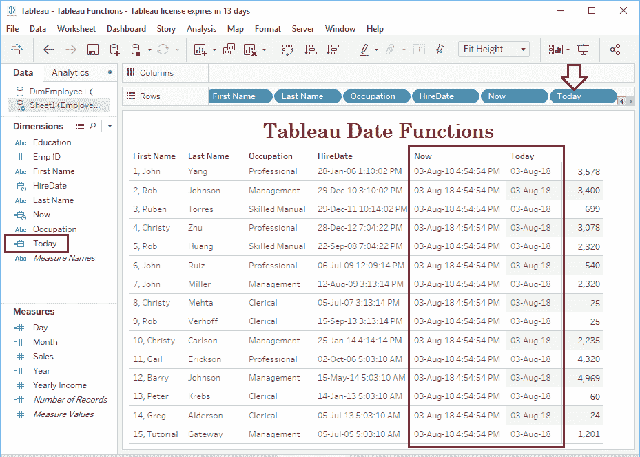

# Tableau 日期函数

> 原文：<https://www.tutorialgateway.org/tableau-date-functions/>

Tableau 提供各种日期函数，如年、月、日、完成日期、完成时间、日期差异、日期部分、日期添加、日期名称、日期滚动、现在、今天等。在本文中，我们将通过示例向您展示如何使用 Tableau 日期函数。

为了演示这些 Tableau 日期函数，我们将使用下面显示的数据。如你所见，这张表中有 15 条记录。


## Tableau 日期函数

以下示例将向您展示 Tableau 日期函数的列表

### 表年函数

Tableau YEAR 函数用于从给定日期返回 YEAR。这个 Tableau YEAR 的语法:

```
YEAR(Date)
```

为了演示[表](https://www.tutorialgateway.org/tableau/)中的日期函数，我们必须使用计算字段。要[创建计算字段](https://www.tutorialgateway.org/calculated-field-tableau/)，导航至分析选项卡，并选择创建计算字段…选项。


单击创建计算字段后，将打开以下窗口。在这里，我们将默认计算名称重命名为年份。

从下面的截图中可以看到，在我打字的时候，计算窗口正在显示建议。


出于演示的目的，我们将返回从 HireDate 年

```
YEAR([HireDate])
```


让我将这个计算字段添加到我们之前创建的表中(通过将字段拖到行架)。请参考[创建 Tableau 报告](https://www.tutorialgateway.org/tableau-table-report/)一文，了解创建表所涉及的步骤


因为它是一种度量，所以有时它可能不会正确显示。如果是这种情况，请单击年份并将其从度量更改为维度。接下来，将值从连续更改为离散。


### Tableau MONTH 函数

Tableau Month 函数用于返回给定日期的月数。这个 Tableau 月函数的语法是

```
MONTH(Date)
```

让我创建一个计算字段，从“日期”返回月数

```
MONTH([HireDate])
```


让我将此表月号字段添加到行货架


### 表日函数

Tableau DAY 函数用于从给定日期中提取或返回日数。这个 Tableau DAY 函数的语法是:

```
DAY(Date)
```

让我创建一个 Tableau Day 字段，从 HireDate 返回日期

```
DAY([HireDate])
```


接下来，我们将 Tableau 日字段添加到行架中


### 表现在功能

Tableau NOW 函数用于返回今天的日期和时间。这个 Tableau NOW 函数的语法是:

```
NOW()
```

让我为 NOW 函数创建一个计算字段来返回今天的日期和时间

```
NOW()
```


从下面的截图，可以看到今天的日期和时间


### 今日函数表

Tableau Today 函数用于返回今天的日期。这个 Tableau Today 函数的语法是:

```
TODAY()
```

让我们创建一个字段来返回今天的日期


从下面的截图中，可以看到今天的日期



### tableau makedata 函数

Tableau MakeDate 函数用于返回年、月和日的日期。这个 Tableau 生成日期函数的语法是:

```
MAKEDATE(year, month, day)
```

让我们创建另一个计算字段来返回指定年、月和日的日期。如您所见，我们使用了 Year()，MONTH()和 DAY()函数来提取相应的值。

```
MAKEDATE(YEAR([HireDate]), MONTH([HireDate]), DAY([HireDate]))
```


您可以看到 tableau makedata 函数的结果


### 表制作时间函数

Tableau MakeTime 函数用于从小时、分钟和秒返回时间。这个 Tableau MakeTime 函数的语法是:

```
MAKETIME(hour, minute, second)
```

让我创建一个计算字段，从小时、分钟和秒返回时间。如您所见，我们给出了静态值。但是，您可以使用 Datepart 从日期和时间中提取小时、分钟和秒。

```
MAKETIME(14, 22, 59)
```


现在，您可以看到 MakeTime 函数的结果。请记住，99 年 12 月 30 日是 tableau 生成的默认日期


### Tableau MakeDateTime 函数

Tableau MakeDateTime 函数用于从日期、时间返回日期和时间。这个 Tableau MakeDateTime 函数的语法是:

```
MAKEDATETIME(Date, Time)
```

如您所见，我们使用之前创建的计算字段作为参数。MakeDt 将从 HireDate 返回日期，MakeTime 将返回静态时间值。

```
MAKEDATETIME([MakeDt], [MakeTime])
```


让我将这个 MakeDateTime 函数字段添加到表中


### Tableau ISDATE 函数

Tableau IsDate 函数用于检查给定的字符串是否是日期。它返回真或假。该表的语法是状态函数:

```
ISDATE(string)
```

让我在字符串“雇用日期”列中使用这个函数。如您所见，这是一个字符串列

```
ISDATE([StringHireDate])
```


你可以看到这个 IsDate 函数的结果


### DATEDIFF 函数数组

Tableau DATEDIFF 函数用于返回开始日期和结束日期之间的日期差。使用第一个参数指定差异项。

这个 Tableau datediff 函数接受年、月、日等。例如，如果选择 YEAR，Tableau DateDiff 函数将返回开始日期和结束日期之间的年数。

这个 Tableau [DATEDIFF](https://www.tutorialgateway.org/sql-datediff/) 的语法是:

```
DATEDIFF(Difference_term, Start_Date, End_Date)
```

让我用 tableau 中的 datediff 来检查“今天”和“今天”在年份上的差异。

```
DATEDIFF('year', [HireDate], NOW())
```


从下面的截图中，可以看到 HireDate 和 Today


之间的总年数

让我将 Tableau datediff 中的差异术语更改为 MONTH，然后单击“应用”按钮。

现在你可以看到这些日期在月份


上的区别

### DATEADD Function 数组

Tableau DATEADD 函数用于将用户指定的时间间隔添加到实际日期。使用第一个参数定义日期部分术语，使用第二个参数指定时间间隔。

这个 Tableau DATEADD 函数接受年、月、日等。例如，如果选择“月”作为第一个参数，间隔为 6，则 Tableau Dateadd 函数将向现有日期添加六个月。

Tableau DATEADD 的语法是:

```
DATEADD(Date_part, interval, Date)
```

以下陈述将使雇佣日期增加 5 年。

```
DATEADD('year', 5, [HireDate])
```


这次我们将使用，月作为 Tableau [DATEADD](https://www.tutorialgateway.org/sql-dateadd/) 中的日期部分。下面的语句将 HireDate 增加了 6 个月。

```
DATEADD('month', 6, [HireDate])
```


### Tableau DATEPART 函数

Tableau DATEPART 函数用于提取或返回日期的一部分。使用第一个参数指定日期部分。

这个 Tableau DatePart 函数接受年、月、日等。例如，如果选择“月”作为日期部分，则 Tableau DatePart 函数将从给定日期返回一年。

这个 Tableau DATEPART 的语法是:

```
DATEPART(Date_part, Date)
```

以下语句将从 HireDate 中提取日期。

```
DATEPART('day', [HireDate])
```


这次我们将使用小时作为表中的[日期部分](https://www.tutorialgateway.org/sql-datepart/)。以下语句将从“开始日期”返回“小时”

```
DATEPART('hour', [HireDate])
```


### datename function 表

Tableau DATENAME 函数用于返回日期部分名称。使用第一个参数指定日期部分，它接受年、月、日。

Tableau DATENAME 的语法是:

```
DATENAME(Date_part, Date)
```

下面的语句将从 HireDate 返回月份名称。

```
DATENAME('month', [HireDate])
```


这次我们将使用工作日作为[日期名称](https://www.tutorialgateway.org/sql-datename/)中的日期部分。以下语句将从 HireDate 返回工作日名称

```
DATENAME('weekday', [HireDate])
```


### Tableau DATETRUNC 函数

Tableau DATETRUNC 函数是 Tableau 日期函数的一种。它用于返回指定日期部分的第一天。使用第一个参数指定日期部分，这个 Tableau datetrunc 函数接受 YEAR、MONTH、DAY 等。

Tableau DATETRUNC 的语法是:

```
DATETRUNC(Date_part, Date)
```

下面的语句将返回从“开始日期”开始的月份。

```
DATETRUNC('month', [HireDate])
```


这次我们将使用一个季度作为 Tableau DATETRUNC 函数中的日期部分。下面的语句将返回该日期所属季度的第一天

```
DATETRUNC('quarter', [HireDate])
```

