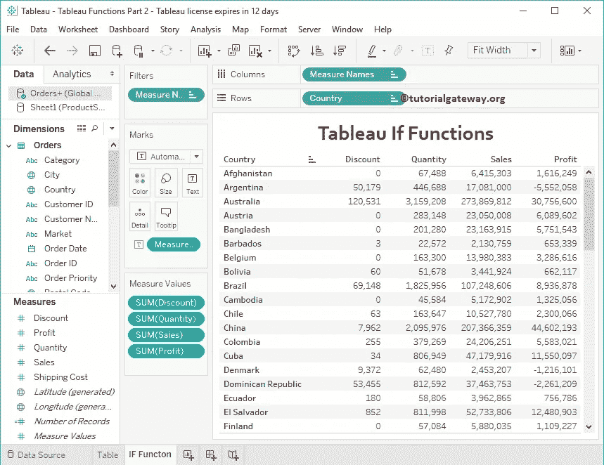
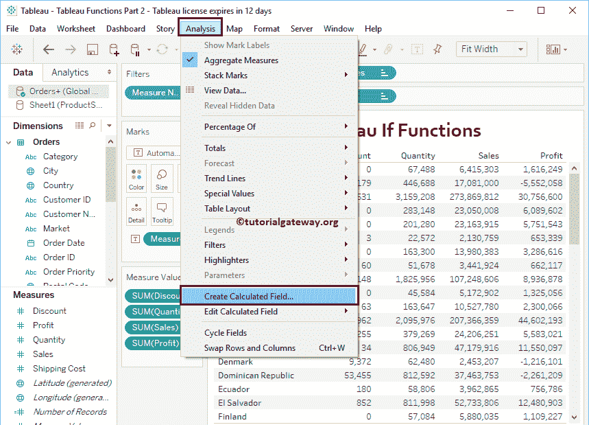
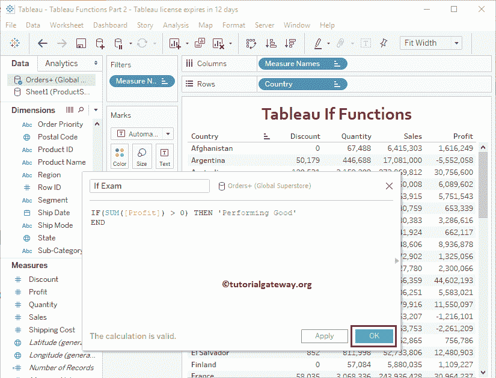
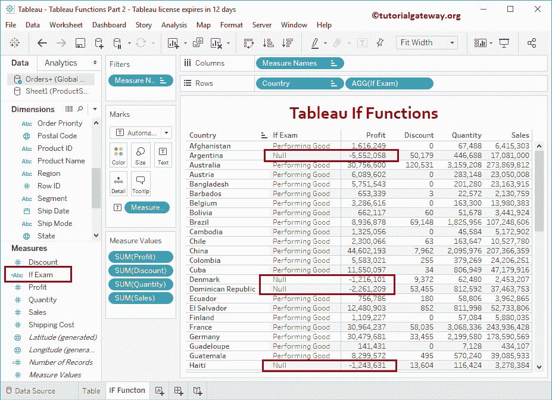
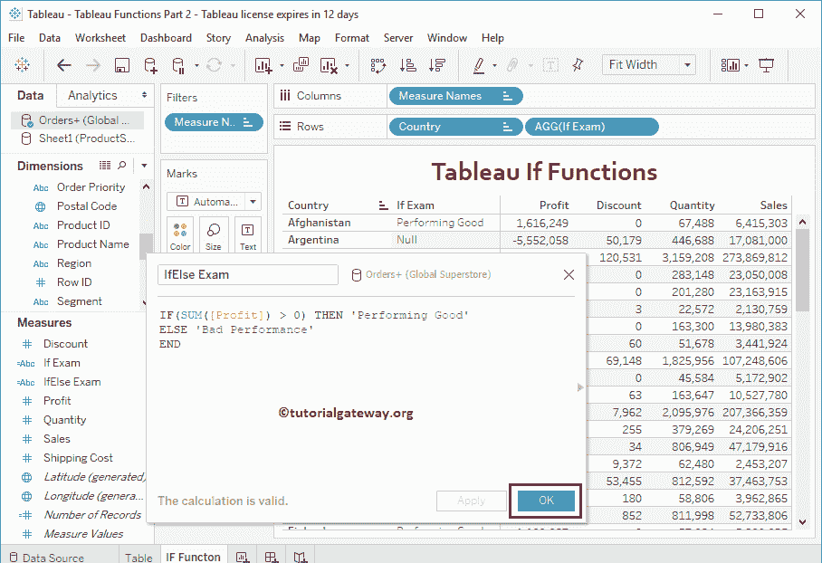
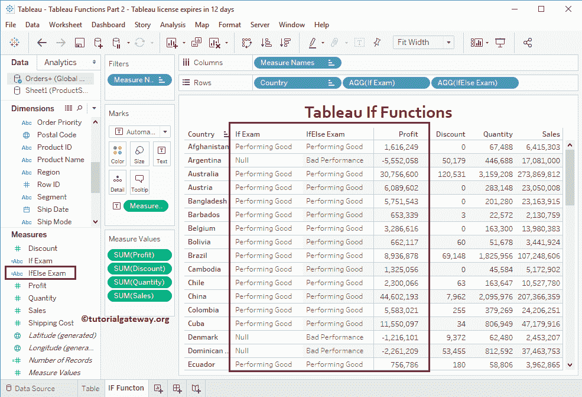
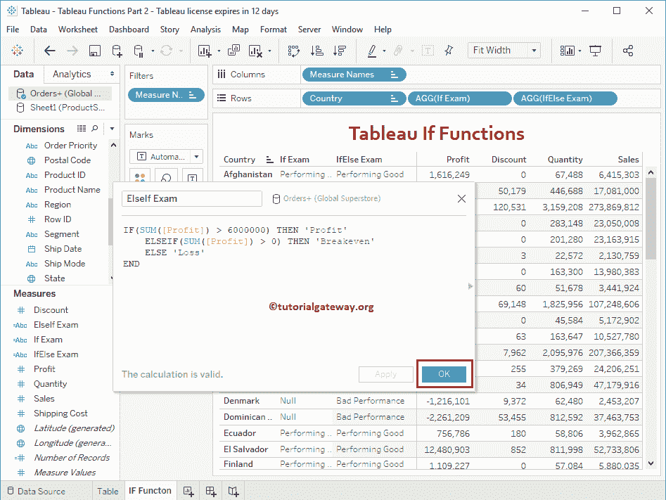
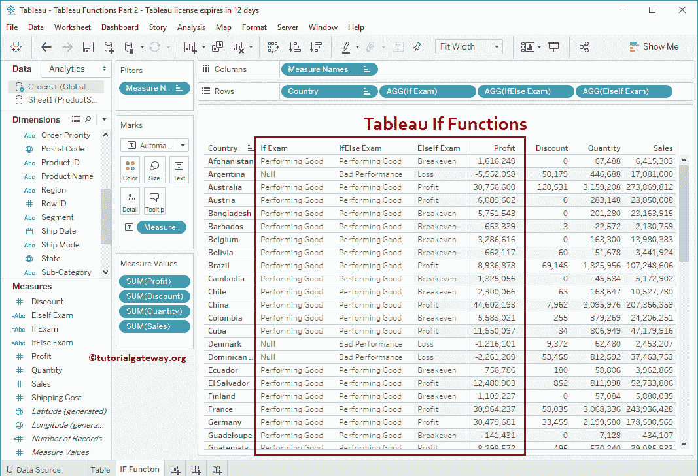

# 表格 If 函数

> 原文：<https://www.tutorialgateway.org/tableau-if-function/>

在报表设计中，Tableau If 函数是最有用的决策函数之一。如果函数测试条件，根据条件结果，它将返回输出。

在 Tableau 中，我们有三种 if 函数:If、If Else、ElseIf。在本文中，我们将通过示例向您展示如何使用这三个函数。

对于这个 Tableau If 语句演示，我们将使用全局超级存储 Excel 工作表中的数据，因此，请参考[在 Tableau](https://www.tutorialgateway.org/connecting-to-excel-files-in-tableau/) 文章中连接到 Excel 文件以了解连接设置。



## 表格 If 语句示例

Tableau If 语句仅在给定条件为真时返回结果；否则，它什么也不返回。

为了演示这个 Tableau If 函数，我们需要一个计算字段。要创建[计算字段](https://www.tutorialgateway.org/calculated-field-tableau/)，请导航至分析选项卡，并选择创建计算字段…选项，如下所示。



单击创建计算字段选项后，将打开以下窗口。在这里，我们将默认计算名称重命名为 If Exam。代码是

```
IF(SUM([Profit]) > 0) THEN 'Performing Good'
END
```



让我将这个计算字段添加到我们之前创建的表中(通过将字段拖到行架)。请参考[创建表格报告](https://www.tutorialgateway.org/tableau-table-report/)一文，了解创建表格



的步骤

从上面的截图中，您可以看到，它正在为失败的条件返回空值。为了避免这种空值，您必须使用 Tableau IF ELSE

## 表格如果是其他函数示例

Tableau If Else 函数将测试条件。

*   如果测试条件为真，那么 THEN 关键字后的语句将返回
*   如果为 False，则 Else 关键字后的语句将返回。

### 如果是，则表语法

Tableau 中 If Else 的语法如下:

```
IF <Expression> THEN <True_statement>
ELSE <False_statement>
END
```

在这个表格中，我们将检查利润是否大于 0。

*   如果条件为真，则将返回执行良好
*   如果为假，则“不良表现”将存储在“否则检查”字段中

我们在这个表格中使用的代码是 if else 语句

```
IF(SUM([Profit]) > 0) THEN 'Performing Good'
ELSE 'Bad Performance'
END
```



让我将这个 Tableau If Else 计算字段添加到表



中

## Tableau ElseIf 函数示例

Tableau ElseIf 函数可以方便地检查多个条件。请记住，ELSE IF 条件只有在前一个 IF 或 ELSEIF 语句失败时才会执行。

### ElseIf 语法表

Tableau 中 If Else 的语法如下:

```
IF <Expression1> THEN <True_statement1>
ELSEIF <Expression2> THEN <True_statement2>
ESEIF <Expression3> THEN <True_statement3>
.....
ELSE <False_statement>
END
```

Tableau ElseIf 函数顺序执行语句。它将检查第一个条件，

*   如果条件为真，它将在 THEN 关键字后执行语句。
*   如果为假，则检查下一个(ElseIf 条件)等等。

我们在下面的表格中使用的代码

```
IF(SUM([Profit]) > 6000000) THEN 'Profit'
    ELSEIF(SUM([Profit]) > 0) THEN 'Breakeven'
    ELSE 'Loss'
END
```



让我将这个表 If，if else 和 elseif 语句输出添加到现有的表

