# 表逻辑函数

> 原文：<https://www.tutorialgateway.org/tableau-logical-functions/>

Tableau 提供了各种逻辑函数来对我们的数据执行逻辑操作。它们是表 AND、NOT、OR、IF、ELSEIF、IF Else、 [CASE](https://www.tutorialgateway.org/tableau-case-function/) 、ISNULL、IFNULL、ZN、IIF 等。在本文中，我们将通过示例向您展示如何使用 Tableau 逻辑函数。

为了演示这些 Tableau 逻辑函数，我们将使用全局超级商店 Excel 工作表中的数据。因此，请参考[在 Tableau](https://www.tutorialgateway.org/connecting-to-excel-files-in-tableau/) 文章中连接到 Excel 文件来了解连接设置。

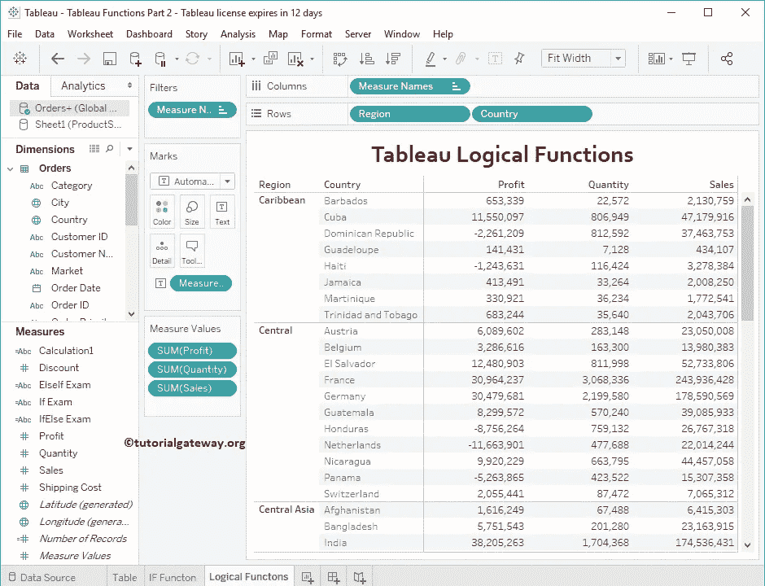

## 表逻辑函数

以下示例将向您展示[表](https://www.tutorialgateway.org/tableau/)中的逻辑函数列表

### 表和函数

Tableau AND 函数用于检查多个表达式。Tableau AND 函数的语法如下所示:

```
Expression_1 AND Expression_2
```

从上面的语法可以看出，Tableau AND 函数接受两个参数。如果两个条件都为真，则返回真。否则，它返回 False。

为了在 Tableau 中演示这些逻辑函数，我们必须使用计算字段。要[创建计算字段](https://www.tutorialgateway.org/calculated-field-tableau/)，请导航至分析选项卡并选择创建计算字段…选项

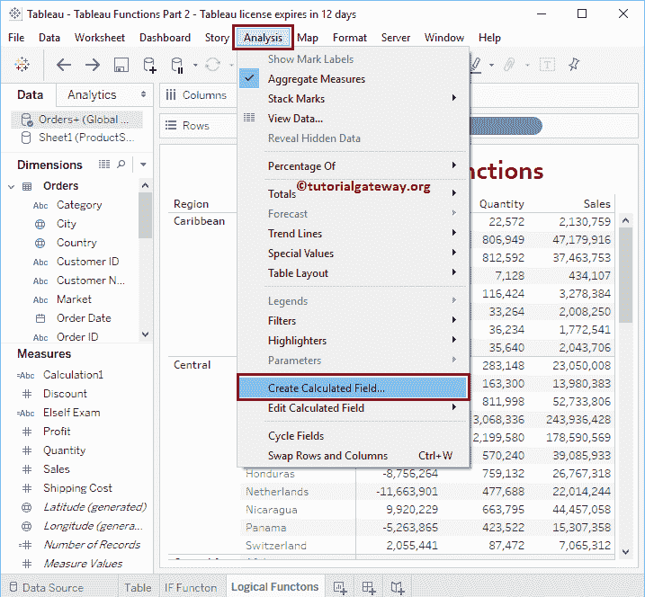

单击创建计算字段选项后，将打开以下窗口。这里，我们将默认计算名称重命名为“与函数”。

它将检查利润是否大于 0，数量是否大于 25000。[如果](https://www.tutorialgateway.org/tableau-if-function/)这两个条件都为真，Tableau 逻辑 AND 函数将返回 Good 否则，它将返回坏

```
IF(SUM([Profit]) > 0 AND SUM(Quantity) > 25000) THEN 'Good'
ELSE 'Bad'
END
```

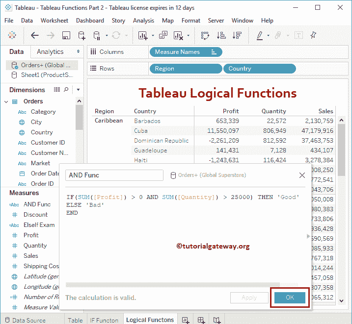

让我将这个“与”函数计算字段添加到表中(通过将一个字段拖到行架上)。请参考[创建Tableau 报告](https://www.tutorialgateway.org/tableau-table-report/)一文，了解

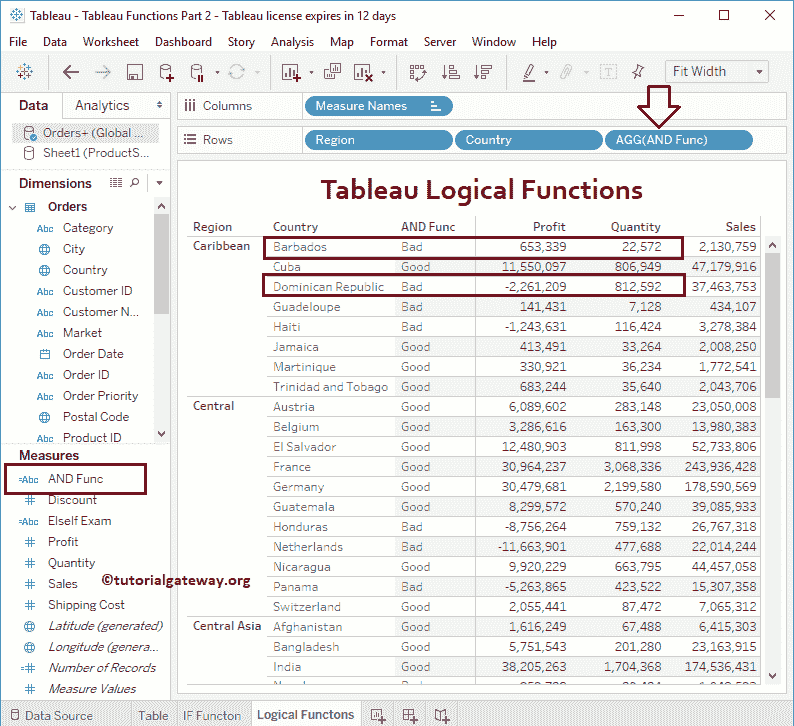

创建表的过程

### 表或函数

Tableau OR 函数在英语中类似于 OR 语句。如果两个条件都为假，Tableau 或将返回假；否则，它返回真。这个表或函数的语法是:

```
Expression_1 OR Expression_2
```

如果这两个语句中有一个为真，下面的语句将返回“好”

```
IF(SUM([Profit]) > 0 OR SUM(Quantity) > 300000) THEN 'Good'
ELSE 'Bad'
END
```

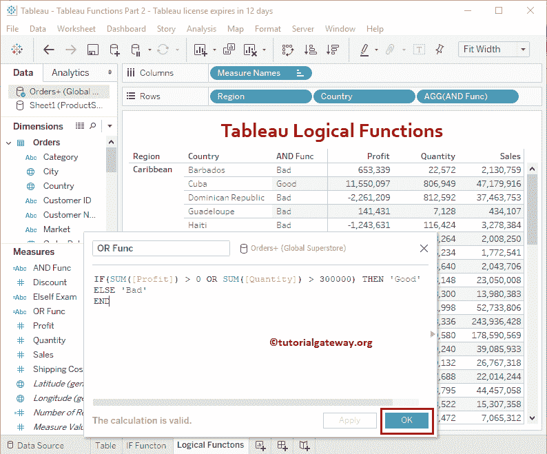

让我将此字段添加到行货架

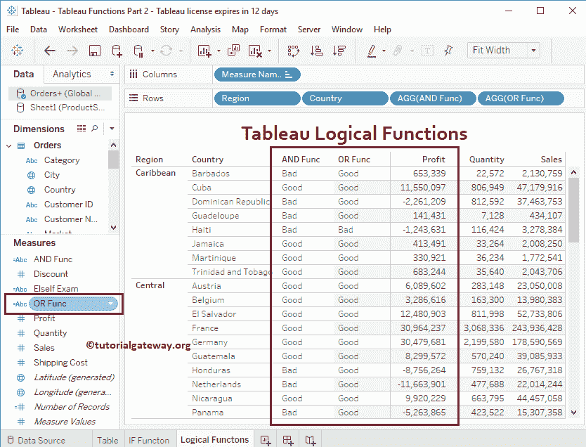

### 表 IIF 函数

Tableau IIF 函数是 [If Else 函数](https://www.tutorialgateway.org/tableau-if-function/)的简单版本。如果两个条件都为真，那么它将返回第一个语句，否则返回第二个语句。这个表 IIF 函数的语法是:

```
IIF(Expression, True_statement, False_Statement)
```

如果条件为真，下面的表 IIF 函数返回利润。否则，损失会回来。

```
IIF(SUM([Profit]) > 0, 'Profit', 'Loss')
```

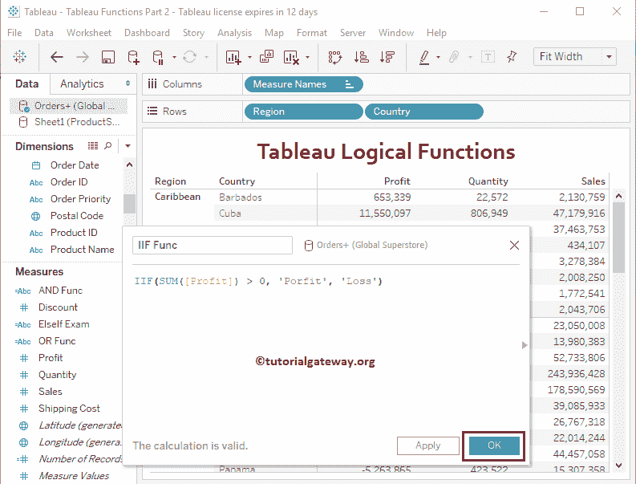

现在可以看到表 IIF 函数

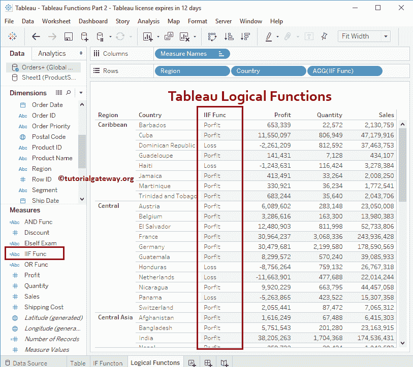

的结果

### 表非函数

Tableau NOT 函数返回的结果正好相反。我的意思是，真会变成假，反之亦然。这个 Tableau NOT 函数的语法是:

```
NOT(Expression)
```

如果条件为真，下面的“不表”语句将返回“损失”。否则，利润就会回来。

```
IF(NOT SUM([Profit]) > 0) THEN 'Profit' 
   ELSE 'Loss'
END
```

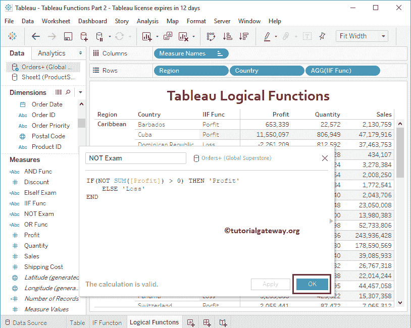

你可以自己查看

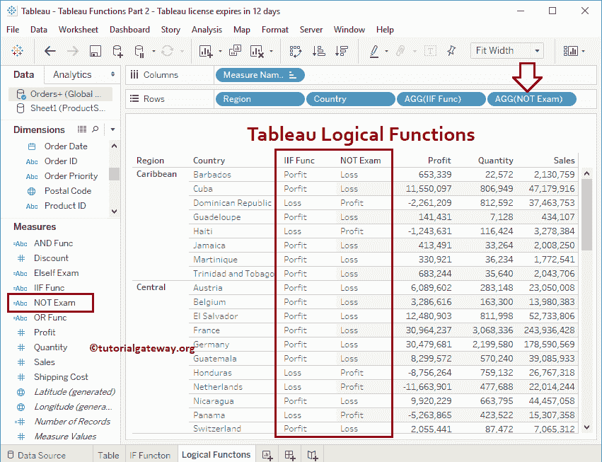

的非函数结果

### Tableau ISNULL 函数

为了演示这个 Tableau ISNULL 函数，我们将使用下面显示的表。

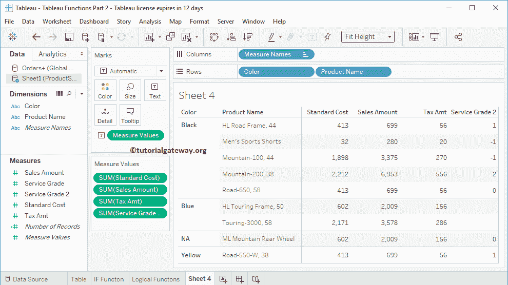

Tableau ISNULL 函数将检查它是否为空。如果为空，则返回真；否则，将返回 False。

Tableau ISNULL 函数的语法是:

```
ISNULL(Expression)
```

下面的表是一个完整的语句，将检查服务等级 2 列中的空值。

```
ISNULL([Service Grader 2])
```

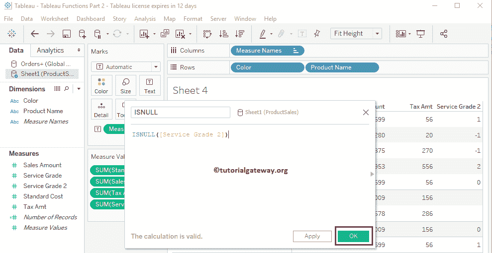

如您所见，对于蓝色下的产品，此 Tableau ISNULL 函数返回 True。

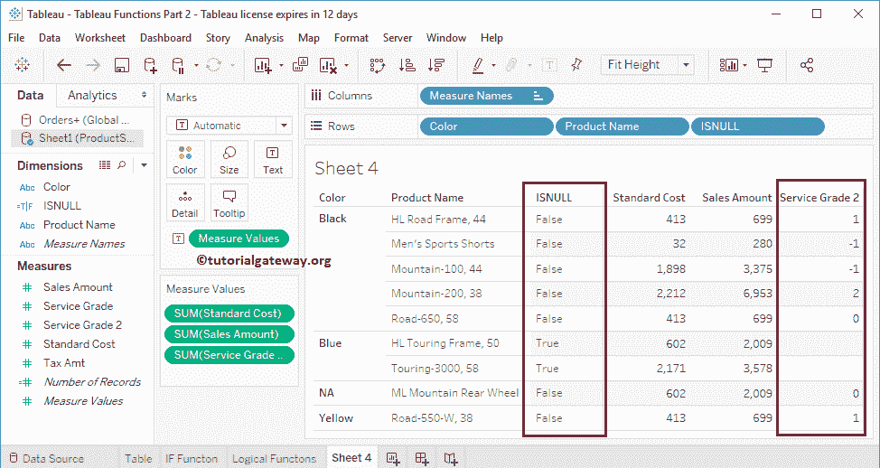

### Tableau ZN 函数

Tableau ZN 函数将返回非空值的原始值，空值为 0。简单的英语来说，Tableau 中的 ZN 用来将空值替换为 0。

Tableau ZN 函数的语法是:

```
ZN(Expression)
```

下面的 Tableau 逻辑函数语句将用 0 替换空值。

```
ZN([Service Grader 2])
```

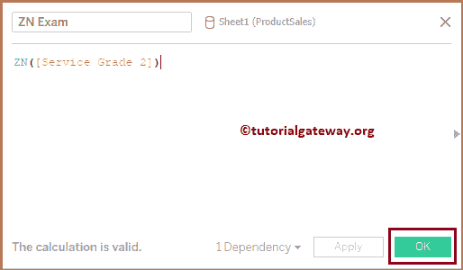

从下面的截图中，你可以看到一个 Tableau ZN 函数的结果。

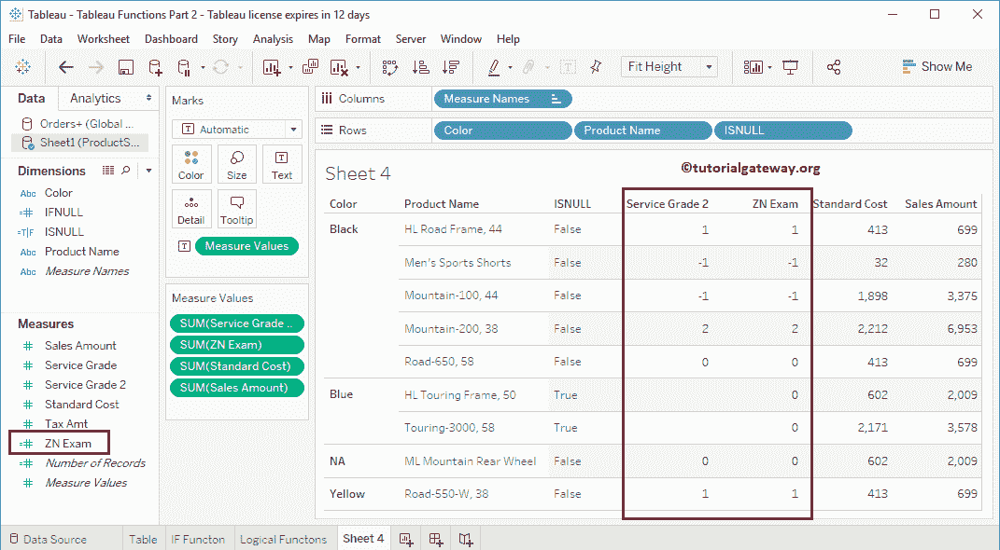

### Tableau IFNULL 函数

Tableau IFNULL 函数用于用您自己的值替换空值。Tableau IFNULL 函数的语法是:

```
IFNULL(Expression, Value)
```

如果存在空值，下面的 Tableau ifnull 语句将用 10 替换空值。

```
IFNULL([Service Grader 2], 10)
```

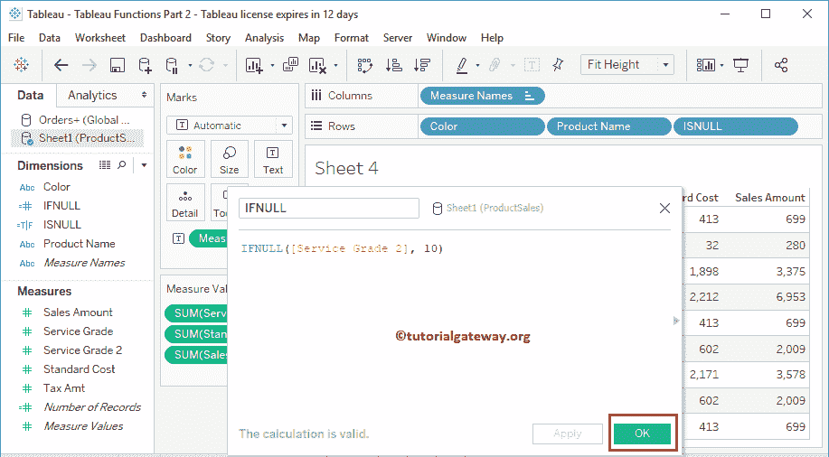

让我们看看表 IFNULL

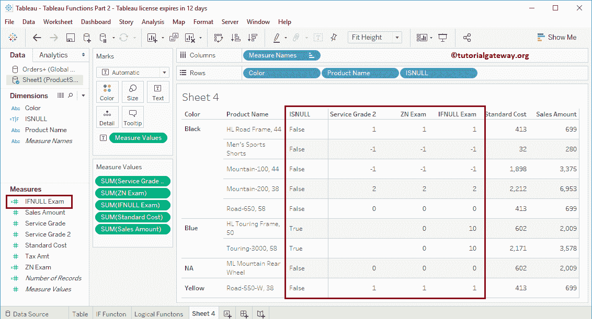

的结果