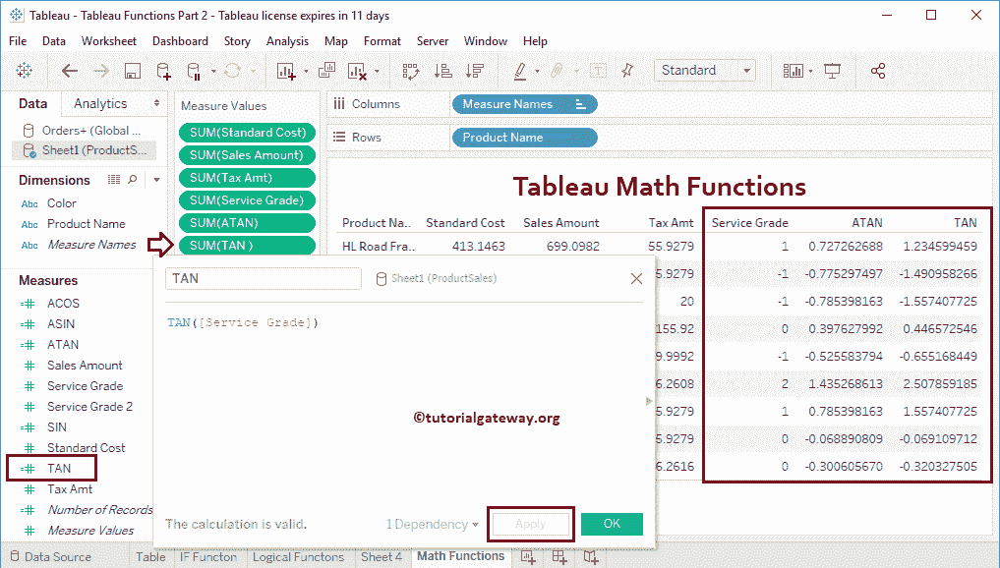
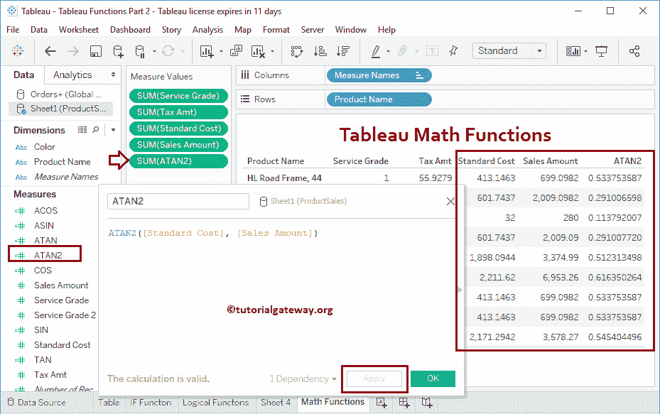
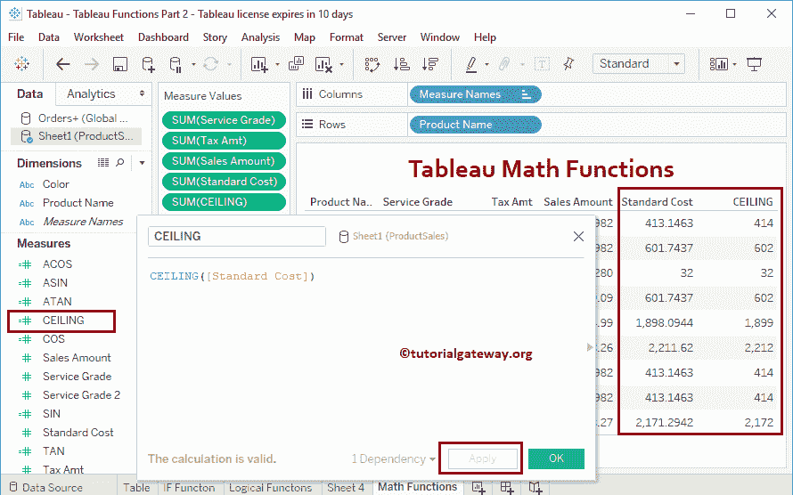

# Tableau 数学函数

> 原文：<https://www.tutorialgateway.org/tableau-math-functions/>

Tableau 提供了各种数学和三角函数来对我们的数据进行数学运算。它们是 Tableau FLOOR、天花板、ABS、DIV、POWER、SQRT、SQUARE、MIN、MAX、SIN、COS、TAN、ACOS、ASIN、ATAN、ATAN2、LN、LOG 等。在本文中，我们通过示例展示了如何使用 Tableau 数学函数。

为了演示这些 Tableau 数学函数，我们将使用下面显示的数据。如你所见，这张表中有九条记录。

请记住，这是一个 Excel 工作表。所以，请参考[连接 Excel 文件](https://www.tutorialgateway.org/connecting-to-excel-files-in-tableau/)一文了解连接设置。


## Tableau 数学函数

以下示例将向您展示[表](https://www.tutorialgateway.org/tableau/)中的数学函数列表

### 表 abs 系统函数

Tableau ABS 函数用于返回绝对正值。该表 abs 系统函数的语法为:

```
ABS(number)
```

为了演示这些 Tableau 数学函数，我们使用计算字段。要[创建计算字段](https://www.tutorialgateway.org/calculated-field-tableau/)，导航至分析选项卡，并选择创建计算字段…选项。


单击创建计算字段选项后，将打开以下窗口。在这里，我们将默认计算名称重命名为 ABS。

下面的陈述将找到服务等级的绝对值

```
ABS([Service Grade])
```


让我将这个 Tableau ABS 函数字段添加到一个现有的表中(通过将一个字段拖动到测量架)。请参考[创建 Tableau 报告](https://www.tutorialgateway.org/tableau-table-report/)一文，了解


创建表的过程

### 表 ACOS 函数

Tableau ACOS 函数计算给定数字的弧余弦。这个表 ACOS 函数的语法是:

```
ACOS(Number)
```

下表 ACOS 语句将找到服务等级的反余弦

```
ACOS([Service Grade])
```


### ASIN 函数表

Tableau ASIN 函数将计算给定数字的反正弦。这个 Tableau ASIN 函数的语法是:

```
ASIN(Number)
```

以下语句查找服务等级的反正弦

```
ASIN([Service Grade])
```


### 表 ATAN 函数

Tableau ATAN 函数用于计算给定数字的反正切。这个表 ATAN 函数的语法是:

```
ATAN(Number)
```

以下语句将找到服务等级的反正切

```
ATAN([Service Grade])
```


### 表正弦函数

Tableau 正弦函数用于计算正弦值。这个 Tableau SIN 函数的语法是:

```
SIN(Number)
```

它会找到服务等级的正弦值

```
SIN([Service Grade])
```


### Tableau TAN 函数

Tableau TAN 函数用于计算正切值。这个 Tableau TAN 函数的语法是:

```
TAN(Number)
```

以下语句将找到服务等级的正切值

```
TAN([Service Grade])
```

让我将此 TAN 字段添加到测量架



### Tableau COS 函数

Tableau COS 函数将计算余弦值。这个 Tableau COS 函数的语法是:

```
COS(Number)
```

它会找到服务等级的余弦值

```
COS([Service Grade])
```


### Tableau ATAN2 函数

Tableau ATAN2 函数是计算两个给定数的反正切。这个 Tableau ATAN2 函数的语法是:

```
ATAN2(y_number, x_number)
```

以下语句将找到销售金额和标准成本的反正切值

```
ATAN2([Standard Cost], [Sales Amount])
```



### Tableau COT 函数

Tableau COT 函数将计算余切值。这个 Tableau COT 函数的语法是:

```
COT(Number)
```

它会找到服务等级的余切值

```
COT([Service Grade])
```


### tableau DEVELOPES 函数

Tableau 度数函数将弧度转换为度数。这个表度数函数的语法是:

```
DEGREES(Number)
```

它会将服务等级中的辐射值转换为度数

```
DEGREES([Service Grade])
```

让我将此度字段添加到测量架


### Tableau RADIANS 函数

Tableau RADIANS 函数会将度数转换为弧度。这个 Tableau 弧度函数的语法是:

```
RADIANS(Number)
```

它会将销售额中的度数值转换为弧度

```
RADIANS([Service Grade])
```

让我将弧度字段添加到测量架


### 表扩展函数

Tableau EXP 函数返回用户指定数字的幂。这个 Tableau EXP 函数的语法是:

```
EXP(Number)
```

它找到了电力服务等级

```
EXP([Service Grade])
```

让我将此 Tableau EXP 字段添加到测量架


### Tableau SQUARE 函数

Tableau Square 函数查找给定数字的平方。这个 Tableau 平方函数的语法是:

```
SQUARE(Number)
```

它会找出税额的平方

```
SQUARE([Tax Amt])
```

让我将这个 SQUARE 字段添加到 Measures 货架


### Tableau `sqrt`函数

Tableau `sqrt`函数查找给定数字的平方根。这个 Tableau `sqrt`函数的语法是:

```
SQRT(Number)
```

它会找到销售额的平方根

```
SQRT([Sales Amount])
```

让我将此 SQRT 字段添加到测量架


### Tableau ROUND 函数

Tableau Round 函数返回最接近的整数值。它接受第二个参数(可选)来指定小数位数。这个 Tableau Round 函数的语法是:

```
ROUND(Number, no_of_decimals)
```

例如，

*   ROUND(248.6759) = 249
*   ROUND(248.6759，1 ) = 248.7
*   ROUND(248.6759，2 ) = 248.68

下面的语句将把标准成本值四舍五入到最接近的整数

```
ROUND([Standard Cost])
```

让我将此 ROUND 字段添加到 Measures 货架


### Tableau `ceil`函数

Tableau `ceil`函数返回最接近的整数值，该整数值大于或等于给定值。这个 Tableau `ceil`函数的语法是:

```
CEILING(Number)
```

下面的语句将查找最接近的大于或等于标准成本的整数值

```
CEILING([Standard Cost])
```

让我将此天花板字段添加到测量架



### Tableau FLOOR 函数

Tableau Floor 函数用于返回小于或等于给定值的最接近的整数值。这个 Tableau `floor`函数的语法是:

```
FLOOR(Number)
```

下面的 Tableau Floor 语句将找到小于或等于标准成本的最接近的整数值

```
FLOOR([Standard Cost])
```


### Tableau SIGN 函数

Tableau 符号函数很容易找到整数符号，这个函数返回

*   +1 =正值
*   -1 =负值
*   0 =表示零。

这个 Tableau 符号函数的语法是:

```
SIGN(Number)
```

表符号功能将找到服务等级记录的符号

```
SIGN([Service Grade])
```


### 表π函数

Tableau PI 函数返回数值 3.14，语法为:

```
PI()
```

它将 PI 值，即 3.14 除以服务等级值。让我将这个 Tableau PI 字段添加到度量货架

```
PI() / [Service Grade]
```


### 表幂函数

Tableau 幂函数用于求给定数字的幂。使用第二个参数指定功率。

例如，幂(2，3) = 2。这个表幂函数的语法是:

```
POWER(Number, power)
```

它会发现销售额增加到 2 的幂

```
POWER([Sales Amount], 2)
```

让我将此 Tableau Power 字段添加到测量架


### 表 LN 函数

Tableau LN 函数用于求给定数的自然对数值。这个表函数的语法是:

```
LN(Number)
```

它会找到销售额的自然对数值

```
LN([Sales Amount])
```


### 表日志函数

Tableau LOG 函数用于查找指定基数的给定数字的对数值。这里，第二个参数是可选的，它的默认值是 10。这个 Tableau 日志函数的语法是:

```
LOG(Number, base)
```

它将找到基数为 5 的销售额的对数值

```
LOG([Sales Amount], 5)
```

让我将此 Tableau 日志字段添加到测量架


### Tableau DIV 函数

Tableau DIV 函数将一个数字除以另一个数字。这个 Tableau DIV 函数的语法是:

```
DIV(integer, integer)
```

以下 Tableau DIV 语句将销售额除以 5

```
DIV(INT([Sales Amount]), 5)
```

