# Tableau 字符串函数

> 原文：<https://www.tutorialgateway.org/tableau-string-functions/>

Tableau 提供了各种字符串函数来格式化或改变字符串数据或子字符串。它们是 Tableau LEN、LTRIM、RTRIM、TRIM、CONTAINS、MID、REPLACE 等。在本文中，我们将通过示例向您展示如何使用 Tableau 字符串函数。

为了演示这些 Tableau 字符串函数，我们将使用下面显示的数据。如你所见，这张表中有 15 条记录。

请记住，这是一个 Excel 工作表。所以，请参考[连接 Excel 文件](https://www.tutorialgateway.org/connecting-to-excel-files-in-tableau/)一文了解连接设置。

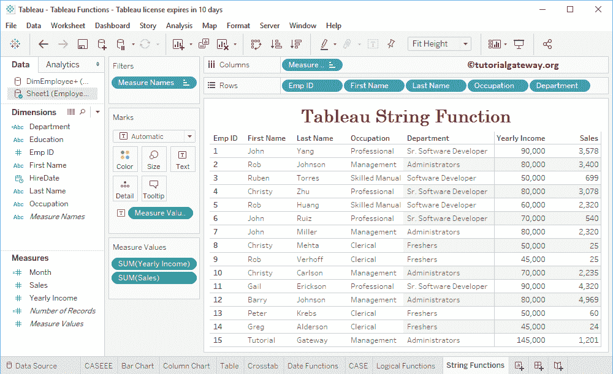

## Tableau 字符串函数

接下来的例子将向您展示[表](https://www.tutorialgateway.org/tableau/)中的字符串函数列表

### Tableau LEN 函数

Tableau LEN 函数返回字符串的长度。这个 Tableau LEN 函数的语法是:

```
LEN(string)
```

为了演示 Tableau 字符串函数，我们必须使用计算字段。要创建[计算字段](https://www.tutorialgateway.org/calculated-field-tableau/)，请导航至分析选项卡并选择创建计算字段…选项。

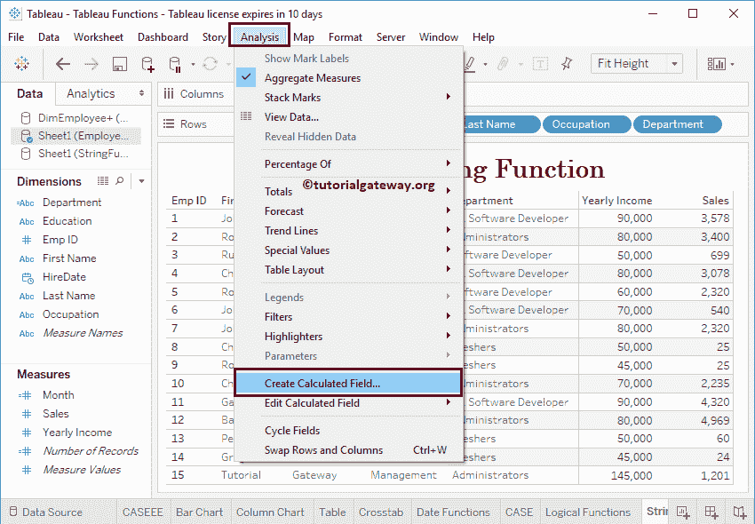

选择创建计算字段…选项将打开以下窗口。在这里，我们将默认计算名称重命名为 LEN。

下面的 Tableau LEN 语句将在“部门”列中找到每条记录的长度

```
LEN([Department])
```

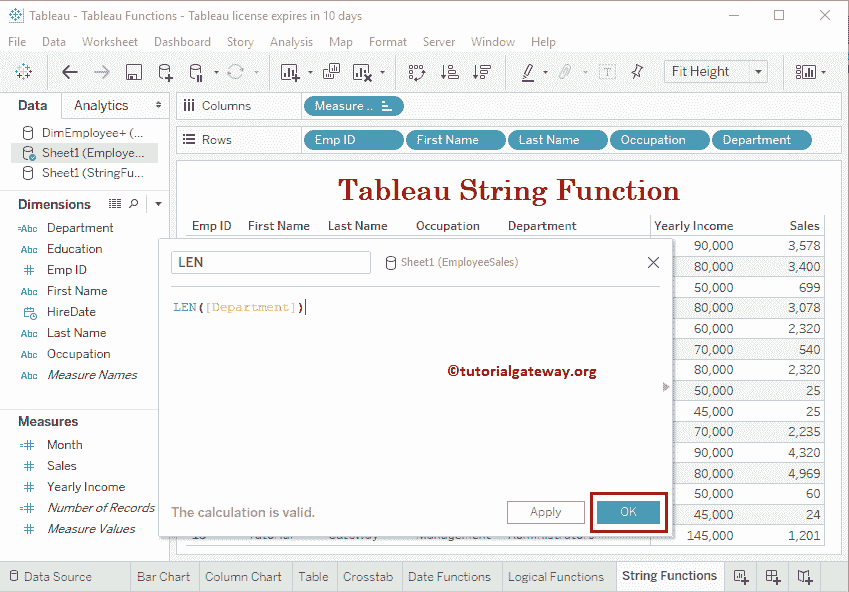

让我将此字段添加到现有表中。请参考[创建Tableau 报告](https://www.tutorialgateway.org/tableau-table-report/)一文，了解

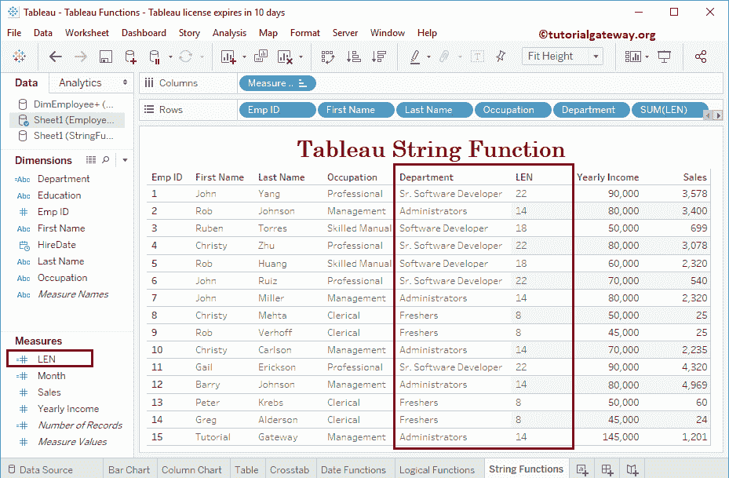

创建表的过程

### 表 ASCII 函数

Tableau ASCII 函数将找到一个字符的 ASCII 值。如果传递一个以上的字符，那么它将返回第一个字符的 [ASCII 值](https://www.tutorialgateway.org/ascii-table/)。这个 Tableau ASCII 函数的语法是:

```
ASCII(string)
```

下面的语句将查找姓氏列中记录的 ASCII 值

```
ASCII([LastName])
```

让我将此字段添加到行中。从下面的截图中，可以看到，它正在返回第一个字符的 ASCII 值。

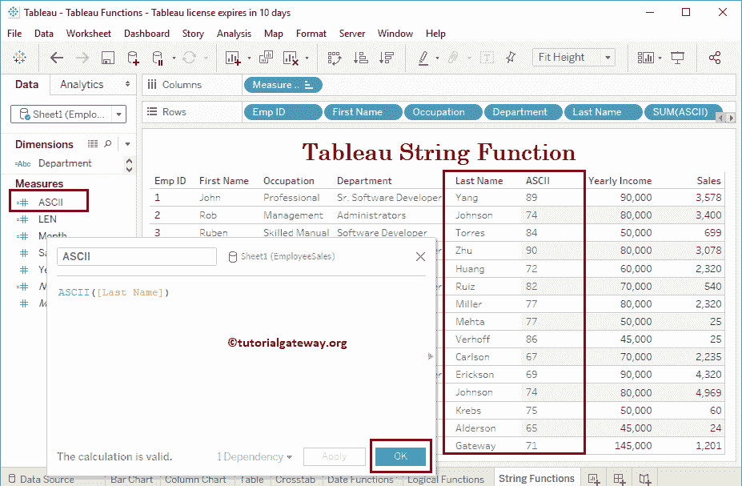

### Tableau CHAR 函数

Tableau CHAR 函数将转换或返回给定 ASCII 值的字符。这个 Tableau CHAR 函数的语法是:

```
CHAR(number)
```

例如，

```
CHAR(ASCII([LastName]))
```

让我将此字段添加到行货架。从下面的截图中，可以看到，它正在返回第一个字符的 ASCII 值。

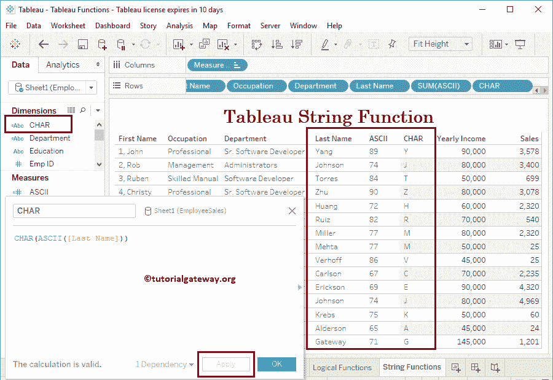

### Tableau CONTAINS 函数

如果原始字符串中存在指定的子字符串，则 Tableau CONTAINS 函数返回 True 否则，它返回 false。这个 Tableau CONTAINS 函数的语法是:

```
CONTAINS(string, substring)
```

下表包含检查“部门”列中的记录是否包含“软件”子字符串的语句。

```
CONTAINS([Department],'Software')
```

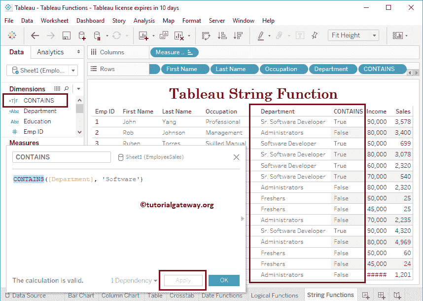

### 表结束开关功能

如果原始字符串以指定的子字符串结尾，Tableau ENDSWITH 函数返回 True 否则，它返回 false。此表的语法是:

```
ENDSWITH(string, substring)
```

以下语句将检查“部门”列中的记录是否以 rs 结尾。

```
ENDSWITH([Department],'rs')
```

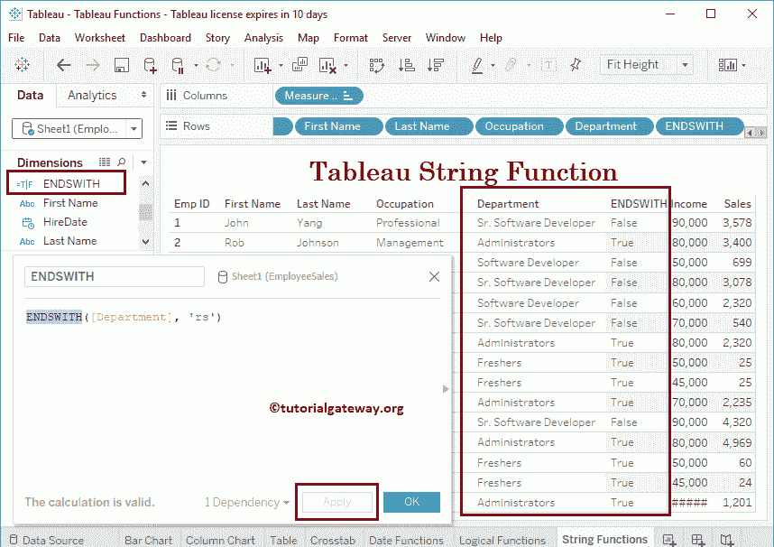

### 表启动开关功能

Tableau STARTSWITH 是字符串函数之一。如果原始字符串以指定的子字符串开头，则该函数返回真；否则，它返回 false。这个 Tableau STARTSWITH 函数的语法是:

```
STARTSWITH(string, substring)
```

下面的 start with 语句检查部门列记录是否以 S 开头。

```
STARTSWITH([Department],'S')
```

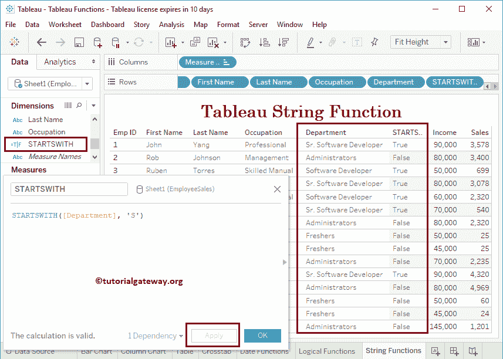

### Tableau 查找函数

Tableau FIND 函数返回子字符串在原始字符串中的索引位置。其语法是:

```
FIND(string, substring)
```

下面的 Tableau find 语句将在 Department 列中找到 re 的索引位置。

```
FIND([Department],'re')
```

让我将这个查找字段添加到 row 货架。

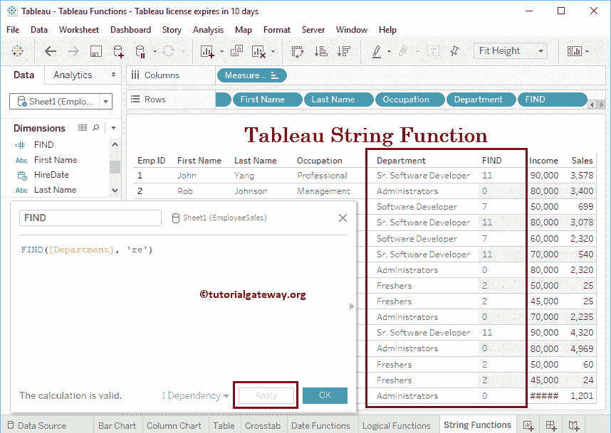

Tableau find 函数还允许您使用第三个参数来指定起始点。

```
FIND(string, substring, starting_Index_Position)
```

下面的语句将在“部门”列中找到索引位置 e，其中查找从索引位置 5 开始。

```
FIND([Department],'e', 5)
```

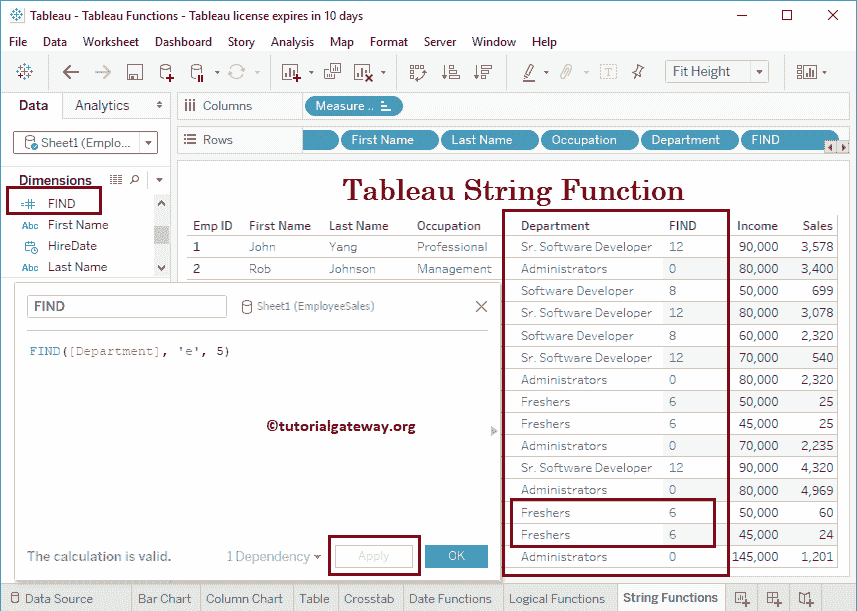

### tableau 查找函数

Tableau FINDNTH 函数返回子字符串在原始字符串中第 n 次出现的索引位置。这个 Tableau FINDNTH 函数的语法是:

```
FINDNTH(string, substring, Occurrence)
```

以下语句在“部门”列中查找第二个出现的 e 的索引位置。

```
FINDNTH([Department],'e', 5)
```

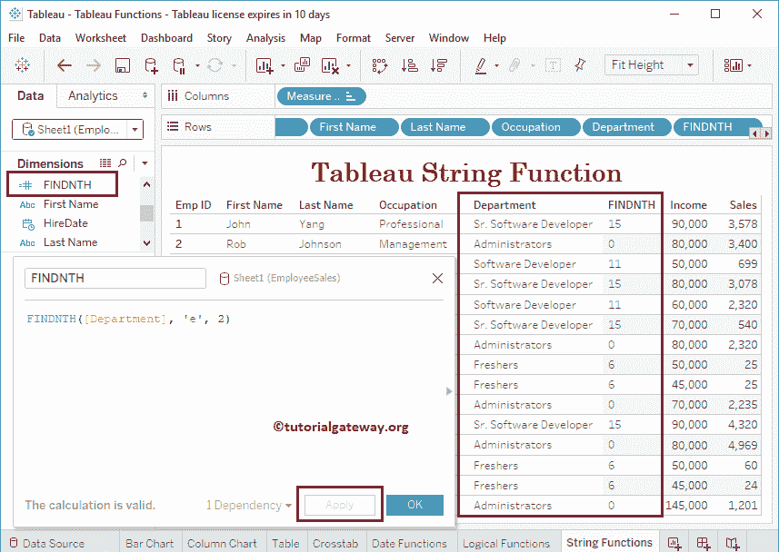

### 左表函数

Tableau LEFT 函数将最左边的字符返回到指定的索引位置。这个 Tableau 左函数的语法是:

```
LEFT(string, index_position)
```

Tableau 左下方的函数返回“部门”列的前五个字符。

```
LEFT([Department], 5)
```

让我将这个左字段添加到行中。

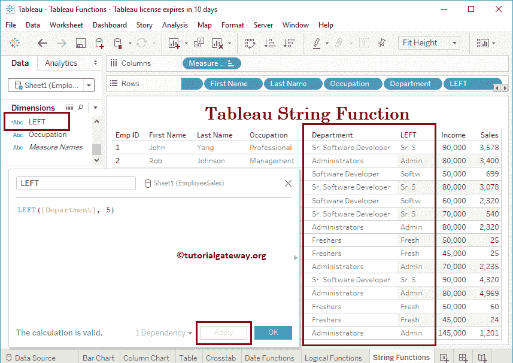

### 右表函数

Tableau RIGHT 函数返回最右边的字符，直到指定的索引位置。这个 Tableau 右函数的语法是:

```
RIGHT(string, index_position)
```

下面的 Tableau Right 函数返回部门列的最后九个字符。

```
RIGHT([Department], 9)
```

让我将这个右字段添加到行中。

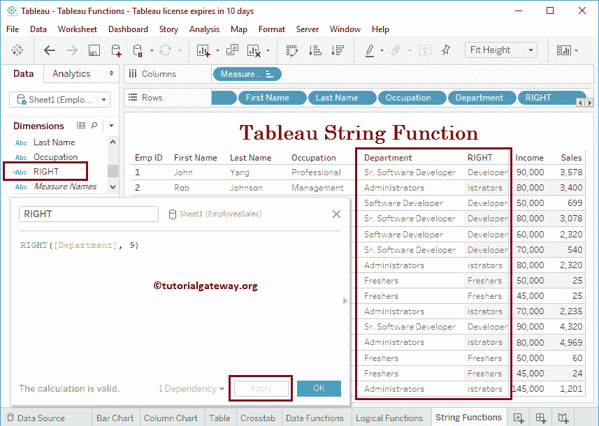

### Tableau 上限函数

Tableau UPPER 函数将字符串中的所有字符转换为大写。这个 Tableau UPPER 函数的语法是:

```
UPPER(string)
```

下面的 Tableau Upper 语句将把“职业”列中的记录转换为大写。

```
UPPER([Occupation])
```

让我将这个上部字段添加到“行”货架。

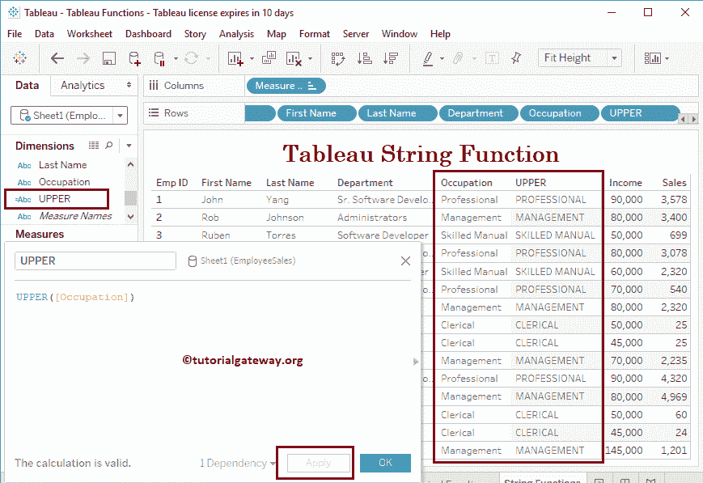

### 表低函数

Tableau LOWER 函数将给定的字符串转换为小写。这个 Tableau LOWER 函数的语法是:

```
LOWER(string)
```

下面的 Tableau 下部函数将部门列记录转换为小写。

```
LOWER([Department])
```

让我将此下部字段添加到行货架。

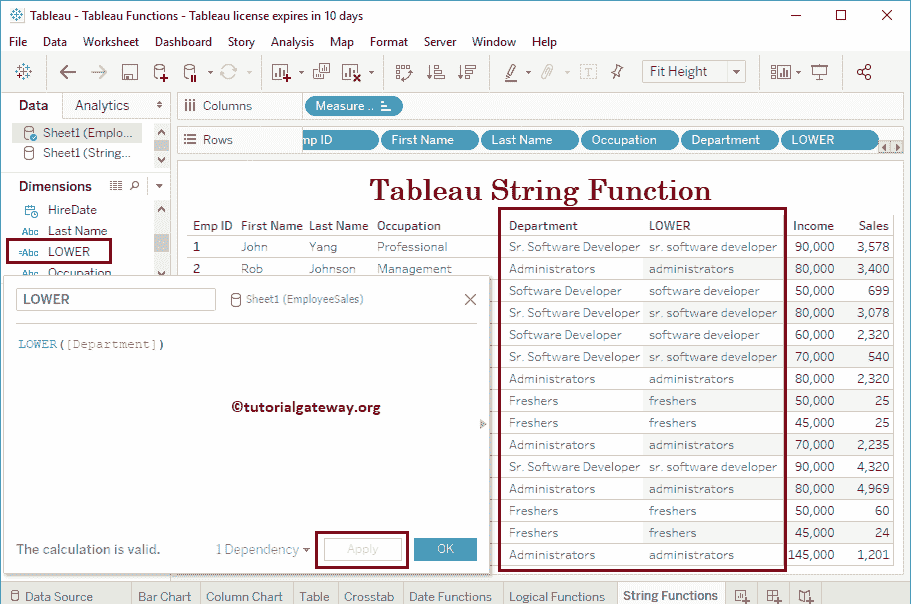

### 表中间函数

Tableau MID 函数，也称为 substring，从原始字符串中返回一个子字符串。这个 Tableau MID 函数或子串的语法是:

```
MID(string, start_position, length)
```

这个 Tableau Substring 函数接受三个参数:

*   原始字符串
*   起始索引位置–子字符串将从该位置开始
*   长度(可选)-这是子字符串的总长度。

下面的 Tableau Mid 语句将返回从“部门”列的索引位置 5 开始的子字符串。

```
MID([Department], 5)
```

让我们将这个 MID 字段添加到 row 货架上。

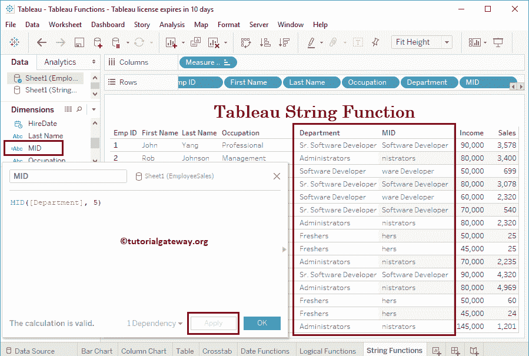

下面的 Tableau Mid 函数返回的子字符串从索引位置 5 开始，在子字符串长度达到 8 后结束。

```
MID([Department], 5, 8)
```

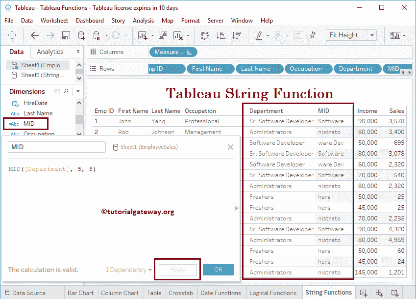

### Tableau REPLACE 函数

Tableau Replace 函数用新字符串替换原始字符串中的子字符串。这个 Tableau 替换函数的语法是:

```
REPLACE(string, old_substring, new_substring)
```

这个 Tableau 替换函数接受三个参数:

*   原始字符串
*   old _ Substring–要查找和替换的子字符串
*   新子字符串–这是将替换旧子字符串的新字符串

下面的 Tableau Replace 语句将用 Web 替换“部门”列中的软件术语。

```
REPLACE([Department], 'Software', 'Web')
```

让我将此替换字段添加到行架。

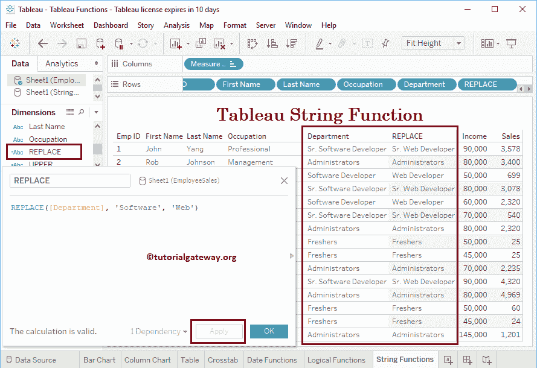

### Tableau 空间函数

Tableau 空间函数帮助您返回空白空间。这个表空间函数的语法是:

```
SPACE(integer)
```

下面的语句将在名和姓之间添加五个空格。顺便说一下，我们在这里连接两个字符串！

```
[First Name] + SPACE(5) + [Last Name]
```

让我们将此“空间”字段添加到“行”货架。

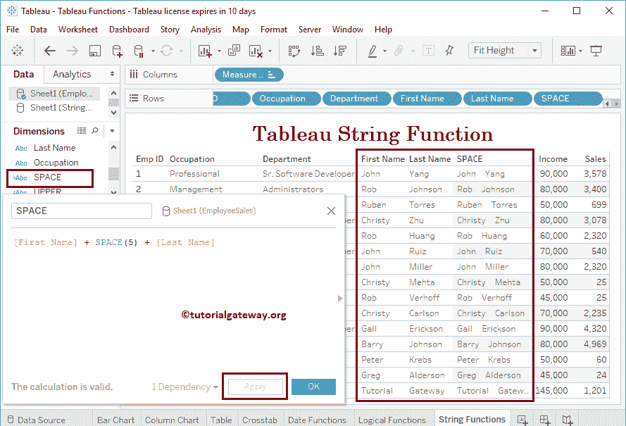

### Tableau 分割函数

Tableau 拆分函数是 Tableau 字符串函数之一。此函数使用标记号和序列替换原始字符串中的子字符串。这个 Tableau 分割函数的语法是:

```
SPLIT(string, Sequence, token_number)
```

Tableau 拆分字符串函数接受三个参数:

*   原始字符串
*   序列-函数使用这个序列来分割原始字符串。例如，逗号、空格等。
*   令牌号–序列的出现。例如，Sequence 是一个逗号，token_number 是三，这意味着子字符串将从第三个逗号之后的字符开始写入，并在第四个逗号之前结束

```
SPLIT([Department], ' ', 2)
```

让我将这个拆分字段添加到行货架。

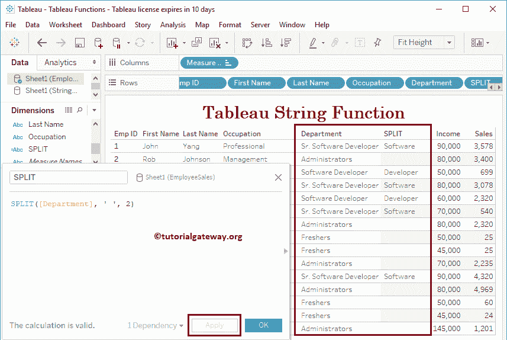

### Tableau LTRIM 函数

LTRIM 函数是 Tableau 字符串函数之一。它删除字符串左侧的空格。Tableau LTRIM 的语法是:

```
LTRIM(string)
```

它删除姓氏左侧的空格

```
LTRIM(Spaces)
```

让我将这个 LTRIM 字段添加到 row 货架。

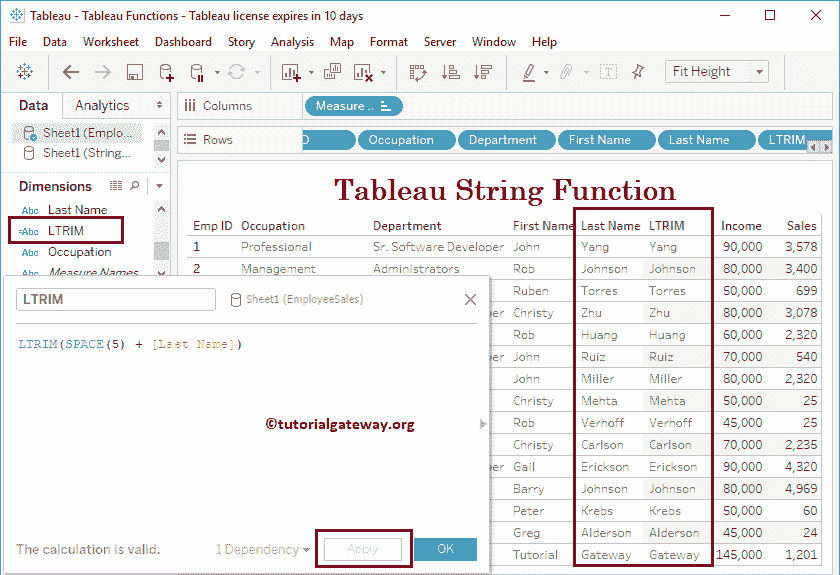

让我创建一个新列，在姓氏前增加 10 个空格，在姓氏后增加 15 个空格

```
SPACE(10) + [Last Name] + SPACE(15)
```

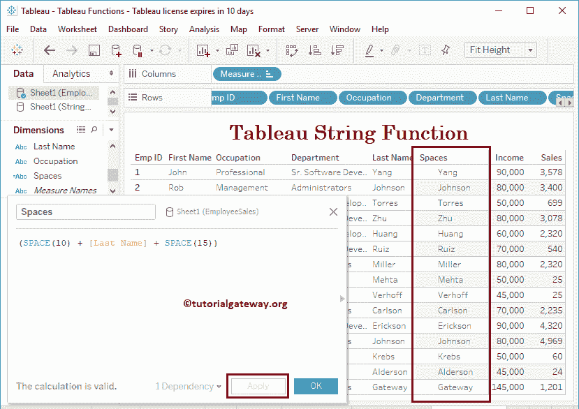

我们将使用这个计算字段来解释 RTRIM 和 TRIM。

### Tableau RTRIM 函数

Tableau RTRIM 函数从字符串的右侧移除空格。语法是:

```
RTRIM(string)
```

Tableau RTRIM 语句将删除空格列右侧的空格

```
RTRIM(Spaces)
```

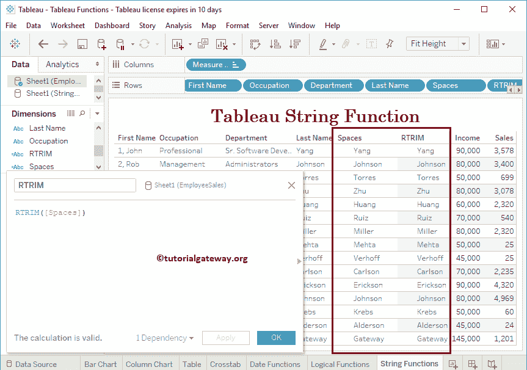

### 表微调功能

Tableau Trim 函数是字符串函数之一，它从字符串的左侧和右侧移除空格。这个表修剪函数的语法是:

```
TRIM(string)
```

下面的 Tableau Trim 语句从“空格”列中删除了空格

```
TRIM(Spaces)
```

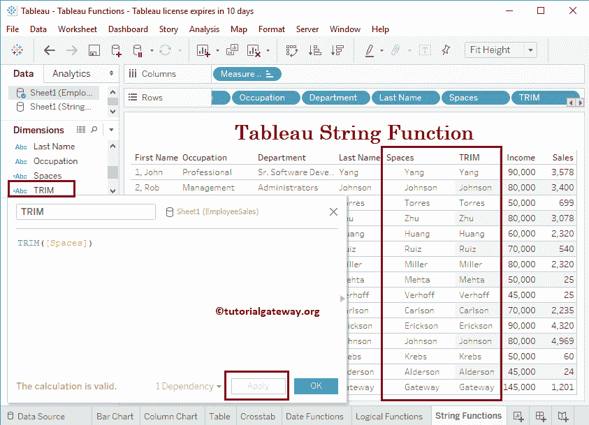