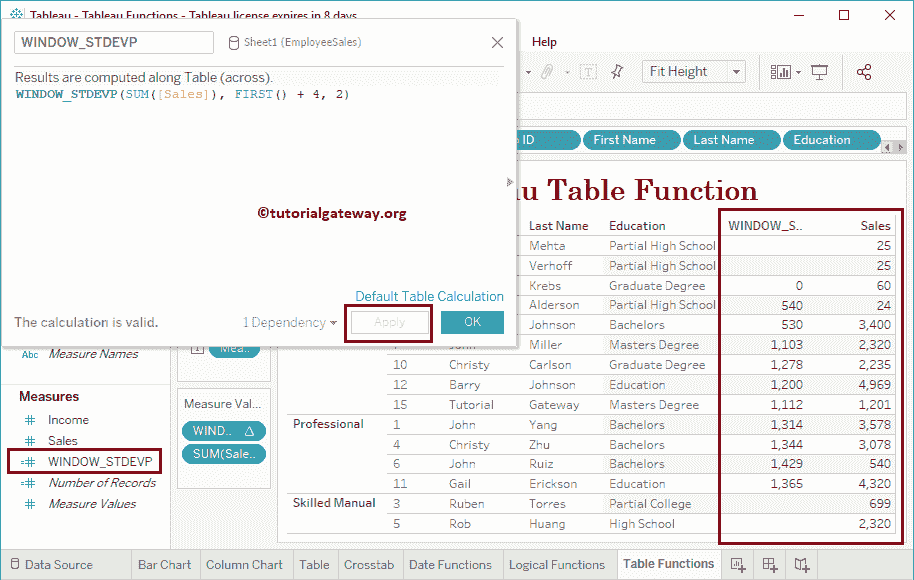

# 表格表格函数

> 原文：<https://www.tutorialgateway.org/tableau-table-functions/>

Tableau 提供了各种表格函数来对整个可视化数据进行计算。它们是第一个、最后一个、索引、运行总和、运行 AVG、窗口总和、窗口风险值等。在本文中，我们将向您展示如何使用 Tableau 表函数。

## 表格表格函数

以下示例将向您展示 Tableau 中的表函数列表。

为了演示这些 Tableau 表函数，我们使用这个表。请记住，这是一个 Excel 工作表。所以，请参考[表格](https://www.tutorialgateway.org/tableau/)中的[连接 Excel 文件](https://www.tutorialgateway.org/connecting-to-excel-files-in-tableau/)。


### 表格第一函数

Tableau FIRST 函数返回值从 0 到-n。这个 Tableau FIRST 函数的语法是:

```
FIRST()
```

为了演示这些表函数，我们必须使用表计算。要创建[表计算](https://www.tutorialgateway.org/tableau-table-calculations/)，请导航至分析选项卡并选择创建计算字段…选项。


单击创建计算字段选项后，将打开以下窗口。这里，我们将默认计算名称重命名为 FIRST。

点击【确定】关闭此窗口


或者，您可以单击默认表计算超链接来更改默认设置。单击该链接将打开以下窗口。


让我将这个 FIRST 函数字段添加到一个现有的表中(通过将该字段拖动到测量架)。请参考[创建表报告](https://www.tutorialgateway.org/tableau-table-report/)一文，了解


创建表的过程

您可以通过单击向下箭头来编辑此表格计算。接下来，从上下文菜单中选择“编辑表格计算”选项。


它将打开一个名为“表格计算”的新窗口。


使用此窗口更改计算过程。我们在上一篇文章中已经解释了这些属性。所以，请参考[表格计算](https://www.tutorialgateway.org/tableau-table-calculations/)文章来了解这些功能。


### 表最后一个函数

Tableau LAST 函数将返回从 n 到 0 的数字。我的意思是，最后一条记录为 0，第一条记录为 n。

```
LAST()
```

让我将最后一个字段添加到测量架


### Tableau 索引函数

Tableau INDEX 函数将返回从 I 到 n 的数字。我的意思是，第一条记录为 1，最后一条记录为 n。Tableau INDEX 函数的语法是:

```
INDEX()
```

让我将此索引字段添加到测量架


### 表运行 _AVG 函数

Tableau RUNNING_AVG 函数将计算该表的运行平均值。这个 Tableau RUNNING_AVG 函数的语法是:

```
RUNNING_AVG(Expression)
```

下面的语句计算整个表中销售列的运行平均值。

```
RUNNING_AVG(SUM([Sales]))
```

让我将这个 RUNNING_AVG 字段添加到度量货架上。

第三记录:(25+25+60)/3 = 36.667 = 37


### Tableau RUNNING_COUNT 函数

Tableau RUNNING _ COUNT 函数将返回表的运行计数。这个 Tableau RUNNING_COUNT 函数的语法是:

```
RUNNING_COUNT(Expression)
```

以下语句返回销售列的运行计数。

```
RUNNING_COUNT(SUM([Sales]))
```

让我将这个 RUNNING_COUNT 字段添加到度量货架。


### 表运行最大函数

Tableau RUNNING _ MAX 函数返回最大运行值。这个 Tableau RUNNING_MAX 函数的语法是:

```
RUNNING_MAX(Expression)
```

返回销售列中的最大运行值。

```
RUNNING_MAX(SUM([Sales]))
```

让我将这个 RUNNING_MAX 字段添加到度量货架。


### 表运行最小函数

Tableau RUNNING _ MIN 函数将返回运行最小值。Tableau RUNNING_Min 函数的语法为:

```
RUNNING_MIN(Expression)
```

返回“销售额”列中的最小累计金额。

```
RUNNING_MIN(SUM([Sales]))
```

让我们将 RUNNING_MIN 字段添加到测量架。


### 表运行求和函数

Tableau RUNNING _ SUM 函数将计算运行总数。这个 Tableau RUNNING_SUM 函数的语法是:

```
RUNNING_SUM(Expression)
```

返回销售列的累计值。

```
RUNNING_SUM(SUM([Sales]))
```

让我们将 RUNNING_SUM 字段添加到度量货架上。

第三条记录:(50 + 60) = 110


### 表格尺寸函数

Tableau SIZE 函数返回表或窗格中的记录总数。这个表格大小函数的语法是:

```
SIZE()
```

让我将此大小字段添加到度量货架。如您所见，我们将默认计算更改为基于职业


显示尺寸

### 总函数表

Tableau TOTAL 函数将在一个窗口中返回完整的总数。该表总函数的语法为:

```
TOTAL(Expression)
```

返回此表中的总销售额。即 25 + 25 + 60 + 24 +…..+ 2320

```
TOTAL(SUM([Sales]))
```

让我将此总计字段添加到度量货架。


这次我们使用的是占领计算。这意味着总函数将基于职业进行求和。

第一套:25 + 25 + 60 + 24 = 133


### 表格窗口 _AVG 函数

Tableau WINDOW_AVG 函数将计算表格中数据的平均值。这个 Tableau WINDOW_AVG 函数的语法是:

```
WINDOW_AVG(Expression, start_point, end_point)
```

它计算总销售额的平均值。

```
WINDOW_AVG(SUM([Sales]), FIRST(), LAST())
```

让我把这个窗口 AVG 字段添加到测量货架。

这里，15 条记录的总和是 28，794。

平均值= 28794/15 = 1919.6 = 1920


这次我们计算的是从第一条记录到最后 12 条记录的平均值(意味着 15-12 条记录)。即第一记录到第三记录

window _ Avg = 25+25+60 = 36.67 = 37


### 表格窗口中值函数

Tableau WINDOW_MEDIAN 函数将计算表格中从起点到终点的中间值。这个表格窗口中值函数的语法是:

```
WINDOW_MEDIAN(Expression, start_point, end_point)
```

计算总销售额的中位数。

```
WINDOW_MEDIAN(SUM([Sales]), FIRST(), LAST())
```

让我把这个窗口中值字段添加到度量货架上。


### 表格窗口最大函数

函数的作用是:返回表格中从起点到终点的最大值。这个 Tableau WINDOW_MAX 函数的语法是:

```
WINDOW_MAX(Expression, start_point, end_point)
```

查找从第一条记录到最后一条记录的最大值–8(表示 15–8 = 7)

```
WINDOW_MAX(SUM([Sales]), FIRST(), LAST() - 8)
```

让我将此窗口最大值字段添加到度量货架。


### 表格窗口最小函数

函数的作用是:返回表格中从起点到终点的最小值。Tableau 窗口最小函数的语法是:

```
WINDOW_MIN(Expression, start_point, end_point)
```

查找从第一条记录+ 4 到最后一条记录的最小值

```
WINDOW_MAX(SUM([Sales]), FIRST(), LAST() - 8)
```

让我将此窗口最小字段添加到度量货架。


### 表格窗口求和函数

Tableau WINDOW_SUM 函数计算表格中从起点到终点的总和。这个 Tableau WINDOW_SUM 函数的语法是:

```
WINDOW_SUM(Expression, start_point, end_point)
```

计算从 11 到 15 的总销售额。

```
WINDOW_SUM(SUM([Sales]), FIRST(), LAST())
```

让我将这个窗口总和字段添加到度量货架。

从 11 到 15 的总和= 3078 + 540 + 4320 + 699 + 2320 = 10957。


### 表格窗口变量函数

Tableau WINDOW_VAR 函数返回表中从起点到终点的样本总体方差。这个 Tableau WINDOW_VAR 函数的语法是:

```
WINDOW_VAR(Expression, start_point, end_point)
```

计算当前行与前一行之间的差异。

```
WINDOW_VAR(SUM([Sales]), FIRST(), 0)
```

让我将此窗口变量字段添加到度量货架。


### 表格窗口 _VARP 函数

Tableau WINDOW_VARP 函数返回表中从起点到终点的全部人口的方差。这个 Tableau WINDOW_VARP 函数的语法是:

```
WINDOW_VARP(Expression, start_point, end_point)
```

计算从第三行到前一行的差异。

```
WINDOW_VARP(SUM([Sales]), FIRST()+ 2, 1)
```

让我把这个窗口 VARP 字段添加到测量货架。


### Tableau WINDOW_STDEV 函数

Tableau WINDOW_STDEV 函数返回表中样本总体从起点到终点的标准差。这个 Tableau WINDOW_STDEV 函数的语法是:

```
WINDOW_STDEV(Expression, start_point, end_point)
```

计算从第二行到当前行的标准偏差。

```
WINDOW_STDEV(SUM([Sales]), FIRST()+ 1, 1)
```

让我将这个窗口 _ 标准偏差字段添加到测量架。


### Tableau WINDOW_STDEVP 函数

Tableau WINDOW_STDEVP 函数返回表中从起点到终点的完整总体的标准差。Tableau WINDOW_STDEVP 函数的语法是:

```
WINDOW_STDEVP(Expression, start_point, end_point)
```

计算整个总体的标准偏差。

```
WINDOW_STDEVP(SUM([Sales]), FIRST()+ 4, 2)
```

让我将这个窗口 _ 标准事件字段添加到度量货架。



### 表格窗口百分位函数

Tableau WINDOW _ PERCENTILE 函数返回表中从起点到终点的指定百分比。Tableau 窗口百分位函数的语法是:

```
WINDOW_PERCENTILE(Expression, percentile, start_point, end_point)
```

计算前两行到当前行的 25%百分比。

```
WINDOW_STDEVP(SUM([Sales]), FIRST()+ 4, 2)
```

让我将这个窗口百分位字段添加到度量货架。


### 表格窗口 _CORR 函数

Tableau WINDOW_CORR 函数返回表中从起点到终点的两个度量之间的相关性。Tableau WINDOW_CORR 函数的语法是:

```
WINDOW_CORR(Expression1, Expression2, start_point, end_point)
```

查找从前三行到当前行的总成本和销售额之间的相关性。

```
WINDOW_CORR(SUM([Total Cost]), SUM([SalesAmount]), -3, 2)
```

让我把这个窗口 CORR 字段添加到测量货架。


### Tableau WINDOW_COVAR 函数

Tableau WINDOW_COVAR 函数返回表中从起点到终点的样本总体的协方差。Tableau WINDOW_COVAR 函数的语法是:

```
WINDOW_COVAR(Expression1, Expression2, start_point, end_point)
```

它查找前三行到当前行的总成本和销售额之间的样本协方差。

```
WINDOW_COVAR(SUM([Total Cost]), SUM([SalesAmount]), -3, 0)
```

让我将这个 WINDOW_COVARP 字段添加到 Measures 货架上。


### Tableau WINDOW _ COVARP 函数

Tableau WINDOW_COVARP 函数返回表中从起点到终点的总体协方差。Tableau WINDOW_COVARP 函数的语法是:

```
WINDOW_COVARP(Expression1, Expression2, start_point, end_point)
```

它查找从前两行到当前行的总成本和销售额之间的总体协方差。

```
WINDOW_COVARP(SUM([Total Cost]), SUM([SalesAmount]), -2, 0)
```

让我将这个 WINDOW_COVARP 字段添加到 Measures 货架上。

