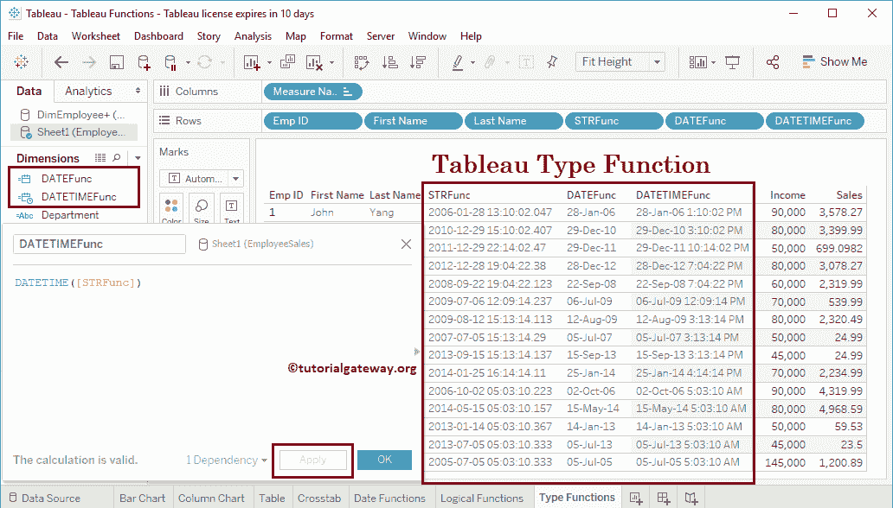

# Tableau转换函数

> 原文：<https://www.tutorialgateway.org/tableau-conversion-functions/>

Tableau 提供了各种类型转换函数来对我们的数据执行类型转换。它们是表日期、日期时间、日期解析、整数、浮点、SRT 等。在本文中，我们通过示例展示了如何使用 Tableau 转换函数。

为了演示这些Tableau转换函数，我们使用下面的 Excel 工作表。所以，请参考[连接 Excel 文件](https://www.tutorialgateway.org/connecting-to-excel-files-in-tableau/)一文。


## Tableau转换函数

以下示例将向您展示[表](https://www.tutorialgateway.org/tableau/)中的转换函数列表

### 表字符串函数

Tableau STR 函数将给定的表达式转换为字符串。这个 Tableau STR 函数的语法是:

```
STR(expression)
```

为了演示这些 Tableau 转换函数，我们必须使用计算字段。要[创建计算字段](https://www.tutorialgateway.org/calculated-field-tableau/)，请导航至分析选项卡，并选择创建计算字段…选项，如下所示。


单击创建计算字段选项后，将打开一个窗口。在这里，我们将默认计算名称重命名为 STRFunc。

下面的 Tableau 字符串语句将雇佣日期转换为字符串

```
STR([Hire Date])
```


让我将这个 STR 函数字段添加到一个现有的表中(通过将一个字段拖动到行架)。请参考[创建Tableau 报告](https://www.tutorialgateway.org/tableau-table-report/)一文，了解


创建表的过程

### Tableau 日期函数

Tableau Date 函数从给定的表达式、数字或字符串中返回日期。这个表日期函数的语法是:

```
DATE(expression)
```

让我在 StrFunc 上使用这个 Tableau 日期函数，它以字符串格式保存雇佣日期。

```
DATE([STRFunc])
```


从下面的截图中，您可以看到 Tableau Date 函数从字符串列中返回了日期。


### Tableau DATETIME 函数

Tableau DateTime 函数是 Tableau 转换函数之一，它从给定的表达式、字符串或数字中返回日期和时间。这个 Tableau Datetime 函数的语法是:

```
DATETIME(expression)
```

让我在 StrFunc 上使用这个 Tableau DateTime 函数，它以字符串格式保存 HireDate。

```
DATETIME([STRFunc])
```



### Tableau INT 函数

Tableau INT 函数从给定的表达式中返回一个整数。这个 Tableau INT 函数的语法是:

```
INT(expression)
```

让我在 Sales 列上使用这个函数，它保存 Float 值。

```
INT([Sales])
```


### Tableau 浮点函数

Tableau FLOAT 是 Tableau 转换函数之一，它将给定的表达式转换为 FLOAT。Tableau 浮点函数的语法是:

```
FLOAT(expression)
```

让我在收入列上使用这个 Tableau 浮点函数，它有 int 值。

```
FLOAT([Income])
```


### Tableau DATEPARSE 函数

Tableau Dateparse 函数解析并返回给定表达式、数字或字符串的日期和时间。这个 Tableau 日期解析函数的语法是:

```
DATEPARSE('format', expression)
```

让我在 StrFunc 上使用这个 Tableau DateParse 函数，它的字符串格式是“雇佣日期”。请记住，给定的格式应该与列内的数据相匹配

```
DATEPARSE('yyyy-MM-dd h:m:s.SSSS', [STRFunc])
```

