# 下载并安装 PowerBI 桌面

> 原文：<https://www.tutorialgateway.org/download-and-install-power-bi-desktop/>

在本节中，我们将通过截图向您展示如何下载和安装 Power BI 桌面。安装 Power BI 台式机包括以下步骤。因此，请按照我们下面提到的步骤操作。

## 下载和安装 PowerBI 桌面的步骤

以下是下载和安装 Power BI 桌面所涉及的步骤。

### 64 位 PowerBI 桌面下载

Power BI 桌面是一个基于自由窗口的应用程序。您可以使用此桌面以适当的格式对数据进行整形，并根据要求设计报告。

为此，首先点击此链接[进入官网下载链接](https://powerbi.microsoft.com/en-us/downloads/)。

提示:您需要 [Power BI](https://www.tutorialgateway.org/power-bi-tutorial/) Pro 访问才能发布报告，并共享它们。

下面的截图显示了下载页面。您可以选择下载按钮，也可以单击高级下载选项的超链接。

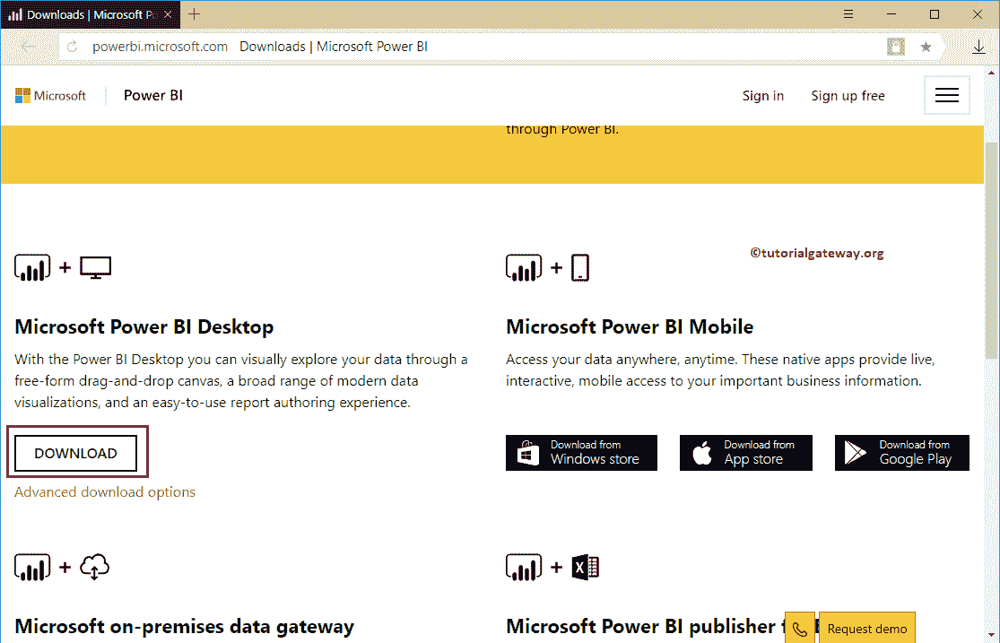

点击高级下载选项将带您进入[微软](https://www.microsoft.com/en-us/download/details.aspx?id=45331)网站。在这里，您可以阅读安装步骤、软件和硬件要求。

点击下载按钮，从微软位置

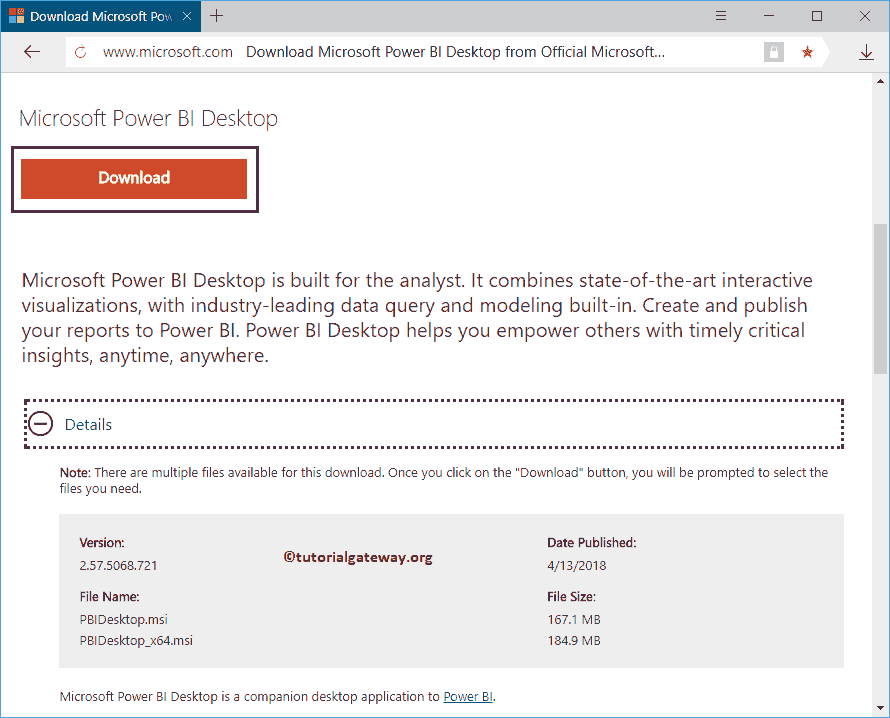

保存软件

### 安装 PowerBI 桌面

要安装 Power BI 桌面，请将您的文件系统导航到我们之前下载的软件。接下来，点击应用程序。

单击应用程序后，将打开如下所示的窗口。这是一个安全警告，如果您有任何安全措施，它可能会出现；否则，跳到下一步。

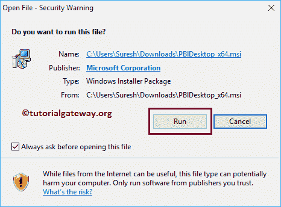

安装 Power BI 桌面的第一页是欢迎页面。请点击【下一步】按钮

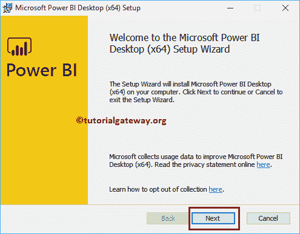

请勾选“我接受许可协议条款”选项，然后单击“下一步”按钮。

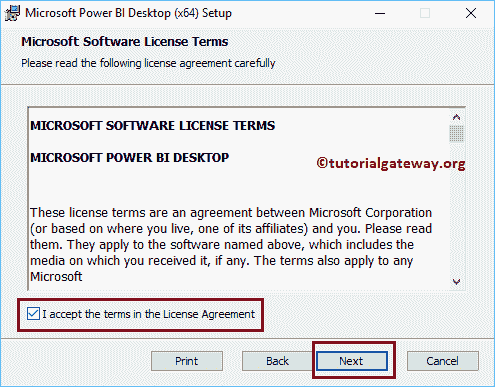

选择要安装此应用程序的位置。在这里，您可以保留默认的 C 位置，或者使用“更改”按钮来更改安装目录。

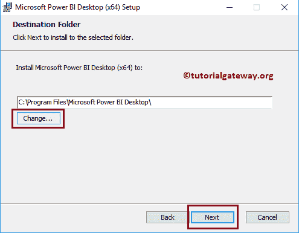

接下来，点击【安装】按钮

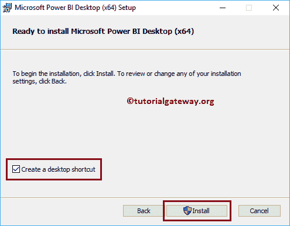

等到安装完成。

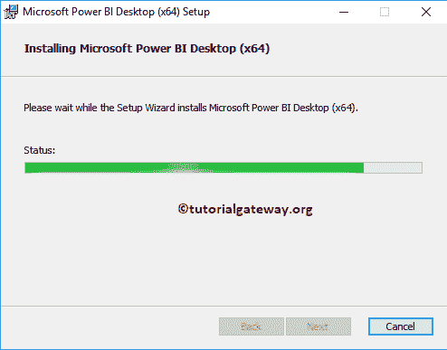

点击【完成】按钮，完成

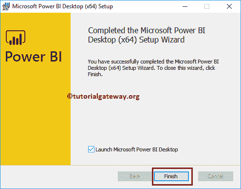

的安装过程

等到它初始化桌面功能。

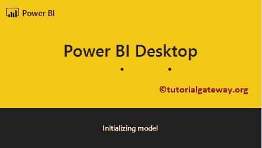

现在，您可以看到已安装的 Power BI 台式机。让我关闭起始页

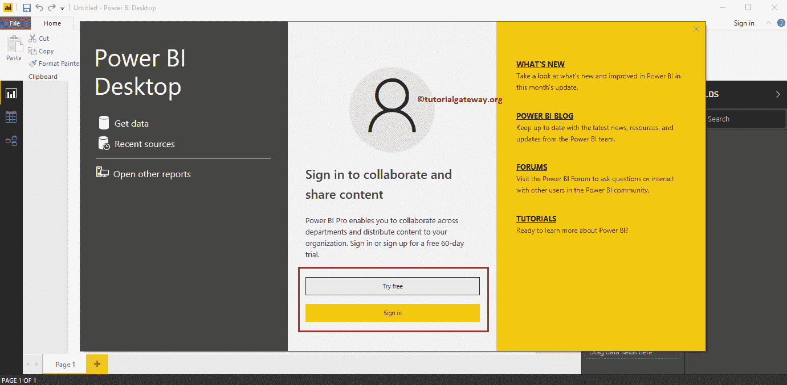

这是我们从不同来源加载数据、设计报告并发布它们的地方。

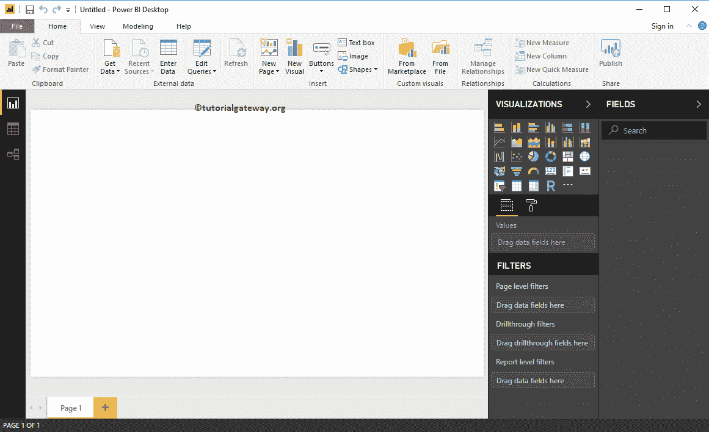