# 在 Power BI 中添加重命名和复制页面

> 原文：<https://www.tutorialgateway.org/add-rename-and-duplicate-pages-in-power-bi/>

在本文中，我们通过一个例子展示了如何在 Power BI 中添加新页面、重命名页面、隐藏页面、复制页面和删除页面。

为了在 Power BI 演示中添加重命名和复制页面，我们将使用之前创建的饼图。请参考 Power BI 文章中的[饼图，了解创建](https://www.tutorialgateway.org/pie-chart-in-power-bi/) [Power BI](https://www.tutorialgateway.org/power-bi-tutorial/) 饼图的步骤。

## 在 Power BI 中添加重命名和复制页面

以下是在 Power BI 中更改页面名称、添加新页面、复制现有页面和删除页面的方法。

### 在 Power BI 中重命名页面

右键单击底部的现有页面名称，打开上下文菜单。请选择重命名选项，如下所示。或者双击 Power BI 页面标题，即可将其重命名。

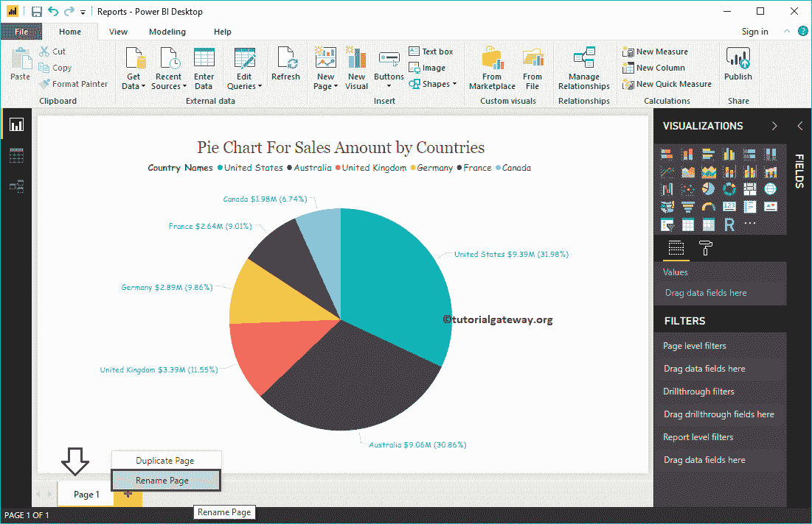

我们将页面重命名为饼图

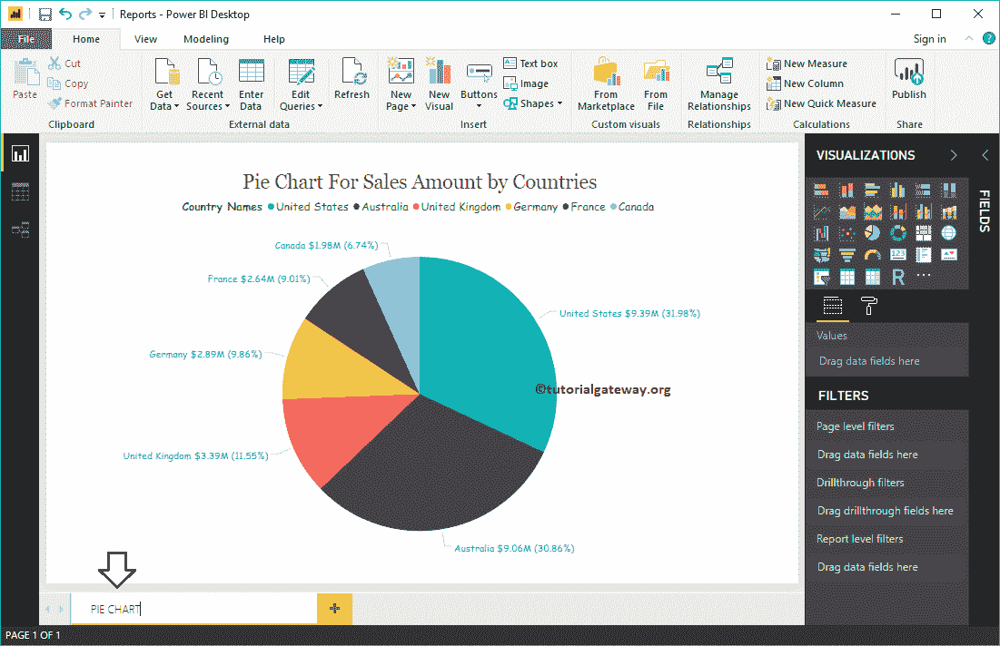

并且可以看到页面名称已经更改

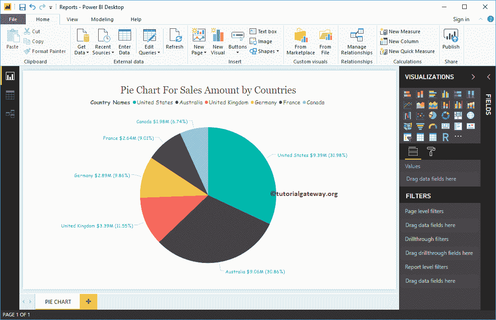

### 在 Power BI 中复制页面

右键单击要复制的现有页面，打开上下文菜单。请选择复制页面选项，如下所示。

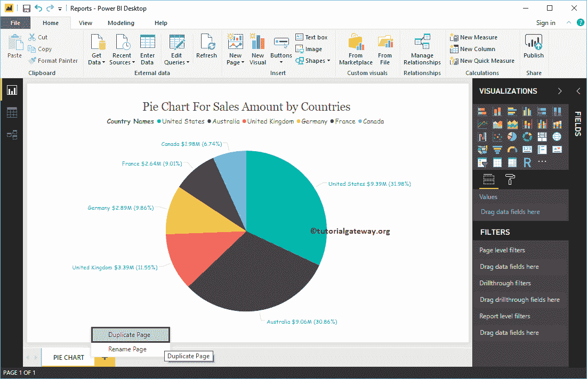

它为您复制了页面

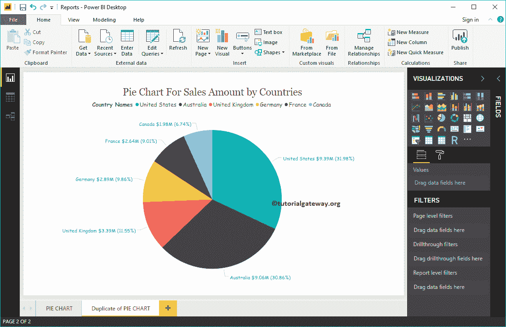

### 在 Power BI 中创建新页面

请点击加号+按钮，在 Power BI

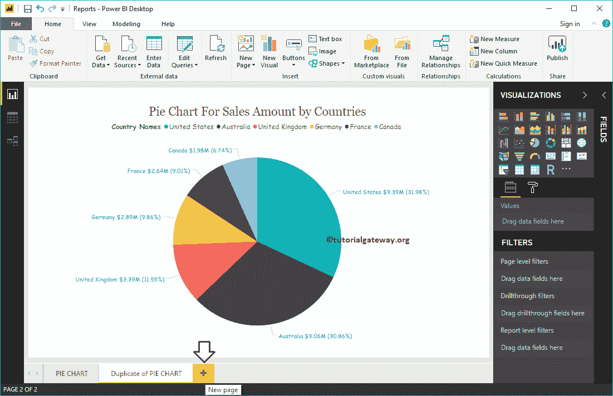

中创建新页面

你可以看到新的一页。

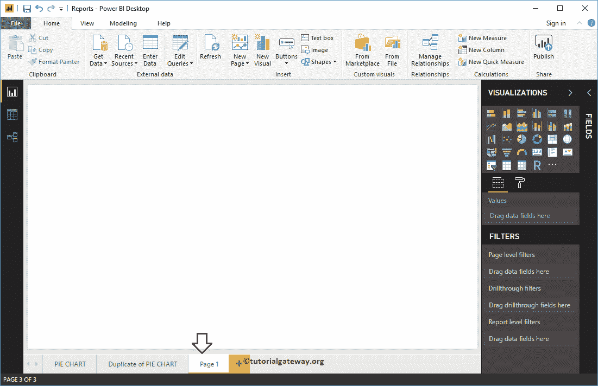

### 删除 PowerBI 中的页面

请点击现有页面

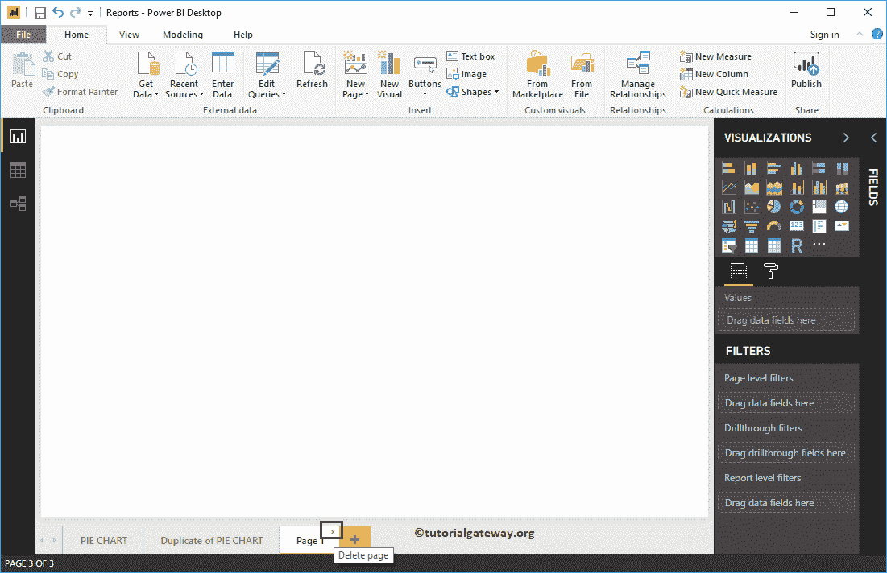

上方的 X 按钮

将显示一个弹出消息框。请点击删除按钮删除页面。

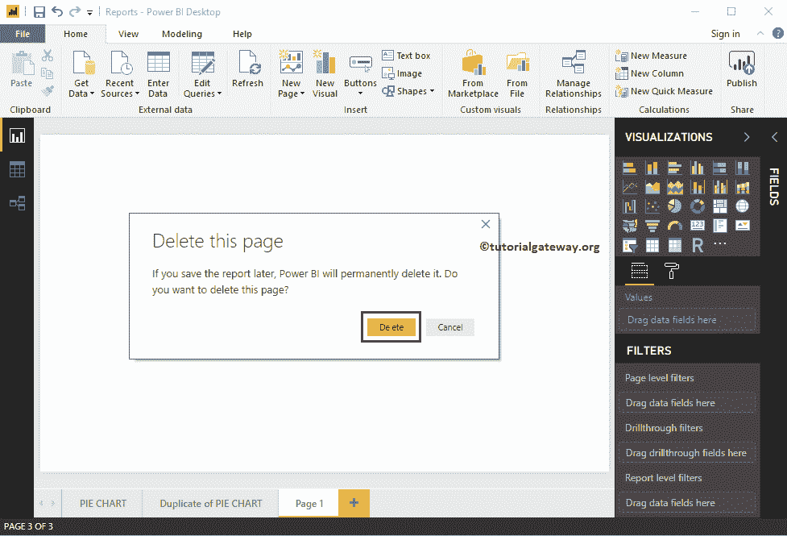

或者，右键单击要删除的现有页面，打开上下文菜单。请选择“删除页面”选项。

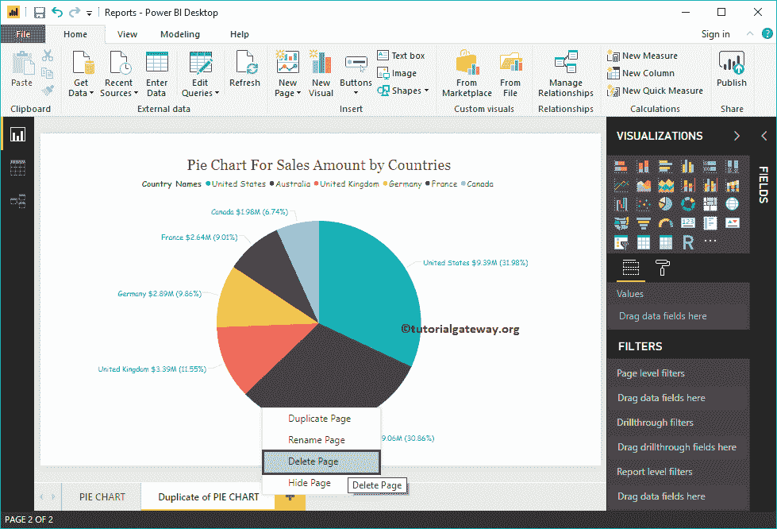

它会打开消息框。这一次，我将点击取消按钮。

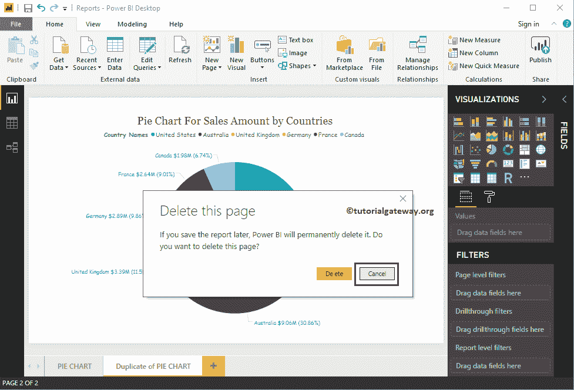

### 隐藏商务智能桌面中的页面

右键单击要隐藏的页面，并从上下文菜单中选择“隐藏页面”选项。

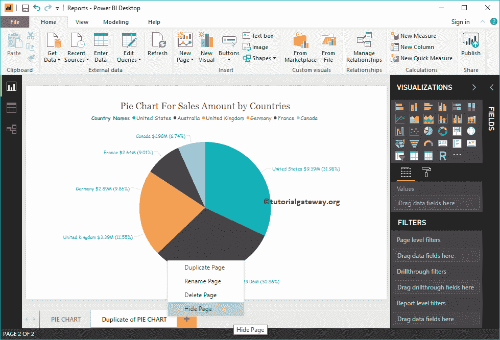

并且可以看到页面隐藏了

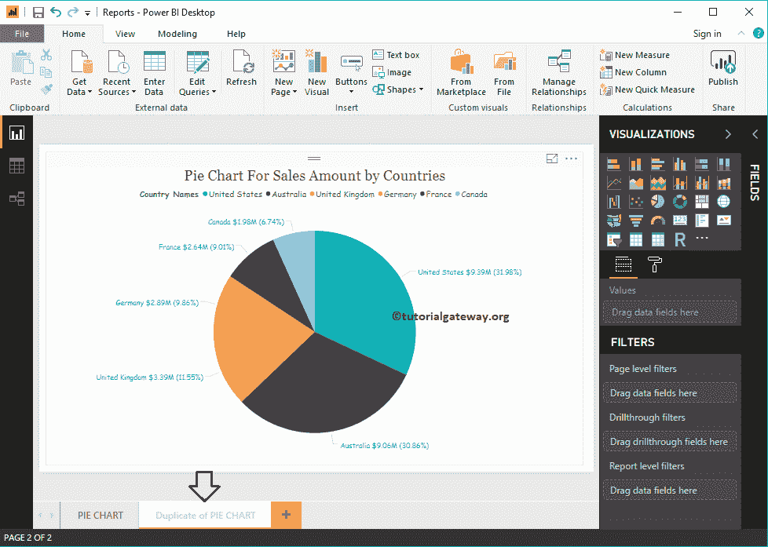

取消选中隐藏页面选项，删除隐藏选项

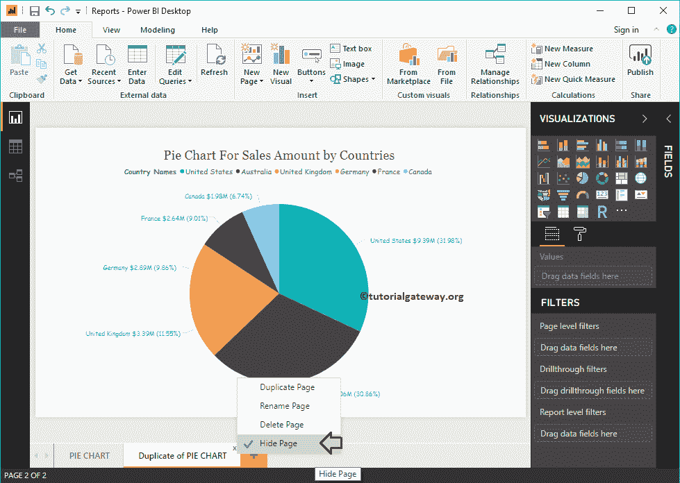