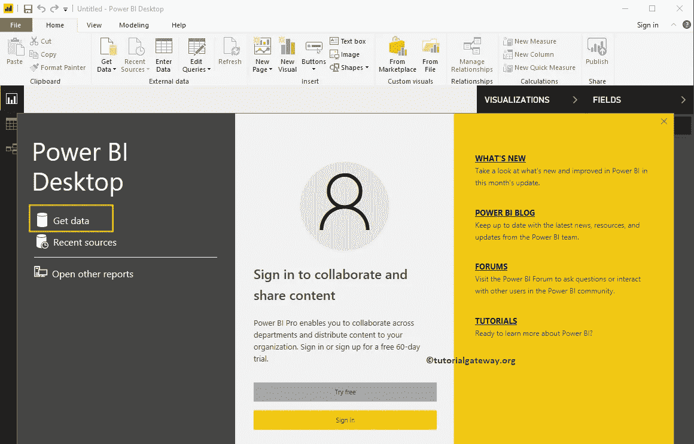
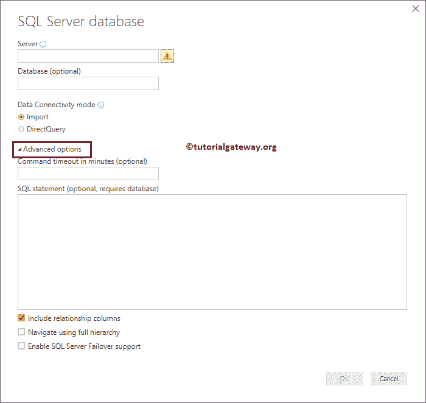

# 将 PowerBI 连接到 SQL 服务器

> 原文：<https://www.tutorialgateway.org/connect-power-bi-to-sql-server/>

让我们看看将 Power BI 连接到 SQL Server 数据库的分步方法。除了这种将 PowerBI 连接到 SQL Server 之外，还通过一个例子说明了如何对 SQL 表中的数据使用 SQL 查询。

## 将 PowerBI 连接到 SQL Server 的分步方法

如果您尚未启动PowerBI智能桌面，请双击PowerBI智能桌面打开。一旦打开，它看起来像下面的截图。请点击获取数据超链接



如果您在 [Power BI](https://www.tutorialgateway.org/power-bi-tutorial/) 可视化页面中，在主页选项卡下，单击获取数据选项并选择 [SQL Server](https://www.tutorialgateway.org/sql/) ，如下图所示。或者选择更多选项。


我们正在选择更多选项来显示以下窗口。使用此窗口选择所需的数据源。在这里，我们正在讨论如何将 Power BI 连接到 SQL Server。因此，让我选择 SQL Server 数据库选项。


### 将 PowerBI 连接到 SQL 服务器

以下是将 PowerBI 连接到 SQL Server 数据库时要填写的可用字段列表

*   服务器:请提供 SQL Server 实例名称。如果[用默认实例安装了 SQL](https://www.tutorialgateway.org/install-sql-server/) ，那么实例名就是计算机名或者 localhost。
*   数据库:这是可选的。如果您想使用自定义的 SQL 查询，那么它是必需的。
*   数据连接模式:请选择是导入还是直接查询。


单击高级选项会向您显示高级属性。



您可以编写自己的 SQL 查询来从指定的数据库中提取数据。为此，在 SQL 语句框


中编写您的查询

我们在上面的将 Power BI 连接到 SQL Server 屏幕截图中使用的自定义查询是:

```
-- Connecting Power BI to SQL Server
SELECT Geo.EnglishCountryRegionName AS Country, 
       Geo.StateProvinceName AS State, 
       SUM(Fact.SalesAmount) AS Sales, 
       SUM(Fact.TaxAmt) AS Tax, 
       COUNT(Fact.OrderQuantity) AS Orders
FROM FactResellerSales AS Fact
  INNER JOIN
     DimSalesTerritory ON 
        Fact.SalesTerritoryKey = DimSalesTerritory.SalesTerritoryKey 
  INNER JOIN
     DimGeography AS Geo ON 
        DimSalesTerritory.SalesTerritoryKey = Geo.SalesTerritoryKey
GROUP BY Geo.EnglishCountryRegionName, Geo.StateProvinceName
HAVING COUNT(Fact.OrderQuantity) > 60000

```

如果要使用这些数据，请单击“加载”。现在，让我单击取消按钮，因为我想选择多个表。


注意:不要担心上面的查询，只需了解程序。但是，如果你想学习，请参考我们的 [SQL Server](https://www.tutorialgateway.org/sql/) 教程

让我使用本地实例，点击【确定】


目前，我们正在使用当前的本地 windows 凭据。如果您没有访问 SQL Server 的权限，请通过选择“使用替代凭据”来使用其他人窗口凭据。


实时情况下，我们只使用 SQL Server 数据库凭据。为此，请选择数据库并输入管理员提供的用户名和密码。

目前，我使用的是当前 windows 凭据


在“显示”选项下，它列出了可用于该实例的数据库。在本例中，我们选择的是 AdventureWorksDW2017 数据库。

你可以从微软官方下载中心或 GitHub 免费下载这个数据库。


展开数据库文件夹将显示可用的表和视图。选择表将显示数据预览。


从下面的截图中，您可以看到我们正在选择所需的表。请记住，如果您对选择表感到困惑，请选择一个度量表(订单或销售)，然后单击选择相关表按钮。

*   加载:这将把选定表中的数据加载到 Power BI。因为我知道数据是干净的，让我点击加载按钮
*   编辑:单击此按钮更改列或清除数据


请等到加载完成


现在，您可以在字段部分看到我们从 SQL Server 数据库中选择的表。


展开任何表以查看该表中的列(字段)。


提示:这是我们将在大部分 [Power BI](https://www.tutorialgateway.org/power-bi-tutorial/) 教程中使用的数据集。