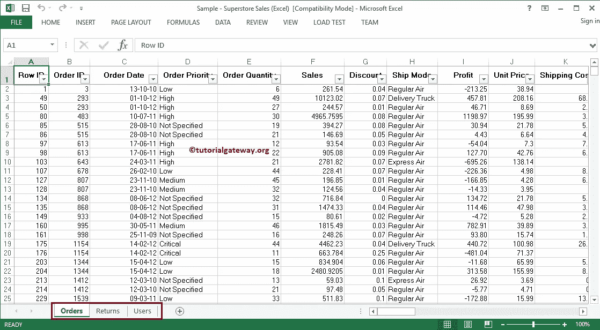
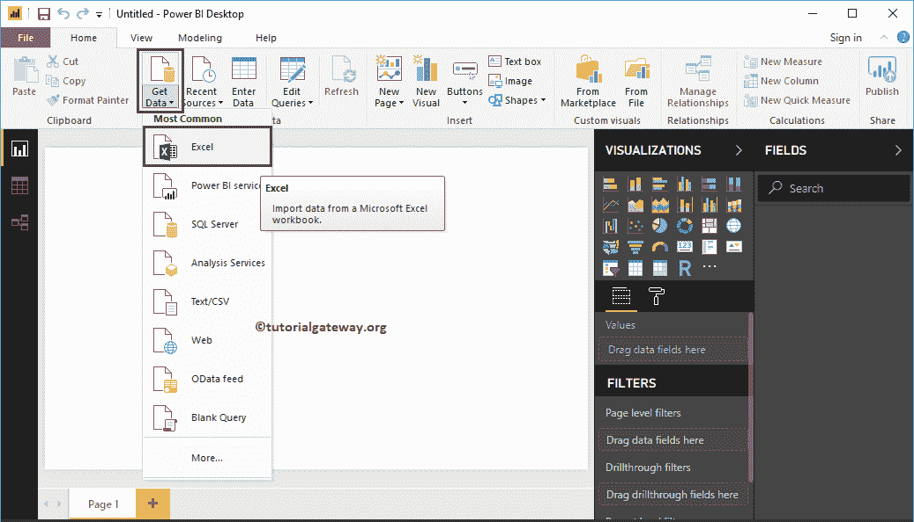
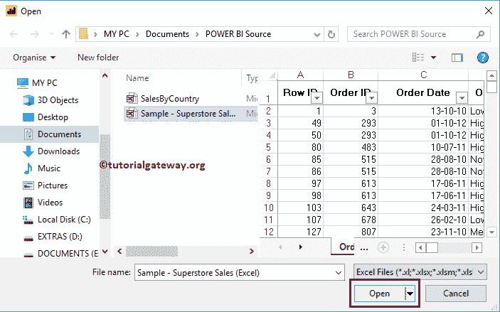
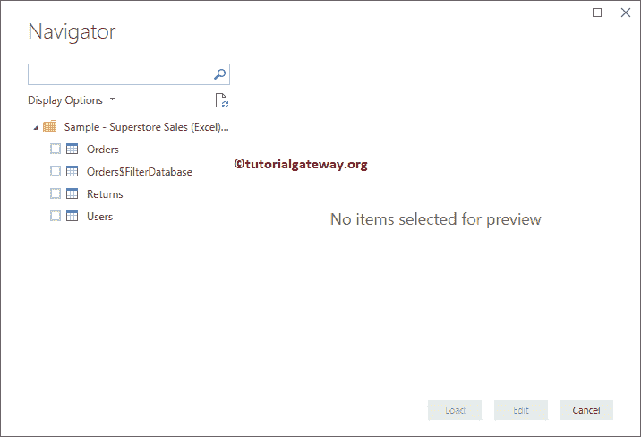
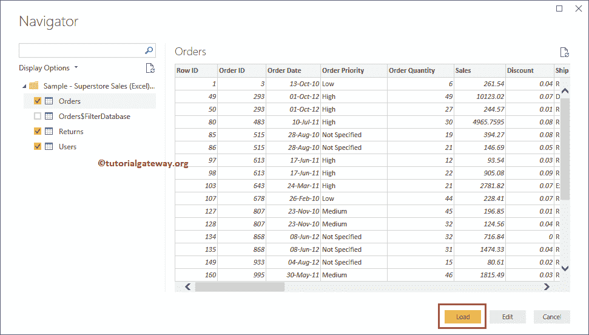
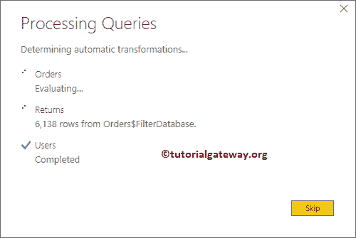
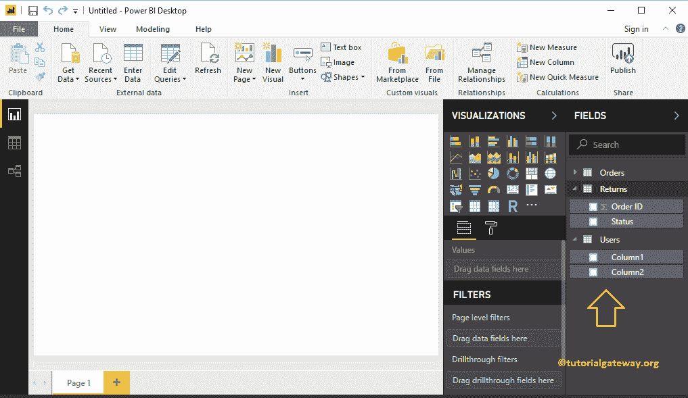
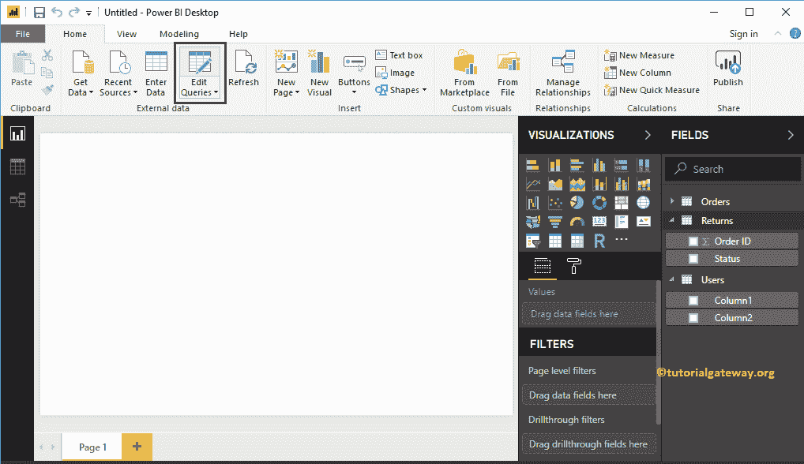
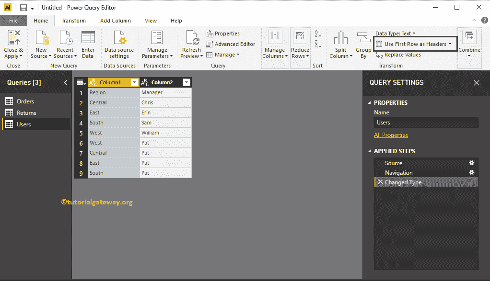
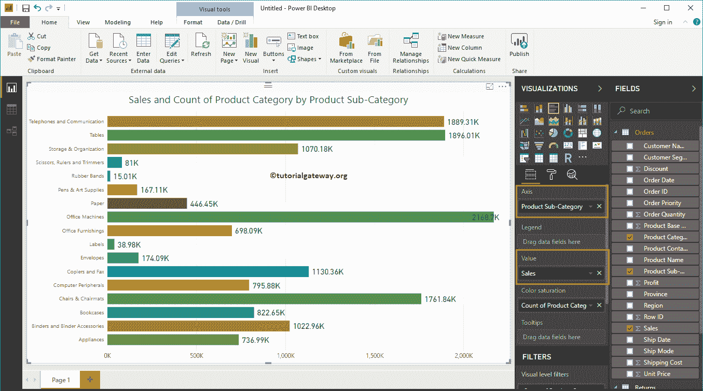

# 将 PowerBI 连接到多个电子表

> 原文：<https://www.tutorialgateway.org/connect-power-bi-to-multiple-excel-sheets/>

在本文中，我们将向您展示如何将 Power BI 连接到多个 Excel 工作表，以及如何使用这些 Excel 工作表中的数据。

为了演示将 Power BI 连接到多个 excel 工作表，我们将把 Excel 文件中多个表或工作表的数据加载到 Power BI，并生成一个条形图。

## 如何将 Power BI 连接到多个 Excel 工作表

在我们开始将 Power BI 连接到多个 Excel 工作表之前，让我们看看示例超级表 Excel 文件中的数据。从下面的截图可以看到，它有三张表【订单、退货、用户】

如果你在 [Power BI](https://www.tutorialgateway.org/power-bi-tutorial/) 可视化页面。在主页选项卡下，单击获取数据选项并选择 Excel，如下所示。或者，选择更多选项并选择 Excel。

一旦你点击了 Excel 标签，一个新的窗口将会打开，从我们的文件系统中选择 Excel 文件。现在，我们选择示例-超级商店文件，如下所示。

展开超级商店 Excel 文件夹将显示可用工作表的列表。

选择图纸或表将显示数据预览。从下面的截图中，可以看到工作表的预览。如果您对数据和数据类型满意，请单击加载按钮；否则，单击“编辑”按钮进行更改。

目前，我们不想对数据进行任何更改。所以，让我点击【加载】按钮

请等到加载完成

现在，您可以在“字段”部分下看到从 excel 文件导入的所有列。正如您所看到的，Users 表有一个问题，因为 Power BI 没有从第一行选择列名。

请点击【编辑查询】选项卡

点击【使用第一行作为标题】

就这样。我们将 Power BI 连接到多个 Excel 工作表，并从多个工作表中加载数据。

让我使用这些数据创建一个柱形图。我建议您参考 Power BI 文章中的[柱形图，了解创建它所涉及的步骤。](https://www.tutorialgateway.org/column-chart-in-power-bi/)

