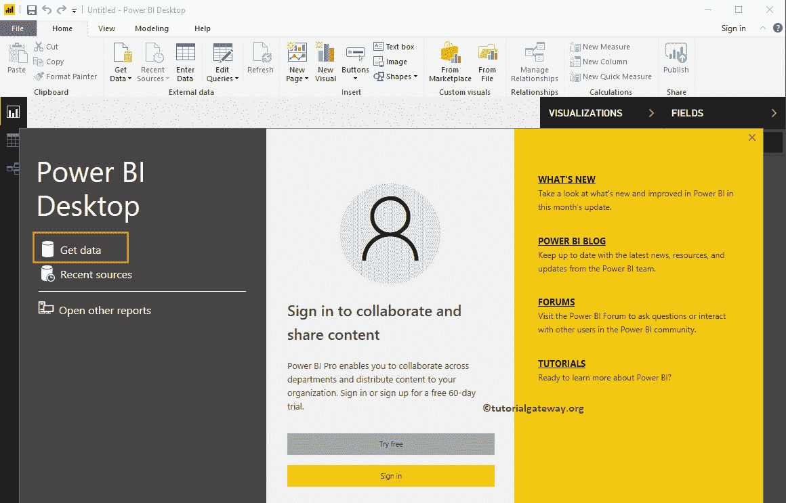
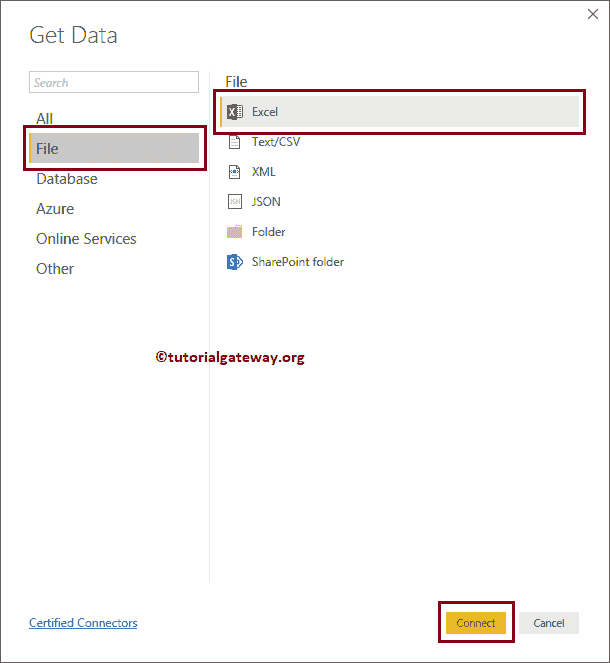

# 从 Excel 获取数据为商业智能提供动力

> 原文：<https://www.tutorialgateway.org/get-data-from-excel-to-power-bi/>

在本节中，我们将向您展示如何将 Power BI 连接到 Excel 文件，以及如何从 Excel 获取数据到 Power BI。为了演示从 excel 获取数据到 Power BI，我们将从 Excel 文件加载数据，并生成一个圆环图。

## 如何从 Excel 获取数据为商业智能提供动力

在开始之前，让我们先看看“按国家销售”Excel 文件中的数据。从下面的截图中，您可以看到第一行有列名。

如果你还没有启动 [Power BI](https://www.tutorialgateway.org/power-bi-tutorial/) 桌面，双击 Power BI 桌面打开。一旦打开，它看起来像下面的截图。请点击获取数据超链接。

如果您在 Power BI 可视化页面中，在主页选项卡下，单击获取数据选项并选择 Excel，如下所示。或者选择更多选项。

### 从 Excel 获取数据为商业智能提供动力

当您选择“更多”选项时，将显示以下窗口。您可以使用此窗口选择所需的数据源。现在，让我选择文件-> Excel 选项，然后单击连接按钮

单击“连接”按钮后，会打开一个新窗口，从我们的文件系统中选择 Excel 文件。目前，我们正在选择 SalesByCountry.xls 文件。

展开 Excel 文件夹显示可用工作表列表。如果选择图纸或表，将显示数据预览。正如您所看到的图纸预览。如果您对数据和数据类型满意，请单击“加载”按钮。否则，单击“编辑”按钮进行更改。

目前，我们不想对数据进行任何更改。所以，让我点击“加载”按钮，将数据从 Excel 转换为 Power BI。

请等到加载完成

现在，您可以在“字段”部分下看到从 excel 文件导入的所有列。

让我使用这些数据创建一个圆环图。我建议您参考 [Power BI 圆环图](https://www.tutorialgateway.org/power-bi-donut-chart/)文章，了解创建它所涉及的步骤。

