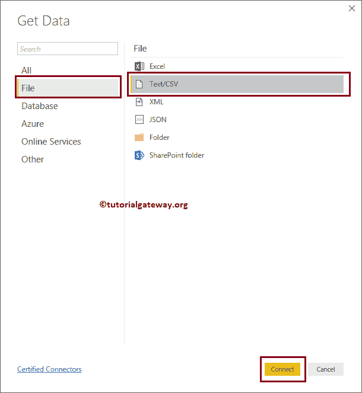

# 在PowerBI中从文本文件获取数据

> 原文：<https://www.tutorialgateway.org/get-data-from-text-file-to-power-bi/>

在本研究中，我们向您展示了如何将 Power BI 连接到文本文件，以及如何从文本文件获取数据到 Power BI。为了演示从文本文件获取数据到 Power BI，我们将从文本文件加载数据到 Power BI，并生成一个柱形图。

## 如何从文本文件中获取数据为商业智能提供动力

在我们开始从文本文件获取数据到 Power BI 之前，让我们看看员工文本文件中的数据。从下面的截图可以看出，它只是一个普通的文本文件。如果仔细观察，第一行有列名

如果你还没有启动 [Power BI](https://www.tutorialgateway.org/power-bi-tutorial/) 桌面，双击 Power BI 桌面打开。一旦打开，它看起来像下面的截图。请点击

获取数据超链接

如果您在 Power BI 可视化页面中，在主页选项卡下，单击获取数据选项并选择文本/CSV，如下所示。或者选择更多选项。

### 从文本文件获取数据以 PowerBI

当您选择“更多”选项时，将显示以下窗口。您可以使用此窗口选择所需的数据源。现在，让我选择文本/CSV 选项，然后单击连接按钮

单击“连接”按钮后，会打开一个新窗口，从我们的文件系统中选择文本文件。现在，我们正在选择 Employee.txt 文件，如下所示。

请等到连接建立

现在，您可以看到文本文件中数据的预览。

大多数情况下，Power BI 会自动挑选分隔符并分隔列。如果不是这种情况，则使用分隔符选项根据您的要求进行更改。

如果您对数据和数据类型满意，请单击加载按钮；否则，单击“编辑”按钮进行更改。

当您单击“编辑”按钮时，将打开以下窗口。使用此窗口根据您的要求更改数据。

目前，我们不想对数据进行任何更改。所以，让我点击【加载】按钮

现在，您可以在字段部分下看到从文本文件导入的所有列。

让我使用这些数据创建一个柱形图。我建议您参考 Power BI 文章中的[柱形图，了解创建它所涉及的步骤。](https://www.tutorialgateway.org/column-chart-in-power-bi/)

