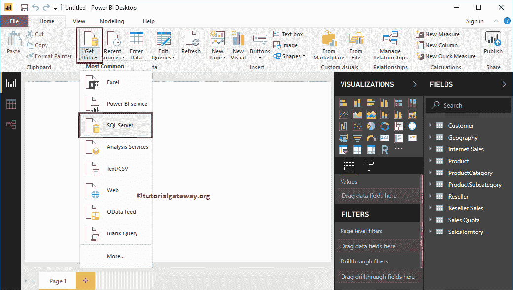
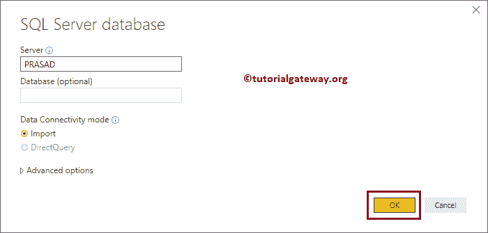
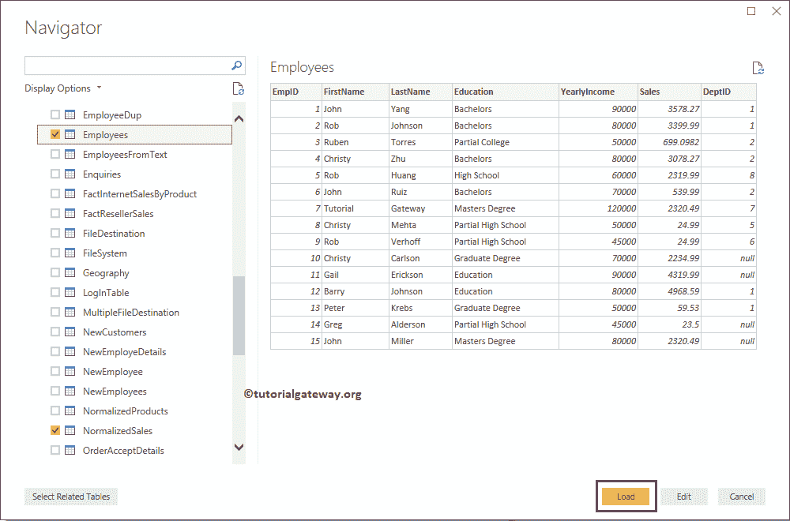
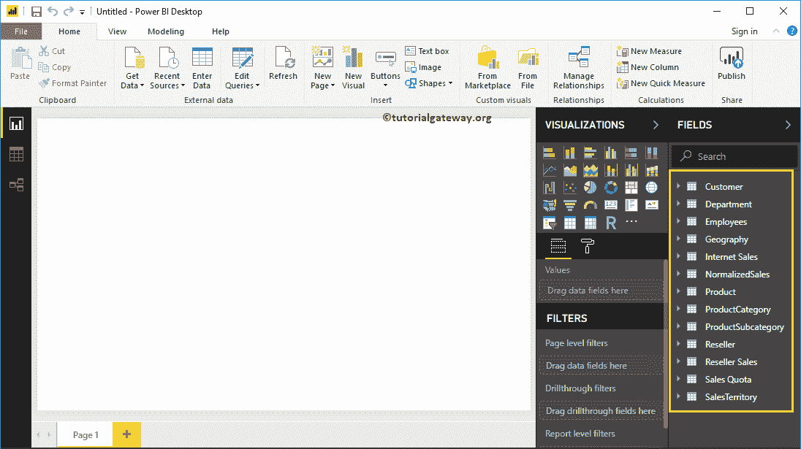
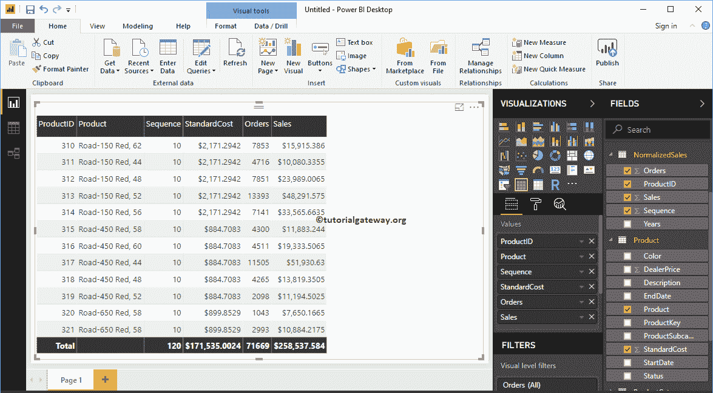

# 在PowerBI中从多个数据源加载数据

> 原文：<https://www.tutorialgateway.org/load-data-from-multiple-data-sources-in-power-bi/>

在 Power BI 中从多个数据源加载数据:实时情况下，您可能会面临数据存在于不同数据库中的情况。但是，在这些情况下，您不必担心，因为 Power BI 在一个图表中支持多个数据源。让我向您展示在 Power BI 中从多个数据源获取或加载数据的分步方法。

## 如何在PowerBI中从多个数据源加载数据

从下面的截图可以看到，Power Bi 桌面里面已经有几张表了。我们在[连接到 SQL](https://www.tutorialgateway.org/connect-power-bi-to-sql-server/) 文章中导入了这些表。如果您在 [Power BI](https://www.tutorialgateway.org/power-bi-tutorial/) 可视化页面中，在主页选项卡下，单击获取数据选项并选择 SQL Server，如下所示。或者，选择更多并选择 SQL Server 选项。

在这里，您必须提供 SQL Server 实例名称。如果[用默认实例安装了 SQL](https://www.tutorialgateway.org/install-sql-server/) ，那么实例名就是计算机名或者 localhost 或者(。).让我使用本地实例，然后单击确定。

在“显示”选项下，它列出了可用于该实例的数据库。在本例中，我们选择了雇员数据库中的三个表。

现在，您可以看到我们选择的表。

让我创建一个包含员工数据库字段和冒险工作数据仓库数据库字段的表。从下面的截图中可以看到，我们也格式化了表。

注:建议参考[创建表](https://www.tutorialgateway.org/create-a-table-in-power-bi/)、[格式化表](https://www.tutorialgateway.org/format-power-bi-table/)文章，了解表创建和格式化选项。

