# 在 Power BI 中删除表中的列

> 原文：<https://www.tutorialgateway.org/remove-columns-from-tables-in-power-bi/>

举例来说，在 Power BI 中从表中删除列需要哪些步骤？一般来说，我们从源中加载的数据可能会有一些分析不需要的列。

## 如何在 Power BI 中删除表中的列

要从现有表中删除不需要的列，请单击“主页”选项卡下的“编辑查询”选项。

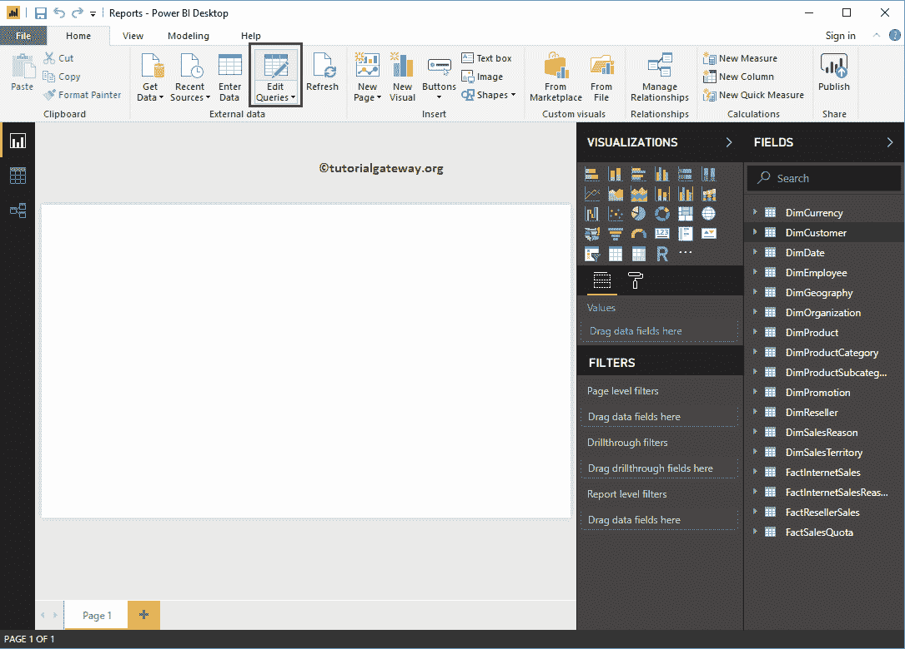

单击编辑查询选项将打开一个名为超级查询编辑器的新窗口。

1.  查询:可用表的列表。
2.  显示选定表中的数据(行和列)。
3.  属性:选定的表名。您可以使用此部分将表重命名为更有意义的名称。
4.  应用步骤:它列出了我们在这个 [Power BI](https://www.tutorialgateway.org/power-bi-tutorial/) 表上所采取的步骤。

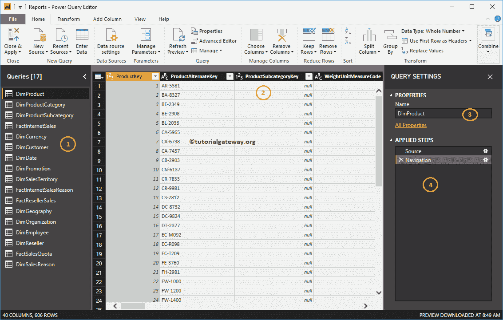

您可以选择所需的列(或者 Ctrl + Select Columns 选择多个列)，然后在键盘上点击“删除”按钮。出于在 Power BI 演示中从表中删除列的目的，我们从 DimProductCategory 表中删除了几列。

### 在 Power BI 中从表中删除列–方法 1

请选择要删除的列。接下来，右键单击它并从上下文菜单中选择移除选项。

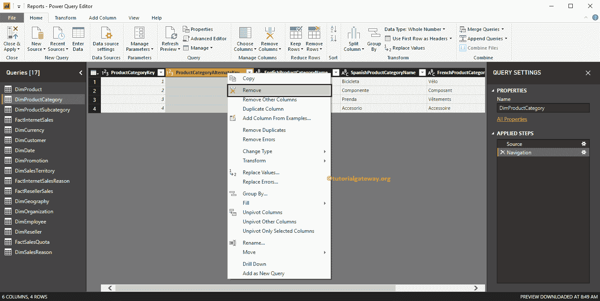

现在，您可以看到产品类别替代键列已从表中删除。您可以在“应用的步骤”部分看到相同的内容。

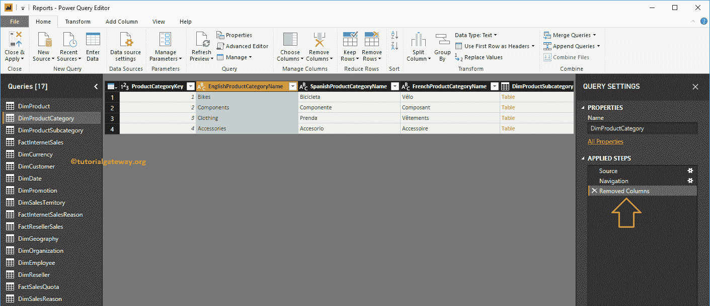

删除其他列:使用此选项从表中删除除选定列之外的所有列。出于演示目的，我选择产品类别密钥和产品类别名称。接下来，右键单击并从上下文菜单中选择“删除其他列”选项。

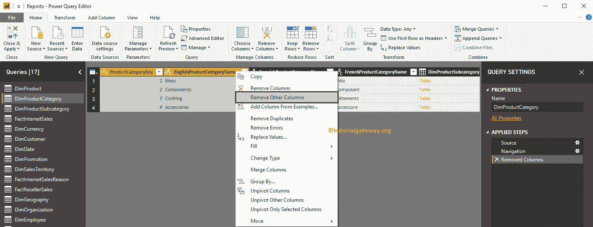

如您所见，所有其他列都从类别表中删除了。

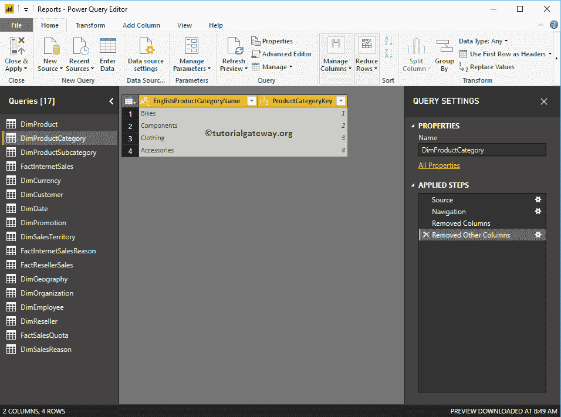

如果您想要撤消更改(或恢复更改)，请转到“应用的步骤”部分，并删除步骤，如下所示。

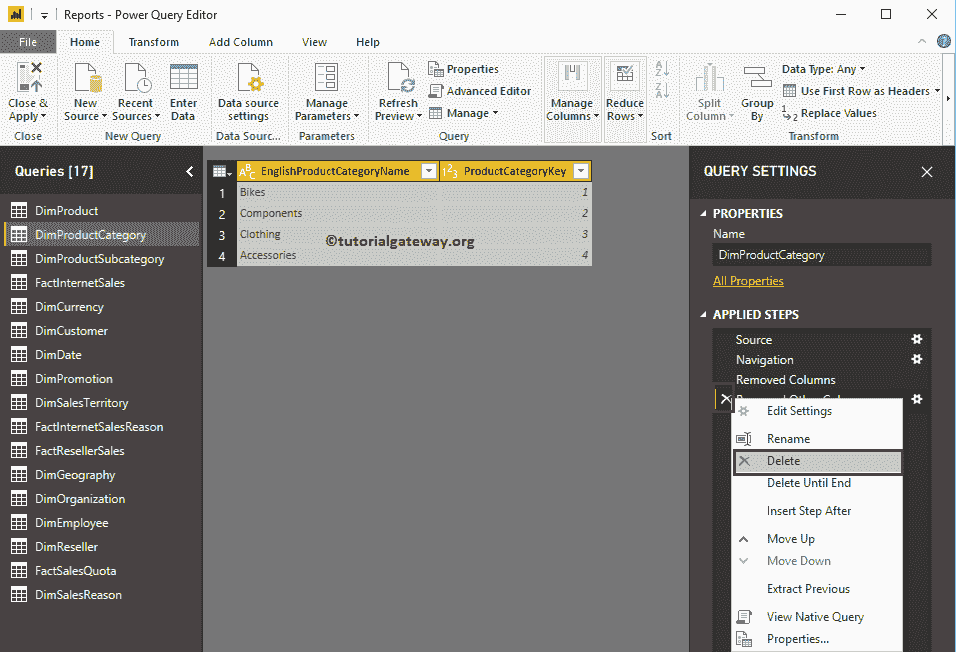

它取消了步骤

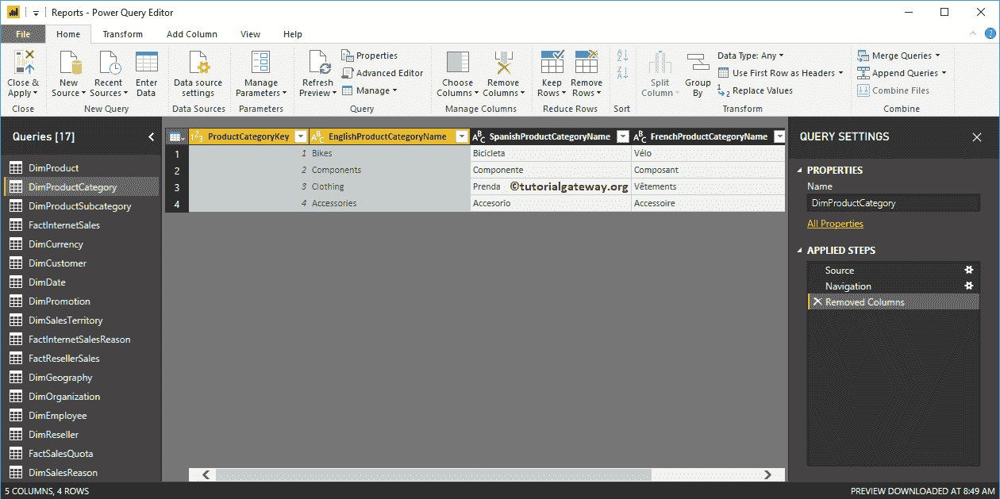

### 在 Power BI 中从表中删除列–方法 2

首先，选择要删除的列，然后单击“主页”选项卡下的“删除列”选项。

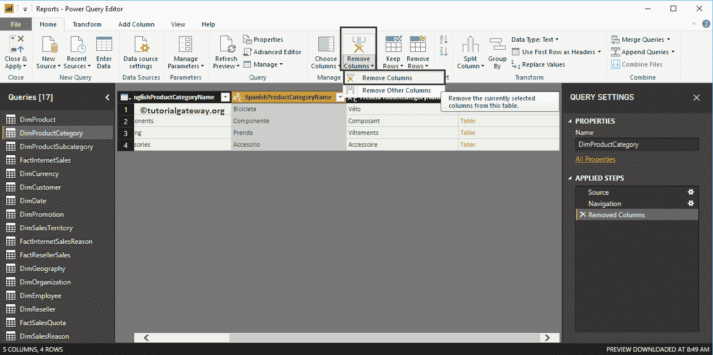

### 重新排序PowerBI表的列

拖动该列，并根据您的要求放置它。出于演示目的，我们将英文产品类别名称从最后一个位置拖到第一个位置。

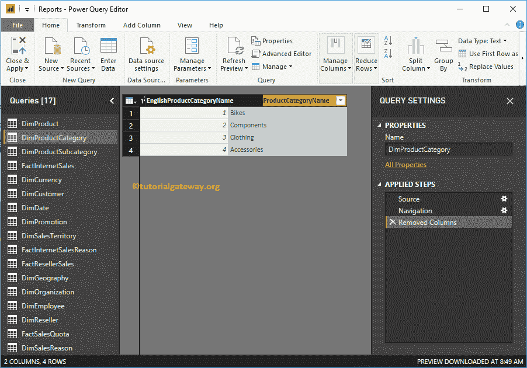

你可以在第一个位置

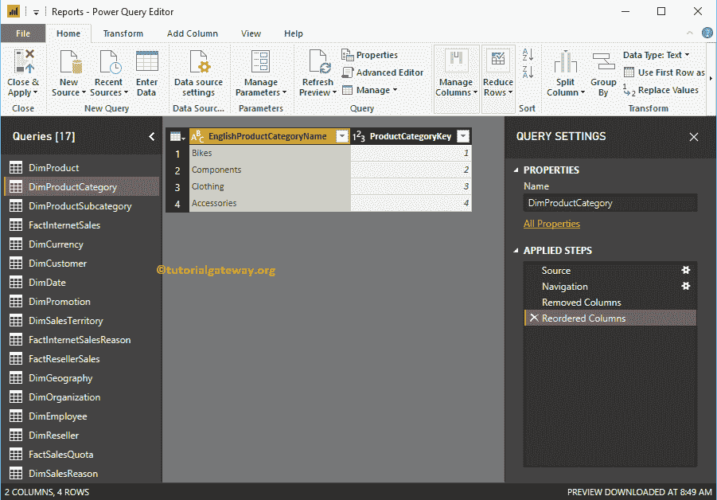

看到类别名称

无论您做了什么更改，在您点击“应用”之前都不会生效。让我点击主页选项卡下的关闭并应用选项。

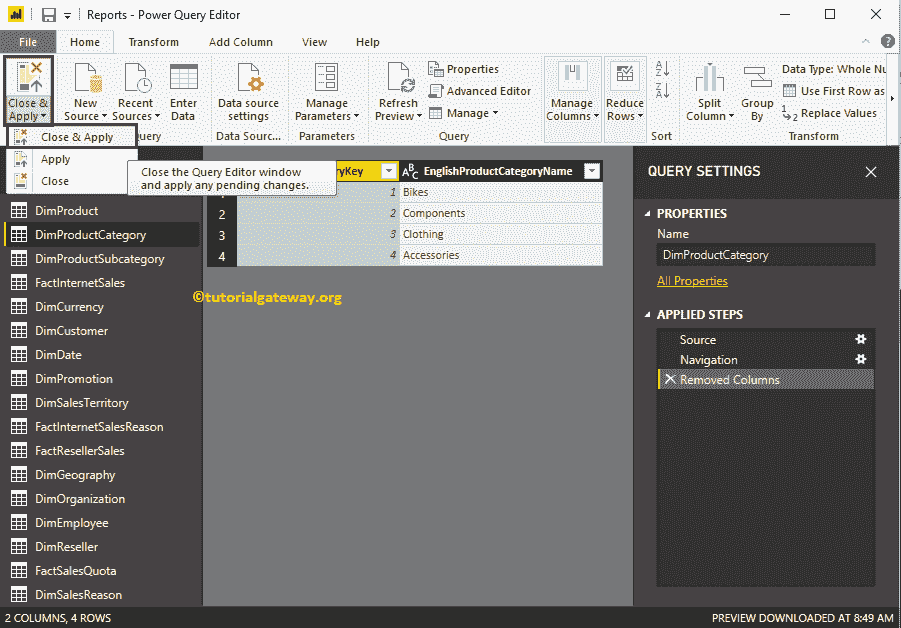

请等到更改完成。

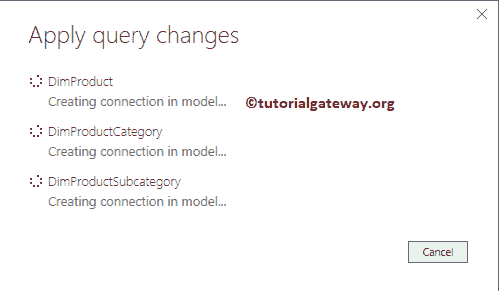

您可以看到产品类别表只有两列。

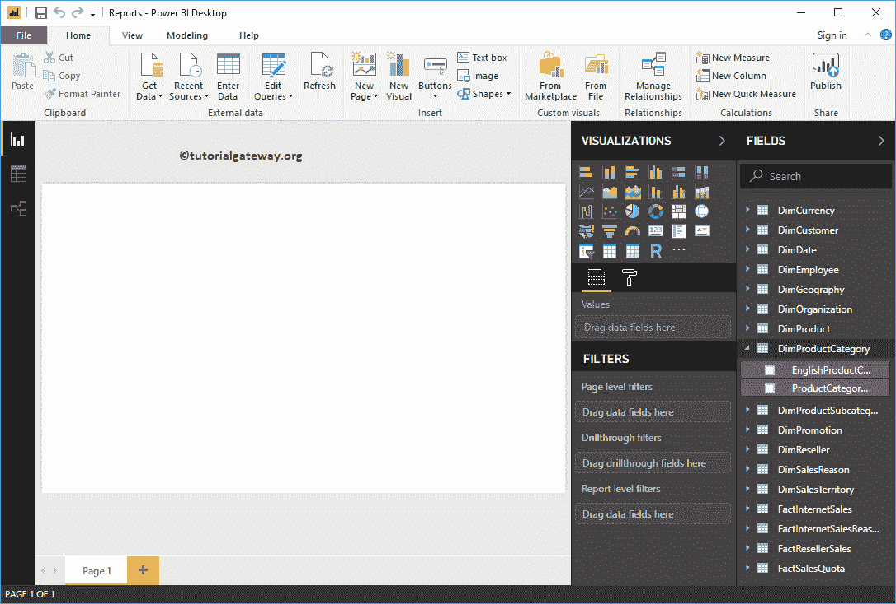