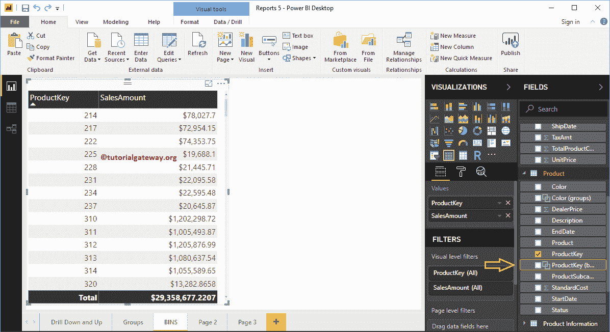

# 在电力商业智能中创建箱柜

> 原文：<https://www.tutorialgateway.org/create-bins-in-power-bi/>

Power BI 箱或桶对于创建一系列数据非常有用，类似于 SQL 桶。让我用一个例子向您展示如何在 Power BI 中创建箱

在这个 Power BI 箱演示中，我们将使用我们在上一篇文章中创建的 SQL 数据源。所以，请参考[连接到 SQL Server](https://www.tutorialgateway.org/connect-power-bi-to-sql-server/) 文章了解数据源。

## 在电力商业智能中创建箱柜

为了直观地展示这种能力，我们将创建一个表格。从下面的截图中可以看到，我们通过拖动“产品密钥”和“销售额”列创建了一个简单的表格。

我建议您参考[创建表格](https://www.tutorialgateway.org/create-a-table-in-power-bi/)和[格式化表格](https://www.tutorialgateway.org/format-power-bi-table/)文章，了解创建和格式化 [Power BI](https://www.tutorialgateway.org/power-bi-tutorial/) 表格的步骤。

请选择要用作媒体夹的文件，然后右键单击它打开上下文菜单。从菜单中选择“新建组”选项。

单击新建组选项将打开以下窗口。

*   名称:指定电源商务智能箱名称
*   字段:用于宁滨的字段或列
*   组类型:列表(组)或[箱](https://www.tutorialgateway.org/create-bins-in-power-bi/)。
*   箱类型:有两个选项，如箱的大小或箱的数量
*   最小值和最大值:选定字段中的最小值和最大值。这里是产品密钥。

如果您选择了箱类型作为箱的大小，那么您必须指定箱的大小(静态数字)

或者，如果选择了“箱类型”作为“箱数”，则必须指定箱数。这里，箱的大小取决于箱的数量。

让我选择箱大小为 20，然后单击确定。意思是每个水桶大小是 20

现在，您可以在“产品”表下看到新创建的媒体夹。

让我把那个箱子加到这张桌子上。从下面的截图可以看到，对于 220 到 240

之间的按键，产品 Key 值为 220

#### 编辑电源商业智能箱

请选择您想要编辑的媒体夹，然后右键单击它打开上下文菜单。从中选择编辑组选项

单击编辑组选项将打开以下窗口。使用此窗口根据您的要求进行更改。

#### 删除电力商业智能中的箱

请选择您想要删除的媒体夹，然后右键单击它打开上下文菜单。从

中选择删除选项

单击删除按钮确认删除操作。

## 在电力商业智能示例 2 中创建箱

为了演示箱柜，我们创建了一个[柱形图](https://www.tutorialgateway.org/column-chart-in-power-bi/)，显示了彩色销售。这次我们在

上创建一个销售金额箱

右键单击“销售额”，并从上下文菜单中选择“新建组”选项。从下面的截图可以看到，我们将 Power BI Bin 的大小定义为 357.2655

让我将这个新的销售金额箱添加到柱形图图例部分。

让我编辑电源 BI 箱，并将箱类型更改为箱数，箱数为 3

现在你可以看到，柱形图中的每个条被一个计数为 3 的箱分割。

