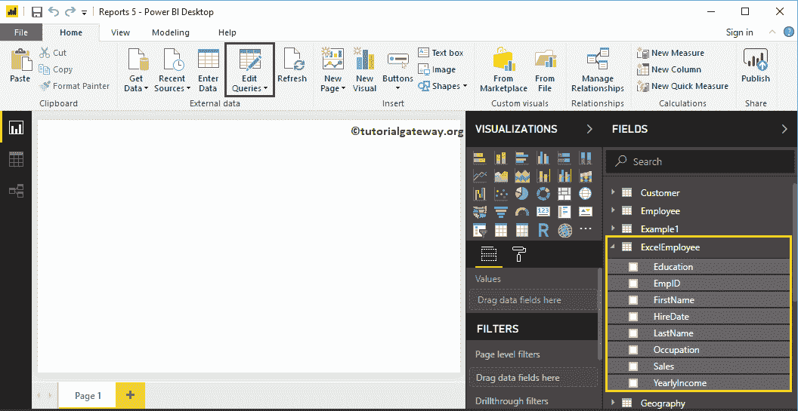
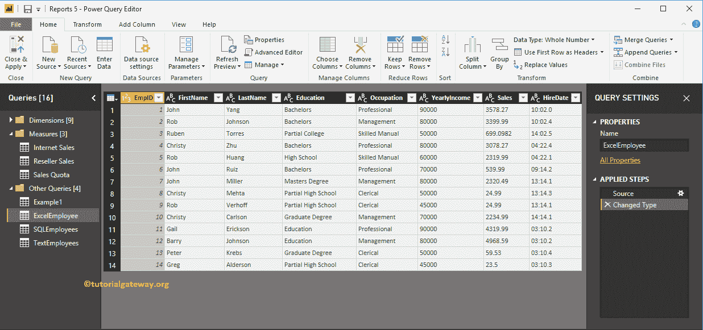
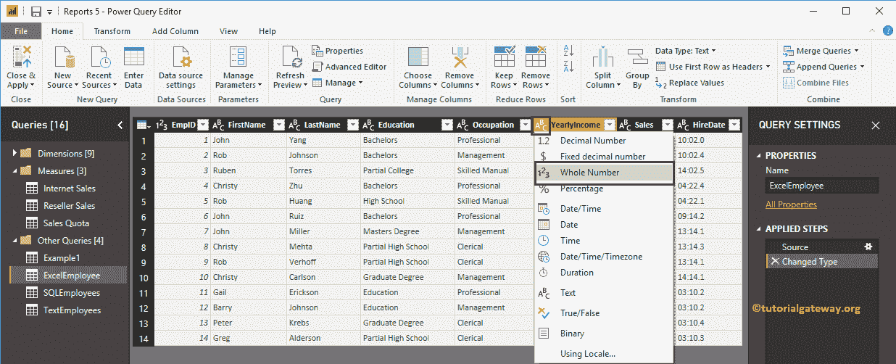
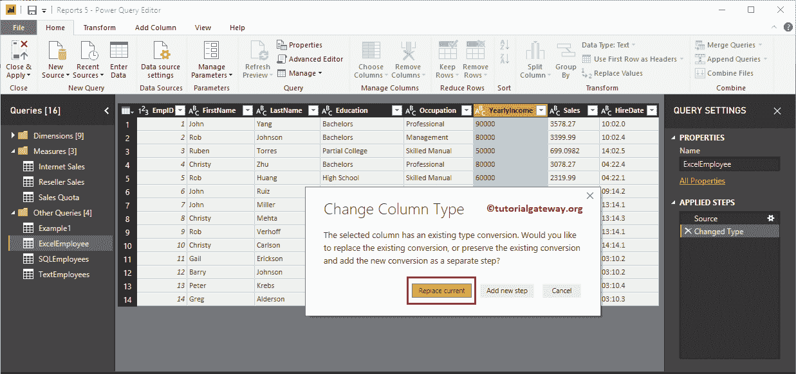
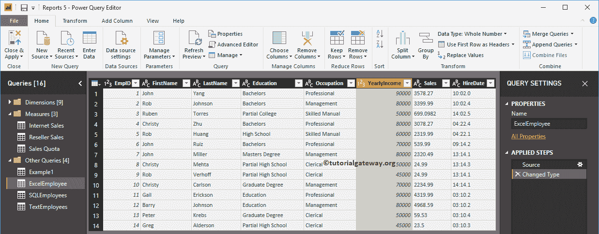
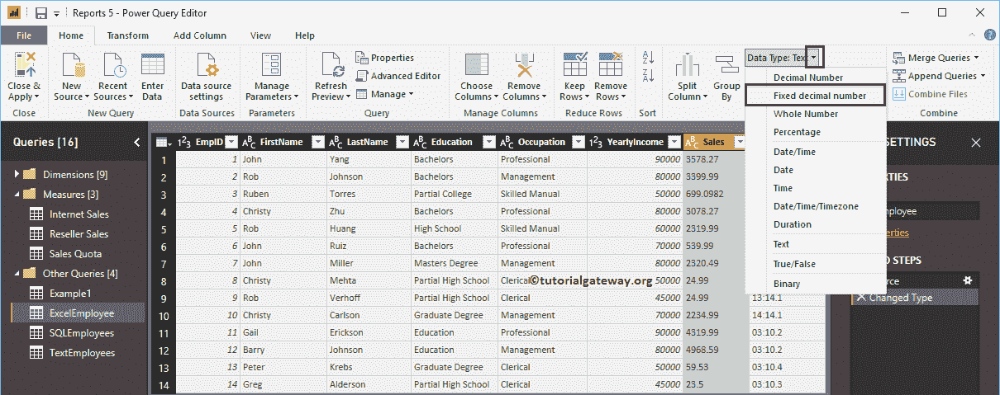
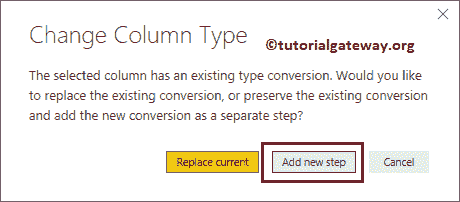
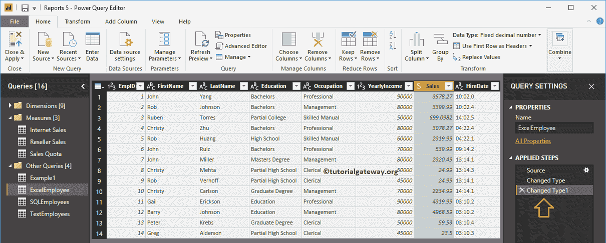
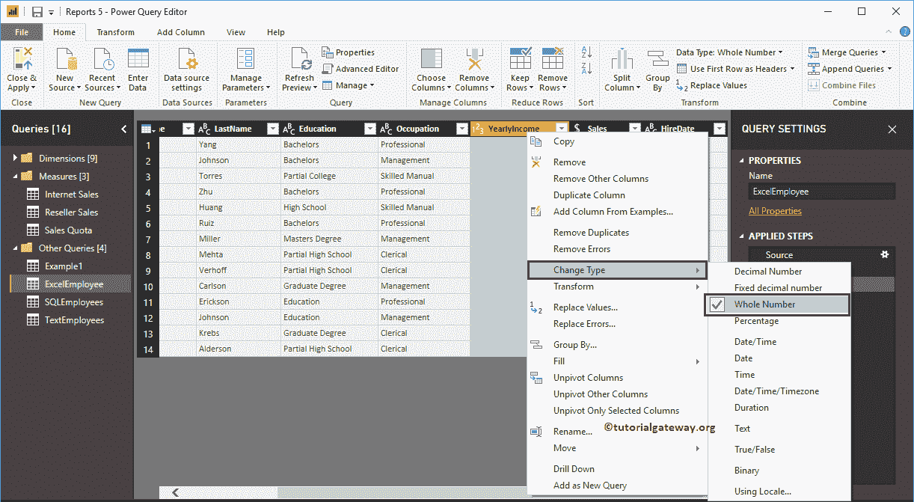

# 在 Power BI 中更改列的数据类型

> 原文：<https://www.tutorialgateway.org/change-data-types-of-a-column-in-power-bi/>

通常，当您从任何数据源加载表时，Power BI 会自动检测列的数据类型。然而，在某些情况下，Power BI 可能会让他们出错。

例如，它可能会将金额、值甚至日期视为文本。在这些情况下，您可以使用 Power BI 更改列选项的数据类型。让我用一个例子向您展示如何在 Power BI 中更改列的数据类型。

## 如何在 Power BI 中更改列的数据类型

为了演示更改列的数据类型，我们将使用我们在[输入数据](https://www.tutorialgateway.org/how-to-enter-data-into-power-bi/)文章中导入的 excel 表。要更改任何列的数据类型，请单击“主页”选项卡下的“编辑查询”选项。

单击编辑查询选项将打开一个名为 [Power BI](https://www.tutorialgateway.org/power-bi-tutorial/) Power 查询编辑器的新窗口。从下面的截图中，您可以看到年收入、销售额和雇佣日期列被加载为文本。

有几种方法可以更改列的数据类型

### 更改列数据类型的第一种方法

请选择要更改数据类型的列。接下来，点击列标题的左上角(目前它代表 ABC 文本)。单击该位置将打开支持的数据类型的下拉列表。请选择适合您的数据的数据类型。这里，我们选择整数。

更改列的数据类型会打开以下弹出窗口。单击替换当前按钮。

现在你可以看到年收入标题显示的是 123(整数)而不是 ABC(文本)

### 在 Power BI 中更改列数据类型的第二种方法

请选择要更改数据类型的列名，然后单击“主页”选项卡下的“数据类型”按钮。它向您显示可用数据类型的下拉列表。出于演示目的，我们选择了一个固定的十进制数。

这次我们将选择添加新步骤。这意味着此更改列类型添加为“应用的步骤”下的新步骤。

从下面的截图中可以看到，它更改了 Sales 列的数据类型，并在 Applied Steps 下添加了一个新步骤。

### 在 Power BI 中更改列数据类型的第三种方法

请选择要更改数据类型的列，右键单击它将打开上下文菜单。从列表中选择更改类型，然后选择数据类型。现在，我们选择整数。

不要忘记点击主页选项卡下的关闭并应用选项来应用这些更改。