# 在 Power BI 中组合多个表

> 原文：<https://www.tutorialgateway.org/combine-multiple-tables-in-power-bi/>

在 Power BI 中组合多个表:实时地，您的数据是以规范化的格式，但是在某些情况下，您可能需要非规范化的数据。在这种情况下，您可以使用查询编辑器组合这些表。让我用一个例子向您展示如何在 Power BI 中组合多个表。

## 电力商业智能中如何组合多个表

从下面的截图中，您可以看到有三个表产品类别、产品子类别和产品表。我们在[连接到 SQL](https://www.tutorialgateway.org/connect-power-bi-to-sql-server/) 文章中导入了这些表。

出于在 Power BI 中合并多个表的演示目的，我们将合并这三个表。为此，请单击 [Power BI](https://www.tutorialgateway.org/power-bi-tutorial/) 主页选项卡下的编辑查询选项。

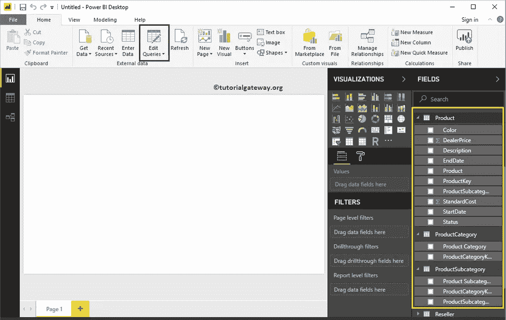

单击编辑查询选项将打开一个名为超级查询编辑器的新窗口。

从下面的截图中，您可以看到产品子类别表与产品和产品类别表都有关联。

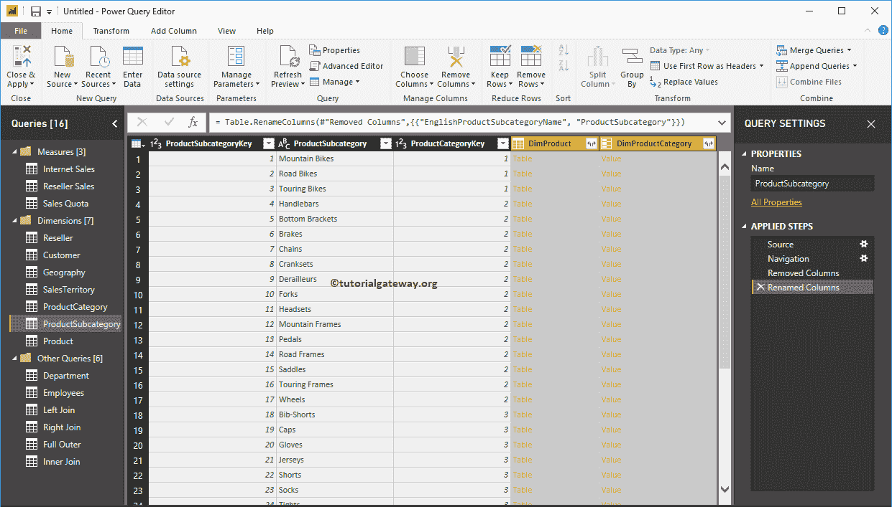

在我们开始在 Power BI 中组合多个表之前，让我通过右键单击该表并从上下文菜单中选择复制选项来复制该表。

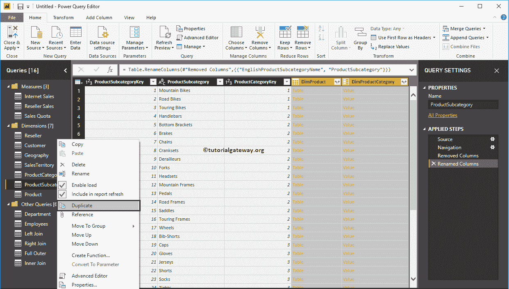

我们将其更名为产品信息

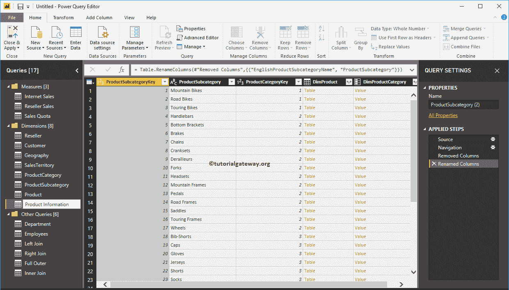

点击表格中的任意一行，显示相应的表格信息。

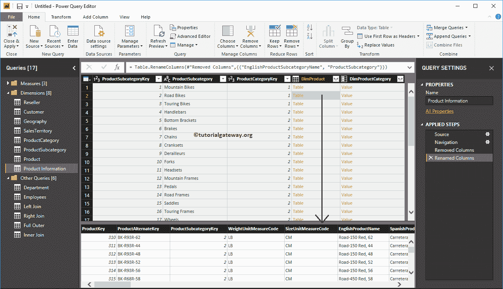

要组合调光产品表，请单击调光产品列标题的右上角。它会打开以下窗口。使用此窗口从产品表中选择必填字段。

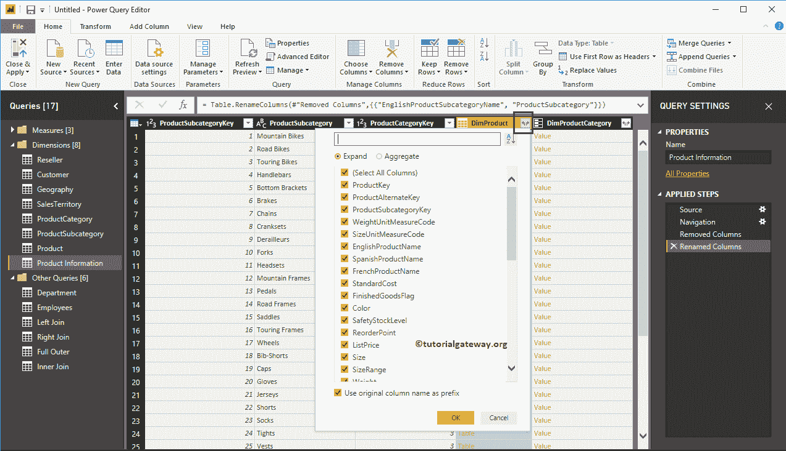

我们从产品表

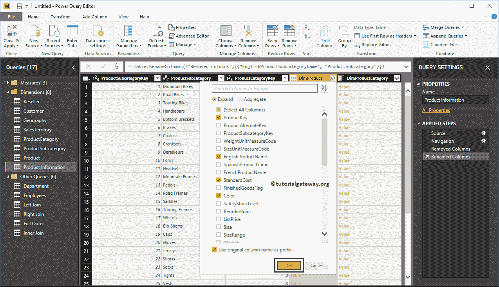

中选择了产品密钥、产品名称、颜色和标准成本

现在，您可以在产品信息表中看到这些列。

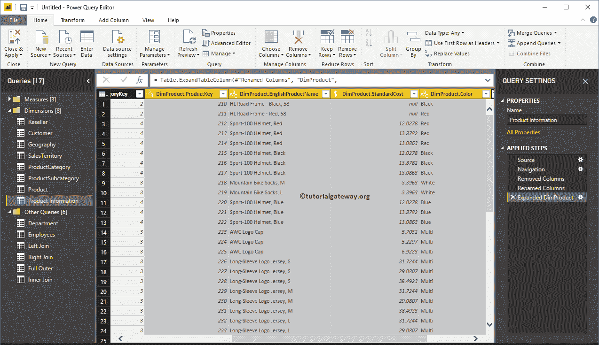

要组合调光产品类别表，请选择调光产品类别列标题的右上角。请从产品类别表中选择必填字段。

我们只需要这个表格

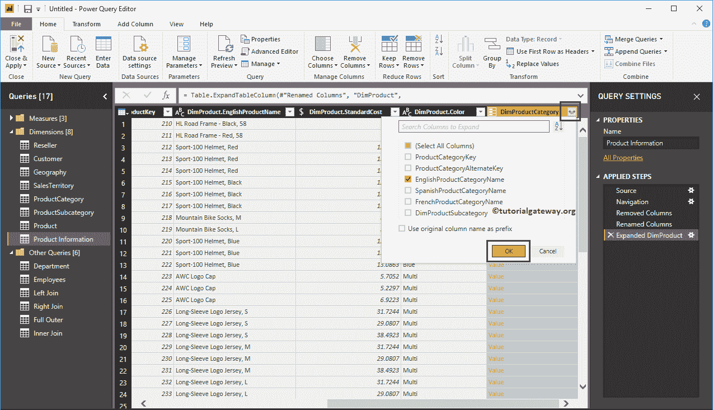

中的英文产品类别名称

现在，您可以在产品信息表中看到英文产品类别名称。

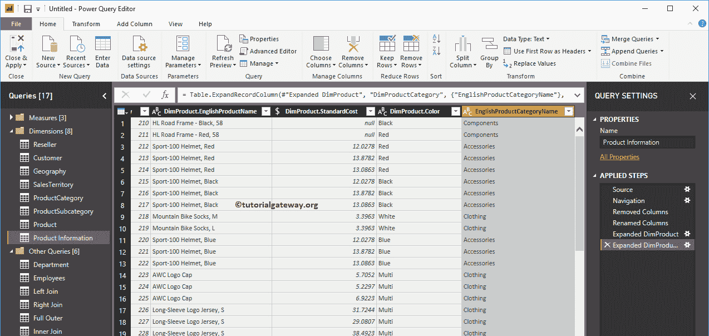

让我[重命名](https://www.tutorialgateway.org/how-to-rename-column-names-in-power-bi/)[重新排列](https://www.tutorialgateway.org/remove-or-reorder-columns-in-power-bi/)列，点击首页选项卡下的关闭&应用选项。

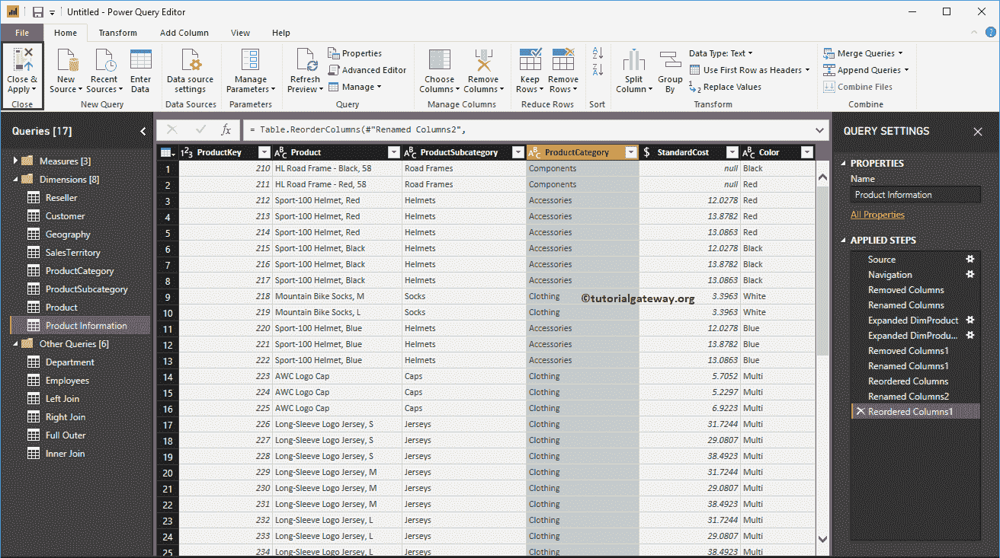

让我用这个新创建的表创建一个表。从下面的截图中可以看到，我们也格式化了表格。

注:建议参考[创建表格](https://www.tutorialgateway.org/create-a-table-in-power-bi/)、[格式化表格](https://www.tutorialgateway.org/format-power-bi-table/)文章，了解表格创建和格式化选项。

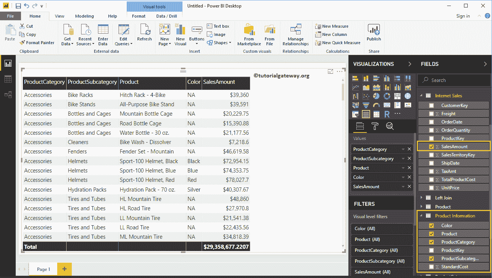