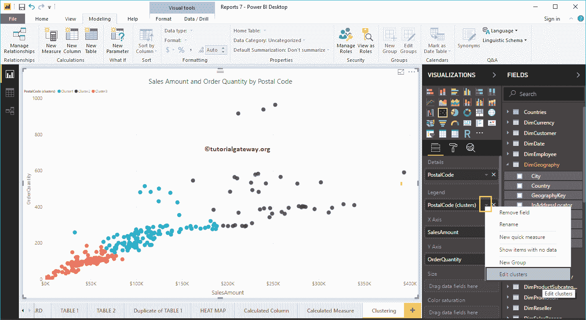

# PowerBI集群

> 原文：<https://www.tutorialgateway.org/power-bi-clusters/>

在本节中，我们将通过一个示例向您展示如何创建 Power BI 集群。为了解释这种功率商业智能集群的概念，我们将使用我们之前创建的散点图。

在这个 Power BI 集群演示中，我们将使用我们在[连接到 SQL Server](https://www.tutorialgateway.org/connect-power-bi-to-sql-server/) 文章和[散点图](https://www.tutorialgateway.org/scatter-chart-in-power-bi/)中创建的 SQL 数据源。

## 创建强大的商业智能集群

请点击图表右上角的… (3 个点)查看选项。从下面的 [Power BI](https://www.tutorialgateway.org/power-bi-tutorial/) 截图中可以看到，我们从菜单中选择了自动查找集群选项。

单击自动查找PowerBI群集选项将打开以下窗口

*   名称:使用此文本框重命名默认生成的名称
*   字段:用于聚类分析的字段或列
*   描述:写一个有意义的描述来描述这一点。
*   群集数量:默认情况下，选择自动。但是，您可以指定任何整数值

对于这个 Power BI 集群演示，我们保留所有默认值。所以，让我点击确定按钮

一个自动选项已经生成了三个集群

### 编辑高级商业智能集群

您可以通过两种方式编辑它。在可视化选项卡下，单击旁边的向下箭头，并从菜单中选择编辑集群选项。

或者，请选择要编辑的集群，然后右键单击它打开上下文菜单。请从中选择编辑集群选项

单击编辑选项将打开以下窗口。使用此窗口根据您的要求进行更改。

让我把默认的三个改为六个

现在你可以看到，它已经生成了六个不同的集群

### 删除PowerBI集群

请选择要删除的群集。接下来，右键单击它并从上下文菜单中选择删除选项。

确认删除

## 创建手动电源商业智能集群

它与第一个示例相同，但这次我们将“群集数量”值从“自动”更改为 5。

并且可以看到 5 个集群

让我在另一份(不同的)报告中使用这个。为此，我们使用邮政编码集群(新创建)和销售额

创建了一个[条形图](https://www.tutorialgateway.org/power-bi-bar-chart/)

像普通列一样，你也可以[过滤](https://www.tutorialgateway.org/power-bi-basic-filters/)簇

T3