# 如何将数据输入电力商业智能

> 原文：<https://www.tutorialgateway.org/how-to-enter-data-into-power-bi/>

让我用一个例子向您展示如何将数据输入到 Power BI 桌面。实时情况下，您可能会面临手动输入表数据，或者将文本文件中的数据复制到 power bi 工作环境中的情况。在这些情况下，您可以使用 Power BI 输入数据选项。

## 如何将数据输入电力商业智能

要向 Power BI 桌面输入新数据，请单击主页选项卡下的输入数据选项。

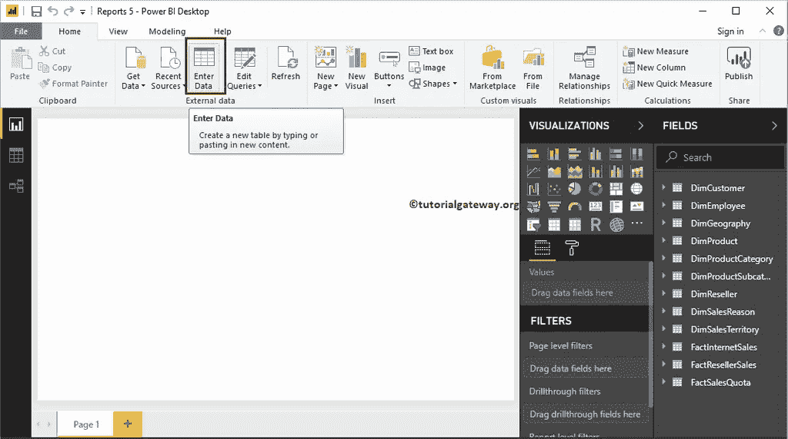

单击输入数据选项将打开一个名为创建表的新窗口。在这里，您可以创建新列和添加新行。

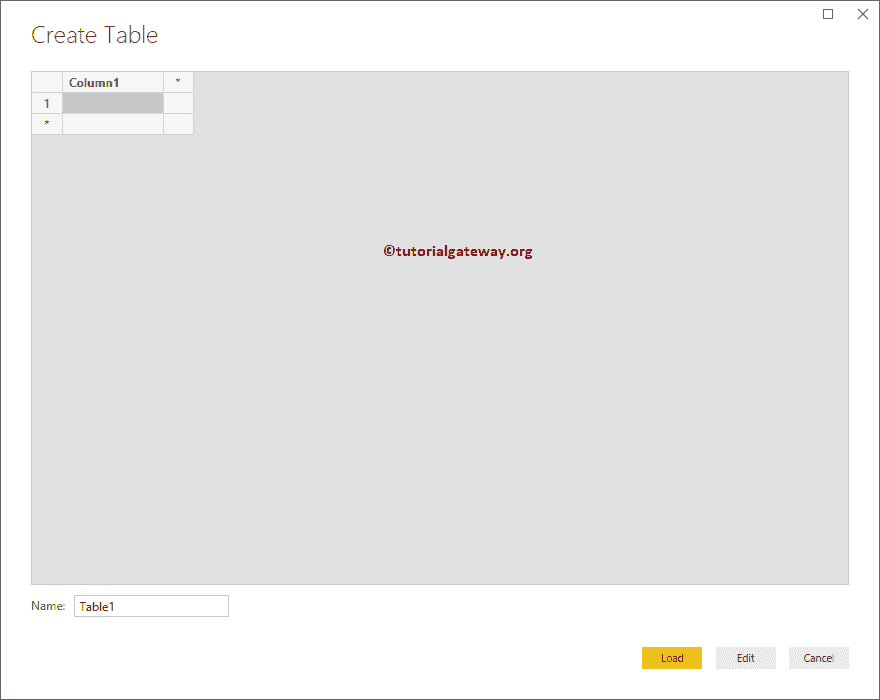

通过单击列 1 区域，允许您添加新名称。让我将第 1 列标题更改为名称。接下来，单击*添加新列。

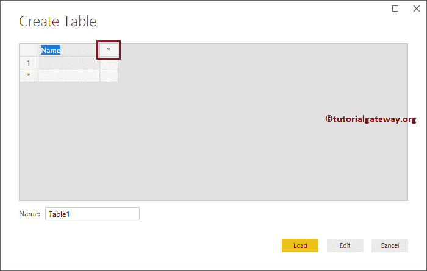

现在您可以在 [Power BI](https://www.tutorialgateway.org/power-bi-tutorial/) 中看到新列。

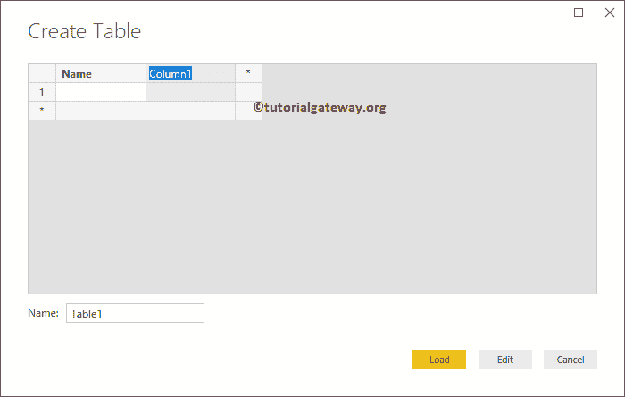

为了演示的目的，让我添加几行

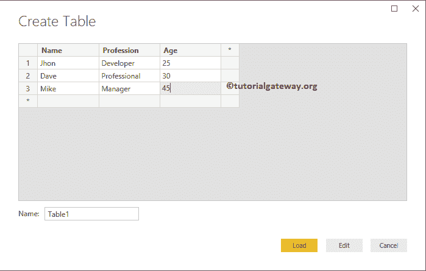

使用名称:字段旁边的文本框更改表名称。从下面的截图中可以看到，我们将表名更改为示例 1。

接下来，单击加载按钮将此表加载到 Power Bi 桌面。您也可以单击“编辑”按钮来编辑这些字段。

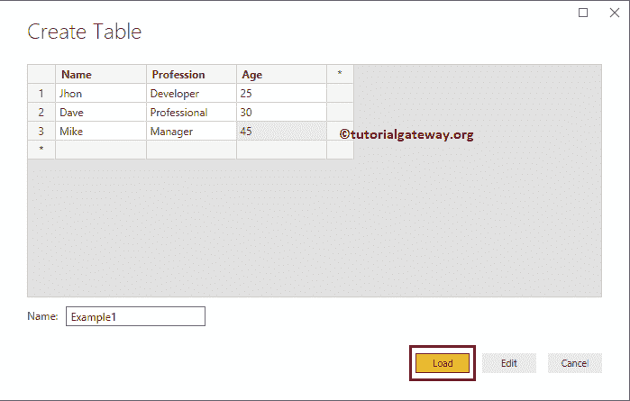

请等待加载完成。

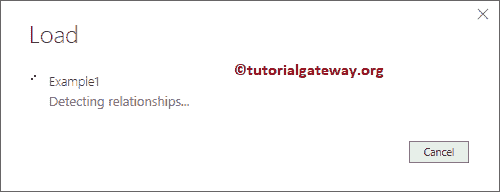

现在你可以看到新表

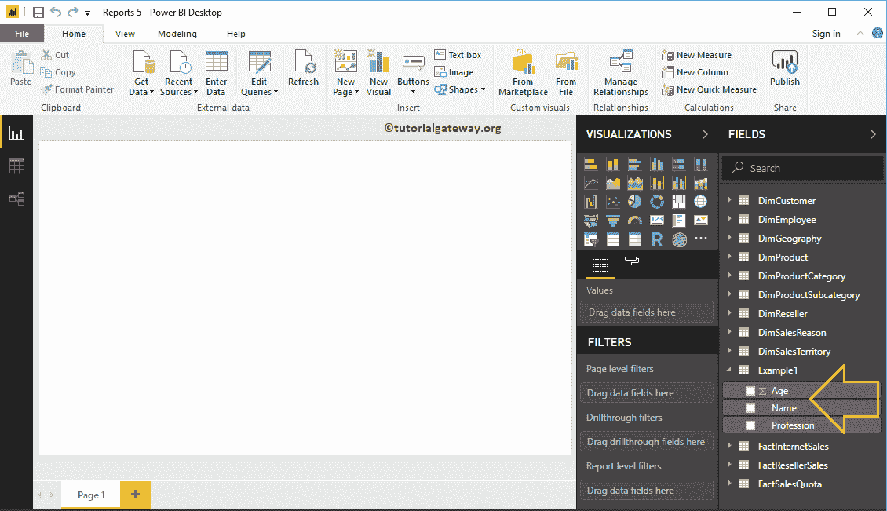

### 将数据从 Excel 文件输入到 Power BI 桌面

在本例中，我们解释了将数据从 Excel 文件粘贴到 Power BI 桌面的步骤。首先，让我通过点击【输入数据】按钮

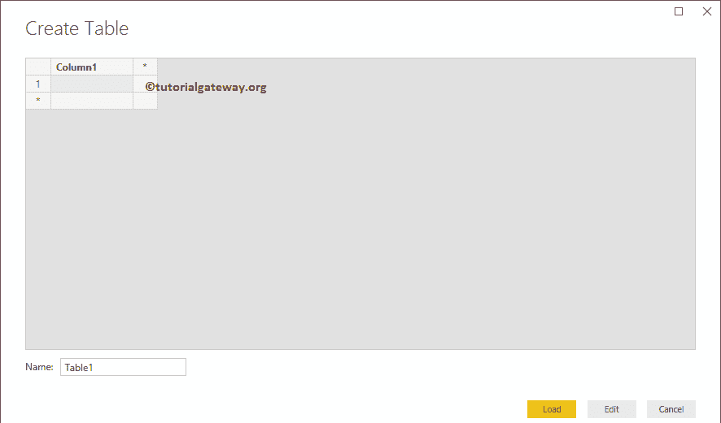

打开创建表窗口

让我复制 Excel 文件

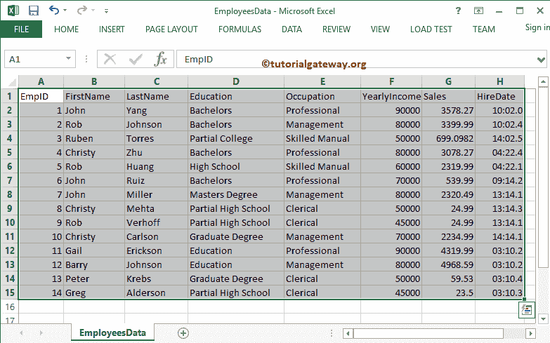

中的数据

并将其粘贴到“创建表”窗口中(控件+ C 和控件+ V)。请记住，Power BI 会自动检测列标题。

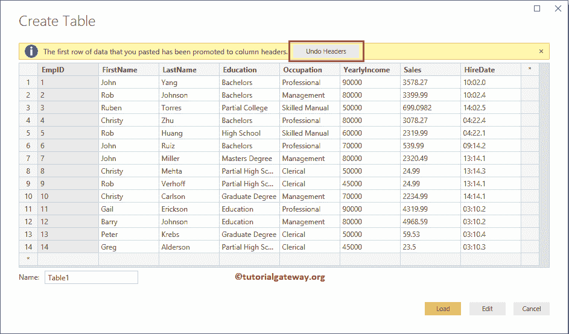

让我将表重命名为雇员，然后单击加载按钮

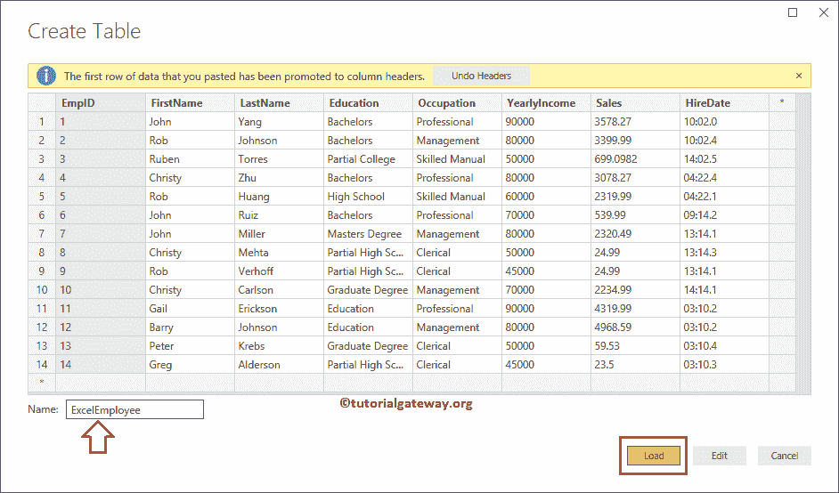

现在你可以看到表

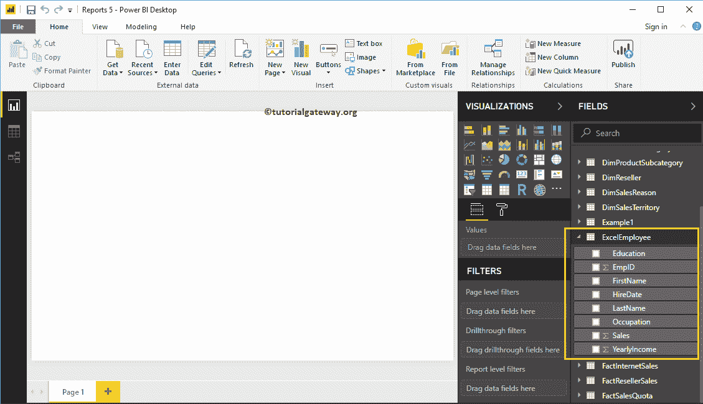

### 将数据从 SQL 表输入到 Power BI 桌面

首先，让我复制一下 [SQL](https://www.tutorialgateway.org/sql/) 表

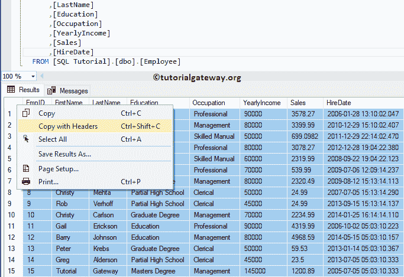T4 中的数据

并将其粘贴到创建表窗口

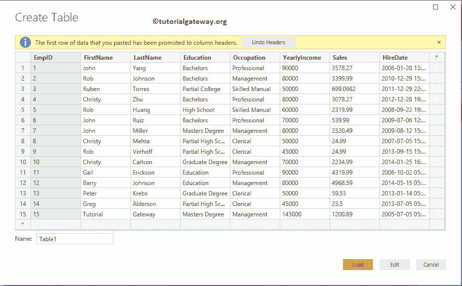

请根据您的要求重命名表名，点击【加载】按钮

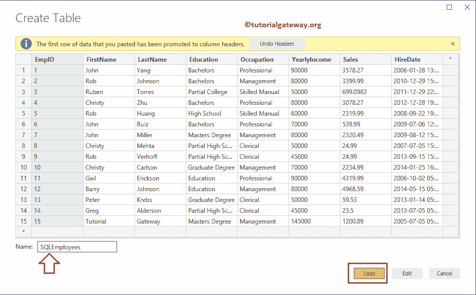

现在你可以看到表

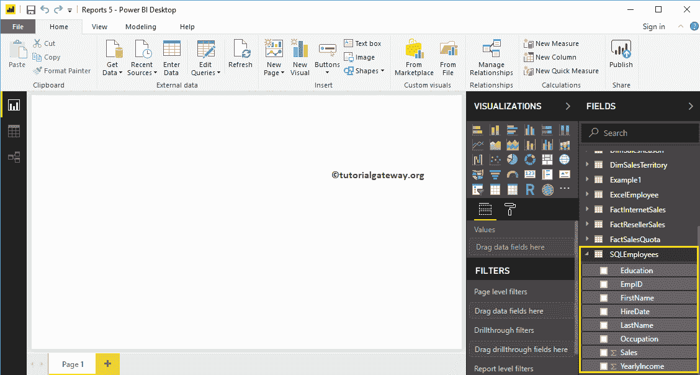

### 将文本文件中的数据输入到高级商务智能桌面

首先，让我打开文本文件。如您所见，文件格式不正确。让我复制一下这个文本文件中的内容。

接下来，我们将其粘贴到创建表窗口中。你可以从下面的截图中看到，所有的信息都存储在一个列中。

我们可以通过点击编辑按钮来编辑它们，但是我们将写一篇单独的文章来解释这些技术。因此，现在，我们重命名了表名，并将表加载到桌面中。

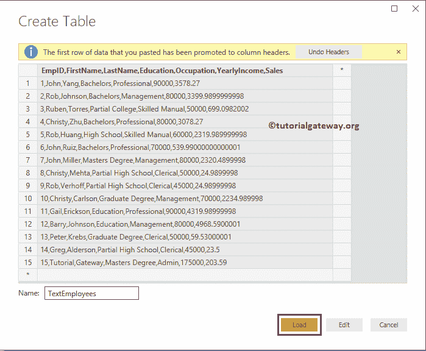