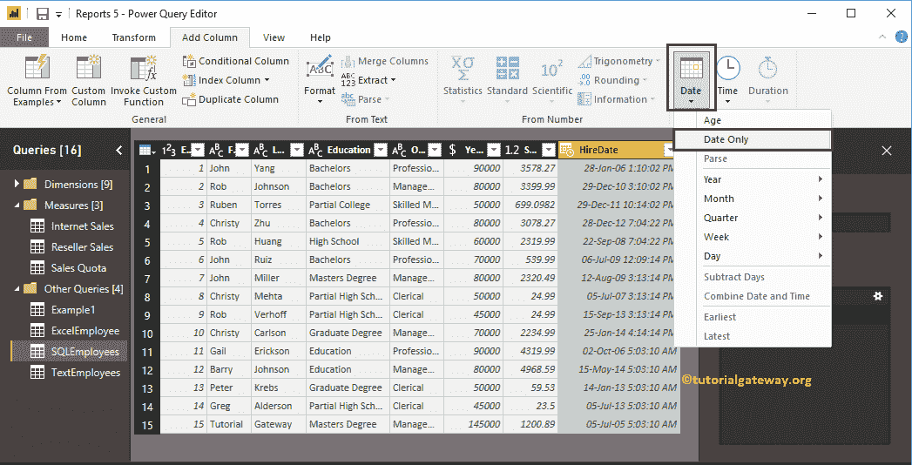

# 如何在电力商务智能中设置日期格式

> 原文：<https://www.tutorialgateway.org/how-to-format-dates-in-power-bi/>

本文通过一个例子来说明如何在 Power BI 中格式化日期？。使用这些 PowerBI 格式化日期选项，您可以提取年、月、日、日号、日名、月开始和月结束等。

在 power bi 中有几种格式化日期的方法，我们会解释其中的大部分。为了演示这些 Power BI 日期格式，我们将使用我们在输入数据文章中导入的 sql 表。

## Power BI 格式日期

要格式化任何表格中的日期，请单击“主页”选项卡下的“编辑查询”选项。请参考[输入数据](https://www.tutorialgateway.org/how-to-enter-data-into-power-bi/)一文。

单击编辑查询选项将打开一个名为超级查询编辑器的新窗口。

从下面的截图中，您可以看到 HireDate 列。为了演示 Power BI 日期格式选项，我们将使用此列。

### 电力商业智能中格式化日期的第一种方法

请选择日期列，然后右键单击它打开上下文菜单。选择转换选项并选择格式选项。目前，我们正在选择年份。这意味着该属性提取并显示自雇佣之日起的年份。

从下面的截图中，您可以看到“雇佣日期”列中的日期和时间被“提取年份”所替换。

### 电力商业智能中日期格式的第二种方法

首先，转到转换选项卡。在此选项卡下，您可以看到日期和时间选项。您可以使用这些下拉列表来格式化日期。

单击日期旁边的向下箭头会显示可用日期格式的下拉列表。出于演示目的，我们选择月中的天数。

从下面的截图中，您可以看到“雇用日期”列中的日期和时间被替换为一个月中的总天数。

### 电力商业智能中日期格式的第三种方法

上面指定的方法是用格式化的日期替换现有的列。但是，这种方法为格式化日期增加了一个额外的列。

首先，转到添加列选项卡。在此选项卡下，您可以看到日期、时间和持续时间选项。您可以使用这些下拉列表来设置日期和时间的格式。

让我在[电源 BI](https://www.tutorialgateway.org/power-bi-tutorial/) 中选择仅日期选项。

现在你可以看到新的栏(额外的栏)显示从雇佣日期

开始的日期

让我只选择时间

现在，您可以看到显示“从雇佣日期开始的时间”

的新列

让我选择一天的名字

现在，您可以看到显示日期名称的额外列。接下来，点击主页选项卡下的关闭并应用选项来应用这些更改。

请等到更改后的应用

现在，您可以在 SQL Employee 表下看到“格式化日期”、“日期名称”和“时间”列。

