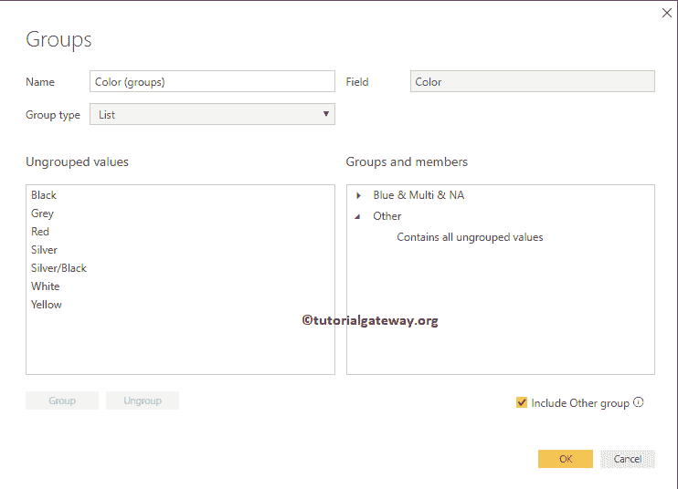

# 在PowerBI中创建组

> 原文：<https://www.tutorialgateway.org/create-groups-in-power-bi/>

Power BI 分组是组合或合并两个或多个值以进行进一步分析的过程。例如，当我们按类别查看产品报告时，我们可能会发现很少的记录(不引人注意的产品)。有时，看到所有那些表现不佳的产品可能会很烦人。在这种情况下，您可以通过组合这些记录来创建 Power BI 组，并将其显示为一个产品。

在本文中，我们将通过一个示例向您展示如何在 Power BI 报告中创建组。在这个 Power BI 组演示中，我们将使用我们在上一篇文章中创建的 SQL 数据源。

请参考[连接到 SQL Server](https://www.tutorialgateway.org/connect-power-bi-to-sql-server/) 文章了解 [Power BI](https://www.tutorialgateway.org/power-bi-tutorial/) 数据源。

## 在PowerBI中创建组

为了直观地演示这种 Power BI 分组技术，我们将创建一个饼图。从下面的截图中可以看到，我们通过将“销售额”列拖到“值”字段，并将“颜色”拖到“图例”区域来创建饼图。

注:我建议您参考[创建饼图](https://www.tutorialgateway.org/pie-chart-in-power-bi/)和[格式化饼图](https://www.tutorialgateway.org/format-power-bi-pie-chart/)文章，了解创建和格式化饼图的步骤。

如果您观察下面的截图，我们突出显示的数据，如多、北美和蓝色产品表现不佳。所以，让我们把他们分组

要在 Power BI 中执行分组，请选择要分组的字段，右键单击它将打开上下文菜单。请从菜单中选择组选项。

单击“分组”选项后，Power BI 将自动对这些项目进行分组，如下所示。就这样，我们分组了。

如果仔细观察，图例部分将被颜色组替换，颜色将放置在细节部分。

提示:默认情况下，Power BI Group 选项会将所选项目分组为一个组，将剩余选项分组为另一个组。

让我从详细信息部分删除颜色字段。现在，您在饼图中只能看到两个分区:一个分区包含蓝色、白色和 NA 颜色，第二个分区包含剩余颜色。

#### 编辑PowerBI组

请选择您想要编辑的组，右键单击它将打开上下文菜单。从列表中选择编辑组选项

单击编辑组选项将打开以下窗口。

*   名称:指定组名
*   字段:用于分组的字段或列
*   组类型:列表([组](https://www.tutorialgateway.org/create-groups-in-power-bi/))或 bin。
*   未分组的值:未分组但在此列中可用的字段。
*   组和成员:组及其成员的列表。
*   包括其他组:是否要将所有未分组的成员放入其他组。如果是，勾选此选项。

让我取消选中包括其他组。这将移除其他组

现在，您可以看到显示所有颜色的饼图，以及一组包含蓝色、多种颜色和北美颜色的饼图。

### 删除PowerBI组成员

要删除PowerBI 组成员，请选择要删除的组成员，然后单击取消分组按钮。出于演示目的，我们移除了蓝色。

现在你可以看到蓝色被移除，并添加到未分组的值

下

我们的饼图显示了所有的颜色，其中一组包含多色和单色。

### 在 Power BI 中重命名组

双击要重命名的组，并提供有效的名称。让我把它重新命名为白&多&纳

从下面的截图中，可以看到组名被重命名了。

### 向PowerBI中的组添加成员

请选择要添加的组成员，并选择该组。接下来，单击“组”按钮。

出于演示的目的，我们将白色添加到现有的组中。

现在你可以在

组下看到白色

### 在PowerBI中创建新组

请选择要为其创建组的字段，然后单击组按钮。出于演示目的，我们选择黄色。

现在你可以看到新组了。

让我再添加几个字段

现在你可以看到，我们的饼图有四种颜色，分别是:黑色、红色和两组

一旦您在 Power BI 中创建了一个组，它将像任何其他列或字段一样工作。所以，你可以在 N 个图表中使用它。

为了证明这一点，我们创建了一个[柱形图](https://www.tutorialgateway.org/column-chart-in-power-bi/)，显示了全国销售情况。

接下来，我们在图例部分添加了颜色组。

## 在PowerBI中创建组的第二种方法

请选择您要用作组的字段，右键单击它将打开上下文菜单。从上下文菜单中选择“新建组”选项。

这将打开以下窗口

有时，Power Bi 会用不同的选项打开同一个窗口，如下图所示。但是，不用担心，您可以将组类型从 Bin 更改为 List

一旦你改变了那个属性，你就可以去

